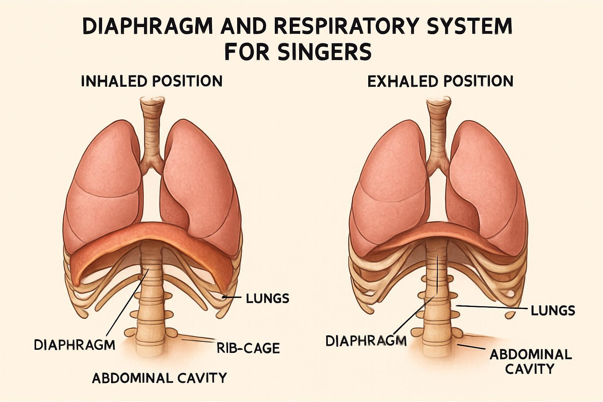
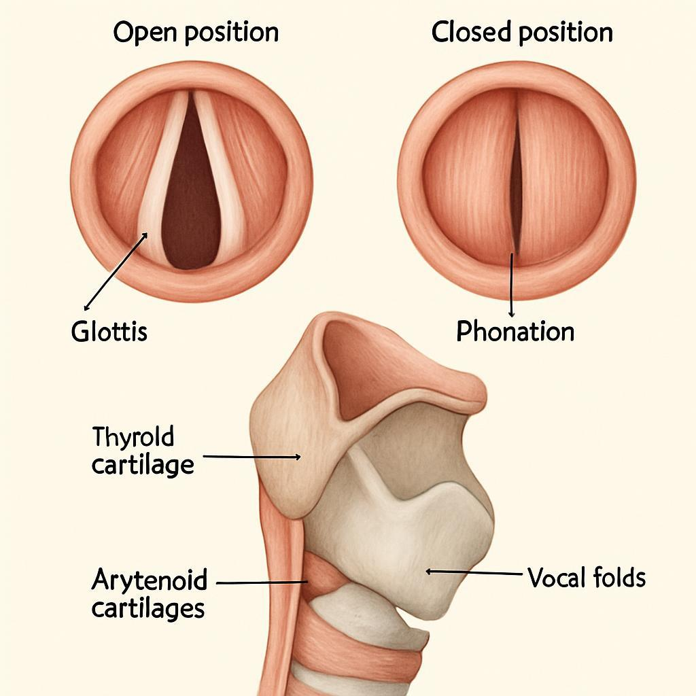

# Singing Fundamentals – From Beginner to Advanced

**Researched, edited and published by Aaron Ellis**

A Comprehensive Encyclopedia of Vocal Technique

## INTRODUCTION

#### Foreword: The Journey to Vocal Excellence

Welcome to the beginning of your transformative vocal journey. Whether you’re picking up this book as a complete beginner with dreams of singing your favorite songs, or as an intermediate vocalist looking to refine your technique, you’ve taken an important step toward vocal mastery.

The human voice is perhaps the most personal, expressive, and versatile instrument in existence. It’s the only instrument that is literally part of your body—an extension of your thoughts, emotions, and identity. Yet despite this intimate connection, many people feel disconnected from their singing voice, believing that the ability to sing well is a gift bestowed upon a lucky few at birth.

Let me assure you: this could not be further from the truth.

Throughout my years of teaching singers of all levels, I’ve witnessed countless “non-singers” transform into confident, skilled vocalists. The secret wasn’t some magical discovery of hidden talent—it was the systematic application of proper technique, consistent practice, and a growth mindset.

This book represents a comprehensive roadmap for that transformation. Within these pages, you’ll find not just the “what” of good singing, but the “why” and “how” as well. We’ll explore the fascinating science behind your voice, demystify complex concepts, and provide practical exercises that build your skills progressively and safely.

The journey ahead will require patience, persistence, and a willingness to experiment with new sensations and sounds. There will be moments of breakthrough and moments of frustration—both are normal and necessary parts of the learning process. Remember that every accomplished singer you admire once stood exactly where you stand now: at the beginning of their vocal journey, full of questions and possibilities.

As you work through this book, be kind to yourself. Celebrate small victories. Record your progress. And most importantly, enjoy the process of discovering and developing your unique voice. The world needs your song—the one that only you can sing.

I’m honored to be your guide on this journey to vocal excellence. Let’s begin.

#### How to Use This Book: Navigating Your Path to Vocal Mastery

This comprehensive encyclopedia is designed to serve as both a sequential learning program and a reference resource. To help you navigate effectively:

##### For Beginners:

If you’re new to singing or have limited formal training, I recommend working through the book sequentially, beginning with Part I: Building Your Vocal Foundation. The fundamental concepts and exercises in these early chapters create the necessary groundwork for more advanced techniques. Don’t rush—mastering these basics will accelerate your progress later.

##### For Intermediate Singers:

If you already have some singing experience, you might be tempted to jump ahead to more advanced chapters. While the book is organized to allow this, I encourage you to at least skim the foundational sections, as they may fill important gaps in your knowledge or correct misconceptions that could be limiting your progress.

##### Practical Application:

Throughout the book, you’ll find: - **Practical Exercises**: Clearly marked activities to develop specific skills - **Troubleshooting Tips**: Solutions for common challenges - **Reflection Prompts**: Questions to deepen your understanding - **Cross-References**: Connections to related topics in other chapters

##### Creating Your Practice Routine:

Consistent practice is essential for vocal development. I recommend: 1. Setting aside 20-30 minutes daily rather than longer, infrequent sessions 2. Following the structured warm-up sequences before attempting more challenging exercises 3. Recording yourself regularly to track progress objectively 4. Maintaining a practice journal to document insights and questions

##### Using the Appendices:

The comprehensive appendices serve as valuable quick-reference tools. The exercise library (Appendix A) provides additional practice material, while the troubleshooting guide (Appendix F) offers solutions for specific vocal challenges you might encounter.

##### A Living Resource:

This book is designed to grow with you. As you advance, previously challenging concepts will become second nature, and you’ll discover new layers of meaning in sections you’ve read before. Many professional singers continue to revisit fundamental concepts throughout their careers, finding fresh insights with each return.

Remember that reading about singing is important, but actual singing is essential. Balance your study with plenty of practical application. Your voice develops through thoughtful, consistent use—not just intellectual understanding.

#### The Philosophy of Vocal Development: Understanding the Learning Process

##### The Myth of Natural Talent vs. Learned Skill

Perhaps the most persistent and harmful myth in singing is the belief that great singers are born, not made. This “talent myth” suggests that some people naturally possess the ability to sing beautifully, while others are destined to struggle regardless of their efforts.

Scientific research and practical experience tell a different story. While certain physical attributes (such as vocal fold structure or resonating chamber size) may create predispositions toward particular vocal qualities, the fundamental skills of good singing—pitch accuracy, breath control, resonance management, and artistic expression—are learned abilities that develop through proper instruction and practice.

Consider this: we don’t expect children to naturally develop the ability to read or solve mathematical equations without instruction. Similarly, singing well is a complex skill that requires guidance, understanding, and deliberate practice. The apparent “naturalness” of accomplished singers is actually the result of well-developed technique that has become automatic through years of training.

This is tremendously liberating news! It means that regardless of your starting point, significant improvement is not just possible—it’s inevitable when you follow the right approach.

##### The Science of Skill Acquisition

Modern neuroscience has revolutionized our understanding of how humans develop skills. When you practice a physical skill like singing:

1.  **Neural Pathways Form**: Your brain creates connections between neurons that control the muscles involved in singing.

2.  **Myelin Development**: With repeated practice, these neural pathways become insulated with myelin, a fatty substance that allows signals to travel up to 100 times faster along these pathways.

3.  **Automaticity Emerges**: As pathways become more myelinated, the skill requires less conscious effort and becomes more automatic.

4.  **Chunking Occurs**: Your brain begins to group complex movements into single units, allowing you to execute complicated vocal maneuvers as one fluid motion rather than a series of separate steps.

This biological process explains why consistent practice is so crucial. Each time you correctly execute a vocal exercise, you strengthen the neural pathways associated with that skill. Eventually, techniques that once required intense concentration become second nature.

The key insight from skill acquisition science is that quality of practice matters more than quantity. Ten minutes of focused, accurate practice creates stronger neural pathways than an hour of distracted, imprecise singing. This is why the structured exercises in this book emphasize awareness, precision, and gradual progression.

##### Setting Realistic Expectations and Timelines

Vocal development follows a predictable pattern, though the pace varies among individuals. Understanding this pattern helps set realistic expectations:

1.  **Initial Rapid Progress**: Beginners often experience noticeable improvements within the first few weeks of structured practice as they correct basic inefficiencies.

2.  **Plateau Phases**: These periods of apparent stagnation are actually critical consolidation phases where your nervous system is integrating new skills. Continued practice during plateaus leads to breakthrough moments.

3.  **Breakthrough Cycles**: Sudden improvements often follow plateau phases as neural connections strengthen and new coordinations become available.

4.  **Refinement Stage**: As fundamental skills become automatic, focus shifts to nuance, artistic expression, and stylistic versatility.

While everyone’s journey is unique, most singers find that significant, noticeable improvement occurs within 3-6 months of consistent, guided practice. More refined skills may take 1-3 years to develop fully, while mastery is a lifelong pursuit.

The most important expectation to set is consistency. Ten minutes daily will yield better results than two hours once a week. Your voice responds to regular, thoughtful use—not sporadic intensive training.

##### The Six-Month Transformation Framework

Based on decades of teaching experience and research in skill acquisition, I’ve developed a six-month framework that provides a realistic timeline for significant vocal transformation:

**Month 1: Foundation Building** - Establishing proper posture and breathing mechanics - Developing awareness of current habits and sensations - Beginning basic resonance exploration - Setting baseline recordings and specific goals

**Month 2: Coordination Development** - Refining breath management - Exploring register connections - Improving pitch accuracy and control - Developing consistent practice routines

**Month 3: Stability and Strength** - Building stamina in newly established techniques - Expanding comfortable range - Improving tonal consistency - Addressing specific technical challenges

**Month 4: Integration and Application** - Applying technique to simple songs - Developing expressive capabilities - Refining vowel production and diction - Increasing technical flexibility

**Month 5: Expansion and Versatility** - Exploring stylistic elements - Extending range capabilities - Developing dynamic control - Building performance readiness

**Month 6: Refinement and Performance** - Polishing repertoire - Developing performance skills - Addressing remaining technical issues - Setting new goals for continued growth

This framework assumes 20-30 minutes of daily practice following the exercises and principles outlined in this book. Your progress may be faster or slower depending on your starting point, consistency, and individual factors—but the sequence of development remains relatively constant.

Remember that vocal development is not linear. You’ll experience days of exceptional clarity and ease followed by days of apparent regression. This fluctuation is normal and doesn’t reflect your overall trajectory. Trust the process, maintain consistency, and your voice will transform.

#### Chapter Reflection: Introduction

**Key Takeaways:** - Singing well is primarily a learned skill, not an inborn talent - Vocal development follows predictable patterns based on how the brain forms and strengthens neural pathways - Consistent, focused practice is more effective than sporadic intensive sessions - Significant vocal transformation is achievable within six months of proper practice - The journey involves both breakthroughs and plateaus, both of which are normal parts of the learning process

**Reflection Questions:** 1. What beliefs about singing have limited your progress in the past? 2. Which aspects of the six-month framework seem most challenging for you personally? 3. How can you create conditions for consistent daily practice in your life? 4. What specific vocal goals would you like to achieve in the next six months?

**Action Steps:** 1. Record yourself singing a simple song to establish your baseline 2. Create a dedicated practice space free from distractions 3. Schedule specific practice times in your calendar for the coming week 4. Begin a practice journal to document your observations and progress \# PART I: BUILDING YOUR VOCAL FOUNDATION

## SECTION 1: UNDERSTANDING YOUR INSTRUMENT

### Chapter 1: Your Journey to Singing Well Begins Here

Welcome, aspiring singer! You stand at the threshold of an exciting adventure—the exploration and development of your own unique voice. This chapter marks the true beginning of your practical journey, laying the groundwork for everything that follows. We’ll address some common misconceptions, set realistic expectations, and cultivate the mindset necessary for success.

###### The Voice Within: Embracing Your Unique Instrument

Your voice is unlike any other instrument on earth. It’s not something you pick up and put down; it *is* you. It reflects your physical state, your emotions, and even your personality. This intimate connection is both a blessing and a challenge. It means your potential for expression is limitless, but it also means that learning to sing involves understanding and coordinating your own body and mind in new ways.

Many beginners feel self-conscious about their voice, comparing it unfavorably to professional singers. It’s crucial to understand that every voice has its own inherent beauty and unique qualities. Your goal isn’t to sound exactly like someone else, but to unlock the full potential of *your* instrument. Embrace its current state, quirks and all. This acceptance is the first step towards transformation. Think of your voice not as something fixed, but as raw material waiting to be shaped and refined through skillful practice.

###### Dispelling the Myth of “Natural Talent”

As mentioned in the introduction, the idea that great singers are simply “born with it” is largely a myth. While genetics play a role in the raw materials (like the size and shape of your vocal folds \[the vibrating tissues in your larynx that produce sound\] and resonators \[spaces in your body that amplify sound\]), the ability to use those materials effectively is overwhelmingly a learned skill. The singers you admire sound effortless because they have spent countless hours honing their technique until it became second nature. They weren’t born singing perfectly; they learned, practiced, and refined, just as you are about to do.

###### The Truth About Vocal Development

Vocal development is a process of building coordination, strength, and awareness. It involves training muscles (many of which you can’t directly see or feel), refining your auditory perception, and connecting your physical actions to the sounds you intend to produce. It’s much like learning any other complex motor skill, such as playing a sport or a musical instrument. Progress comes through consistent, mindful practice, applying correct principles, and gradually increasing the challenge.

Expect ups and downs. Some days your voice will feel free and responsive; other days it might feel sluggish or uncooperative. This is normal. Factors like sleep, hydration, health, and even stress levels can affect your voice daily. The key is not to get discouraged by temporary setbacks but to focus on the long-term trajectory of improvement.

###### Your Six-Month Transformation: What to Expect

We introduced the Six-Month Transformation Framework earlier. Let’s revisit it with a focus on this initial phase. In the first few months, your primary goal is to build a solid foundation. This involves:

- **Awareness:** Learning to notice subtle sensations related to breath, posture, and sound production.

- **Coordination:** Teaching your body new ways of working together (e.g., coordinating breath flow with vocal fold vibration).

- **Consistency:** Establishing regular practice habits.

Don’t expect to sound like a professional overnight. Instead, focus on mastering the fundamental building blocks presented in Part I. You should expect to notice changes in:

- Your ability to breathe more deeply and control the exhale.

- Your posture and physical alignment.

- Your awareness of resonance sensations.

- Your ability to match pitch more accurately.

- Your overall vocal stamina.

These foundational improvements might seem small initially, but they are the essential prerequisites for developing a powerful, flexible, and expressive voice later on.

###### The Power of Consistent Practice

Consistency trumps intensity in vocal training. Short, focused daily practice sessions (20-30 minutes) are far more effective than one long, exhausting session per week. Why? Because vocal development relies on neuromuscular learning—training your brain and muscles to work together efficiently. Regular repetition strengthens these neural pathways and builds muscle memory.

Think of it like watering a plant. A little water each day helps it grow strong roots. Drenching it once a week is less effective and can even be harmful. Your voice needs regular, gentle nurturing, not occasional brute force.

**Practical Tip:** Find a time each day when you can consistently dedicate 20-30 minutes to practice without interruption. Treat it like an important appointment you wouldn’t miss.

###### Setting Meaningful Goals for Your Vocal Journey

Clear goals provide direction and motivation. Vague goals like “I want to sing better” are hard to track. Instead, use the SMART framework:

- **Specific:** What exactly do you want to achieve? (e.g., “Sing my favorite song in tune,” “Increase my comfortable range by two notes.”)

- **Measurable:** How will you know when you’ve achieved it? (e.g., “Record myself and compare to the original,” “Use a keyboard to check range.”)

- **Achievable:** Is the goal realistic given your current level and timeframe? (e.g., Aiming for a two-note range increase in a month is more achievable than aiming for an octave.)

- **Relevant:** Does the goal align with your overall singing aspirations? (e.g., If you want to sing pop, focusing on operatic high notes might be less relevant initially.)

- **Time-bound:** When do you aim to achieve this goal? (e.g., “Within the next three months.”)

**Exercise: Setting Your First Goals** 1. Write down 1-3 specific, short-term (1-3 months) vocal goals. 2. Write down 1-2 long-term (6+ months) vocal aspirations. 3. Review them using the SMART criteria and adjust as needed. 4. Keep these goals visible in your practice space.

###### Creating Your Ideal Practice Environment

Where you practice matters. An ideal environment supports focus and encourages good habits. Aim for a space that is:

- **Private:** Where you feel comfortable making sounds without feeling self-conscious.

- **Quiet:** Free from distracting background noise.

- **Spacious Enough:** Allows you to stand or sit with good posture and move slightly if needed.

- **Well-Ventilated:** Fresh air is good for breathing.

- **Equipped:** Have necessary tools handy: a mirror (for posture checks), water, a recording device (your phone works fine), a keyboard or pitch pipe (optional but helpful), and this book or your practice notes.

If finding a perfect space is difficult, do your best with what you have. Even a quiet corner can work. The key is consistency and focus, regardless of the location.

###### The Mindset of Successful Singers

Your attitude significantly impacts your progress. Cultivate these mental qualities:

- **Patience:** Vocal development takes time. Embrace the process.

- **Persistence:** Keep practicing even when progress feels slow.

- **Curiosity:** Be an explorer of your own voice. Ask “What happens if I try this?”

- **Self-Compassion:** Be kind to yourself, especially on challenging days. Avoid harsh self-criticism.

- **Growth Mindset:** Believe that your abilities can be developed through dedication and hard work (as opposed to a fixed mindset, which assumes talent is innate).

- **Focus:** Engage fully during practice sessions, minimizing distractions.

Remember, every time you practice with intention, you are reshaping your brain and body for better singing. Trust the process, stay consistent, and enjoy the incredible journey of discovering your voice.

#### Chapter Reflection: Your Journey Begins

**Key Takeaways:** \* Your voice is a unique instrument; embrace its current state as the starting point for development. \* Singing well is a learned skill, achievable through consistent, mindful practice. \* Expect gradual progress with plateaus and breakthroughs; focus on foundational skills initially. \* Short, daily practice sessions are more effective than infrequent long ones. \* Setting SMART goals provides direction and motivation. \* A dedicated practice space and a positive mindset are crucial for success.

**Reflection Questions:** 1. How does the idea that singing is a learned skill change your perspective on your own potential? 2. What is one SMART goal you can set for your singing this month? 3. What potential obstacles might interfere with consistent practice, and how can you address them? 4. Which aspect of the “successful singer mindset” do you most need to cultivate?

**Action Steps:** 1. Identify and prepare your primary practice space. 2. Finalize your first set of SMART goals and write them down. 3. Schedule your practice sessions for the next week. 4. Re-read the section on the “Mindset of Successful Singers” and choose one quality to focus on this week.

### Chapter 2: The Core Pillars of Good Singing

Singing is a complex activity that involves multiple systems working together in harmony. To master this art, we need a framework that breaks down the seemingly mysterious process of singing into manageable components. This chapter introduces the Seven Pillars Framework—a comprehensive approach that will guide your vocal development throughout this book.

#### Introduction to the Seven Pillars Framework

The Seven Pillars Framework divides the art of singing into seven fundamental components:

1.  **Posture**: How you align and support your body

2.  **Breath**: How you manage airflow for singing

3.  **Pitch**: How you produce accurate notes

4.  **Tone**: The quality and color of your sound

5.  **Diction**: How you form and articulate words

6.  **Rhythm**: How you manage timing and musical flow

7.  **Vocal Health**: How you maintain and protect your instrument

Each pillar represents a distinct aspect of singing that can be studied and improved independently. However, the true power of this framework lies in understanding how these elements interact and support each other.

#### How the Pillars Work Together

Imagine your voice as a house. The pillars aren’t isolated columns—they’re interconnected supports that together create a stable structure. Here’s how they interact:

**Posture and Breath**: Your alignment directly affects your breathing capacity and efficiency. Without good posture, even the best breathing techniques will be compromised.

**Breath and Tone**: Your breath is the power source for your sound. The way you manage airflow significantly impacts the quality, stability, and resonance of your tone.

**Pitch and Tone**: Accurate pitch requires proper vocal fold coordination, which also affects tonal quality. Conversely, finding optimal resonance (tone) can make pitch production easier and more reliable.

**Diction and Tone**: How you shape vowels and consonants directly influences your resonance patterns and, therefore, your tone quality.

**Rhythm and Breath**: Musical timing affects where and how you breathe, while breath control enables you to sustain phrases and execute rhythmic patterns effectively.

**Vocal Health and All Pillars**: Your overall vocal condition affects every aspect of singing. Conversely, proper technique in all pillars contributes to long-term vocal health and sustainability.

Understanding these relationships helps you troubleshoot effectively. For example, if you’re struggling with a high note (pitch), the solution might actually lie in adjusting your posture, breath support, or vowel shape (diction)—not just in “trying harder” to hit the note.

#### The Importance of Balanced Development

Many singers make the mistake of focusing exclusively on one or two pillars while neglecting others. For instance, a singer might work extensively on breath support and high notes but ignore diction and rhythmic precision. This imbalanced approach creates weaknesses that limit overall progress.

The Seven Pillars Framework encourages holistic development. By giving appropriate attention to each pillar, you create a solid, well-rounded technique that can adapt to different musical styles and performance demands.

This doesn’t mean you must divide your practice time equally among all pillars. At different stages of development, certain pillars may require more focus. However, regularly checking in with all seven ensures that no aspect falls too far behind.

#### Assessing Your Current Abilities

Before creating a development plan, it’s helpful to assess your current strengths and weaknesses across the seven pillars. This self-assessment provides a baseline and helps you prioritize your practice.

**Exercise: Pillar Self-Assessment**

1.  Record yourself singing a simple song you know well.

2.  Listen to the recording and rate yourself on a scale of 1-5 in each pillar:

    - **Posture**: Do you appear aligned and free from tension?

    - **Breath**: Can you sustain phrases comfortably? Is your breathing quiet and efficient?

    - **Pitch**: Are the notes accurate and stable?

    - **Tone**: Is your sound clear, resonant, and appropriate for the style?

    - **Diction**: Are the words clear and well-articulated?

    - **Rhythm**: Is your timing precise and musical?

    - **Vocal Health**: Does your voice sound healthy and free from strain?

3.  Identify your two strongest and two weakest pillars.

4.  Write down specific observations about what worked well and what needs improvement.

This assessment isn’t about judgment but awareness. Every singer, regardless of level, has areas of relative strength and weakness. Identifying these patterns helps you create a more effective practice strategy.

#### Creating Your Personalized Development Plan

Based on your self-assessment, you can now create a personalized development plan that addresses your specific needs while maintaining balanced growth.

**Exercise: Creating Your Development Plan**

1.  Prioritize your two weakest pillars for focused attention.

2.  Allocate approximately 50% of your practice time to these priority areas.

3.  Dedicate 30% to maintaining and gradually improving your areas of moderate strength.

4.  Use the remaining 20% to further refine your strongest pillars.

5.  Review and adjust this distribution monthly based on your progress.

For example, if your assessment revealed weaknesses in breath and diction, your 30-minute practice session might include: - 15 minutes on breathing exercises and diction drills (priority areas) - 9 minutes on pitch matching and rhythmic exercises (moderate areas) - 6 minutes on posture check-ins and tone exploration (strong areas)

This balanced approach ensures steady progress across all pillars while addressing your most pressing needs.

#### The Synergy Effect: Why Whole-System Thinking Matters

The most remarkable aspect of the Seven Pillars Framework is what I call the “synergy effect”—improvements in one pillar often trigger unexpected advances in others. This happens because the voice functions as an integrated system rather than a collection of separate components.

For example, many singers struggle for years with high notes, focusing intensely on the pitch pillar without success. Then, after working on proper breath support or vowel modification (diction pillar), they suddenly find those same high notes becoming accessible. The breakthrough came not from hammering away at the apparent problem but from strengthening a supporting pillar.

This whole-system thinking transforms how you approach vocal challenges. Instead of getting frustrated when direct approaches don’t work, you can strategically address the underlying systems that support the challenging skill.

As you progress through this book, we’ll explore each pillar in depth, providing specific exercises and techniques for development. We’ll also continually highlight the connections between pillars, helping you develop an integrated understanding of your voice as a complete instrument.

Remember that the goal isn’t perfection in all areas immediately, but rather steady, balanced growth across the entire system. Trust the process, maintain consistency in your practice, and the results will follow.

#### Chapter Reflection: The Core Pillars

**Key Takeaways:** - The Seven Pillars Framework provides a comprehensive approach to vocal development - The pillars (Posture, Breath, Pitch, Tone, Diction, Rhythm, and Vocal Health) are interconnected systems that support each other - Balanced development across all pillars creates a more versatile and reliable technique - Self-assessment helps identify your current strengths and weaknesses - Improvements in one pillar often trigger advances in others through the synergy effect

**Reflection Questions:** 1. Which pillar do you find most intriguing or mysterious at this point? 2. Based on your self-assessment, which pillars will you prioritize initially? 3. Have you previously focused too much on one aspect of singing while neglecting others? 4. How might the concept of “whole-system thinking” change your approach to vocal challenges?

**Action Steps:** 1. Complete the Pillar Self-Assessment exercise if you haven’t already 2. Create your personalized development plan using the guidelines provided 3. Schedule specific practice time for each pillar in your next week’s practice sessions 4. Prepare a simple way to track your progress in each pillar (journal, chart, or app)

### Chapter 3: Vocal Anatomy and Physiology

Understanding the physical structures that produce your voice is essential for developing effective technique. This chapter provides a comprehensive overview of vocal anatomy and physiology, demystifying the complex systems that work together when you sing.

#### The Singing Body: A Comprehensive Overview

Singing engages your entire body, not just your throat. From the muscles that power your breath to the resonating spaces that amplify your sound, every part plays a crucial role. Let’s explore this remarkable system from the ground up.

##### The Respiratory System: Your Power Source

###### The Lungs and Breathing Mechanism

Your lungs are elastic, sponge-like organs that expand and contract to take in and expel air. Unlike many other muscles in your body, your lungs don’t contract on their own—they respond to pressure changes in your thoracic cavity (chest).

When you inhale, your diaphragm contracts and flattens, creating negative pressure that draws air into your lungs. When you exhale, your diaphragm relaxes, returning to its dome shape, while your abdominal and intercostal muscles help regulate the release of air.

For singers, understanding this passive-active relationship is crucial. Inhalation can be relatively passive (allowing the lungs to fill naturally), while exhalation during singing is actively controlled to regulate the airflow needed for sound production.

###### The Diaphragm: Your Primary Breathing Muscle

The diaphragm is a dome-shaped muscle that separates your thoracic cavity (chest) from your abdominal cavity. It’s your most important breathing muscle and the foundation of good vocal technique.

*Diagram of the Diaphragm*

When you inhale, your diaphragm contracts and flattens downward, creating space for your lungs to expand. When you exhale, it relaxes and returns to its dome shape. During singing, you learn to control the rate at which the diaphragm returns to its resting position, allowing for measured release of air.

Many beginners mistakenly believe they can feel their diaphragm directly. In reality, what you feel are the secondary effects of diaphragmatic movement—the expansion of your lower ribs and abdominal area. The diaphragm itself has minimal sensory nerve endings, making direct sensation impossible.

**Practical Exercise: Diaphragmatic Awareness** 1. Lie on your back with one hand on your chest and one on your abdomen. 2. Breathe in slowly through your nose, focusing on expanding your abdomen rather than lifting your chest. 3. Exhale slowly, feeling your abdomen gently fall. 4. Repeat 5-10 times, noticing the natural movement of your breathing mechanism.

###### The Intercostal Muscles and Rib Cage

Three layers of intercostal muscles run between your ribs, playing important roles in breathing: - External intercostals: Help expand the rib cage during inhalation - Internal intercostals: Assist in controlled exhalation - Innermost intercostals: Stabilize the rib cage

For singers, developing awareness and control of these muscles helps create what’s often called “expansion against resistance”—the sensation of maintaining an expanded rib cage even as you exhale during singing.

###### The Abdominal Support System

Your abdominal muscles—particularly the transversus abdominis, internal and external obliques, and rectus abdominis—work in coordination with your diaphragm to regulate breath pressure during singing.

These muscles provide what singers often call “support” by creating controlled resistance to the diaphragm’s natural tendency to release quickly. This controlled engagement allows you to manage airflow precisely, creating consistent breath pressure for sustained phrases and dynamic control.

**Practical Exercise: Engaging Support Muscles** 1. Stand with good posture and place your hands on your lower ribs. 2. Inhale, feeling your ribs expand laterally (sideways). 3. Exhale on a hissing sound (“sss”), focusing on maintaining the expanded sensation in your lower ribs while your abdomen gradually moves inward. 4. Aim for a steady, consistent sound without collapsing your chest.

##### The Larynx: Your Sound Generator

###### The Vocal Folds: Structure and Function

Your vocal folds (commonly called vocal cords) are twin folds of mucous membrane stretched horizontally across your larynx. They’re composed of: - A muscular layer (thyroarytenoid muscle) - A ligamentous layer (vocal ligament) - A mucosal covering

*Vocal Folds Diagram*

When you breathe, your vocal folds are open, forming a “V” shape that allows air to pass freely. When you phonate (make sound), they come together and vibrate as air passes between them. This vibration creates the primary sound that is then resonated and articulated into speech or song.

The vocal folds can vibrate from 70-1000+ times per second, depending on the pitch you’re producing. Higher pitches require faster vibrations, achieved through stretching and thinning the vocal folds.

###### The Glottis and Phonation

The glottis is the space between your vocal folds. When you sing, your vocal folds come together, and air pressure builds up beneath them. This pressure causes them to blow apart momentarily, releasing a puff of air, before they’re drawn back together by both muscular action and the Bernoulli effect (the same principle that helps airplanes fly).

This rapid cycle of opening and closing creates a sound wave that becomes your voice. The process happens so quickly that what you hear is a continuous tone rather than individual pulses.

**Practical Exercise: Feeling Phonation** 1. Place your fingers gently on your larynx (Adam’s apple area). 2. Produce a gentle humming sound on a comfortable pitch. 3. Feel the vibration under your fingers—this is your vocal folds in action. 4. Alternate between breathing silently and humming to feel the difference between open and vibrating vocal folds.

###### Laryngeal Cartilages and Their Movement

Your larynx is a complex structure composed of several cartilages that move in relation to each other: - Thyroid cartilage: Forms the front wall of your larynx (the “Adam’s apple”) - Cricoid cartilage: Forms the base of your larynx - Arytenoid cartilages: Two small pyramidal structures that control vocal fold adduction (closing) - Epiglottis: A leaf-shaped cartilage that prevents food from entering your airway

These cartilages are connected by joints and membranes that allow for the precise movements needed to adjust pitch, volume, and tone quality.

###### The Intrinsic and Extrinsic Laryngeal Muscles

Two muscle groups control your larynx:

**Intrinsic muscles** (within the larynx): - Control the length, tension, and adduction of the vocal folds - Regulate pitch and certain aspects of tone - Include the thyroarytenoid, cricothyroid, and arytenoid muscles

**Extrinsic muscles** (outside the larynx): - Connect the larynx to surrounding structures - Control the vertical position of the larynx - Include the sternothyroid, thyrohyoid, and digastric muscles

For singers, developing awareness of laryngeal position is important. A larynx that’s excessively high or low can negatively impact tone quality and range. Most styles aim for a relatively neutral to slightly lowered laryngeal position, achieved through proper breathing and release of tension rather than forced manipulation.

##### The Resonators: Your Sound Amplifiers

The sound created by your vocal folds is relatively weak and buzzy. It’s transformed into a rich, carrying tone through resonance—the amplification and modification of sound waves in the hollow spaces of your body.

###### The Pharynx (Throat)

Your pharynx is a muscular tube extending from behind your nose and mouth down to your esophagus and larynx. It’s divided into three sections: - Nasopharynx: The upper portion, connected to the nasal cavity - Oropharynx: The middle portion, behind the oral cavity - Laryngopharynx: The lower portion, above the larynx

The pharynx is a primary resonator whose shape dramatically affects your tone quality. By adjusting its width, length, and tension, you can create significant changes in your sound’s brightness, depth, and color.

###### The Oral Cavity (Mouth)

Your mouth is a highly adjustable resonating space. By changing the position of your tongue, soft palate, jaw, and lips, you can fine-tune your resonance for different vowels, pitches, and tonal effects.

The oral cavity is particularly important for vowel formation. Each vowel sound requires a specific shape that creates characteristic resonance patterns called formants. These formants are what make an “ah” sound different from an “ee” sound, regardless of the pitch.

**Practical Exercise: Exploring Oral Resonance** 1. Sing a comfortable sustained note on “ah.” 2. Without changing pitch, gradually shift to “oh,” then “oo.” 3. Notice how the sound changes as you modify your oral cavity shape. 4. Try the same exercise moving from “ee” to “eh” to “ah.” 5. Pay attention to both the sound and the physical sensations of these changes.

###### The Nasal Cavity and Sinuses

Your nasal cavity and sinuses contribute to your vocal resonance, particularly for certain consonants (m, n, ng) and in some singing styles that employ nasal resonance. However, excessive nasal resonance on vowels is generally avoided in most classical and contemporary techniques.

The soft palate (velum) controls the connection between your oral and nasal cavities. When raised, it reduces nasal resonance; when lowered, it allows sound to resonate in the nasal passages.

###### The Chest Cavity

Your chest cavity provides additional resonance, particularly for lower notes. While you can’t directly control its shape, the sensation of “chest voice” partly comes from vibrations felt in this area due to the lower frequencies produced by thicker vocal fold vibrations.

##### The Articulators: Your Sound Shapers

Articulators transform the resonated tone into recognizable words by shaping consonants and vowels.

###### The Tongue: The Primary Articulator

Your tongue is the most versatile and important articulator. This powerful muscle can assume countless shapes and positions, affecting both resonance (through vowel formation) and articulation (through consonant production).

For singers, tongue tension is a common issue that can restrict vocal freedom. Learning to use your tongue efficiently—with just enough tension for clear articulation but not so much that it interferes with laryngeal function—is a crucial skill.

**Practical Exercise: Tongue Awareness** 1. Place the tip of your tongue behind your lower front teeth. 2. Slowly arch the middle of your tongue up toward your hard palate, then release. 3. Repeat several times, noticing the sensations of controlled movement. 4. Now try the same exercise while sustaining a comfortable note, observing how tongue position affects your sound.

###### The Lips and Teeth

Your lips shape vowels and form certain consonants (p, b, m, f, v). Their position affects both articulation clarity and tonal quality. For example, overly spread lips can create a thin, strained sound, while appropriately rounded lips can help create depth and warmth when needed.

Your teeth serve as points of contact for your tongue and lips during articulation and contribute to certain consonant sounds (th, f, v).

###### The Soft and Hard Palate

Your hard palate is the bony structure forming the roof of your mouth. It serves as a point of contact for your tongue when forming certain consonants and helps shape the oral cavity for resonance.

Your soft palate (velum) is the flexible muscular extension at the back of your hard palate. It can raise to close off the nasal cavity or lower to allow nasal resonance. For most singing, a raised soft palate is desirable as it creates more space in the pharynx and reduces unwanted nasality.

**Practical Exercise: Soft Palate Awareness** 1. Yawn slightly, noticing the lifting sensation at the back of your mouth—that’s your soft palate raising. 2. Alternate between saying “ah” (oral sound) and “ng” (nasal sound), feeling the soft palate’s movement. 3. Try sustaining an “ah” vowel with your soft palate raised (as in the beginning of a yawn).

###### The Jaw and Its Movement

Your jaw affects both resonance and articulation. Excess jaw tension is a common issue that can restrict vocal freedom and clarity. Learning to release and move your jaw efficiently is an important aspect of vocal technique.

The temporomandibular joint (TMJ) connects your jaw to your skull. Tension in this joint can cause vocal fatigue and even pain. Regular gentle massage and awareness exercises can help maintain healthy jaw function.

**Practical Exercise: Jaw Release** 1. Gently place your fingertips on your jaw joints (just in front of your ears). 2. Allow your jaw to hang loosely, creating a small space between your teeth. 3. Make small, gentle circular movements with your jaw. 4. Hum a comfortable note while maintaining this released jaw position.

##### The Nervous System: Coordination and Control

###### Neural Pathways in Singing

Singing involves complex coordination between your brain and body, facilitated by your nervous system. Multiple neural pathways work together:

- **Motor pathways**: Control the muscles involved in breathing, phonation, resonance, and articulation

- **Sensory pathways**: Provide feedback about physical sensations and sound

- **Auditory pathways**: Process the sounds you hear, including your own voice

- **Proprioceptive pathways**: Give information about the position and movement of your body parts

When you learn a new vocal technique, you’re essentially creating and strengthening these neural pathways through repeated practice. Eventually, complex coordinations become automatic, allowing you to focus on expression rather than mechanics.

###### Proprioception and Kinesthetic Awareness

Proprioception—your sense of your body’s position and movement—is crucial for singing. Since you can’t directly see most of your vocal mechanism, you must develop keen awareness of subtle physical sensations.

Kinesthetic awareness allows you to monitor and adjust your technique based on how it feels rather than just how it sounds. This internal feedback system becomes increasingly important as you advance, enabling fine-tuned control of your instrument.

**Practical Exercise: Developing Kinesthetic Awareness** 1. Place your hand on your abdomen while breathing. 2. Focus intently on the sensations of movement. 3. Try to recreate those same sensations without using your hand as a guide. 4. Practice alternating between using touch feedback and relying solely on internal awareness.

###### The Mind-Body Connection in Vocal Production

Your thoughts and emotions directly affect your voice through physical responses. Anxiety can cause muscle tension and restricted breathing. Confidence can promote relaxation and vocal freedom. This mind-body connection works in both directions—physical adjustments can also influence your mental state.

Understanding this connection helps you develop techniques for managing performance anxiety and accessing different emotional qualities in your singing. Visualization, mindfulness practices, and body awareness exercises can strengthen this connection, giving you greater control over your instrument.

#### Chapter Reflection: Vocal Anatomy and Physiology

**Key Takeaways:** - Singing involves coordinated action of the respiratory, phonatory, resonatory, and articulatory systems - The diaphragm and supporting muscles create and regulate the airflow that powers your voice - Your vocal folds vibrate to create the primary sound, which is then shaped and amplified by your resonators - Articulators transform this resonated sound into recognizable words - Neural pathways and kinesthetic awareness allow you to monitor and control this complex system - The mind-body connection significantly impacts vocal function and expression

**Reflection Questions:** 1. Which aspect of vocal anatomy was most surprising or interesting to you? 2. How might understanding the physical processes of singing change your approach to practice? 3. Which area of your vocal mechanism do you think might benefit from more awareness or attention? 4. How could you incorporate more kinesthetic awareness into your regular practice?

**Action Steps:** 1. Practice the diaphragmatic breathing exercise daily for one week 2. Experiment with the resonance exploration exercise, recording yourself to hear the differences 3. Try the jaw release exercise before your regular warm-up routine 4. Choose one aspect of vocal anatomy to research further or discuss with your teacher

**References:** - Titze, I. R. (2000). *Principles of Voice Production*. National Center for Voice and Speech. - Sataloff, R. T. (2017). *Professional Voice: The Science and Art of Clinical Care*. Plural Publishing. - Chapman, J. L. (2016). *Singing and Teaching Singing: A Holistic Approach to Classical Voice*. Plural Publishing.

### Chapter 4: Vocal Health and Maintenance

Your voice is a biological instrument that requires proper care and maintenance. This chapter explores the essential practices that keep your vocal instrument in optimal condition, helping you prevent injury and maintain vocal longevity throughout your singing life.

#### The Singer’s Lifestyle: Holistic Vocal Care

Vocal health extends far beyond what happens during your practice sessions. Every aspect of your lifestyle—from sleep patterns to dietary choices, environmental factors to stress management—affects your vocal function. Professional singers understand that vocal care is a 24/7 commitment, not just something to consider while singing.

This holistic approach doesn’t mean living in a bubble or becoming obsessive about vocal rules. Rather, it means making informed choices that support your vocal goals while maintaining balance in your life. Let’s explore the key components of a singer-friendly lifestyle.

#### Hydration: The Foundation of Vocal Health

##### Water Intake Guidelines

Proper hydration is perhaps the single most important factor in day-to-day vocal health. Your vocal folds require adequate moisture to vibrate efficiently and resist injury. When dehydrated, the mucous membranes that cover your vocal folds become thinner and more vulnerable to damage from vibration.

For singers, the general recommendation is to drink at least 8-10 eight-ounce glasses of water daily. However, your individual needs may vary based on: - Body size and weight - Activity level - Climate - Overall health - Medications you take

A practical approach is to monitor your urine color—pale yellow indicates good hydration, while darker yellow suggests you need more water.

**Practical Exercise: Hydration Tracking** 1. For one week, track your daily water intake using a journal or app 2. Note how your voice feels each day in relation to your hydration level 3. Experiment with increasing your water intake and observe any changes in vocal ease 4. Establish your personal optimal daily water intake based on these observations

##### Humidity and Environmental Factors

The air you breathe directly contacts your vocal folds, making environmental humidity an important consideration. Dry environments—including air-conditioned spaces, airplanes, and many winter indoor settings—can significantly impact vocal health.

Strategies for managing environmental dryness include: - Using a personal steam inhaler before and after singing - Keeping a humidifier in your bedroom and practice space - Breathing through your nose when possible (it naturally humidifies air) - Avoiding direct exposure to air conditioning vents or heaters - Using a scarf to cover your throat in cold, dry conditions

**Practical Exercise: Steam Inhalation** 1. Boil water and pour it into a heat-safe bowl 2. Create a tent over your head with a towel 3. Breathe the steam (not too hot!) for 5-10 minutes 4. Notice the immediate effect on your vocal ease and comfort

##### Hydration Strategies for Performers

Performance situations present unique hydration challenges. Consider these strategies: - Hydrate consistently throughout the day before a performance - Avoid drinking large amounts immediately before singing (which can cause discomfort) - Keep room-temperature water accessible during performances - Consider electrolyte drinks if performing in hot environments or with significant sweating - Rehydrate thoroughly after performances

Remember that caffeinated beverages and alcohol have diuretic effects, meaning they remove water from your system. While you don’t need to eliminate these entirely, be aware that they don’t count toward your hydration goals and may require additional water intake to compensate.

#### Nutrition for Singers

##### Foods That Support Vocal Health

While no single food will transform your voice, your overall diet significantly impacts vocal function. Foods that generally support vocal health include:

**Anti-inflammatory foods:** - Fatty fish (salmon, mackerel, sardines) - Berries (blueberries, strawberries, cherries) - Leafy greens (spinach, kale, collards) - Nuts (walnuts, almonds) - Olive oil - Turmeric and ginger

**Hydrating foods:** - Watermelon, cucumber, celery - Soups and broths - Fruits with high water content (oranges, grapes, apples)

**Immune-supporting foods:** - Citrus fruits - Bell peppers - Garlic - Yogurt with active cultures - Zinc-rich foods (pumpkin seeds, chickpeas)

##### Foods and Substances to Avoid or Limit

Certain foods and substances can negatively impact vocal function, particularly before singing:

**Mucus-producing foods** (effects vary by individual): - Dairy products (especially for those with sensitivity) - Chocolate - Soy products

**Drying agents:** - Alcohol - Caffeine - Antihistamines and decongestants

**Irritants:** - Spicy foods - Acidic foods (citrus, tomatoes) for those with reflux - Extremely hot or cold foods/beverages - Carbonated beverages

**Other substances:** - Tobacco products (extremely damaging to vocal health) - Recreational drugs (many have drying or irritating effects) - Unnecessary medications (consult healthcare providers about vocal effects)

##### Pre-Performance Nutrition Strategies

What you eat before performing can significantly impact your vocal comfort and stamina. Consider these guidelines:

**Timing:** - Eat a substantial meal 3-4 hours before performing - Have a light, easily digestible snack 1-2 hours before if needed - Avoid eating immediately before singing

**Composition:** - Choose complex carbohydrates for sustained energy (whole grains, sweet potatoes) - Include moderate protein (chicken, fish, beans) - Limit fats, which take longer to digest - Avoid foods you know cause reflux or discomfort

**Practical Example: Pre-Performance Meal Plan** - 3-4 hours before: Grilled chicken, brown rice, steamed vegetables - 1-2 hours before: Banana or apple with a small handful of almonds - During performance: Small sips of room-temperature water as needed

#### Sleep and Vocal Recovery

##### The Importance of Quality Rest

Sleep is when your body repairs itself, including your vocal tissues. Insufficient or poor-quality sleep directly impacts vocal stamina, control, and tone quality. Research shows that even moderate sleep deprivation can: - Reduce fine motor control (affecting pitch accuracy) - Decrease cognitive function (affecting memorization and expression) - Impair immune function (increasing susceptibility to vocal illness) - Alter hormone levels (potentially affecting vocal fold tissues)

Most adults need 7-9 hours of quality sleep per night, though individual needs vary. Prioritizing sleep is not a luxury for singers—it’s a fundamental aspect of vocal maintenance.

##### Sleep Hygiene for Singers

“Sleep hygiene” refers to habits that promote quality sleep. For singers, consider these practices:

**Environment:** - Keep your bedroom cool (65-68°F/18-20°C is ideal for most people) - Ensure darkness (use blackout curtains if needed) - Maintain quiet or use white noise to mask disturbances - Use a humidifier to prevent overnight vocal dryness

**Routine:** - Establish consistent sleep and wake times - Create a wind-down ritual (reading, gentle stretching, warm bath) - Avoid screens 1-2 hours before bed (blue light affects sleep hormones) - Limit evening caffeine and alcohol

**Practical Exercise: Sleep Quality Assessment** 1. For one week, rate your sleep quality each morning on a scale of 1-10 2. Note factors that might have affected your sleep (stress, late meals, screen time) 3. Record how your voice feels each day in relation to your sleep quality 4. Identify patterns and make adjustments to improve sleep quality

##### Recovery Protocols After Intensive Singing

After particularly demanding vocal use (performances, long rehearsals, recording sessions), your voice needs specific recovery attention:

**Immediate recovery (within hours):** - Vocal rest (not complete silence, but gentle, limited speaking) - Hydration replenishment - Steam inhalation - Gentle stretching of neck and shoulder muscles

**Next-day recovery:** - Modified warm-ups focusing on gentle exercises - Reduced practice time or intensity - Continued hydration focus - Additional rest if vocally fatigued

Professional singers often schedule “vocal recovery days” after intensive performances, just as athletes schedule recovery after competitions. This isn’t laziness—it’s strategic maintenance that prolongs vocal longevity.

#### Common Vocal Health Issues and Prevention

##### Vocal Fatigue: Causes and Solutions

Vocal fatigue—characterized by reduced stamina, changes in tone quality, and increased effort—is the most common vocal health issue singers face. It’s essentially overuse of the vocal mechanism.

**Common causes:** - Singing too long without breaks - Using excessive volume or inappropriate technique - Inadequate warm-up - Dehydration - Poor sleep - Stress and tension - Environmental factors (dry air, noise)

**Prevention strategies:** - Schedule regular breaks (5-10 minutes per hour of singing) - Use appropriate technique for your voice type and style - Develop a consistent warm-up routine - Maintain proper hydration - Prioritize adequate sleep - Practice stress management techniques - Be aware of environmental impacts

**Recovery approaches:** - Relative vocal rest (reduced speaking and singing) - Increased hydration - Steam inhalation - Gentle stretching and relaxation exercises - Modified warm-ups when returning to singing

##### Reflux and Its Impact on the Voice

Laryngopharyngeal reflux (LPR), sometimes called “silent reflux,” occurs when stomach acids travel up the esophagus and contact the larynx and pharynx. Unlike traditional heartburn, LPR often doesn’t cause obvious burning sensations but can significantly impact vocal health.

**Symptoms relevant to singers:** - Morning hoarseness - Chronic throat clearing - Sensation of a lump in the throat - Post-nasal drip sensation - Bitter taste in the mouth - Difficulty with high notes - Increased vocal fatigue

**Management strategies:** - Avoid eating 2-3 hours before lying down - Elevate the head of your bed 4-6 inches - Limit trigger foods (spicy, acidic, fatty, caffeinated) - Maintain healthy weight - Wear loose clothing around the waist - Consider over-the-counter antacids before consulting a doctor about prescription options

If you suspect LPR is affecting your voice, consult an ENT (Ear, Nose, and Throat doctor) who specializes in voice. They can provide proper diagnosis and treatment recommendations.

##### Allergies and Sinus Issues

Allergies and sinus problems can significantly impact vocal function through: - Post-nasal drip irritating the vocal folds - Mouth breathing due to nasal congestion (causing dryness) - Medications that dry mucous membranes - Coughing and throat clearing

**Management approaches:** - Identify and avoid allergens when possible - Use saline nasal rinses to clear sinuses without drying effects - Consider non-drying allergy treatments (consult a doctor) - Increase hydration during allergy seasons - Use air purifiers in home and practice spaces - Adjust warm-up routines during allergy flare-ups

##### Upper Respiratory Infections

Colds, flu, and other respiratory infections pose significant challenges for singers. While sometimes unavoidable, you can reduce their frequency and impact:

**Prevention strategies:** - Practice good hand hygiene - Avoid touching your face - Maintain distance from sick individuals - Consider wearing masks in high-risk situations - Support immune function through nutrition, sleep, and stress management - Stay current with recommended vaccinations

**Management when ill:** - Prioritize rest and hydration - Use steam inhalation for comfort - Avoid whispering (it’s actually more stressful for vocal folds than gentle speaking) - Postpone demanding vocal activities when possible - Consult a doctor for appropriate treatment - Return to singing gradually after recovery

#### Vocal Hygiene Practices

##### Daily Maintenance Routines

Incorporating these simple practices into your daily routine can significantly improve vocal health:

**Morning routine:** - Hydrate upon waking (before coffee or tea) - Gentle stretching of neck, shoulders, and torso - Brief humming or lip trills to “wake up” the voice - Steam inhalation if needed

**Throughout the day:** - Maintain consistent hydration - Take “posture checks” to release tension - Use a comfortable speaking pitch and volume - Avoid unnecessary throat clearing (swallow or sip water instead)

**Evening routine:** - Review vocal use during the day - Steam inhalation if you’ve used your voice extensively - Gentle stretching to release accumulated tension - Ensure adequate hydration before sleep

##### Warm-Up and Cool-Down Protocols

Just as athletes wouldn’t sprint without warming up, singers shouldn’t jump into demanding vocal activities without preparation. Similarly, a proper cool-down helps transition the voice back to speaking after intensive singing.

**Effective warm-up progression:** 1. Body alignment and relaxation (2-3 minutes) 2. Breathing exercises (2-3 minutes) 3. Gentle resonant humming or lip trills (2-3 minutes) 4. Gradual range extension exercises (3-5 minutes) 5. Articulation exercises (2-3 minutes) 6. Style-specific exercises (3-5 minutes)

**Cool-down approach:** 1. Gentle descending scales or arpeggios 2. Resonant humming in comfortable range 3. Easy stretching of neck and shoulders 4. Hydration

We’ll explore specific warm-up and cool-down exercises in detail in Chapter 12.

##### Vocal Rest Strategies

Vocal rest doesn’t necessarily mean complete silence. Rather, it means thoughtful voice use that allows recovery. Consider these approaches:

**Relative vocal rest:** - Reduce overall speaking time - Use a comfortable, efficient speaking pitch - Avoid raising your voice or speaking over noise - Limit phone calls and unnecessary conversations - Use text or email when appropriate

**Strategic silence:** - Schedule specific “voice-free” periods during vocally demanding days - Use writing or text-to-speech apps when complete rest is needed - Inform others of your vocal rest needs to avoid misunderstandings

**Practical Exercise: Voice Use Awareness** 1. For one day, keep a log of all your vocal activities (speaking, singing, etc.) 2. Note the duration, intensity, and environment of each activity 3. Identify opportunities to reduce unnecessary vocal load 4. Create a personal vocal conservation plan based on your observations

#### When to Seek Professional Help

##### Warning Signs of Vocal Injury

While some vocal issues resolve with rest and proper care, others require professional intervention. Seek medical advice if you experience:

**Persistent symptoms (lasting more than 2-3 weeks):** - Hoarseness or voice changes - Increased effort to produce sound - Pain while speaking or singing - Loss of range, especially upper notes - Consistent breathiness or weakness in tone - Voice breaks or cuts out unexpectedly

**Acute symptoms (requiring immediate attention):** - Sudden voice loss - Blood in sputum after singing - Sharp pain when phonating - Complete inability to produce certain pitches

Remember that early intervention often leads to simpler treatment and faster recovery. Don’t wait until a small problem becomes a major issue.

##### Working with ENTs and Speech Pathologists

**ENT specialists (Otolaryngologists)** diagnose and treat medical conditions affecting the voice. When seeking an ENT, look specifically for one who: - Specializes in voice disorders (laryngology) - Has experience working with singers - Uses videostroboscopy (specialized imaging of vocal fold vibration) - Works collaboratively with speech pathologists

**Speech-Language Pathologists (SLPs)** specializing in voice provide therapy to improve vocal function. They can help with: - Rehabilitation after vocal injury - Technique modification to prevent future problems - Exercises to improve specific vocal issues - Strategies for professional voice use

Your primary care physician can provide referrals, or you can search through professional organizations like the Voice Foundation or the National Center for Voice and Speech.

##### The Voice Team Approach to Treatment

Optimal voice care often involves a collaborative team approach, including: - Laryngologist (ENT specializing in voice) - Speech-Language Pathologist - Singing teacher - Other specialists as needed (allergist, gastroenterologist, etc.)

This team approach ensures that medical treatment, rehabilitation, and singing technique work together coherently. When consulting with medical professionals, bring: - A record of your symptoms and when they occur - Information about your typical vocal use - Questions about how treatments might affect singing - A recording of your voice problem if possible

#### Long-Term Vocal Sustainability

##### Age-Related Vocal Changes

Your voice naturally changes throughout your lifetime due to hormonal, structural, and neurological factors. Understanding these changes helps you adapt your technique appropriately:

**Adolescence:** - Voice change (more dramatic in males) - Increased vocal fold mass and length - Temporary coordination challenges

**Young adulthood (20s-30s):** - Peak physical conditioning potential - Stabilization after growth changes - Development of stamina and control

**Middle age (40s-50s):** - Slight thinning of vocal fold mucosa - Decreased elasticity in vocal tissues - Hormonal changes affecting resonance - Often accompanied by deepened artistic maturity

**Older adulthood (60s+):** - Reduced respiratory capacity - Decreased laryngeal muscle strength - Changes in mucous membrane lubrication - Potential for increased vibrato rate

These changes don’t signal the end of singing—many vocalists perform beautifully well into their 70s and beyond. The key is adapting technique and repertoire to work with your voice’s natural evolution.

##### Adapting Your Technique Over Time

Sustainable singing requires ongoing technical adjustments throughout your life:

**Respiratory adaptations:** - Increased focus on breath efficiency - More frequent breath points in phrases - Enhanced breath support exercises

**Phonatory adjustments:** - Modified warm-up routines - Adjusted technical exercises - Potential changes in optimal tessitura (comfortable range)

**Resonance refinements:** - Vowel modification strategies - Adjusted resonance balancing - Compensation for physical changes

**Repertoire considerations:** - Selecting music that showcases current vocal strengths - Transposing when appropriate - Focusing on expressive and interpretive depth

##### Preventative Care Throughout Your Singing Life

Proactive maintenance becomes increasingly important as your voice matures:

**Physical conditioning:** - Overall cardiovascular fitness - Core strength development - Flexibility and posture work

**Consistent technique refinement:** - Regular lessons, even for experienced singers - Periodic technique check-ins with trusted teachers - Ongoing education about vocal function

**Lifestyle factors:** - Increased attention to hydration - Appropriate sleep prioritization - Stress management practices - Nutritional support for aging tissues

**Professional voice use management:** - Strategic scheduling of performances - Appropriate amplification when needed - Balanced teaching and performing loads

Remember that vocal longevity isn’t about preserving your voice exactly as it was in your youth, but rather about maintaining optimal function and expressive capability throughout your life’s journey.

#### Chapter Reflection: Vocal Health and Maintenance

**Key Takeaways:** - Vocal health requires a holistic approach encompassing hydration, nutrition, sleep, and lifestyle factors - Prevention is easier and more effective than treatment for most vocal issues - Understanding warning signs helps you address potential problems before they become serious - Professional voice care may involve multiple specialists working as a team - Adapting technique as your voice naturally changes ensures lifelong vocal sustainability

**Reflection Questions:** 1. Which aspect of vocal health have you previously overlooked or underestimated? 2. What specific changes to your daily routine could most improve your vocal health? 3. How might your current technique need to adapt as your voice matures? 4. What resources for professional voice care are available in your area?

**Action Steps:** 1. Create a personal hydration plan based on your specific needs and schedule 2. Establish a pre-sleep routine that promotes quality rest 3. Develop a basic warm-up and cool-down protocol for daily use 4. Research voice-specialized ENTs and speech pathologists in your area

**References:** - Sataloff, R. T. (2017). *Professional Voice: The Science and Art of Clinical Care*. Plural Publishing. - Titze, I. R., & Verdolini Abbott, K. (2012). *Vocology: The Science and Practice of Voice Habilitation*. National Center for Voice and Speech. - LeBorgne, W. D., & Rosenberg, M. D. (2019). *The Vocal Athlete*. Plural Publishing.

### Chapter 5: Pillar 1 - Posture: Your Vocal Foundation

Good posture is the foundation upon which all other aspects of singing technique are built. This chapter explores how proper alignment affects your breathing, sound production, and overall vocal freedom, providing practical guidance for developing the optimal singing posture.

#### The Aligned Singing Body: Principles of Good Posture

Singing posture isn’t about rigid perfection or military stiffness. Rather, it’s about finding a balanced, dynamic alignment that allows your body to function optimally as an instrument. This alignment:

- Creates space for full respiratory function

- Reduces unnecessary muscular tension

- Allows for efficient sound production and resonance

- Enables expressive movement while maintaining vocal stability

- Presents a confident, engaged appearance to your audience

The key principle is **dynamic alignment**—a posture that is both stable and flexible, allowing for the natural movements required in expressive singing while maintaining core stability.

#### Standing Posture for Optimal Vocal Production

Let’s build the optimal standing posture from the ground up, examining each component of alignment.

##### The Feet and Base of Support

Your feet form the foundation of your singing posture. Their position affects everything above them.

**Optimal foot position:** - Feet approximately hip-width apart - Weight distributed evenly between both feet - Weight balanced between the balls and heels of each foot - Toes pointing forward or slightly outward

This stance creates a stable base that supports your body while allowing for subtle weight shifts during expressive singing.

**Common issues to avoid:** - Locking knees (creates tension and restricts breathing) - Standing with feet too close together (reduces stability) - Standing with feet too far apart (creates tension in hip flexors) - Shifting weight predominantly to one side (creates asymmetrical tension)

**Practical Exercise: Finding Your Base** 1. Stand with feet together, then step one foot to the side until feet are hip-width apart 2. Gently rock forward and backward, finding the center point where weight is balanced 3. Slightly bend and straighten your knees, settling into a position where they are relaxed but not locked 4. Notice the sensation of being grounded yet flexible

##### Knee Alignment and Flexibility

Your knees play a crucial role in posture, acting as shock absorbers and allowing for flexibility.

**Optimal knee position:** - Slightly released (soft) rather than locked - Aligned with feet (not caving inward or pushing outward) - Flexible enough to allow subtle movement

**Common issues to avoid:** - Hyperextended (locked) knees, which restrict breathing and create tension - Excessively bent knees, which create fatigue and instability - Misaligned knees that don’t track over the feet

**Practical Exercise: Knee Awareness** 1. Stand in your base position and slowly bend your knees, then straighten them 2. Find the point just before your knees lock—this is your optimal position 3. Maintain this soft knee position while taking several deep breaths 4. Notice how this position allows your abdomen to expand more freely

##### Pelvic Positioning and Stability

Your pelvis is the center of gravity for your body and significantly impacts your breathing mechanism.

**Optimal pelvic position:** - Neutral alignment (neither tilted forward/anterior nor backward/posterior) - Stable but not rigid - Balanced over the feet

To find neutral pelvis: 1. Stand sideways to a mirror 2. Exaggerate tilting your pelvis forward (anterior tilt, arching lower back) and backward (posterior tilt, tucking tailbone) 3. Find the midpoint between these extremes where your lower back has a slight natural curve

**Common issues to avoid:** - Anterior pelvic tilt (swayback), which compresses the lower back and restricts breathing - Posterior pelvic tilt (tucked under), which restricts diaphragmatic movement - Excessive movement or instability during singing

**Practical Exercise: Pelvic Reset** 1. Stand with your back against a wall, feet about 6 inches away from the wall 2. Press your lower back toward the wall, then release until there’s a small space 3. Maintain this position while stepping away from the wall 4. Check your alignment in a mirror from the side

##### The Spine: Natural Curves and Alignment

Your spine has natural curves that should be maintained during singing: - Cervical curve (neck): slight forward curve - Thoracic curve (mid-back): slight backward curve - Lumbar curve (lower back): slight forward curve

**Optimal spinal alignment:** - Natural curves maintained (not flattened or exaggerated) - Length through the entire spine - Sense of being “stacked” vertically - Feeling of space between vertebrae

**Common issues to avoid:** - Flattened lower back - Exaggerated curves in any section - Collapsed chest - Side-to-side imbalances

**Practical Exercise: Spinal Lengthening** 1. Imagine a string extending from the crown of your head to the ceiling 2. Allow this imaginary string to gently lengthen your spine upward 3. Maintain the natural curves of your spine as you lengthen 4. Feel space creating between each vertebra

##### Shoulder Placement and Release

Shoulder tension is one of the most common postural issues affecting singers.

**Optimal shoulder position:** - Relaxed and slightly back - Neither pulled back tensely nor rounded forward - Level (not elevated toward ears) - Free to move expressively without disrupting core alignment

**Common issues to avoid:** - Shoulders raised toward ears (creates neck tension) - Shoulders rounded forward (restricts breathing and resonance) - Shoulders pulled back excessively (creates upper back tension)

**Practical Exercise: Shoulder Reset** 1. Slowly raise your shoulders toward your ears 2. Roll them back and down 3. Find the position where they feel naturally placed, neither pulled back nor rounded forward 4. Maintain this position while taking several deep breaths

##### Neck Alignment and Head Position

Your head position significantly affects your larynx and resonators.

**Optimal head and neck alignment:** - Neck in line with the spine (not jutting forward) - Chin parallel to the floor (neither lifted nor tucked) - Feeling of the head floating atop the spine - Jaw relaxed and free to move

**Common issues to avoid:** - Forward head position (compresses larynx and vocal tract) - Chin lifted too high (restricts vocal fold function) - Chin tucked too low (creates tension and restricts resonance) - Tilting head to one side (creates asymmetrical tension)

**Practical Exercise: Head Float** 1. Gently place one finger on your chin 2. Without pushing, guide your head back until your ears align with your shoulders 3. Ensure your chin remains parallel to the floor (not tilting up or down) 4. Remove your finger and maintain this position, imagining your head floating atop your spine

#### Seated Posture for Singers

Many singing situations require seated posture—rehearsals, lessons, certain performances. Maintaining good alignment while seated presents unique challenges.

##### Chair Selection and Positioning

The chair you choose significantly impacts your singing posture.

**Optimal chair features:** - Firm, flat seat (not deeply cushioned or sloped) - Height that allows feet to rest flat on the floor - No arms that restrict torso movement - Supportive but not restrictive back

**Positioning on the chair:** - Sit toward the front edge (not leaning against the back) - Weight distributed evenly on both sitting bones - Feet flat on the floor, approximately hip-width apart

**Practical Exercise: Finding Your Sitting Edge** 1. Sit all the way back in your chair 2. Rock forward until you feel your weight on your sitting bones 3. Stop at the point where you feel balanced and supported 4. This “perched” position at the front edge of the chair is your optimal singing position

##### Maintaining Spinal Alignment While Seated

The principles of spinal alignment remain the same whether standing or sitting.

**Key considerations:** - Maintain natural spinal curves - Create length through the spine - Keep shoulders relaxed and slightly back - Position head in alignment with spine

**Common seated posture issues:** - Slumping/collapsing the lower back - Leaning against the chair back - Crossing legs (creates pelvic imbalance) - Tucking feet under the chair (restricts breathing)

**Practical Exercise: Seated Alignment Check** 1. Sit at the edge of your chair with feet flat on the floor 2. Place one hand on your lower back, feeling the natural curve 3. Place the other hand on your sternum (breastbone) 4. Imagine these two points moving away from each other, creating length 5. Maintain this lengthened position while breathing deeply

##### Supporting the Body Without Tension

Sitting actively requires core engagement without creating restrictive tension.

**Finding the balance:** - Engage core muscles enough to maintain alignment - Allow for full breathing movement - Avoid rigid holding patterns - Permit natural movement during expressive singing

**Practical Exercise: Active Sitting** 1. While seated at the edge of your chair, imagine your spine as a stack of blocks 2. Allow your breath to move freely in your lower ribs and abdomen 3. Maintain your alignment while gently turning your torso from side to side 4. Notice how you can maintain stability while allowing movement

#### Dynamic Alignment: Posture in Motion

Singing rarely happens in a static position. Whether performing on stage or expressing emotion through music, movement is an integral part of singing. The challenge is maintaining core alignment while allowing expressive movement.

##### Moving While Maintaining Vocal Efficiency

**Principles of dynamic alignment:** - Maintain core stability while extremities move - Keep breathing mechanism free regardless of position - Return to neutral alignment between expressive movements - Coordinate movement with musical phrases when possible

**Practical Exercise: Walking While Aligned** 1. Establish your optimal standing alignment 2. Begin walking slowly, maintaining your core alignment 3. Feel how your arms and legs can move freely while your torso remains stable 4. Practice singing a simple phrase while walking, keeping your breath support consistent

##### Performance Posture vs. Practice Posture

Performance often requires more dynamic movement than practice sessions. Developing the ability to maintain vocal efficiency while incorporating expressive movement is essential.

**Practice to performance progression:** 1. Establish solid alignment in static practice 2. Add small, controlled movements while maintaining vocal quality 3. Gradually incorporate larger, more expressive movements 4. Develop the ability to quickly return to optimal alignment after movement

**Practical Exercise: Expressive Movement Integration** 1. Choose a simple song you know well 2. Sing it in optimal alignment without movement 3. Identify places where expressive movement would enhance the performance 4. Add these movements one by one, checking that your vocal quality remains consistent 5. If vocal quality suffers, scale back the movement or find a way to maintain core alignment

##### Adapting to Different Performance Environments

Singers must adapt their posture to various performance settings: - Different stage configurations - Restrictive costumes - Props or instruments - Interaction with other performers

**Adaptation strategies:** - Preview performance spaces when possible - Practice in similar conditions (shoes, costumes, etc.) - Develop a pre-performance alignment routine - Identify potential challenges and practice solutions

**Practical Exercise: Environmental Adaptation** 1. Practice singing in different settings (standing, sitting, moving, confined spaces) 2. Note which elements of alignment are most challenging in each environment 3. Develop specific strategies for maintaining vocal efficiency in each situation 4. Create a mental checklist for quickly establishing alignment in any environment

#### Common Postural Issues and Corrections

##### Forward Head Position

This extremely common postural issue occurs when the head juts forward from the shoulders, creating a craning neck position.

**Effects on singing:** - Restricts laryngeal movement - Creates tension in neck muscles - Compresses vocal tract, affecting resonance - Limits breath capacity

**Correction strategies:** - Wall alignment check: Stand with back, shoulders, and head against a wall - Chin tuck exercises: Gently draw chin back without tilting up or down - Neck stretches: Gentle stretching of tight anterior neck muscles - Strengthening exercises for upper back and deep neck flexors

**Practical Exercise: Wall Slide for Forward Head** 1. Stand with your back against a wall, heels about 6 inches away 2. Make sure your lower back, upper back, shoulders, and head touch the wall 3. Slide your head up the wall slightly, creating length in your neck 4. Step away from the wall, maintaining this alignment

##### Rounded Shoulders

Rounded shoulders roll forward, closing the chest and restricting breathing capacity.

**Effects on singing:** - Limits rib expansion - Restricts breath capacity - Creates tension in upper back and neck - Presents a less confident appearance

**Correction strategies:** - Doorway chest stretches - Shoulder blade squeezes - Pectoral muscle stretches - Upper back strengthening exercises

**Practical Exercise: Shoulder Blade Activation** 1. Stand in your base position 2. Gently squeeze your shoulder blades together and slightly down 3. Release about 50%, finding a position that feels open but not forced 4. Maintain this activation while breathing deeply into your back

##### Swayback and Anterior Pelvic Tilt

This posture involves an exaggerated curve in the lower back with the pelvis tilted forward.

**Effects on singing:** - Creates compression in lower back - Restricts full abdominal breathing - Reduces core stability - Can lead to back pain with prolonged singing

**Correction strategies:** - Pelvic tilting exercises - Abdominal engagement - Hamstring stretches - Lower back release exercises

**Practical Exercise: Pelvic Clock** 1. Lie on your back with knees bent, feet flat 2. Imagine your pelvis as a clock face, with 12 o’clock toward your head and 6 o’clock toward your feet 3. Gently tilt your pelvis toward 12 o’clock (flattening lower back) and 6 o’clock (arching lower back) 4. Find the neutral position between these extremes 5. Practice finding this same neutral position while standing

##### Collapsed Chest

A collapsed chest drops the sternum and closes the upper thoracic area, significantly restricting breathing capacity.

**Effects on singing:** - Severely limits breath capacity - Restricts upper resonance - Creates neck and shoulder tension - Presents a less confident appearance

**Correction strategies:** - Sternum lift awareness - Upper back strengthening - Chest opening stretches - Breathing exercises focusing on upper chest expansion

**Practical Exercise: Sternum Lift** 1. Place one hand on your sternum (breastbone) 2. Without changing your breathing, gently lift your sternum upward 3. Maintain this lift while breathing deeply 4. Notice how this position opens your chest without creating tension

##### Locked Knees

Hyperextended or locked knees create rigidity throughout the body and restrict breathing.

**Effects on singing:** - Creates tension that travels upward through the body - Restricts natural breathing movement - Reduces flexibility for expressive movement - Can lead to fatigue or even fainting during long performances

**Correction strategies:** - Knee awareness exercises - Finding the “soft knee” position - Weight shifting exercises - Core strengthening to support alignment without knee locking

**Practical Exercise: Knee Release** 1. Stand in your base position 2. Slowly bend your knees about an inch, then straighten them until just before they lock 3. Practice finding this “soft knee” position quickly 4. Maintain this position while singing a few phrases

#### Postural Exercises and Routines

##### Daily Alignment Check-In

Developing postural awareness requires regular check-ins throughout your day.

**Quick alignment scan (30 seconds):** 1. Feet: Balanced base, hip-width apart 2. Knees: Soft, not locked 3. Pelvis: Neutral position 4. Spine: Natural curves, feeling of length 5. Shoulders: Relaxed, neither forward nor back 6. Head: Floating atop spine, ears over shoulders

Perform this scan several times daily, especially before singing and when you notice tension.

##### Strengthening Exercises for Postural Muscles

Strong postural muscles support alignment without tension.

**Core strengthening:** - Plank variations (standard, side, modified) - Pelvic tilts with progressive control - Gentle back extensions

**Upper back strengthening:** - Shoulder blade squeezes - Wall angels - Prone Y-T-L exercises

**Neck stability:** - Gentle chin tucks - Isometric neck exercises - Head float practice

**Practical Routine: Daily Postural Strength (5 minutes)** 1. Wall angels: 10 slow repetitions 2. Modified plank: Hold for 20-30 seconds 3. Shoulder blade squeezes: 10 repetitions with 3-second hold 4. Gentle chin tucks: 10 repetitions 5. Pelvic tilts: 10 repetitions, finding neutral position

##### Flexibility Exercises for Postural Freedom

Flexibility complements strength, allowing for free movement within good alignment.

**Key areas for singers:** - Neck and shoulders - Chest and pectoral muscles - Hip flexors - Hamstrings - Lower back

**Practical Routine: Daily Flexibility (5 minutes)** 1. Neck releases: Gentle head rolls and side stretches 2. Doorway chest stretch: 30 seconds each side 3. Standing hip flexor stretch: 30 seconds each side 4. Gentle forward fold: 30 seconds 5. Cat-cow spine mobility: 10 repetitions

##### Alexander Technique Principles for Singers

The Alexander Technique offers valuable principles for singers seeking efficient alignment.

**Key Alexander concepts:** - **Inhibition**: Pausing before action to release habitual tension - **Direction**: Using thought to guide alignment rather than muscular effort - **Primary Control**: The relationship between head, neck, and back as the foundation for movement - **Constructive Rest**: A position for releasing tension and restoring natural alignment

**Practical Exercise: Constructive Rest Position** 1. Lie on your back on a firm surface with knees bent, feet flat 2. Place a small book or folded towel under your head 3. Allow your back to widen and lengthen against the floor 4. Spend 5-10 minutes in this position, focusing on releasing tension 5. When rising, roll to your side first rather than sitting up directly

##### Body Mapping Concepts for Kinesthetic Awareness

Body Mapping, developed by William Conable, helps musicians correct inaccurate mental maps of their body structure.

**Key Body Mapping concepts for singers:** - Understanding the true structure and function of the breathing mechanism - Locating joints accurately (especially the AO joint at the top of the spine) - Mapping the size and movement of the rib cage - Understanding the relationship between the pelvis and legs

**Practical Exercise: Mapping Your AO Joint** 1. Place your fingers on the bony protrusions behind your ears (mastoid processes) 2. Draw an imaginary line between these points—this is approximately where your head joints with your spine 3. Gently nod from this joint, feeling the difference between this movement and a neck-bending motion 4. Practice initiating head movement from this joint rather than the middle of your neck

#### Posture and Emotional Expression

##### How Posture Affects Emotional Delivery

Posture and emotion are bidirectionally linked—posture influences how we feel, and emotions affect our posture.

**The posture-emotion connection:** - Upright, open posture tends to evoke positive, confident emotions - Collapsed posture often correlates with subdued or negative emotions - Audience perception of emotion is significantly influenced by a singer’s posture - Authentic emotional expression requires a balance between postural freedom and core stability

**Practical Exercise: Posture-Emotion Exploration** 1. Stand in optimal alignment and sing a neutral phrase 2. Adopt a collapsed posture (rounded shoulders, dropped chest) and sing the same phrase 3. Try an overly rigid, military posture and sing again 4. Notice how each postural change affects both the sound and the emotional quality 5. Return to optimal alignment, allowing subtle postural shifts that enhance emotional expression without compromising vocal function

##### Using Postural Shifts for Dramatic Effect

Strategic postural changes can enhance dramatic expression without compromising vocal technique.

**Effective approaches:** - Subtle weight shifts to create dramatic tension - Controlled changes in spinal alignment for character development - Deliberate gestural language that maintains core stability - Facial expression and head position variations

**Practical Exercise: Character Posture Development** 1. Choose a song with clear emotional content 2. Identify the emotional journey through the piece 3. Develop subtle postural shifts that reflect this journey 4. Practice these shifts while maintaining core alignment and breath support 5. Refine until the movements enhance rather than detract from vocal production

##### Maintaining Vocal Integrity During Emotional Performance

The challenge is expressing emotion physically while maintaining technical efficiency.

**Balancing strategies:** - Develop a strong technical foundation before adding significant expressive movement - Practice emotional pieces first with minimal movement, then gradually add physical expression - Identify your personal tension patterns during emotional singing and develop awareness - Create a mental “home base” alignment to return to when needed

**Practical Exercise: Emotional Singing Check-In** 1. Choose an emotionally charged song you know well 2. Record yourself singing it with full emotional expression 3. Watch the recording with the sound off, noting any postural compromises 4. Practice the piece again, maintaining core alignment while expressing emotion 5. Compare recordings to see if you can express the emotion while maintaining better alignment

#### Posture Troubleshooting Guide

##### Diagnosing Postural Issues Through Sound

Vocal sound provides valuable feedback about postural alignment.

**Sound indicators of postural issues:** - **Breathiness or weak tone**: Often indicates collapsed chest or poor core support - **Strained, pressed sound**: May suggest neck tension or forward head position - **Unstable pitch or wobble**: Can indicate overall postural instability - **Limited resonance**: Often relates to restricted rib cage or collapsed chest - **Quick breath depletion**: Frequently stems from inadequate postural support for breathing

**Practical Exercise: Posture-Sound Connection** 1. Record yourself singing a simple phrase in your optimal posture 2. Sing the same phrase with various postural distortions (collapsed chest, forward head, etc.) 3. Listen to the recordings, noting how each postural change affects your sound 4. Use this awareness to identify when sound issues might be posture-related

##### Quick Fixes for Common Alignment Problems

While long-term postural improvement requires consistent work, these quick fixes can help in the moment.

**For forward head:** - Gently draw head back to align ears with shoulders - Imagine lengthening the back of your neck - Think of your head floating upward

**For rounded shoulders:** - Gently roll shoulders up, back, and down - Feel your collar bones widening - Imagine your shoulder blades sliding gently down your back

**For swayback:** - Engage lower abdominals slightly - Imagine your tailbone dropping toward the floor - Equalize weight between balls and heels of feet

**For collapsed chest:** - Gently lift your sternum without raising shoulders - Imagine your collar bones floating on water - Think of breathing into your upper back

**For locked knees:** - Slightly bend and release knees - Shift weight subtly forward and back to find center - Imagine roots growing from feet into the ground

##### Progressive Postural Improvement Strategies

Lasting postural change requires a systematic approach.

**Four-week improvement plan:**

**Week 1: Awareness** - Perform alignment check-ins hourly - Take “before” photos and/or videos - Identify your three most significant alignment issues - Practice constructive rest position daily

**Week 2: Targeted Exercises** - Begin specific strengthening exercises for weak areas - Practice flexibility exercises for tight areas - Continue awareness work from Week 1 - Integrate alignment check-ins before all singing

**Week 3: Integration** - Practice alignment during everyday activities - Sing simple exercises while maintaining alignment - Work with a mirror for visual feedback - Begin applying alignment to easy repertoire

**Week 4: Performance Application** - Add expressive movement while maintaining core alignment - Practice in performance-like conditions - Record yourself to assess progress - Set goals for continued improvement

**Practical Exercise: Postural Progress Journal** 1. Take photos of your singing posture from front and side views 2. Write detailed notes about your current postural tendencies 3. Track daily practice of alignment exercises 4. Note improvements and continuing challenges weekly 5. Repeat photo documentation monthly to visualize progress

#### Chapter Reflection: Posture

**Key Takeaways:** - Posture forms the foundation for all aspects of singing technique - Optimal alignment creates freedom for breathing, phonation, and resonance - Dynamic alignment balances stability with the flexibility needed for expression - Common postural issues can be systematically addressed through awareness and targeted exercises - Posture and emotion are interconnected, with each influencing the other - Lasting postural improvement requires consistent awareness and practice

**Reflection Questions:** 1. Which aspects of your current posture most support your singing? Which aspects create limitations? 2. How does your posture change when you sing different styles or emotional content? 3. What postural habits from your daily life might be affecting your singing alignment? 4. Which postural exercises or concepts resonated most strongly with you?

**Action Steps:** 1. Establish a daily alignment check-in routine 2. Choose 2-3 specific postural exercises to practice consistently 3. Record yourself singing from multiple angles to assess your current alignment 4. Create a practice space with proper mirror placement for visual feedback 5. Integrate alignment awareness into your regular warm-up routine

**References:** - Conable, B., & Conable, W. (2000). *What Every Musician Needs to Know About the Body*. Andover Press. - Malde, M., Allen, M. L., & Zeller, K. A. (2013). *What Every Singer Needs to Know About the Body*. Plural Publishing. - Dimon, T. (2011). *The Body in Motion: Its Evolution and Design*. North Atlantic Books.

### Chapter 6: Pillar 2 - Breath: The Fuel for Your Voice

Breath is the power source for your voice—the fuel that sets your vocal folds into motion and sustains your sound. This chapter explores the mechanics of breathing for singing, providing practical techniques to develop the breath control needed for expressive, powerful, and sustainable vocal performance.

#### The Physics of Breathing for Singing

When you sing, you’re essentially managing a controlled release of air pressure. Understanding the physical principles involved helps you develop more efficient breath management.

Sound production requires three elements: 1. **Energy source**: Your breath provides the air pressure 2. **Vibrator**: Your vocal folds convert air pressure into sound waves 3. **Resonator**: Your vocal tract shapes and amplifies these sound waves

The relationship between breath pressure and vocal fold resistance determines both the volume and quality of your sound. Too much pressure against too little resistance creates a breathy, inefficient tone. Too little pressure against high resistance creates a strained, pushed sound. Finding the optimal balance—what voice scientists call “flow phonation”—is key to efficient, healthy singing.

#### Diaphragmatic Breathing: The Foundation

##### Anatomy of the Breathing Mechanism

As we explored in Chapter 3, your breathing mechanism consists of several key components: - The **diaphragm**: A dome-shaped muscle separating your thoracic and abdominal cavities - The **intercostal muscles**: Three layers of muscles between your ribs - The **abdominal muscles**: Including the transversus abdominis, internal and external obliques, and rectus abdominis - The **lungs**: Elastic organs that expand and contract in response to pressure changes

During inhalation, your diaphragm contracts and flattens downward while your external intercostal muscles lift your ribs outward and upward. This creates negative pressure in your thoracic cavity, drawing air into your lungs.

During exhalation for singing, your diaphragm gradually returns to its resting dome shape while your abdominal muscles and internal intercostals provide controlled resistance, regulating the air pressure needed for sound.

##### The Diaphragm’s Role in Inhalation and Exhalation

The diaphragm is your primary inhalation muscle. When it contracts, it: - Flattens and moves downward - Increases thoracic volume - Creates negative pressure that draws air into the lungs - Displaces abdominal contents downward and outward

During passive exhalation (as in quiet breathing), the diaphragm simply relaxes and returns to its dome shape. During singing, however, the diaphragm remains somewhat engaged, working with the abdominal muscles to regulate air pressure precisely.

**Practical Exercise: Diaphragmatic Awareness** 1. Lie on your back with knees bent, feet flat on the floor 2. Place one hand on your chest and one on your abdomen 3. Breathe in slowly through your nose, focusing on expanding your abdomen rather than lifting your chest 4. Exhale slowly, feeling your abdomen gradually fall 5. Repeat 10-15 times, focusing on the sensation of your diaphragm’s movement

##### Feeling vs. Reality: Common Misconceptions

Many singers develop misconceptions about breathing because we can’t directly feel the diaphragm itself. What we actually feel are the secondary effects of diaphragmatic movement—the expansion of our lower ribs and abdomen.

Common misconceptions include: - **“Push your diaphragm down”**: You can’t consciously push your diaphragm; it moves when it contracts - **“Hold your diaphragm down while singing”**: The diaphragm naturally returns to its resting position during exhalation - **“Breathe from your diaphragm”**: All breathing involves the diaphragm; the distinction is whether you’re using it efficiently - **“Fill your diaphragm with air”**: Air only goes into your lungs, not your diaphragm

Understanding these distinctions helps you focus on sensations that actually reflect efficient breathing rather than chasing misleading concepts.

#### The Three-Dimensional Breath

Efficient breathing for singing involves expansion in multiple directions—what some teachers call “three-dimensional breathing.” This approach maximizes your air capacity while maintaining optimal alignment.

##### Expansion in the Lower Ribs

Your lower ribs are designed to move outward (laterally) as well as upward during inhalation. This lateral expansion: - Creates significant additional space for lung inflation - Allows for deeper breathing without raising the chest or shoulders - Provides a sensation you can monitor for breath awareness

**Practical Exercise: Lower Rib Expansion** 1. Place your hands on the sides of your lower ribs 2. Breathe in slowly, focusing on expanding your ribs sideways into your hands 3. Exhale, feeling your ribs gradually return 4. Repeat, emphasizing the lateral expansion while keeping your shoulders relaxed

##### Abdominal Engagement

Your abdominal area visibly expands during inhalation as your diaphragm descends and displaces your abdominal contents. During controlled exhalation for singing, your abdominal muscles engage gradually to help regulate air pressure.

**Practical Exercise: Abdominal Awareness** 1. Place your hands on your abdomen, fingers spread across your middle 2. Inhale, feeling your abdomen expand in all directions 3. Exhale on a sustained “ss” sound, feeling your abdomen gradually move inward 4. Focus on maintaining a steady, consistent sound without collapsing quickly

##### Back Expansion

Many singers overlook the back expansion that occurs with deep breathing. Your lungs extend toward your back as well as your front, and allowing expansion in this area increases your air capacity.

**Practical Exercise: Back Breathing** 1. Sit on the edge of a chair with good posture 2. Place your hands on your lower back, fingers pointing toward your spine 3. Breathe in, focusing on expanding into your hands 4. Exhale slowly, maintaining awareness of this back area 5. Gradually combine this with awareness of lower rib and abdominal expansion

##### Maintaining the Expanded Frame

A key concept in breath management for singing is maintaining an expanded frame even as you exhale. This means keeping your ribs open rather than allowing them to collapse immediately.

**Practical Exercise: Maintaining Expansion** 1. Inhale fully, expanding your lower ribs 2. As you exhale on a hissing sound, focus on keeping your ribs expanded 3. Allow your abdomen to gradually move inward while your ribs remain relatively stable 4. Notice how this creates a sensation of support and control

#### Breath Management Techniques

##### Appoggio: The Italian Approach to Breath Support

Appoggio (Italian for “to lean”) is a breath management technique developed in the Italian school of singing. Its key principles include:

- Maintaining an expanded ribcage throughout the phrase

- Balancing the antagonistic action of the inspiratory and expiratory muscles

- Creating a sensation of “noble posture” with an open chest

- Avoiding collapse or rigid holding during singing

This technique creates the sensation of “leaning” the voice on a cushion of air, providing consistent breath pressure without unnecessary tension.

**Practical Exercise: Appoggio Sensation** 1. Stand with good alignment 2. Inhale, expanding your lower ribs 3. Exhale on “ss,” maintaining your expanded ribcage 4. Feel the balanced resistance between your abdominal muscles and your ribcage 5. Notice the sensation of stability and control this creates

##### Inhalation: Silent, Efficient, and Complete

Effective inhalation for singing should be: - **Silent**: Noisy breathing often indicates tension or inefficiency - **Efficient**: Taking in adequate air without excessive movement - **Complete**: Utilizing your full capacity when needed - **Appropriate**: Matching the breath size to the phrase requirements

**Practical Exercise: Silent Inhalation** 1. Place your hand a few inches in front of your mouth 2. Inhale through your mouth as if beginning to fog a mirror 3. Focus on creating absolutely no sound 4. Feel the cool sensation of air at the back of your throat 5. Gradually increase the depth of breath while maintaining silence

##### Controlled Exhalation: The Art of Metering Air

Controlled exhalation—the ability to regulate airflow precisely—is perhaps the most crucial breathing skill for singers. It allows you to: - Sustain phrases with consistent tone - Control dynamics (volume) - Maintain pitch stability - Express musical ideas without running out of breath

**Practical Exercise: Breath Metering** 1. Inhale comfortably 2. Exhale on “ss,” aiming for 10 seconds of consistent sound 3. Repeat, extending to 15 seconds 4. Try again, creating a crescendo (getting louder) while maintaining the same duration 5. Finally, try a diminuendo (getting softer) over the same time span

##### The Concept of “Noble Posture” in Breathing

“Noble posture” refers to an alignment that facilitates optimal breathing: - Sternum comfortably elevated - Ribcage expanded - Shoulders relaxed and back - Spine lengthened - Head balanced atop the spine

This posture creates ideal conditions for both inhalation and controlled exhalation, allowing maximum efficiency with minimum effort.

**Practical Exercise: Finding Noble Posture** 1. Stand with your back against a wall 2. Allow your head, upper back, and tailbone to touch the wall 3. Maintain a small space at your lower back 4. Breathe deeply in this position, feeling the expansion in your lower ribs 5. Step away from the wall, maintaining this sensation of openness

#### Breath Capacity Development

##### Exercises to Increase Vital Capacity

Vital capacity—the maximum amount of air you can exhale after a maximum inhalation—can be increased through specific exercises:

**Practical Exercise: Incremental Breathing** 1. Exhale completely 2. Inhale for 4 counts, filling approximately 1/4 of your capacity 3. Hold for 4 counts 4. Inhale for another 4 counts, filling to 1/2 capacity 5. Hold for 4 counts 6. Inhale for another 4 counts, filling to 3/4 capacity 7. Hold for 4 counts 8. Inhale for a final 4 counts, filling completely 9. Hold for 4 counts 10. Exhale slowly and completely 11. Repeat 3-5 times

**Practical Exercise: Measured Exhale Extension** 1. Inhale fully 2. Exhale on a hissing sound while counting slowly 3. Note how many counts you can sustain 4. Rest, then repeat, aiming to extend by 1-2 counts 5. Practice daily, gradually building duration

##### Building Stamina Through Controlled Breathing

Breath stamina—the ability to manage breath efficiently over extended periods—is crucial for singers. Develop it through:

**Practical Exercise: Breath Push-Ups** 1. Inhale fully 2. Exhale on “ss” for 5 seconds 3. Without breathing in, immediately sing “ah” for 5 seconds 4. Without breathing in, immediately return to “ss” for 5 seconds 5. Inhale and rest 6. Repeat 3-5 times, gradually increasing duration

**Practical Exercise: Phrase Linking** 1. Choose a simple melody 2. Sing it with normal breaths between phrases 3. Practice linking two phrases with one breath 4. Gradually work toward linking more phrases 5. Always return to normal breathing when you feel strain

##### Measuring Progress in Breath Control

Tracking your breath development helps maintain motivation and identify areas for improvement:

**Practical Exercise: Breath Control Assessment** 1. Time how long you can sustain a comfortable “ss” sound on one breath 2. Record the result in your practice journal 3. Measure how long you can sustain a comfortable sung note on one breath 4. Record this result as well 5. Repeat this assessment weekly, noting improvements

#### Breath and Phrasing

##### Planning Breath Points in Music

Strategic breath planning is essential for musical phrasing: - Analyze the musical structure to identify natural phrase breaks - Consider the textual meaning when determining breath points - Mark breaths in your score during practice - Plan alternate breath points for emergencies

**Practical Exercise: Breath Mapping** 1. Take a piece you’re learning 2. Mark ideal breath points with a solid line 3. Mark emergency backup breath points with a dotted line 4. Practice with only the ideal breaths 5. Practice occasionally using the emergency breaths to build flexibility

##### Catch Breaths vs. Full Breaths

Not all breaths need to be full inhalations. Skilled singers use different types of breaths: - **Full breath**: Complete inhalation for long or demanding phrases - **Catch breath**: Quick, partial breath for brief pauses - **Half breath**: Moderate inhalation for medium-length phrases - **Staggered breath**: Used in ensemble singing to maintain continuous sound

**Practical Exercise: Breath Typing** 1. Choose a song with varied phrase lengths 2. Mark each breath point with F (full), C (catch), or H (half) 3. Practice taking each type of breath as marked 4. Notice how this creates more natural, speech-like phrasing

##### Creating Musical Lines Through Breath Management

Breath management directly affects musical expression: - Sustaining through long phrases creates a sense of legato (connected) singing - Well-placed breaths can emphasize important words or musical moments - Controlled breath pressure enables dynamic shaping within phrases - Efficient breathing allows for greater expressive freedom

**Practical Exercise: Expressive Breath Shaping** 1. Choose a phrase from a song you’re studying 2. Sing it with consistent breath pressure throughout 3. Now sing it with a gradual crescendo (increasing pressure) 4. Sing it with a diminuendo (decreasing pressure) 5. Finally, shape the phrase with both crescendo and diminuendo, following the musical contour

#### Common Breathing Issues and Solutions

##### Clavicular (Upper Chest) Breathing

Clavicular breathing—characterized by shoulder raising and upper chest movement—is inefficient for singing.

**Symptoms:** - Visible shoulder raising during inhalation - Tension in neck and shoulder muscles - Limited breath capacity - Quick breath depletion - Strained sound quality

**Solutions:** - Practice breathing while lying on your back - Place hands on lower ribs to redirect awareness - Use gentle weight (book) on abdomen to feel proper movement - Practice with shoulders against a wall to prevent raising

**Practical Exercise: Releasing Clavicular Tension** 1. Stand with your back against a wall 2. Allow your shoulders to touch the wall 3. Breathe in, focusing on expanding your lower ribs while keeping shoulders down 4. Exhale slowly, maintaining this position 5. Repeat 10-15 times until this breathing pattern begins to feel natural

##### Shallow Breathing

Shallow breathing uses only a fraction of your lung capacity, limiting your phrase length and expressive options.

**Symptoms:** - Frequent breaths during singing - Limited phrase length - Inability to sing softly or sustain notes - Feeling constantly “out of breath”

**Solutions:** - Practice three-dimensional breathing awareness - Gradually extend exhale duration - Use breath capacity exercises - Address any underlying anxiety or tension

**Practical Exercise: Deepening the Breath** 1. Place one hand on your abdomen and one on your lower back 2. Inhale, focusing on expanding in both directions 3. Hold briefly, noticing the sensation of fullness 4. Exhale slowly and completely 5. With each repetition, focus on slightly deeper inhalation

##### Breath Holding and Tension

Many singers unconsciously hold their breath or create tension during challenging passages.

**Symptoms:** - Feeling “stuck” before high notes - Visible neck tension during singing - Inconsistent airflow - Pitch problems in specific passages

**Solutions:** - Practice continuous airflow exercises - Use gentle consonants (v, z) to encourage steady flow - Identify and address specific tension triggers - Work with simpler material to establish good habits

**Practical Exercise: Flow Maintenance** 1. Choose a simple scale pattern 2. Before singing, exhale on a continuous “v” sound 3. Without stopping the airflow, transition directly into singing the scale 4. Focus on maintaining that same sensation of continuous flow 5. Apply to problematic passages in your repertoire

##### Overbreathing and Hyperventilation

Taking in too much air can be as problematic as too little, creating tension and potential hyperventilation.

**Symptoms:** - Feeling overly “full” or tense after inhalation - Dizziness or tingling sensations - Rigid torso during singing - Difficulty controlling the start of phrases

**Solutions:** - Practice right-sized breaths for phrase length - Focus on release and relaxation during inhalation - Use semi-occluded vocal tract exercises to regulate airflow - Address any underlying anxiety

**Practical Exercise: Right-Sizing Your Breath** 1. Analyze a short phrase for length and intensity requirements 2. Practice taking exactly the amount of air needed—no more, no less 3. Sing the phrase with this measured breath 4. Notice if you have air remaining at the end 5. Adjust your next inhalation accordingly

#### Advanced Breath Control Techniques

##### Messa di Voce: Crescendo and Diminuendo on a Single Breath

Messa di voce—the ability to crescendo and diminuendo on a single sustained note—is a classic test of breath control.

**Practical Exercise: Developing Messa di Voce** 1. Sustain a comfortable mid-range note on “ah” 2. Begin softly, gradually increase to medium volume, then return to soft 3. Maintain consistent pitch and tone quality throughout 4. Extend the duration gradually with practice 5. Apply to different vowels and pitch levels

##### Coloratura and Rapid Passages

Fast, melismatic passages require precise breath management—enough pressure for clarity but controlled enough for agility.

**Practical Exercise: Breath for Agility** 1. Practice a simple scale on a lip trill or rolled “r” 2. Focus on maintaining steady, gentle breath pressure 3. Gradually increase the tempo while maintaining consistent flow 4. Transfer this sensation to vowels 5. Apply to more complex patterns

##### Sustained Notes and Phrases

Extending your ability to sustain long notes and phrases requires both capacity and efficiency.

**Practical Exercise: Phrase Extension** 1. Choose a phrase from your repertoire that challenges your breath 2. Break it into smaller segments 3. Practice each segment with optimal breath management 4. Gradually connect segments, focusing on consistent airflow 5. Eventually sing the entire phrase with one breath

##### Dynamic Control Through Breath Management

Different dynamic levels require different approaches to breath pressure and management.

**Practical Exercise: Dynamic Breath Mapping** 1. Sustain a comfortable note at medium volume 2. Without changing pitch, reduce volume by reducing breath pressure 3. Return to medium volume 4. Increase to forte by increasing breath pressure while maintaining free vocal production 5. Practice moving between these dynamic levels smoothly

#### Breath Coordination Exercises

##### Breath-Body Coordination Drills

Coordinating breath with physical movement enhances performance freedom.

**Practical Exercise: Movement Integration** 1. Stand with good alignment 2. Inhale while raising your arms slowly to shoulder height 3. Exhale on “ss” while lowering your arms 4. Repeat, focusing on coordinating the movement and breath 5. Apply to simple walking movements, then to performance gestures

##### Breath-Voice Coordination Exercises

The coordination between breath initiation and vocal onset is crucial for healthy sound production.

**Practical Exercise: Balanced Onset** 1. Inhale comfortably 2. Exhale silently for a moment 3. While continuing the exhalation, gently begin a sustained “ah” 4. Focus on a smooth, neither breathy nor glottal, initiation of sound 5. Repeat, paying attention to the coordination of breath and voice

##### Breath-Emotion Connection Activities

Different emotional states create different breathing patterns, which you can use expressively in performance.

**Practical Exercise: Emotional Breath Patterns** 1. Explore how you breathe when experiencing different emotions: - Excitement (quick, energized inhalation) - Sadness (slower, deeper breathing) - Fear (shallow, held breathing) - Contentment (relaxed, full breathing) 2. Practice incorporating these patterns subtly into appropriate repertoire 3. Notice how the breath pattern influences both your sound and emotional connection

#### Breathing for Different Musical Styles

##### Classical Breathing Techniques

Classical singing typically emphasizes: - Consistent breath support throughout phrases - Relatively low laryngeal position - Balanced resonance requiring steady breath pressure - Legato line maintained through careful breath management

**Practical Exercise: Classical Breath Support** 1. Choose a simple art song phrase 2. Inhale with noble posture, expanding lower ribs 3. Maintain expanded ribcage while singing 4. Focus on consistent airflow throughout the phrase 5. Allow natural tapering at phrase ends

##### Contemporary Commercial Music Approaches

Contemporary styles often require: - More varied breath patterns - Speech-like phrasing - Greater dynamic contrast - Stylistic effects requiring specialized breath control

**Practical Exercise: Contemporary Breath Flexibility** 1. Choose a phrase from a pop or rock song 2. Identify the natural speech rhythm 3. Practice breathing in a way that supports this more conversational delivery 4. Experiment with intentional dynamic variations within phrases 5. Practice any style-specific effects (vocal breaks, growls, etc.) with appropriate breath support

##### Belt Technique and Breath Support

Belt voice—a powerful chest-dominant sound used in musical theater and pop—requires specific breath support: - Strong engagement of the abdominal muscles - Maintained expansion in the lower back - Quick, efficient inhalation between phrases - Precise pressure control to avoid pushing

**Practical Exercise: Belt Support** 1. Stand with one hand on your lower abdominals 2. Inhale, expanding fully 3. Sing a simple phrase in belt quality on “hey” or “wah” 4. Feel the strong but measured engagement of your abdominal muscles 5. Ensure your throat remains open despite the strong support

##### Specialized Breathing for Various Genres

Different genres have developed specialized breathing approaches:

**Jazz and Blues:** - Often uses shorter phrases with space for improvisation - Requires quick, efficient catch breaths - Benefits from flexible support for stylistic effects

**Folk and Country:** - Typically employs speech-like breathing patterns - Often uses breath strategically for emotional effect - May incorporate stylistic catches or breaks

**Rock and Heavy Styles:** - Requires robust support for sustained power - Benefits from quick recovery between intense phrases - Needs specialized support for effects like distortion

**Practical Exercise: Genre Adaptation** 1. Choose a simple melody 2. Sing it in three different styles (e.g., classical, jazz, rock) 3. Notice how your breathing naturally adapts to each style 4. Consciously refine these adaptations for greater stylistic authenticity

#### Chapter Reflection: Breath

**Key Takeaways:** - Breath is the power source for your voice, providing the energy that creates sound - Efficient breathing involves three-dimensional expansion and controlled release - Different musical styles and expressions require adapted breathing techniques - Common breathing issues can be systematically addressed through targeted exercises - Advanced breath control enables greater expressive range and vocal freedom - Coordination between breath, body, and voice creates integrated, authentic performance

**Reflection Questions:** 1. Which aspects of breathing for singing feel most natural to you? Which are most challenging? 2. How has your understanding of breath support changed after reading this chapter? 3. What connections do you notice between your everyday breathing patterns and your singing? 4. Which breathing exercises resonated most strongly with your current development needs?

**Action Steps:** 1. Incorporate 5 minutes of focused breathing exercises into your daily routine 2. Record yourself singing a simple song before and after breath awareness practice 3. Analyze your repertoire for breath challenges and create a targeted practice plan 4. Experiment with three-dimensional breathing in different positions (standing, sitting, moving) 5. Practice breath recovery techniques for use between demanding phrases

**References:** - Bozeman, K. W. (2013). *Practical Vocal Acoustics: Pedagogic Applications for Teachers and Singers*. Pendragon Press. - Chapman, J. L. (2016). *Singing and Teaching Singing: A Holistic Approach to Classical Voice*. Plural Publishing. - Miller, R. (1997). *The Structure of Singing: System and Art in Vocal Technique*. Schirmer Books.

### Chapter 7: Pillar 3 - Pitch: Singing in Tune

Singing in tune is often considered the most fundamental skill for any singer. This chapter explores the science of pitch, provides practical techniques for developing pitch accuracy, and addresses common intonation challenges.

#### The Science of Pitch

##### Frequency and Perception

Pitch is our perception of sound frequency—how high or low a note sounds. Physically, it’s determined by the number of vibrations per second (Hertz or Hz) produced by your vocal folds. For example: - Middle C (C4) vibrates at approximately 262 Hz - The A above middle C (A4) vibrates at 440 Hz - Each octave represents a doubling of frequency

Your vocal folds adjust their length, thickness, and tension to produce different pitches: - Higher notes require thinner, more stretched vocal folds vibrating faster - Lower notes use thicker, more relaxed vocal folds vibrating slower

However, pitch isn’t purely physical—it’s also perceptual. Your brain interprets these frequencies as distinct musical notes. This perceptual aspect explains why some people have more difficulty with pitch than others, despite having physically normal hearing.

##### Relative vs. Absolute Pitch

Two types of pitch perception are relevant for singers:

**Relative pitch** is the ability to identify or produce a note in relation to another note. This skill allows you to: - Recognize intervals (the distance between notes) - Stay in key while singing - Hear when you’re sharp or flat relative to a reference

**Absolute pitch** (or “perfect pitch”) is the ability to identify or produce a specific note without any reference. This rare ability allows someone to: - Name a note when they hear it - Sing a requested note without a reference - Identify when instruments are out of tune

While absolute pitch is helpful, it’s not necessary for excellent singing. Most professional singers rely on well-developed relative pitch, which can be systematically trained and improved.

##### The Psychology of Pitch Recognition

Pitch perception involves complex psychological processes: - **Categorical perception**: Your brain groups frequencies into discrete note categories - **Tonal context**: Notes are perceived differently depending on their musical context - **Memory**: Your brain compares current sounds to remembered pitch patterns - **Attention**: Focused listening improves pitch discrimination

Understanding these processes helps explain why pitch accuracy can be affected by factors like: - Distraction or anxiety - Unfamiliar musical contexts - Competing sounds or poor monitoring - Fatigue or illness

**Practical Exercise: Pitch Awareness** 1. Play a single note on a piano or app 2. Listen carefully, focusing solely on the sound 3. Hum the note, matching it precisely 4. Play the note again to check your accuracy 5. Repeat with different notes, developing your focused pitch attention

#### Ear Training Fundamentals

##### Developing Pitch Awareness

Before you can consistently sing in tune, you must develop the ability to hear pitch accurately. Many pitch problems stem from listening issues rather than vocal production problems.

**Practical Exercise: Active Listening** 1. Listen to a simple melody from a recording 2. Without singing, mentally track the ups and downs of the melody 3. Use your hand to show the contour (moving up when notes go higher, down when lower) 4. Replay and check your perception 5. Gradually increase the complexity of melodies

##### Interval Recognition Exercises

Intervals—the distances between notes—are the building blocks of melody. Learning to recognize them improves your pitch accuracy dramatically.

**Practical Exercise: Interval Identification** 1. Learn reference songs for common intervals: - Minor 2nd: Jaws theme (first two notes) - Major 2nd: “Happy Birthday” (first two notes) - Minor 3rd: “Greensleeves” (first two notes) - Major 3rd: “When the Saints Go Marching In” (first two notes) - Perfect 4th: “Here Comes the Bride” (first two notes) - Perfect 5th: “Star Wars Theme” (first two notes) - Major 6th: “My Bonnie Lies Over the Ocean” (first two notes) - Minor 7th: “Star Trek Theme” (first two notes) - Octave: “Somewhere Over the Rainbow” (first two notes)

2.  Practice identifying these intervals:

    - Play two notes on a piano or app

    - Identify the interval

    - Check your answer

    - Repeat with different intervals

3.  Practice singing these intervals:

    - Play a starting note

    - Sing the note that creates the desired interval

    - Check your accuracy

    - Repeat with different starting notes and intervals

##### Melodic Pattern Recognition

Beyond individual intervals, recognizing common melodic patterns helps you anticipate and accurately produce pitch sequences.

**Practical Exercise: Pattern Recognition** 1. Study these common patterns: - Scales (ascending and descending) - Arpeggios (broken chords) - Turns (note, note above, original note, note below, original note) - Neighbor tones (note, note above or below, return to original note)

2.  Listen for these patterns in songs you know

3.  Practice singing each pattern starting on different notes

4.  Create simple melodies combining these patterns

##### Harmonic Awareness Development

Understanding how notes function within chords and harmonies significantly improves pitch accuracy, especially when singing with accompaniment or in groups.

**Practical Exercise: Chord Tone Identification** 1. Play a major chord on piano or app 2. Sing the root (bottom note) 3. Sing the third (middle note) 4. Sing the fifth (top note) 5. Repeat with minor chords, seventh chords, etc.

**Practical Exercise: Singing Against Harmony** 1. Play and hold a chord 2. Sing each note of a scale against this chord 3. Notice which notes feel stable (chord tones) and which create tension 4. Practice finding chord tones within harmonies

#### Vocal Fold Function in Pitch Production

##### How the Vocal Folds Create Different Pitches

Your vocal folds adjust in several ways to produce different pitches:

**Length**: Controlled primarily by the cricothyroid muscle, which stretches the vocal folds for higher pitches and relaxes them for lower pitches.

**Thickness**: For lower notes, your vocal folds are thicker and vibrate more fully; for higher notes, they thin out with only the edges vibrating.

**Tension**: The internal tension of the vocal folds increases for higher pitches and decreases for lower pitches.

**Closure pattern**: How firmly and completely the vocal folds close affects both pitch and tone quality.

Understanding these mechanisms helps you develop more conscious control over pitch production.

##### The Cricothyroid and Thyroarytenoid Muscles

Two primary muscle groups control pitch:

**Cricothyroid muscles** (CT): - Located at the front of the larynx - Stretch and thin the vocal folds - Primarily responsible for raising pitch - More active in head voice/higher register

**Thyroarytenoid muscles** (TA): - Form the body of the vocal folds themselves - Thicken and shorten the vocal folds - More active in chest voice/lower register - Help regulate vocal fold closure

The balance between these muscle groups creates different vocal registers and affects pitch stability.

**Practical Exercise: Register Awareness** 1. Sing a comfortable mid-range note 2. Slide down to a low note, feeling the engagement of the thyroarytenoid muscles (chest voice sensation) 3. Return to the middle note 4. Slide up to a high note, feeling the engagement of the cricothyroid muscles (head voice sensation) 5. Notice the coordination between these muscle groups throughout your range

##### Registration and Pitch Control

Vocal registers—chest voice, head voice, mix, etc.—result from different patterns of vocal fold vibration. These patterns significantly impact pitch control:

- **Chest voice**: Thicker vocal fold vibration, stronger thyroarytenoid activity

- **Head voice**: Thinner vocal fold vibration, stronger cricothyroid activity

- **Mix voice**: Balanced coordination between muscle groups

Pitch problems often occur during register transitions when this muscular coordination is inconsistent. We’ll explore registration in depth in Chapter 15.

**Practical Exercise: Smooth Register Transitions** 1. Start on a comfortable mid-range pitch on “ah” 2. Slide down an octave, maintaining even tone 3. Slide back up, focusing on smooth transitions between registers 4. Notice any points where pitch becomes unstable 5. Practice small slides around these transition points

#### Finding Your Range

##### Determining Your Vocal Range

Your vocal range consists of all the notes you can produce, from lowest to highest. Understanding your range helps you choose appropriate repertoire and focus your technical development.

**Practical Exercise: Range Mapping** 1. Warm up thoroughly 2. With a piano or keyboard app, start at a comfortable middle pitch 3. Descend by half steps, singing each note on “ah” until you reach your lowest comfortable note 4. Return to the middle and ascend by half steps until you reach your highest comfortable note 5. Record these boundary notes (e.g., A2 to G5) 6. Note that your range will expand with training

##### Understanding Tessitura

Tessitura refers to the most comfortable part of your range where you can sing with ease for extended periods. This “sweet spot” is more important than your total range for repertoire selection.

**Practical Exercise: Finding Your Tessitura** 1. Sing a simple melody (like “Happy Birthday”) starting on different pitches 2. Notice where the song feels most comfortable and resonant 3. This area—typically spanning about an octave—is your tessitura 4. Choose repertoire that primarily sits in this range, especially when beginning

##### Comfortable Range vs. Extended Range

Distinguish between: - **Comfortable range**: Notes you can sing with ease and good tone - **Extended range**: Notes you can reach but with more effort or less tonal quality

As you develop technique, notes from your extended range gradually move into your comfortable range.

**Practical Exercise: Range Categories** 1. On a keyboard diagram, mark your: - Comfortable range (green) - Workable but challenging notes (yellow) - Extreme notes requiring development (red) 2. Focus practice on expanding the green zone and converting yellow notes to green

##### Voice Classification Basics

Voice classification systems (soprano, alto, tenor, bass, etc.) are based on range, timbre, and transition points between registers. While classification can be helpful for repertoire selection, avoid limiting yourself with rigid categorization, especially as a developing singer.

Factors affecting classification include: - Total range - Tessitura (comfortable range) - Timbre (vocal color) - Register transition points (passaggio locations) - Physical characteristics of the vocal instrument

**Practical Exercise: Classification Exploration** 1. Record yourself singing the same song in different keys 2. Listen objectively to where your voice sounds most natural and resonant 3. Notice where register transitions occur 4. Compare these observations with standard voice type descriptions 5. Remember that definitive classification often emerges over time with training

#### Pitch Matching Techniques

##### Single Note Matching Exercises

The ability to match a given pitch accurately is fundamental to singing in tune.

**Practical Exercise: Basic Pitch Matching** 1. Play a comfortable mid-range note on piano or app 2. Listen carefully, internalizing the sound 3. Sing the note on “ah,” focusing on matching exactly 4. Play the note again to check accuracy 5. If incorrect, notice whether you were high (sharp) or low (flat) and adjust 6. Repeat with different notes across your comfortable range

**Practical Exercise: Pitch Matching Refinement** 1. Play a note 2. Sing the note on “ah” 3. While sustaining your note, play the reference again 4. Listen for “beats” (wavering sound when pitches are close but not identical) 5. Adjust until the beats disappear, indicating perfect match 6. Practice with eyes closed to focus solely on listening

##### Interval Jumping Precision

Beyond matching single notes, singers must accurately navigate the spaces between notes.

**Practical Exercise: Interval Accuracy** 1. Play a starting note and match it 2. Play a second note (creating an interval) but don’t sing it yet 3. Mentally hear the second note 4. Sing the second note 5. Play it again to check accuracy 6. Repeat with various intervals, starting with smaller ones (2nds, 3rds) before attempting larger jumps

**Practical Exercise: Blind Interval Singing** 1. Play a starting note and match it 2. Without playing the target note, sing a specific interval (e.g., “sing a perfect 5th above”) 3. Play the target note to check accuracy 4. Repeat with different intervals and directions (up/down)

##### Scale and Arpeggio Accuracy

Scales and arpeggios provide structured contexts for developing pitch accuracy.

**Practical Exercise: Scale Precision** 1. Play a five-note scale slowly 2. Sing it back using solfege (do-re-mi-fa-sol) or numbers 3. Play each note after you sing it to check accuracy 4. If any note is incorrect, stop and fix before continuing 5. Gradually increase speed and range

**Practical Exercise: Arpeggio Precision** 1. Play a major arpeggio (1-3-5-8-5-3-1) 2. Sing it back using solfege or numbers 3. Check accuracy note by note 4. Repeat with minor arpeggios and other patterns 5. Practice starting on different pitches

##### Melodic Contour Navigation

Melodic contour—the shape of a melody as it moves up and down—provides important cues for pitch accuracy.

**Practical Exercise: Contour Awareness** 1. Listen to a short melody 2. Draw the contour in the air as you listen 3. Sing the melody while tracing its shape 4. Notice how visual/kinesthetic awareness enhances pitch accuracy

**Practical Exercise: Contour Creation** 1. Draw a wavy line on paper 2. Sing a melody that follows this contour 3. Create different contours and sing them 4. Notice which directional changes challenge your pitch accuracy

#### Common Pitch Problems and Solutions

##### Identifying When You’re Sharp or Flat

Before you can correct pitch problems, you must recognize them. Many singers struggle to hear when they’re off-pitch.

**Signs you’re singing sharp (too high):** - Sound feels strained or pushed - Tone becomes thin or pinched - Others wince or look uncomfortable - You feel excessive tension in your throat

**Signs you’re singing flat (too low):** - Sound lacks energy or “lift” - Tone feels heavy or weighed down - Others may look confused or disengaged - You feel like you’re not fully supporting

**Practical Exercise: Pitch Problem Identification** 1. Record yourself singing a simple melody with piano accompaniment 2. Listen critically, marking any notes that sound off 3. Play those sections again, comparing your pitch to the correct notes 4. Determine whether you tend to be sharp, flat, or both in different contexts

##### Causes of Pitch Inaccuracy

Pitch problems stem from various sources:

**Physical causes:** - Inadequate breath support - Excessive tension in larynx, jaw, or tongue - Poor posture affecting breathing and laryngeal position - Underdeveloped coordination between hearing and vocal muscles

**Perceptual causes:** - Auditory processing challenges - Difficulty filtering out competing sounds - Lack of focused listening - Underdeveloped inner hearing

**Psychological causes:** - Performance anxiety affecting muscle coordination - Lack of confidence causing tentative production - Overthinking rather than trusting trained responses - Negative self-talk creating tension

**Environmental causes:** - Poor acoustics making it difficult to hear yourself - Competing sounds masking pitch references - Unfamiliar accompaniment or key - Inadequate monitors in performance settings

##### Physical Adjustments for Better Pitch

Many pitch problems can be resolved through physical adjustments:

**For singing flat:** - Increase breath energy and support - Lift your soft palate slightly - Engage your core muscles more actively - Brighten your vowels slightly - Maintain better posture with lifted sternum

**Practical Exercise: Flat Correction** 1. Sing a five-note descending scale 2. If you tend to go flat, repeat with these adjustments: - More energized breath - Slightly brighter vowels - Gentle upward hand gesture while singing 3. Record and compare the before and after

**For singing sharp:** - Release jaw and tongue tension - Allow more space in the back of your throat - Maintain consistent breath support - Slightly round or darken vowels - Avoid pushing or pressing for notes

**Practical Exercise: Sharp Correction** 1. Sing a five-note ascending scale 2. If you tend to go sharp, repeat with these adjustments: - Released jaw - More space in the throat - Slightly rounder vowels - Gentle downward hand gesture while singing 3. Record and compare the before and after

##### Mental Approaches to Pitch Precision

Your mental approach significantly impacts pitch accuracy:

**Visualization techniques:** - Imagine the pitch slightly higher than you think (if you tend to be flat) - Imagine the pitch slightly lower than you think (if you tend to be sharp) - Visualize a target to “place” each note - See the intervals as physical distances

**Practical Exercise: Pitch Visualization** 1. Choose a simple melody 2. Before singing, visualize each note as a point in space 3. Imagine connecting these points with your voice 4. Sing the melody with this visual image in mind 5. Notice if this improves your accuracy

**Anticipation strategies:** - Mentally hear each note before singing it - Prepare physically for upcoming challenging notes - Think ahead to the next phrase while singing the current one - Anticipate register adjustments for large intervals

**Practical Exercise: Mental Preparation** 1. Study a short melody 2. Without singing aloud, mentally perform it with perfect pitch 3. Now sing it, maintaining that same mental clarity 4. Practice alternating between mental and actual singing

#### Registration and Vocal Breaks

##### Understanding Chest Voice, Head Voice, and Mix

Vocal registers result from different configurations of your vocal folds:

**Chest voice:** - Fuller vocal fold vibration - Stronger, speech-like quality - Dominant in lower range - Named for vibration sensations felt in chest

**Head voice:** - Thinner vocal fold vibration - Lighter, more flute-like quality - Dominant in upper range - Named for resonance sensations felt in head

**Mix voice:** - Balanced coordination between registers - Combines elements of both chest and head - Creates smooth transitions throughout range - Essential for contemporary singing styles

Registration directly affects pitch accuracy—many pitch problems occur during register transitions.

**Practical Exercise: Register Awareness** 1. Sing a five-note ascending scale in comfortable range 2. Notice any changes in sensation or sound quality 3. Identify where you transition between registers 4. Practice small scales around these transition points

##### The Passaggio: Navigating Transition Points

The passaggio (Italian for “passage”) refers to the transition areas between vocal registers. Most singers have: - A lower passaggio between chest voice and mix - An upper passaggio between mix and head voice

These transition points often create pitch challenges as the laryngeal muscles reconfigure.

**Practical Exercise: Passaggio Navigation** 1. Identify your passaggio areas through slides and scales 2. Practice narrow-range exercises (3-5 notes) centered on these transitions 3. Use forward-focused vowels like “ee” or “ay” through the transitions 4. Maintain consistent breath support and space through the shifts

##### Blending Registers for Seamless Singing

Smooth register transitions create the illusion of one consistent voice throughout your range.

**Practical Exercise: Register Blending** 1. Start in comfortable chest voice on “oo” 2. Slide up slowly into head voice, focusing on a smooth transition 3. Maintain even volume and tone quality throughout 4. If you notice a sudden flip or crack, return to that area and practice smaller slides 5. Gradually increase the speed of the slides while maintaining smoothness

##### Register-Specific Exercises

Different registers benefit from targeted exercises:

**For chest voice stability:** - Descending five-note scales on open vowels (“ah,” “oh”) - Speech-level singing exercises on comfortable pitches - Gentle glides from speaking to singing

**For head voice development:** - Light descending patterns on “oo” or “ee” - Gentle sirens from top down - “Hooty” sounds to find lightness without breathiness

**For mix voice coordination:** - Narrow-range exercises through the passaggio - Forward-placed vowels (“ay,” “eh”) - Lip trills or “ng” sounds through transition areas

**Practical Exercise: Register-Targeted Practice** 1. Identify which register needs most development 2. Spend 5 minutes daily on exercises specific to that register 3. Gradually connect this register to adjacent registers 4. Record your progress weekly

#### Advanced Pitch Techniques

##### Microtonal Singing and Ornamentation

Beyond standard pitches, advanced singers develop control over microtones—pitches between the notes of the standard scale. These are essential for: - Expressive slides and scoops - Blues notes and bends - Non-Western musical traditions - Certain ornaments and embellishments

**Practical Exercise: Microtonal Control** 1. Play a note on piano 2. Sing the note, then deliberately slide slightly above it 3. Return to the exact pitch 4. Slide slightly below, then return 5. Practice controlled slides between notes

##### Pitch Bending and Slides

Pitch bends and slides add expressivity to singing when used intentionally.

**Practical Exercise: Controlled Pitch Bends** 1. Sing a sustained note 2. Gradually bend it up a half step 3. Return to the original pitch 4. Bend it down a half step 5. Return to the original pitch 6. Practice with increasing speed and precision

##### Vibrato Development and Control

Vibrato—a natural oscillation in pitch and sometimes intensity—adds warmth and expressiveness to sustained notes. While some vibrato develops naturally, many singers benefit from conscious development.

**Practical Exercise: Vibrato Awareness** 1. Sustain a comfortable mid-range note 2. Allow any natural vibrato to emerge without forcing 3. Notice the sensation if vibrato is present 4. If no vibrato is present, try gently pulsing the note (“ha-ha-ha-ha”) 5. Gradually smooth these pulses into a more continuous oscillation

**Practical Exercise: Vibrato Control** 1. Sustain a note with vibrato 2. Try to: - Speed up the vibrato - Slow down the vibrato - Start with straight tone, then add vibrato - Begin with vibrato, then straighten the tone 3. Practice these variations to develop control

##### Pitch Accuracy in Harmony Singing

Singing in harmony requires heightened pitch awareness and the ability to maintain your part while hearing others.

**Practical Exercise: Harmony Independence** 1. Play a sustained chord on piano 2. Sing one note of the chord 3. Have someone play or sing a different note from the chord 4. Maintain your note without being pulled to theirs 5. Practice with increasingly dissonant intervals

**Practical Exercise: Duet Practice** 1. Record yourself singing the melody of a simple song 2. Sing a harmony part along with your recording 3. Focus on maintaining your line independently 4. Check accuracy by recording both parts together

#### Intonation in Different Musical Contexts

##### A Cappella Singing and Tuning

Singing without instrumental accompaniment requires exceptional pitch awareness and the ability to maintain key center.

**Practical Exercise: Key Center Maintenance** 1. Record a tonic note (the “home” note of your key) 2. Sing a simple melody without accompaniment 3. Pause and sing the tonic note 4. Check against your recording to see if you’ve maintained the key 5. Practice progressively longer excerpts

**Practical Exercise: A Cappella Group Tuning** 1. In a group, sustain a chord 2. Listen for the root, third, and fifth 3. Make subtle adjustments to align your pitch with others 4. Practice starting chords with only the root given

##### Singing with Instrumental Accompaniment

Different instruments present unique intonation challenges:

**Piano:** Fixed pitch reference but equal temperament tuning (slightly different from vocal just intonation)

**String instruments:** Flexible intonation that may adjust to match your voice

**Wind instruments:** May have intonation tendencies in certain registers

**Practical Exercise: Instrument-Specific Adaptation** 1. Practice with different accompaniment instruments 2. Notice any consistent pitch tendencies when singing with each 3. Develop specific listening strategies for each instrumental context

##### Adjusting to Different Temperaments and Tuning Systems

Different musical traditions use various tuning systems: - Equal temperament (standard Western keyboard tuning) - Just intonation (based on pure mathematical ratios) - Pythagorean tuning (based on perfect fifths) - Quarter-tone systems (common in Middle Eastern music)

Advanced singers develop the flexibility to adapt to these different systems.

**Practical Exercise: Tuning System Exploration** 1. Listen to examples of different tuning systems 2. Sing simple melodies along with these examples 3. Notice how your ear adapts to different pitch relationships 4. Practice singing the same melody in different tuning contexts

##### Environmental Challenges to Pitch Accuracy

Various performance environments create pitch challenges: - Rooms with poor acoustics - Outdoor settings with sound dispersion - Environments with competing sounds - Situations with inadequate monitoring

**Practical Exercise: Environmental Adaptation** 1. Practice singing in different acoustic environments 2. Record yourself in each setting 3. Develop strategies for maintaining pitch accuracy in challenging spaces 4. Create a pre-performance routine that includes acoustic adjustment

#### Technology-Assisted Pitch Training

##### Using Apps and Software for Feedback

Technology offers valuable tools for developing pitch accuracy: - Tuner apps that display your pitch in real-time - Pitch visualization software showing your sung notes - Ear training apps for interval and chord recognition - Recording apps for objective self-assessment

**Practical Exercise: Tuner Training** 1. Download a tuner app with visual display 2. Sustain various notes, watching the display 3. Practice making micro-adjustments to center the pitch 4. Gradually rely less on visual and more on aural feedback

##### Recording and Analysis Techniques

Recording yourself provides objective feedback on pitch accuracy.

**Practical Exercise: Comparative Recording** 1. Record yourself singing a melody with piano accompaniment 2. Listen critically, marking any pitch issues 3. Practice the problematic sections 4. Record again and compare 5. Continue this cycle until satisfied with accuracy

##### Electronic Pitch Correction: Understanding the Tools

While electronic pitch correction (Auto-Tune, Melodyne, etc.) should never replace good technique, understanding these tools provides insights into pitch perception and production.

**Practical Exercise: Correction Awareness** 1. Record a simple melody 2. If available, observe the pitch analysis in a program like Melodyne 3. Notice which notes tend to be off-pitch 4. Use this information to target your practice

#### Chapter Reflection: Pitch

**Key Takeaways:** - Pitch accuracy combines physical coordination, perceptual skills, and mental approaches - Ear training is fundamental to developing reliable pitch - Vocal fold function directly affects pitch production and stability - Register transitions often create pitch challenges that require specific techniques - Different musical contexts demand adaptable intonation strategies - Technology can provide valuable feedback for pitch development

**Reflection Questions:** 1. Which aspects of pitch production feel most natural to you? Which are most challenging? 2. How has your understanding of the relationship between hearing and singing changed? 3. What specific pitch patterns or contexts consistently challenge your accuracy? 4. Which exercises or approaches from this chapter seem most relevant to your development?

**Action Steps:** 1. Incorporate 5 minutes of focused ear training into your daily practice 2. Record yourself singing scales and simple melodies weekly to track progress 3. Create a personalized exercise routine targeting your specific pitch challenges 4. Practice singing with different accompaniment sources to develop flexibility 5. Develop a pre-performance pitch preparation routine

**References:** - Cooke, A. (2014). *The Cambridge Companion to Singing*. Cambridge University Press. - Kayes, G. (2004). *Singing and the Actor*. A & C Black. - Titze, I. R. (2000). *Principles of Voice Production*. National Center for Voice and Speech.

### Chapter 8: Pillar 4 - Tone: The Color of Your Voice

Tone quality—the distinctive color and character of your voice—is what makes you instantly recognizable as a singer. This chapter explores the physics and techniques behind beautiful tone production, helping you develop a rich, resonant, and versatile vocal sound.

#### The Physics of Vocal Tone

##### Harmonics and Formants

When your vocal folds vibrate, they produce not just a single frequency (the fundamental pitch) but a complex series of higher frequencies called harmonics or overtones. These harmonics occur at whole-number multiples of the fundamental frequency.

For example, if you sing A3 (220 Hz), your vocal folds also generate harmonics at: - 440 Hz (2× the fundamental) - 660 Hz (3× the fundamental) - 880 Hz (4× the fundamental) - And so on…

These harmonics give your voice its richness and complexity. A pure tone without harmonics would sound thin and electronic, like a sine wave.

Formants are resonance peaks created by your vocal tract that emphasize certain harmonics while dampening others. Your vocal tract acts as a filter, shaping the raw sound from your vocal folds into recognizable vowels and your unique vocal timbre.

The first two formants (F1 and F2) primarily determine vowel identity, while higher formants (F3, F4, F5) contribute more to your personal vocal color and carrying power.

**Practical Exercise: Harmonic Awareness** 1. Sustain a comfortable low note on “ah” 2. Gradually brighten the vowel toward “eh” without changing pitch 3. Notice how the tone color changes as different harmonics are emphasized 4. Return to “ah” and darken toward “oh” 5. Pay attention to the sensation of different harmonic balances

##### The Source-Filter Theory

The source-filter theory explains how your voice produces sound: - **Source**: Your vocal folds generate the primary sound with its fundamental frequency and harmonics - **Filter**: Your vocal tract shapes this sound by emphasizing certain frequencies

This two-part system allows for incredible versatility. You can: - Change the source by adjusting your vocal fold vibration (affecting pitch, intensity, and basic timbre) - Change the filter by reshaping your vocal tract (affecting resonance, vowel sounds, and tone color)

Understanding this relationship helps you make targeted adjustments to your tone rather than making random changes.

##### Acoustic Properties of the Vocal Tract

Your vocal tract—the spaces from your vocal folds to your lips—functions as an acoustic resonator with these key properties:

**Length**: A longer vocal tract produces lower formant frequencies and typically a darker sound. While your anatomical length is fixed, you can functionally lengthen your vocal tract by: - Lowering your larynx - Rounding or protruding your lips - Raising your soft palate

**Width**: A wider vocal tract generally produces a fuller sound with stronger low harmonics. You can adjust width through: - Jaw opening - Pharyngeal space (throat opening) - Tongue position

**Shape**: The specific contours of your vocal tract create your unique sound. You can modify these through: - Tongue position (front/back, high/low) - Soft palate height - Lip shape - Laryngeal position

**Practical Exercise: Tract Shaping** 1. Sustain a comfortable mid-range note on “ah” 2. Without changing pitch, experiment with: - Slightly raising and lowering your larynx - Widening and narrowing your pharynx - Adjusting lip shape from spread to rounded 3. Notice how each adjustment affects your tone quality 4. Find the configuration that produces your most resonant, free sound

#### Resonance: The Key to Beautiful Tone

##### The Resonating Chambers of the Body

Your body contains several key resonating spaces that amplify and color your sound:

**Pharynx (throat)**: The primary resonator, highly adjustable in shape and size

**Oral cavity (mouth)**: Highly flexible space controlled by jaw, tongue, and lips

**Nasal cavity**: Adds brightness and “ring” when appropriately accessed

**Chest cavity**: Contributes to lower resonance sensations, especially in lower range

**Head cavities**: Include sinuses and other small spaces that contribute to upper resonance sensations

While you can’t directly control the size of your sinuses or chest cavity, you can adjust how effectively you use these spaces through proper technique.

##### Forward Placement and “Mask Resonance”

“Placement” refers to where you direct your sound and where you feel vibration sensations. Forward placement—focusing sound in the “mask” area of your face (around the nose, cheeks, and upper lip)—creates a clear, present tone with carrying power.

**Practical Exercise: Finding Forward Placement** 1. Hum gently on “mm” at a comfortable pitch 2. Feel the buzzing sensation in your lips and face 3. While maintaining this sensation, open to “mah” 4. Focus on keeping the vibration feeling in the facial mask 5. Practice alternating between “mm” and “mah,” maintaining the forward sensation

##### Chest Resonance and Depth

Chest resonance refers both to vibration sensations felt in the chest and to the fuller sound quality typically associated with lower-range singing. All singers, regardless of voice type, can develop appropriate chest resonance for depth and warmth.

**Practical Exercise: Accessing Chest Resonance** 1. Place your hand on your upper chest 2. Speak a comfortable low phrase, feeling the vibrations 3. Sing the same phrase, maintaining that connected sensation 4. Gradually move to slightly higher pitches, preserving the depth 5. Find the balance where the tone is both deep and free

##### Head Resonance and Brilliance

Head resonance creates the bright, clear qualities in your upper range and adds “ring” throughout your voice. These sensations are often felt in the skull, sinuses, and top of the head.

**Practical Exercise: Developing Head Resonance** 1. Using a gentle “oo” vowel, slide from a comfortable middle pitch up to a higher note 2. Focus on feeling vibrations in your head rather than throat 3. Maintain a relaxed, open throat while directing energy upward 4. Gradually open to other vowels while preserving the same resonance sensation 5. Practice bringing this “head” quality down into your middle range

#### Vowel Formation and Modification

##### The Pure Vowels: Formation and Characteristics

Vowels are created by specific configurations of your vocal tract, particularly your tongue and lips. Each vowel has a unique acoustic profile created by its formant structure.

The primary pure vowels and their formation:

**“ee” (as in “heat”):** - Tongue high and forward - Lips slightly spread - Narrow oral space - Bright acoustic profile

**“eh” (as in “head”):** - Tongue medium height, relatively forward - Lips neutral to slightly spread - Medium oral space - Balanced acoustic profile

**“ah” (as in “father”):** - Tongue low and relatively flat - Lips relaxed and naturally open - Wide oral space - Open acoustic profile

**“oh” (as in “home”):** - Tongue medium-low, slightly back - Lips rounded and slightly protruded - Back-focused oral space - Warm acoustic profile

**“oo” (as in “boot”):** - Tongue high and back - Lips rounded and protruded - Small, back-focused oral space - Dark acoustic profile

**Practical Exercise: Pure Vowel Formation** 1. Speak each pure vowel slowly, paying attention to tongue and lip position 2. Sing each vowel on a comfortable middle pitch 3. Place your hand on your throat and notice how the larynx position tends to change with different vowels 4. Practice maintaining a relatively stable, comfortable laryngeal position across all vowels 5. Record yourself to check for consistency and purity of vowel sounds

##### Vowel Modification Across the Range

As you sing higher in your range, the relationship between your fundamental pitch and vowel formants changes. Unmodified vowels can become difficult to produce and may sound strained or thin in higher registers.

Vowel modification (sometimes called “vowel migration”) involves subtle adjustments to create optimal resonance while maintaining recognizable vowel sounds. Typically, vowels become more similar to each other as you ascend in pitch.

**Common modification patterns:** - “ee” moves toward “ih” (as in “bit”) - “eh” moves toward “ah” - “ah” moves toward “uh” (as in “up”) - “oh” moves toward “aw” (as in “law”) - “oo” moves toward “oh”

**Practical Exercise: Vowel Modification Exploration** 1. Choose a five-note ascending scale 2. Sing it on “ee,” noticing any difficulty or thinness at the top 3. Repeat, slightly modifying toward “ih” as you ascend 4. Compare the ease and resonance 5. Repeat this process with each pure vowel and its modification

##### The Tall-Narrow Principle

The “tall-narrow” principle suggests that optimal vowel formation combines: - Vertical space (tall) created by appropriate jaw opening and lifted soft palate - Focused direction (narrow) created by proper tongue position and lip shape

This combination allows for both resonance (tall) and clarity (narrow).

**Practical Exercise: Tall-Narrow Balance** 1. Sing a comfortable note on “ah” 2. Focus on creating height by maintaining appropriate jaw space and lifted soft palate 3. Add focus by slightly narrowing the vowel without losing the height 4. Find the balance where the sound is both resonant and clear 5. Apply this principle to other vowels

##### Maintaining Vowel Integrity in Different Registers

While vowels need modification for optimal resonance, they must remain recognizable to communicate text clearly. The challenge is finding the balance between acoustic efficiency and linguistic clarity.

**Practical Exercise: Vowel Integrity** 1. Record yourself singing a simple melody with varied vowels 2. Listen critically—can you clearly identify each vowel? 3. If certain vowels sound distorted, practice them individually 4. Find the minimum modification necessary for ease while maintaining clarity 5. Have someone else listen to confirm vowel intelligibility

#### Developing Tonal Variety

##### Bright vs. Dark Sounds

Tonal color exists on a spectrum from bright to dark. Neither extreme is inherently better—both have appropriate applications depending on musical style, emotional context, and personal preference.

**Factors affecting brightness/darkness:** - Laryngeal height (higher = brighter, lower = darker) - Tongue position (forward = brighter, back = darker) - Lip shape (spread = brighter, rounded = darker) - Soft palate height (lower = brighter, higher = darker) - Pharyngeal width (narrower = brighter, wider = darker)

**Practical Exercise: Tonal Spectrum** 1. Sing a comfortable note on “ah” 2. Gradually brighten the sound by: - Allowing a slightly higher laryngeal position - Bringing the tongue slightly forward - Widening the lips somewhat 3. Return to neutral, then gradually darken by: - Allowing a slightly lower laryngeal position - Letting the tongue relax back - Rounding the lips slightly 4. Find your optimal “home base” tone somewhere on this spectrum 5. Practice moving smoothly between different tonal colors

##### Thin vs. Full Tones

Vocal weight or density—how “thin” or “full” your tone sounds—is another important variable in tonal variety.

**Factors affecting vocal weight:** - Vocal fold closure pattern (firmer closure = fuller sound) - Breath pressure (more pressure generally = fuller sound, within healthy limits) - Resonance balance (more chest resonance = fuller sound) - Registration (chest-dominant = fuller, head-dominant = thinner)

**Practical Exercise: Weight Variation** 1. Sing a comfortable note with a medium-weight tone 2. Gradually thin the sound by: - Reducing breath pressure slightly - Allowing more head resonance - Lightening vocal fold closure 3. Return to medium, then gradually add weight by: - Increasing breath pressure slightly - Engaging more chest resonance - Firming vocal fold closure (without pressing) 4. Practice smooth transitions between these different weights 5. Apply appropriate weight variations to expressive phrases

##### Creating Color Contrasts for Expression

Tonal variety brings music to life, highlighting emotional shifts and textual meaning.

**Practical Exercise: Expressive Coloring** 1. Choose a song with varied emotional content 2. Identify key words or phrases that would benefit from tonal contrast 3. Experiment with different colors for these moments: - Brighter tone for joyful or intense passages - Darker tone for somber or intimate moments - Fuller tone for passionate or emphatic statements - Thinner tone for vulnerable or delicate expressions 4. Practice subtle transitions between these colors 5. Record and assess whether the variations enhance the emotional impact

##### Tonal Palette Expansion Exercises

Like a painter with a limited palette, a singer with few tonal options is artistically restricted. Expanding your tonal palette requires systematic exploration.

**Practical Exercise: Tonal Exploration Grid** 1. Create a simple grid with brightness on one axis (bright to dark) and weight on the other (thin to full) 2. This creates four quadrants: - Bright/Thin - Bright/Full - Dark/Thin - Dark/Full 3. Practice singing the same phrase in each quadrant 4. Add intermediate points for more subtle variations 5. Record these explorations to develop awareness of your full tonal palette

#### Eliminating Unwanted Tonal Qualities

##### Addressing Nasality

Nasality—excessive nasal resonance—occurs when too much sound energy enters the nasal cavity due to insufficient closure of the velopharyngeal port (the opening between your oral and nasal cavities).

**Signs of excessive nasality:** - “Honky” or “whiny” quality - Limited dynamic range - Reduced resonance and depth - Listener fatigue

**Practical Exercise: Nasality Reduction** 1. Alternate between nasal consonants (“m,” “n”) and vowels (“ah,” “oh”) 2. Focus on lifting your soft palate as you transition to vowels 3. Practice the phrase “Many men may come and go” with clear distinction between nasal and non-nasal sounds 4. Use gentle finger pressure on the side of your nose while singing vowels—if the sound changes dramatically, you’re singing with nasality 5. Record yourself to objectively assess improvement

##### Reducing Breathiness

Breathiness occurs when your vocal folds don’t close completely during phonation, allowing excess air to escape. While sometimes used for stylistic effect, persistent breathiness limits your dynamic range and vocal stamina.

**Causes of breathiness:** - Insufficient vocal fold closure - Inadequate breath support - Technical habits from speaking patterns - Misunderstanding of “relaxed” singing

**Practical Exercise: Breath Energy Balance** 1. Practice gentle glottal onsets by whispering “uh-oh” then singing it 2. Use consonants that encourage closure, like “g” and “b” (e.g., “gah,” “boh”) 3. Imagine singing “through a straw”—focused but not pressed 4. Increase breath support while maintaining relaxed throat 5. Record before and after to assess improvement

##### Eliminating Stridence

Stridence—an excessively bright, harsh, or “edgy” sound—results from imbalanced resonance and often excessive tension.

**Causes of stridence:** - Overly high laryngeal position - Excessive tongue tension or retraction - Insufficient pharyngeal space - Pressed phonation

**Practical Exercise: Stridence Reduction** 1. Start with a gentle sigh on a descending “ah” 2. Maintain that released sensation while adding more support 3. Focus on creating more space in the back of your throat 4. Imagine your tone “warming” rather than “brightening” 5. Practice alternating between slightly strident and warmer tones to develop control

##### Correcting Muffled or Swallowed Tone

A muffled or swallowed tone lacks clarity and projection, often sounding dark but unfocused.

**Causes of muffled tone:** - Excessively lowered larynx - Over-retracted tongue base - Insufficient forward resonance - Collapsed soft palate

**Practical Exercise: Clarity Development** 1. Begin with forward consonants like “n” or “m” 2. Open to vowels while maintaining the forward sensation 3. Imagine directing your sound toward your hard palate 4. Slightly brighten extremely dark vowels 5. Find the balance between warmth and clarity

#### Resonance Balancing Techniques

##### Finding Optimal Resonance for Your Voice Type

Each voice has an ideal resonance balance that maximizes its natural qualities. This balance varies based on: - Voice classification (soprano, tenor, etc.) - Individual vocal structure - Stylistic context - Expressive intentions

**Practical Exercise: Resonance Exploration** 1. Record yourself singing a simple melody in your comfortable range 2. Sing it again with slightly more forward/bright resonance 3. Sing it again with slightly more space/depth 4. Listen objectively to all three versions 5. Note which balance best complements your natural voice 6. Use this as your “home base” resonance, adjusting as needed for expression

##### Chiaroscuro: The Balance of Light and Dark

Chiaroscuro (Italian for “light-dark”) describes the ideal resonance balance sought in classical singing—combining brightness (chiaro) with depth and warmth (scuro).

**Elements of chiaroscuro:** - Clear, forward placement (chiaro) - Open throat and appropriate depth (scuro) - Balanced registration - Even resonance throughout range

**Practical Exercise: Chiaroscuro Development** 1. Begin with an “ng” sound, feeling forward placement 2. Open to “ah” while maintaining the forward sensation 3. Add depth by creating appropriate space in the pharynx 4. Find the balance where your sound is both brilliant and warm 5. Practice maintaining this balance throughout your comfortable range

##### Adjusting Resonance for Different Musical Styles

Different musical styles favor different resonance balances:

**Classical**: Emphasizes balanced chiaroscuro with consistent vowels and more head resonance

**Musical Theater**: Traditional styles use speech-like resonance with clear text; contemporary styles often employ belt technique with higher laryngeal positions

**Pop/Rock**: Generally employs speech-level singing with variable resonance for stylistic effect

**Jazz**: Often uses a more forward, sometimes slightly nasal resonance with speech-like qualities

**Folk**: Typically emphasizes natural, speech-based resonance with clear storytelling

**Practical Exercise: Style Shifting** 1. Choose a simple melody 2. Sing it in a classical style with balanced chiaroscuro 3. Shift to a musical theater approach with more speech-like qualities 4. Try a pop interpretation with appropriate resonance adjustments 5. Notice how each style requires specific resonance choices 6. Practice smooth transitions between styles

##### Resonance Troubleshooting Guide

When resonance issues arise, systematic troubleshooting helps identify solutions:

**For thin, weak tone:** - Check for sufficient breath support - Ensure appropriate vocal fold closure - Explore lower laryngeal positions - Add appropriate chest resonance - Release jaw and tongue tension

**For overly dark, muffled tone:** - Add forward placement - Avoid excessive laryngeal depression - Release tongue base tension - Lift soft palate - Brighten vowels slightly

**For harsh, strident tone:** - Create more pharyngeal space - Release tongue and jaw tension - Explore slightly lower laryngeal position - Balance with appropriate breath flow - Modify extremely bright vowels

**For inconsistent resonance across range:** - Work on smooth register transitions - Practice appropriate vowel modifications - Maintain consistent space and placement - Develop register balance - Use narrow-range exercises through transition areas

#### The Role of Articulation in Tone

##### Tongue Position and Tone Quality

Your tongue significantly impacts tone quality through: - Its effect on oral cavity shape - Its influence on laryngeal position - Its role in vowel formation - Potential tension patterns affecting the entire vocal mechanism

**Practical Exercise: Tongue Awareness** 1. Place the tip of your tongue behind your lower front teeth 2. Sing a comfortable note on “ah” 3. Without moving the tip, gradually raise the middle of your tongue 4. Notice how this brightens and focuses the sound 5. Lower the middle of your tongue to create more space 6. Notice how this darkens and opens the sound 7. Find the optimal position for balanced resonance

##### Soft Palate Height and Nasal Resonance

Your soft palate (velum) controls the opening between your oral and nasal cavities, affecting both resonance and vowel quality.

**Practical Exercise: Soft Palate Control** 1. Alternate between “ah” (oral) and “ng” (nasal) 2. Feel the movement of your soft palate 3. Practice sustaining “ah” with a lifted soft palate 4. Add gentle nasal consonants before vowels (“mah,” “noh”) 5. Develop the ability to control nasal/oral balance consciously

##### Jaw Release and Tonal Freedom

Jaw tension restricts resonance and limits tonal freedom. Many singers hold unnecessary tension in the jaw, particularly when approaching higher notes.

**Practical Exercise: Jaw Release** 1. Place your fingertips on your jaw joints (just in front of your ears) 2. Let your jaw hang loosely 3. Without moving your jaw, initiate sound with a gentle “h” followed by “ah” 4. Maintain this released sensation while singing simple patterns 5. Notice how a free jaw allows for fuller resonance

##### Lip Shape and Tone Modification

Your lips act as the final resonance modifier before sound leaves your body. Their shape affects both vowel clarity and tonal color.

**Practical Exercise: Lip Awareness** 1. Sing a comfortable note on “ah” with neutral lips 2. Slightly round and protrude your lips 3. Notice how this darkens the tone 4. Return to neutral, then slightly spread your lips 5. Notice how this brightens the tone 6. Practice subtle lip adjustments for fine-tuning resonance

#### Developing Your Signature Sound

##### Embracing Your Natural Vocal Qualities

Every voice has inherent qualities that make it unique. Rather than fighting these characteristics, successful singers learn to optimize and feature them.

**Practical Exercise: Voice Appreciation** 1. Record yourself singing a simple song you enjoy 2. Listen objectively, noting your voice’s natural qualities: - Timbre (bright, warm, clear, rich, etc.) - Weight (light, medium, full) - Texture (smooth, grainy, vibrant, etc.) 3. List three qualities you appreciate about your natural sound 4. Consider how these qualities might be featured rather than disguised

##### Refining Your Unique Tonal Characteristics

Refining your signature sound involves enhancing your natural strengths while addressing limitations.

**Practical Exercise: Signature Sound Development** 1. Identify your voice’s most distinctive and appealing qualities 2. Practice techniques that highlight these characteristics 3. Address any technical issues that obscure your natural sound 4. Experiment with repertoire that showcases your unique qualities 5. Record yourself regularly to track the development of your signature sound

##### Balancing Technical Correctness with Personal Style

Technical skill provides the foundation for artistic freedom. The goal is not to sound like everyone else but to develop your unique voice with technical excellence.

**Practical Exercise: Technical-Artistic Integration** 1. Choose a technically challenging phrase 2. Master it with precise technique 3. Once secure, add your personal interpretation 4. Find the balance where technique serves expression 5. Record and assess whether your personal style remains intact within technical excellence

##### Finding Inspiration Without Imitation

Other singers can inspire you without becoming models to copy. The most memorable singers develop their own distinctive sound.

**Practical Exercise: Inspiration Integration** 1. Identify 3-5 singers whose work you admire 2. For each, note specific qualities you appreciate 3. Rather than imitating their sound directly, experiment with their: - Phrasing approaches - Expressive techniques - Stylistic elements 4. Adapt these elements to your own voice rather than copying their tone 5. Develop a sound that reflects your influences but remains distinctly yours

#### Tone Across Musical Genres

##### Classical Tone Production

Classical singing emphasizes: - Consistent resonance throughout the range - Balanced chiaroscuro - Vibrant, present tone with “ring” - Smooth register transitions - Vowel consistency with appropriate modifications - Sufficient volume to project over an orchestra without amplification

**Practical Exercise: Classical Tone Development** 1. Begin with a noble, aligned posture 2. Initiate sound with balanced onset and appropriate space 3. Focus on consistent legato with even resonance 4. Maintain lifted soft palate and open throat 5. Practice smooth register transitions with appropriate vowel modifications 6. Develop vibrato that enhances rather than dominates the tone

##### Contemporary Commercial Music Tone

Contemporary styles (pop, rock, R&B, etc.) typically feature: - Speech-level production - Variable resonance for expressive effect - Closer microphone technique allowing for intimate sounds - Style-specific effects (distortion, vocal fry, etc.) - More conversational vowel production - Registration choices that serve the style (chest dominance, mix, etc.)

**Practical Exercise: Contemporary Tone Development** 1. Begin with a relaxed, speech-like production 2. Practice microphone technique to understand how it affects your choices 3. Develop control of different resonance balances for stylistic variety 4. Explore registration options appropriate to your style 5. Incorporate controlled effects where stylistically appropriate 6. Maintain vocal health while achieving authentic style

##### Genre-Specific Tonal Characteristics

Different genres have developed distinctive tonal aesthetics:

**Musical Theater:** - Traditional: Speech-based with classical influence, consistent vibrato - Contemporary: Belt-driven with pop influences, variable vibrato

**Jazz:** - Clear, forward placement - Speech-influenced production - Flexible approach to vibrato - Emphasis on subtle tonal variations for expression

**Rock:** - Often higher laryngeal position - More edge and intensity - Controlled distortion in some styles - Strong chest resonance

**Folk:** - Natural, unaffected production - Clear text emphasis - Straightforward, authentic quality - Often less vibrato than classical or theatrical styles

**Practical Exercise: Genre Exploration** 1. Choose a simple melody 2. Sing it in 3-4 different genre styles 3. Note the specific tonal adjustments needed for each 4. Record and analyze the differences 5. Identify which genres best suit your natural voice

##### Adapting Your Tone for Stylistic Authenticity

Stylistic authenticity requires understanding the tonal expectations of different genres while maintaining vocal health.

**Practical Exercise: Stylistic Adaptation** 1. Listen critically to exemplary singers in your chosen style 2. Identify key tonal characteristics 3. Experiment with healthy techniques to approximate these qualities 4. Record yourself and compare to the reference 5. Refine your approach to balance authenticity with your unique sound 6. Always prioritize vocal health over exact imitation

#### Advanced Resonance Techniques

##### Formant Tuning

Formant tuning involves adjusting your vocal tract to optimize the relationship between harmonics and formants. This creates maximum resonance with minimum effort.

**Practical Exercise: Formant Exploration** 1. Sing a comfortable note on “ah” 2. Make tiny adjustments to: - Lip opening - Tongue height - Pharyngeal width 3. Listen for moments of increased resonance and ease 4. When you find an optimal position, sustain it and memorize the sensation 5. Practice finding this “sweet spot” on different pitches

##### The Singer’s Formant or “Ring”

The singer’s formant is a concentration of acoustic energy around 2800-3400 Hz that allows classical singers to be heard over an orchestra. This “ring” or “squillo” results from clustering the third, fourth, and fifth formants through proper technique.

**Practical Exercise: Developing Ring** 1. Begin with a forward humming sensation (“ng”) 2. Open to a bright “ah” while maintaining the focused sensation 3. Feel resonance in your facial mask area 4. Imagine directing your sound to a point in front of your face 5. Practice maintaining this “ring” at different volumes

##### Twang and Its Applications

Twang is a bright, focused sound quality created by narrowing the epilaryngeal tube (the space just above your vocal folds). When produced properly, it adds carrying power without strain.

**Practical Exercise: Healthy Twang Development** 1. Imitate a duck quack or a child’s teasing “nyah-nyah” sound 2. Notice the bright, focused quality 3. Maintain the same configuration but with less intensity 4. Apply this focused resonance to vowels 5. Practice incorporating appropriate twang in phrases that need projection

##### Resonance Strategies for Extreme Ranges

Different parts of your range benefit from specific resonance strategies:

**For very low notes:** - Allow appropriate laryngeal lowering - Create maximum pharyngeal space - Maintain forward placement despite depth - Use slightly more closed vowels

**For very high notes:** - Maintain open throat despite rising pitch - Modify vowels appropriately - Balance brightness with sufficient space - Allow the resonance to “thin” appropriately without becoming strained

**Practical Exercise: Range-Specific Resonance** 1. Practice scales throughout your range 2. Notice where resonance naturally shifts 3. Develop smooth transitions between resonance adjustments 4. Record and analyze for consistency and ease 5. Refine your approach for problematic areas

#### Chapter Reflection: Tone

**Key Takeaways:** - Tone quality results from the interaction between your vocal fold vibration and vocal tract resonance - Resonance can be consciously shaped through adjustments to your vocal tract - Different musical styles require different resonance balances - Your unique vocal tone emerges from both physical characteristics and technical choices - Advanced resonance techniques allow for greater expressive range and vocal efficiency

**Reflection Questions:** 1. How would you describe your natural vocal tone? Which qualities do you most appreciate? 2. Which resonance adjustments create the most noticeable changes in your voice? 3. What specific tonal challenges do you face in your preferred musical style? 4. How has your understanding of resonance and tone production evolved after reading this chapter?

**Action Steps:** 1. Record yourself singing the same phrase with 3-4 different resonance balances 2. Practice the resonance troubleshooting exercises for any persistent tonal issues 3. Experiment with genre-specific tonal adjustments on familiar repertoire 4. Develop a short daily routine focusing on your optimal resonance balance 5. Seek feedback from a trusted listener about your most effective tonal qualities

**References:** - Bozeman, K. W. (2013). *Practical Vocal Acoustics: Pedagogic Applications for Teachers and Singers*. Pendragon Press. - McCoy, S. (2012). *Your Voice: An Inside View*. Inside View Press. - Titze, I. R. (2001). *Acoustic Interpretation of Resonant Voice*. Journal of Voice, 15(4), 519-528.

### Chapter 9: Pillar 5 - Diction: Making Words Matter

Clear, expressive diction transforms singing from mere vocalization into meaningful communication. This chapter explores the art and science of singing text with clarity, expressivity, and technical efficiency.

#### The Importance of Clear Communication

##### The Balance Between Diction and Musicality

Singers face a unique challenge: they must communicate text while maintaining beautiful tone and musical line. This requires finding the perfect balance between clear diction and vocal freedom.

When diction is overemphasized, the voice can become rigid and consonant-heavy, disrupting the musical line. When underemphasized, the text becomes unintelligible, disconnecting the audience from the meaning. The goal is integration—where clear text enhances rather than interferes with musical expression.

**Practical Exercise: Diction-Musicality Balance** 1. Choose a phrase from a song you’re studying 2. Sing it with exaggerated diction, overemphasizing every consonant 3. Sing it with minimal diction, focusing only on beautiful tone 4. Find the middle ground where text is clear but the musical line remains intact 5. Record all three versions and listen for the optimal balance

##### Text as the Vehicle for Emotion

Text carries the emotional content of your song. Even the most beautiful voice loses impact when listeners can’t understand the words. Clear diction allows you to: - Communicate the story or message - Highlight important emotional shifts - Create connection with your audience - Honor the composer’s or songwriter’s intentions

**Practical Exercise: Text-Emotion Connection** 1. Speak the lyrics of a song expressively without melody 2. Identify the most emotionally significant words 3. When singing, give these words slightly more emphasis through clear diction 4. Notice how this clarity enhances the emotional impact 5. Record and assess whether the emotional message comes through clearly

##### The Listener’s Perspective

Singers often forget that what sounds clear to them may be unintelligible to listeners. The physical sensations of forming words create an illusion of clarity that may not translate to the audience’s experience.

**Practical Exercise: Listener Awareness** 1. Record yourself singing a verse of a song 2. Have someone listen without seeing the lyrics 3. Ask them to write down what they hear 4. Note any words or phrases they misunderstood 5. Work specifically on clarifying those problem areas

#### The Articulators and Their Functions

##### The Tongue: Positions and Movements

Your tongue is the primary articulator, capable of incredibly precise and rapid movements. It consists of several parts: - The tip (apex): Forms many consonants (t, d, n, l) - The blade (front): Forms sibilants (s, z, sh) - The body (middle): Shapes vowels - The root (back): Affects pharyngeal space and resonance

Many singers experience excess tension in the tongue, particularly at the root, which can restrict vocal freedom and resonance.

**Practical Exercise: Tongue Awareness and Release** 1. Stick out your tongue and then relax it back into your mouth 2. Place the tip gently behind your lower front teeth 3. Allow the sides to rest against your upper molars 4. Feel this relaxed position—this is your “home base” 5. Practice returning to this position between phrases

**Practical Exercise: Tongue Agility** 1. Speak the following sequence slowly, then gradually faster: “La-da-ta-na-la-da-ta-na” 2. Focus on precise tip movement without tension 3. Add different vowels: “Lee-dee-tee-nee” and “Loo-doo-too-noo” 4. Apply this precision to a phrase from your repertoire

##### The Lips: Shapes and Actions

Your lips shape vowels and form certain consonants (p, b, m, f, v). They contribute significantly to both diction clarity and resonance.

**Practical Exercise: Lip Flexibility** 1. Alternate between spread (“ee”) and rounded (“oo”) lip positions 2. Practice the sequence “me-mo-me-mo” with exaggerated lip movement 3. Speak “Peter Piper picked a peck of pickled peppers” with focus on precise lip articulation 4. Apply this awareness to a phrase requiring clear labial consonants

##### The Jaw: Freedom and Control

Your jaw should provide stable support for articulation without creating tension or restricting movement. Many singers either hold their jaw rigidly or move it excessively.

**Practical Exercise: Jaw Release** 1. Gently massage your jaw joints (just in front of your ears) 2. Allow your jaw to hang loosely 3. Practice speaking with minimal jaw movement, letting the tongue and lips do most of the work 4. Apply this released jaw position to singing simple phrases 5. Notice how a free jaw allows for clearer articulation and better resonance

##### The Soft Palate: Elevation and Relaxation

Your soft palate (velum) controls the connection between your oral and nasal cavities. For most singing, it’s raised to create an open resonance space and prevent unwanted nasality. However, it must lower for nasal consonants (m, n, ng).

**Practical Exercise: Soft Palate Control** 1. Alternate between “ah” (soft palate raised) and “ng” (soft palate lowered) 2. Practice the phrase “Many men make money” with clear distinction between nasal and non-nasal sounds 3. Sing a phrase containing both elements, focusing on quick, precise soft palate adjustments 4. Record and check for appropriate nasal/non-nasal balance

#### Vowels: The Core of Singing

##### The Pure Vowel Sounds

Vowels carry the tone and sustain the musical line. In singing, we often work with “pure” vowels—consistent sounds without the diphthongs (vowel glides) common in spoken English.

The primary pure vowels include:

[**i**](#5dopsikvsfy9) as in “heat” (IPA: /i/) - Tongue high and forward - Lips slightly spread - Narrow oral space

**\[ɪ\]** as in “hit” (IPA: /ɪ/) - Tongue high but slightly lower than [i](#5dopsikvsfy9) - Lips neutral to slightly spread - Slightly more open than [i](#5dopsikvsfy9)

[**e**](#2g2xfa8y6dl1) as in “hay” (without the glide) (IPA: /e/) - Tongue medium-high and forward - Lips slightly spread - Medium-narrow oral space

**\[ɛ\]** as in “head” (IPA: /ɛ/) - Tongue medium height - Lips neutral - Medium oral space

**\[æ\]** as in “hat” (IPA: /æ/) - Tongue low-front position - Lips neutral to slightly spread - Medium-wide oral space

**\[ɑ\]** as in “father” (IPA: /ɑ/) - Tongue low and back - Lips relaxed and open - Wide oral space

**\[ɔ\]** as in “thought” (IPA: /ɔ/) - Tongue low-back position - Lips rounded - Back-focused oral space

[**o**](#yx4xj8hm2t9p) as in “home” (without the glide) (IPA: /o/) - Tongue medium-back position - Lips rounded - Medium back-focused space

**\[u\]** as in “boot” (IPA: /u/) - Tongue high and back - Lips rounded and protruded - Small, back-focused oral space

**\[ʌ\]** as in “up” (IPA: /ʌ/) - Tongue mid-central position - Lips neutral - Medium-open oral space

**Practical Exercise: Pure Vowel Formation** 1. Speak each pure vowel, focusing on precise tongue and lip position 2. Sing each vowel on a comfortable pitch 3. Record yourself and listen for consistency and purity 4. Practice transitioning between vowels while maintaining consistent tone

##### Vowel Modification for Range and Resonance

As you sing higher in your range, vowels often need subtle modification to maintain resonance and ease. This is because the relationship between your fundamental pitch and vowel formants changes as you ascend.

**Common modification patterns:** - [i](#5dopsikvsfy9) (“heat”) moves toward \[ɪ\] (“hit”) - \[ɪ\] (“hit”) moves toward [e](#2g2xfa8y6dl1) (“hay”) - \[ɛ\] (“head”) moves toward \[æ\] (“hat”) - \[æ\] (“hat”) moves toward \[ɑ\] (“father”) - \[u\] (“boot”) moves toward [o](#yx4xj8hm2t9p) (“home”)

**Practical Exercise: Vowel Modification Awareness** 1. Sing a five-note ascending scale on [i](#5dopsikvsfy9) (“heat”) 2. Repeat, allowing the vowel to modify slightly toward \[ɪ\] (“hit”) at the top 3. Compare the ease and resonance 4. Repeat this process with each vowel pair listed above 5. Apply appropriate modifications to phrases in your repertoire

##### Maintaining Vowel Integrity Throughout a Phrase

While vowels may need modification for range and resonance, they must remain recognizable to communicate text clearly. The challenge is finding the minimum modification necessary for vocal efficiency while maintaining linguistic clarity.

**Practical Exercise: Vowel Integrity** 1. Choose a phrase with varied vowels 2. Speak it with precise, pure vowels 3. Sing it in a comfortable range, maintaining that same clarity 4. Transpose it higher, applying minimal necessary modifications 5. Record and check that vowels remain identifiable despite modifications

##### Common Vowel Problems and Solutions

**Problem: Inconsistent vowels** - Cause: Insufficient awareness of precise tongue/lip positions - Solution: Practice speaking and singing vowels while monitoring in a mirror

**Problem: Spread vowels** - Cause: Excessive horizontal mouth position - Solution: Focus on vertical space and appropriate rounding

**Problem: Swallowed or muffled vowels** - Cause: Excessive tongue retraction or depression - Solution: Practice with tongue tip lightly touching lower teeth

**Problem: Unstable vowels that shift during sustain** - Cause: Lack of tongue stability - Solution: Practice sustaining vowels while maintaining consistent tongue position

**Practical Exercise: Vowel Problem-Solving** 1. Record yourself singing a simple melody 2. Listen critically for any of the above vowel issues 3. Apply the relevant solution exercise 4. Record again and compare 5. Incorporate successful adjustments into your regular practice

#### Consonants: Clarity Without Tension

##### Voiced and Unvoiced Consonants

Consonants are classified as voiced (using vocal fold vibration) or unvoiced (using only air and articulation).

**Voiced consonants:** b, d, g, v, z, j, l, m, n, r, w, y, th (as in “the”) **Unvoiced consonants:** p, t, k, f, s, sh, ch, th (as in “think”), h

Understanding this distinction helps you manage vocal energy efficiently—voiced consonants maintain vocal fold vibration, while unvoiced consonants require a momentary pause in phonation.

**Practical Exercise: Voiced/Unvoiced Awareness** 1. Place your hand on your throat 2. Alternate between voiced/unvoiced pairs: - “b” / “p” - “d” / “t” - “g” / “k” - “v” / “f” - “z” / “s” 3. Feel the vibration present in voiced consonants 4. Practice maintaining appropriate energy through voiced consonants in singing

##### Plosives, Fricatives, and Nasals

Consonants are also categorized by their manner of articulation:

**Plosives** (stops): Created by building up air pressure and releasing it - p, b, t, d, k, g

**Fricatives**: Created by forcing air through a narrow channel - f, v, th, s, z, sh, zh, h

**Nasals**: Sound directed through the nasal cavity - m, n, ng

**Liquids**: Partial obstruction with minimal friction - l, r

**Glides**: Moving from one position to another - w, y

Each category requires specific technical approaches for clarity without tension.

**Practical Exercise: Consonant Category Precision** 1. Practice these consonant category sequences: - Plosives: “pa-ba-ta-da-ka-ga” - Fricatives: “fa-va-sa-za-sha-ha” - Nasals: “ma-na-nga” - Liquids and glides: “la-ra-wa-ya” 2. Focus on precise, efficient articulation 3. Apply this precision to text in your repertoire

##### Initial vs. Final Consonants

Initial consonants (at the beginning of words) and final consonants (at the end) present different challenges:

**Initial consonants:** - Establish the word’s identity - Need clear, precise articulation - Should be timed exactly with the beat when required - Must not create tension that affects the following vowel

**Final consonants:** - Complete the word’s identity - Often need slight exaggeration to be heard - Should be timed musically (often placed at the last possible moment) - Must not disturb the connection to the next word

**Practical Exercise: Initial/Final Consonant Balance** 1. Practice this phrase with focus on initial consonants: “Peter picked particularly perfect peppers” 2. Practice this phrase with focus on final consonants: “What light through yonder window breaks” 3. Combine both focuses in a phrase from your repertoire 4. Record and assess clarity of both initial and final consonants

##### Consonant Clusters and Their Challenges

Consonant clusters—multiple consonants together—present special challenges for singers. Examples include “str” in “string,” “cts” in “facts,” or “sks” in “asks.”

**Strategies for managing consonant clusters:** - Identify the most important consonant for comprehension - Slightly emphasize that primary consonant - Execute others efficiently but minimally - Ensure adequate time for clear articulation - Maintain consistent breath energy through clusters

**Practical Exercise: Cluster Clarity** 1. Slowly speak challenging clusters: “sixths,” “strengths,” “glimpsed” 2. Identify the primary consonant in each cluster 3. Practice speaking with emphasis on that primary consonant 4. Gradually increase speed while maintaining clarity 5. Apply this approach to clusters in your repertoire

#### The International Phonetic Alphabet (IPA)

##### Introduction to IPA for Singers

The International Phonetic Alphabet (IPA) is a standardized system of symbols representing speech sounds. For singers, it provides precise guidance for pronunciation, especially in foreign languages.

Key benefits of learning IPA include: - Consistent pronunciation across languages - Precise communication about sound formation - Clear distinction between similar sounds - Standardized approach to diction

##### Using IPA for Precise Pronunciation

IPA symbols represent specific sounds rather than letters. For example: - The symbol \[ɑ\] represents the “ah” vowel in “father” - The symbol \[ʃ\] represents the “sh” sound in “ship” - The symbol \[ŋ\] represents the “ng” sound in “sing”

**Practical Exercise: IPA Basics** 1. Learn these common IPA vowel symbols: - [i](#5dopsikvsfy9) = “ee” as in “heat” - \[ɪ\] = “ih” as in “hit” - [e](#2g2xfa8y6dl1) = “ay” as in “hay” (without the glide) - \[ɛ\] = “eh” as in “head” - \[æ\] = “ah” as in “hat” - \[ɑ\] = “ah” as in “father” - \[ɔ\] = “aw” as in “thought” - [o](#yx4xj8hm2t9p) = “oh” as in “home” (without the glide) - \[u\] = “oo” as in “boot” - \[ʊ\] = “oo” as in “foot” - \[ʌ\] = “uh” as in “up” - \[ə\] = “uh” as in unstressed “the”

2.  Practice producing each sound precisely

3.  Find these vowels in your repertoire and ensure accurate production

##### Transcribing Lyrics with IPA

Transcribing lyrics into IPA helps internalize precise pronunciation:

**Practical Exercise: IPA Transcription** 1. Take a short phrase from a song 2. Write out the IPA symbols for each sound 3. Speak the text using your transcription as a guide 4. Compare your pronunciation to a native speaker or coach 5. Adjust your transcription as needed

##### Resources for IPA Learning

Recommended resources for learning IPA: - Diction books specific to each language - Online IPA keyboards and charts - Language-specific pronunciation guides - Coaching from language specialists - Recording resources with IPA transcriptions

**Practical Exercise: IPA Resource Exploration** 1. Find an IPA chart online 2. Practice the sounds in each category 3. Locate IPA transcriptions for a piece in your repertoire 4. Use these resources to refine your pronunciation

#### Language-Specific Diction

##### English Diction (American, British, etc.)

English presents unique challenges for singers: - Numerous diphthongs (vowel glides) - Variable stress patterns - Reduced vowels in unstressed syllables - Regional accent variations

**Key considerations for sung English:** - Pure vowels often replace diphthongs on sustained notes - Final consonants need special attention - The schwa \[ə\] sound requires appropriate coloring - “R” sounds vary by style and dialect

**Practical Exercise: English Diction Refinement** 1. Identify diphthongs in a phrase (e.g., “I,” “day,” “now”) 2. Practice sustaining the primary vowel before adding the glide at the end 3. Ensure final consonants are clear but don’t disturb the line 4. Record and assess clarity and naturalness

##### Italian Diction

Italian is considered highly singable due to: - Clear, pure vowels - Consistent pronunciation rules - Vowel-rich syllable structure - Strong connection between spelling and pronunciation

**Key considerations for Italian:** - Double consonants require slight prolongation - Open vs. closed “e” and “o” distinctions - Pure vowels without glides - Forward articulation

**Practical Exercise: Italian Vowel Purity** 1. Practice these Italian vowels: - [a](#7lhgwyhsusm7) as in “amore” - [e](#2g2xfa8y6dl1) (closed) as in “me” - \[ɛ\] (open) as in “è” - [i](#5dopsikvsfy9) as in “si” - [o](#yx4xj8hm2t9p) (closed) as in “amore” - \[ɔ\] (open) as in “cosa” - \[u\] as in “tu” 2. Maintain consistent tongue/lip positions throughout sustained notes 3. Apply to an Italian phrase or aria

##### German Diction

German features: - Precise consonant articulation - Front-focused vowels - Umlauts (ä, ö, ü) - Consistent stress patterns

**Key considerations for German:** - Final consonants are fully articulated - Mixed vowels (umlauts) require specific lip/tongue positions - Glottal attacks before initial vowels - Ich-Laut \[ç\] and Ach-Laut \[x\] distinctions

**Practical Exercise: German Consonant Precision** 1. Practice these challenging German consonant combinations: - “spricht” \[ʃpʀɪçt\] - “zwischen” \[tsvɪʃən\] - “schlecht” \[ʃlɛçt\] 2. Focus on clean, precise articulation without tension 3. Apply to a German lied or aria

##### French Diction

French presents unique challenges: - Nasal vowels - Forward placement - Liaison (connecting words) - Silent letters

**Key considerations for French:** - Nasal vowels never connect to following consonants - Final consonants are often silent unless followed by a vowel (liaison) - Pure vowels without diphthongization - Forward, bright resonance

**Practical Exercise: French Nasal Vowels** 1. Practice these French nasal vowels: - \[ɑ̃\] as in “dans” - \[ɛ̃\] as in “vin” - \[ɔ̃\] as in “bon” - \[œ̃\] as in “un” 2. Ensure the soft palate is lowered appropriately 3. Avoid connecting these nasals to following consonants 4. Apply to a French mélodie or aria

##### Latin Diction

Latin diction varies somewhat by tradition (Ecclesiastical/Italian vs. Classical), but generally features: - Pure, consistent vowels - Clearly articulated consonants - Syllabic stress patterns - Rolled “r” sounds

**Key considerations for Latin:** - Vowels are pure and consistent - Double consonants are articulated distinctly - “C” is pronounced \[tʃ\] before “e” and “i” in Ecclesiastical Latin - “AE” is pronounced \[ɛ\] in Ecclesiastical Latin

**Practical Exercise: Latin Clarity** 1. Practice this Latin text with pure vowels: “Sanctus, sanctus, sanctus, Dominus Deus Sabaoth” 2. Articulate double consonants clearly 3. Maintain consistent vowel quality 4. Apply to a Latin sacred piece

##### Spanish Diction

Spanish features: - Five pure vowels - Consistent pronunciation rules - Rolled and flipped “r” sounds - Strong consonant articulation

**Key considerations for Spanish:** - Vowels are always pure and consistent - “R” is flipped \[ɾ\] or rolled [r](#rxpcc4f1gtmk) depending on position - “D” is softer \[ð\] between vowels - “H” is silent

**Practical Exercise: Spanish Vowel Consistency** 1. Practice the five Spanish vowels with consistent quality: - [a](#7lhgwyhsusm7) as in “casa” - [e](#2g2xfa8y6dl1) as in “que” - [i](#5dopsikvsfy9) as in “si” - [o](#yx4xj8hm2t9p) as in “no” - \[u\] as in “tu” 2. Maintain this purity throughout phrases 3. Apply to a Spanish art song or zarzuela

##### Introduction to Other Languages

Many other languages appear in vocal repertoire, including: - Russian - Czech - Hebrew - Portuguese - Scandinavian languages - Asian languages

While detailed coverage is beyond our scope, the principles of IPA and articulator awareness apply universally.

**Practical Exercise: New Language Exploration** 1. Find a pronunciation guide for a language new to you 2. Identify sounds that don’t exist in languages you know 3. Practice these new sounds in isolation 4. Gradually incorporate them into words and phrases 5. Record yourself and seek feedback from a native speaker

#### Diction for Different Musical Styles

##### Classical Diction Principles

Classical singing generally emphasizes: - Pure, consistent vowels - Precise, clean consonants - Legato line maintained through text - Appropriate vowel modification for range - Style-appropriate treatment of diphthongs

**Practical Exercise: Classical Text Delivery** 1. Choose a phrase from an art song or aria 2. Speak it with pure vowels and precise consonants 3. Sing it with the same clarity while maintaining legato 4. Record and assess the balance between diction and line

##### Musical Theater Diction

Musical theater diction varies by style and era: - Traditional/legit: Closer to classical principles but with more speech-like delivery - Contemporary: More conversational with speech-like vowels - Character roles: May employ specific accent or speech patterns

**Practical Exercise: Musical Theater Text** 1. Choose phrases from both traditional and contemporary musical theater 2. Identify diction differences between styles 3. Practice appropriate text delivery for each 4. Ensure clarity while maintaining character and style

##### Pop and Rock Diction

Contemporary commercial styles typically feature: - Speech-based pronunciation - Conversational delivery - Style-specific articulation patterns - Emotional emphasis through diction choices

**Practical Exercise: Pop Style Diction** 1. Choose a phrase from a pop song 2. Speak it conversationally 3. Sing it, maintaining that speech-like quality 4. Compare to classical delivery of the same text 5. Find the appropriate style while maintaining clarity

##### Jazz and Blues Articulation

Jazz and blues often employ: - Relaxed, speech-based diction - Stylistic consonant emphasis - Vowel bending for expression - Rhythmic consonant placement

**Practical Exercise: Jazz Articulation** 1. Listen to a great jazz vocalist 2. Note their specific articulation choices 3. Imitate these choices in a jazz standard 4. Find the balance between style and clarity

##### Folk and Country Singing Styles

Folk and country styles typically emphasize: - Storytelling through clear text - Regional accent elements - Conversational delivery - Authentic, unaffected pronunciation

**Practical Exercise: Folk Text Clarity** 1. Choose a folk or country song with narrative lyrics 2. Speak the text as if telling a story 3. Sing with the same storytelling clarity 4. Ensure the narrative comes through clearly

#### Text Delivery and Emphasis

##### Word Stress and Musical Stress

Ideally, word stress and musical stress align. When they don’t, singers must find ways to honor both language and music.

**Practical Exercise: Stress Alignment** 1. Identify the naturally stressed syllables in a phrase 2. Note where these align or conflict with musical stresses 3. When aligned, emphasize through slight length and weight 4. When conflicting, use subtle emphasis to maintain word stress while honoring musical rhythm

##### Conveying Meaning Through Emphasis

Strategic emphasis helps communicate textual meaning: - Emphasize important words through slightly clearer diction - Use consonants to highlight emotional words - Allow vowel colors to reflect emotional content - Create contrast between emphasized and de-emphasized words

**Practical Exercise: Meaningful Emphasis** 1. Identify the 3-4 most important words in a phrase 2. Speak the phrase, clearly emphasizing these words 3. Sing the phrase with the same emphasis pattern 4. Record and assess whether the meaning comes through clearly

##### Syllabic Timing and Rhythm

Different languages have different syllabic timing patterns: - Stress-timed languages (English, German): Stressed syllables occur at regular intervals - Syllable-timed languages (French, Spanish): Each syllable receives similar duration

Understanding these patterns helps create authentic-sounding diction.

**Practical Exercise: Language Rhythm** 1. Speak a phrase in English with natural stress timing 2. Speak a similar phrase in a syllable-timed language (or vice versa) 3. Notice the different rhythmic feel 4. Apply these natural patterns when singing in each language

##### The Prosody of Sung Text

Prosody—the patterns of rhythm and sound in language—should inform musical interpretation. Great composers often reflect natural speech patterns in their melodic writing.

**Practical Exercise: Prosody Awareness** 1. Speak a phrase from your repertoire naturally 2. Note the natural rises, falls, stresses, and rhythms 3. Sing the phrase, incorporating these natural speech patterns 4. Find the balance between musical demands and natural prosody

#### Diction Exercises and Drills

##### Articulator Agility Exercises

Regular practice develops the flexibility and precision needed for clear diction.

**Practical Exercise: Articulator Workout** 1. Tongue agility: Repeat “la-da-ta-na” gradually increasing speed 2. Lip flexibility: Alternate between “ee” and “oo” with exaggerated movement 3. Soft palate control: Alternate between “ah” and “ing” 4. Jaw release: Speak text with minimal jaw movement 5. Practice daily for 3-5 minutes

##### Tongue Twisters and Speed Drills

Tongue twisters develop coordination and precision.

**Practical Exercise: Graduated Speed Drills** 1. Start with this tongue twister: “Unique New York” 2. Speak it slowly with precise articulation 3. Gradually increase speed while maintaining clarity 4. When speaking is mastered, sing it on a single pitch 5. Finally, apply the same precision to a melodic phrase

##### Exaggeration Exercises for Clarity

Temporary exaggeration helps develop awareness and control.

**Practical Exercise: Exaggeration-Reduction** 1. Speak a phrase with extremely exaggerated diction 2. Reduce to 75% exaggeration 3. Reduce to 50% 4. Reduce to 25% 5. Find the optimal level that provides clarity without distortion

##### Balanced Articulation Development

Different parts of your articulatory system may need specific attention.

**Practical Exercise: Targeted Development** 1. Assess your specific articulation challenges 2. Create a personalized daily drill focusing on your weakest area 3. Practice for 5 minutes daily 4. Reassess weekly and adjust your focus as needed

#### Troubleshooting Diction Issues

##### Diagnosing Articulation Problems

Common diction problems include: - Mumbled or unclear consonants - Distorted or inconsistent vowels - Regional accent interference - Excessive jaw or tongue tension - Imbalance between diction and vocal freedom

**Practical Exercise: Diction Diagnosis** 1. Record yourself singing a text-heavy phrase 2. Listen critically or ask for feedback 3. Identify specific problem areas 4. Categorize issues (consonants, vowels, tension, etc.) 5. Create targeted exercises for each category

##### Solutions for Unclear Text

**For unclear consonants:** - Practice speaking with exaggerated articulation - Focus on precise tongue/lip movements - Ensure adequate breath energy through consonants - Work with consonant-vowel pairs (ba-be-bi-bo-bu)

**For distorted vowels:** - Verify correct tongue and lip positions - Practice sustained vowels with consistent position - Use a mirror to check for unwanted movement - Record and listen for consistency

**For regional accent issues:** - Study IPA for standard pronunciation - Work with a coach familiar with standard diction - Practice listening and imitating model pronunciations - Focus on specific sounds that differ from your natural accent

**Practical Exercise: Targeted Solutions** 1. Identify your primary diction challenge 2. Apply the relevant solution approach for 5 minutes daily 3. Record before and after samples to track improvement 4. Gradually integrate improvements into your repertoire

##### Balancing Diction with Vocal Freedom

Clear diction should enhance, not restrict, vocal production.

**Practical Exercise: Integration Check** 1. Sing a phrase focusing only on beautiful tone 2. Sing it again focusing only on clear diction 3. Now sing it integrating both priorities 4. Record all three versions 5. Analyze which elements from each attempt should be combined

##### Recording and Self-Assessment Techniques

Recording provides objective feedback on your diction clarity.

**Practical Exercise: Diction Self-Assessment** 1. Record yourself singing a text-heavy piece 2. Listen without looking at the text 3. Write down what you hear 4. Compare with the actual text 5. Note any words or phrases that weren’t clear 6. Create specific exercises for problem areas

#### Chapter Reflection: Diction

**Key Takeaways:** - Clear diction transforms singing from mere vocalization into meaningful communication - The articulators (tongue, lips, jaw, soft palate) work together to shape both vowels and consonants - Different languages and musical styles require specific diction approaches - The International Phonetic Alphabet (IPA) provides a standardized system for precise pronunciation - Effective diction balances clarity with vocal freedom and musical line - Regular, targeted practice develops the coordination needed for excellent diction

**Reflection Questions:** 1. Which aspects of your diction currently serve your singing well? Which need improvement? 2. How has your understanding of the relationship between diction and tone production changed? 3. What specific articulation challenges do you face in your preferred repertoire or style? 4. Which exercises from this chapter seem most relevant to your development needs?

**Action Steps:** 1. Create a 5-minute daily diction workout targeting your specific needs 2. Record yourself singing text in different languages and assess clarity 3. Begin learning basic IPA symbols for your primary performance language 4. Practice speaking text expressively before singing it 5. Ask a listener for feedback on your diction clarity

**References:** - Adams, D. (2008). *A Handbook of Diction for Singers: Italian, German, French*. Oxford University Press. - LaBouff, K. (2007). *Singing and Communicating in English: A Singer’s Guide to English Diction*. Oxford University Press. - Wall, J., & Caldwell, R. (2009). *Diction for Singers: A Concise Reference for English, Italian, Latin, German, French, and Spanish Pronunciation*. Pst Inc.

### Chapter 10: Pillar 6 - Rhythm: The Heartbeat of Music

Rhythm is the organizing framework that gives music its structure, momentum, and emotional impact. This chapter explores how singers can develop precise rhythmic skills while maintaining the natural flow and expressivity that brings music to life.

#### Understanding Musical Time

##### The Elements of Rhythm

Rhythm consists of several interrelated elements:

**Pulse**: The underlying, regular heartbeat of music. Pulse provides the basic unit of measurement against which all rhythmic elements are organized.

**Meter**: The organization of pulses into recurring patterns of strong and weak beats. Common meters include: - Duple meter (strong-weak): ONE-two, ONE-two - Triple meter (strong-weak-weak): ONE-two-three, ONE-two-three - Quadruple meter (strong-weak-medium-weak): ONE-two-THREE-four

**Tempo**: The speed at which pulses occur, typically measured in beats per minute (BPM).

**Duration**: How long notes and rests last, measured relative to the pulse.

**Patterns**: Recurring rhythmic figures that create recognition and structure.

**Subdivision**: The division of beats into smaller units (halves, thirds, quarters, etc.).

Understanding these elements provides the foundation for rhythmic mastery.

**Practical Exercise: Element Identification** 1. Choose a familiar song 2. Identify its: - Pulse (tap along with the basic beat) - Meter (count the recurring pattern of strong and weak beats) - Tempo (use a metronome to find the BPM) - Key rhythmic patterns (note recurring figures) 3. Practice conducting while singing to reinforce awareness

##### Meter and Time Signatures

Time signatures provide a written indication of meter, appearing as two numbers at the beginning of a piece: - The top number indicates how many beats occur in each measure - The bottom number indicates which note value receives one beat

Common time signatures include: - 4/4 (four quarter-note beats per measure) - 3/4 (three quarter-note beats per measure) - 6/8 (six eighth-note beats per measure, typically felt as two groups of three) - 2/2 (two half-note beats per measure, often used for faster tempos)

**Practical Exercise: Time Signature Exploration** 1. Find examples of songs in different time signatures 2. For each example: - Count aloud while listening - Conduct the appropriate pattern - Tap the strong beats with one hand and all beats with the other 3. Notice how different meters create distinct musical feels

##### Simple vs. Compound Meters

Meters are classified as simple or compound based on how beats are naturally subdivided:

**Simple meters** divide beats into two equal parts: - 2/4, 3/4, 4/4 (beats divide into two eighth notes)

**Compound meters** divide beats into three equal parts: - 6/8, 9/8, 12/8 (beats divide into three eighth notes)

Understanding this distinction helps singers navigate different rhythmic contexts.

**Practical Exercise: Simple vs. Compound Feel** 1. Practice counting in 4/4 (simple): “1-and-2-and-3-and-4-and” 2. Practice counting in 6/8 (compound): “1-and-a-2-and-a” (or “1-2-3-4-5-6” grouped as “ONE-two-three-FOUR-five-six”) 3. Sing a simple melody in 4/4, then adapt it to 6/8 4. Notice how the feel changes between the two meters

##### Tempo Markings and Variations

Composers indicate tempo through:

**Metronome markings**: Specific BPM indications (♩= 120)

**Italian terms**: Traditional descriptors like: - Largo (very slow) - Adagio (slow) - Andante (walking pace) - Moderato (moderate) - Allegro (fast) - Presto (very fast)

**Tempo modifications**: Terms indicating changes: - Accelerando (gradually faster) - Ritardando (gradually slower) - Rubato (flexible tempo for expressive purposes) - A tempo (return to the original tempo)

**Practical Exercise: Tempo Sensitivity** 1. Choose a simple melody 2. Sing it at three different tempos (slow, moderate, fast) 3. Practice gradual tempo changes (accelerando and ritardando) 4. Experiment with subtle rubato for expressive effect 5. Return precisely to the original tempo after modifications

#### Developing Internal Pulse

##### Building a Strong Sense of Pulse

A consistent internal pulse is fundamental to rhythmic security. Without it, even simple rhythms become unstable.

**Practical Exercise: Pulse Internalization** 1. Set a metronome to a moderate tempo (♩= 80) 2. Tap along for 30 seconds 3. Continue tapping while muting the metronome for 15 seconds 4. Unmute to check your accuracy 5. Gradually extend the muted period 6. Practice daily to strengthen your internal pulse

##### Subdivision: The Key to Rhythmic Precision

Subdivision—mentally dividing beats into smaller units—is the secret to rhythmic accuracy, especially in slower tempos.

**Practical Exercise: Subdivision Awareness** 1. Set a metronome to a slow tempo (♩= 60) 2. Count quarter notes aloud while the metronome clicks 3. Mentally subdivide each beat into eighth notes (“1-and-2-and-3-and-4-and”) 4. Mentally subdivide into sixteenth notes (“1-e-and-a-2-e-and-a”) 5. Sing a simple melody while maintaining this subdivision

##### Maintaining Tempo Through Challenging Passages

Rhythmic challenges often cause singers to rush or drag. Internal subdivision helps maintain consistent tempo.

**Practical Exercise: Challenge Navigation** 1. Identify a rhythmically challenging passage in your repertoire 2. Break it down by speaking the rhythm on a neutral syllable 3. Add subdivision counting underneath 4. Gradually increase the tempo while maintaining precision 5. Finally, sing the passage with text while mentally subdividing

##### Developing Rhythmic Independence

Singers must maintain their rhythmic integrity even when accompaniment patterns are complex or when singing a cappella.

**Practical Exercise: Independence Building** 1. Practice clapping a steady pulse while speaking syncopated rhythms 2. Tap different patterns with each hand (e.g., quarter notes with right hand, eighth notes with left) 3. Sing a melody while tapping a contrasting rhythm 4. Practice with increasingly complex accompaniment patterns 5. Practice maintaining your part in multi-voice settings

#### Rhythmic Notation and Reading

##### Note Values and Their Relationships

Standard rhythmic notation uses different note shapes to indicate duration: - Whole note (o): 4 beats in 4/4 time - Half note (d): 2 beats in 4/4 time - Quarter note (♩): 1 beat in 4/4 time - Eighth note (♪): 1/2 beat in 4/4 time - Sixteenth note (♬): 1/4 beat in 4/4 time

These values are relative to the time signature, not absolute durations.

**Practical Exercise: Note Value Recognition** 1. Create flashcards with different note values 2. Practice quick identification 3. Clap the appropriate duration for each 4. Create and clap simple rhythmic patterns using various note values

##### Dots, Ties, and Special Rhythmic Notations

**Dotted notes**: A dot after a note adds half of the note’s original value - Dotted half note = 3 beats (2 + 1) - Dotted quarter note = 1.5 beats (1 + 0.5)

**Tied notes**: A tie connects two notes of the same pitch, adding their durations - Quarter note tied to eighth note = 1.5 beats

**Triplets**: Three notes played in the time of two - Eighth note triplet: three notes evenly spaced within one beat

**Practical Exercise: Special Notation Practice** 1. Clap patterns containing dotted notes, comparing them to their undotted versions 2. Practice singing melodies with tied notes, sustaining through the full duration 3. Speak and clap triplet patterns against a steady beat 4. Combine these elements in progressive exercises

##### Sight-Reading Rhythms

Sight-reading—performing music at first sight—requires strong rhythmic reading skills.

**Practical Exercise: Progressive Sight-Reading** 1. Start with simple rhythmic patterns in familiar meters 2. Speak rhythms using a counting system (“1-and-2-and” or “ta-ta-ti-ti”) 3. Clap while speaking 4. Add pitch (sing on a neutral syllable) 5. Finally, add text 6. Practice daily with gradually increasing complexity

##### Counting Systems for Complex Rhythms

Various counting systems help internalize rhythm:

**Traditional counting**: “1-and-2-and-3-and-4-and” (eighth notes) “1-e-and-a-2-e-and-a” (sixteenth notes)

**Kodály system**: “ta” (quarter notes), “ti-ti” (eighth notes), “ti-ri-ti-ri” (sixteenth notes)

**Takadimi system**: “ta-ka-di-mi” (sixteenth notes within a beat)

Choose a system that works for you and use it consistently.

**Practical Exercise: Counting System Application** 1. Choose a counting system that feels intuitive 2. Apply it to increasingly complex rhythmic patterns 3. Practice speaking the counts while clapping the rhythm 4. Gradually internalize the counting while maintaining precision

#### Common Rhythmic Challenges for Singers

##### Syncopation: Emphasizing the Unexpected

Syncopation places emphasis on normally weak beats or off-beats, creating rhythmic tension and interest.

**Practical Exercise: Syncopation Mastery** 1. Clap a steady pulse on beats 1, 2, 3, 4 2. Speak “ah” on the off-beats (the “and” of each beat) 3. Practice patterns that alternate between on-beats and off-beats 4. Apply to syncopated passages in your repertoire 5. Always maintain mental subdivision through syncopated patterns

##### Melismas and Rhythmic Precision

Melismas—multiple notes sung on a single syllable—often create rhythmic challenges for singers.

**Practical Exercise: Melisma Control** 1. Speak the rhythm of a melisma on a neutral syllable 2. Add subdivision counting underneath 3. Sing on a single vowel, emphasizing rhythmic precision 4. Gradually increase tempo while maintaining accuracy 5. Finally, integrate into the full musical context

##### Rests and Silence in Rhythm

Rests—notated silences—are active rhythmic elements, not merely absences of sound.

**Practical Exercise: Active Rest Awareness** 1. Practice counting through rests aloud 2. Physically gesture during rests to maintain engagement 3. Practice breathing during rests without disrupting the pulse 4. Work with patterns alternating between sung notes and rests 5. Develop the ability to “hear” the pulse through rests

##### Rhythmic Challenges in Recitative

Recitative—speech-like singing—presents unique rhythmic challenges, often balancing notated rhythm with speech-like delivery.

**Practical Exercise: Recitative Rhythm** 1. Speak the text naturally, noting its inherent rhythm 2. Compare to the notated rhythm 3. Practice with strict rhythm initially 4. Gradually incorporate appropriate flexibility 5. Find the balance between speech-like delivery and musical structure

#### Expressive Rhythm

##### Rubato: The Art of Expressive Timing

Rubato—“robbed time”—involves flexible tempo for expressive purposes. Effective rubato bends time without breaking it.

**Practical Exercise: Controlled Rubato** 1. Choose a lyrical phrase 2. Sing it with strict rhythm 3. Identify words or moments that might benefit from slight lingering 4. Experiment with subtle stretching at these points 5. Practice “giving back” time after taking it 6. Record yourself to ensure the overall phrase timing remains intact

##### Agogic Accents and Word Stress

Agogic accents—emphasis through slight lengthening—help highlight important words or syllables.

**Practical Exercise: Expressive Lengthening** 1. Identify important words in a phrase 2. Practice slightly lengthening these words 3. Ensure the overall phrase timing remains intact 4. Compare with purely dynamic emphasis (louder) 5. Combine both approaches for maximum expressivity

##### The Relationship Between Text and Rhythm

Text and rhythm should work together to enhance meaning and emotional impact.

**Practical Exercise: Text-Rhythm Integration** 1. Speak a text expressively, noting natural timing patterns 2. Compare to the composer’s rhythmic setting 3. Find ways to honor both textual rhythm and musical rhythm 4. Identify where the composer has highlighted words through rhythm 5. Enhance these moments in your interpretation

##### Finding Freedom Within Structure

Rhythmic freedom is most effective when built on a foundation of precision.

**Practical Exercise: Structured Freedom** 1. Learn a piece with meticulous rhythmic accuracy 2. Once secure, identify places for potential expressive timing 3. Experiment with subtle variations while maintaining the overall structure 4. Record and assess whether your timing choices enhance the music 5. Refine until you achieve both freedom and coherence

#### Style-Specific Rhythmic Approaches

##### Classical Rhythm Interpretation

Classical music typically balances precision with tasteful flexibility: - Baroque: Generally more steady, with ornaments providing rhythmic interest - Classical: Elegant, proportional timing with subtle rubato - Romantic: More generous rubato while maintaining structural integrity - Modern: Often more precise, sometimes with complex meters and patterns

**Practical Exercise: Period-Appropriate Rhythm** 1. Compare recordings of the same piece by different performers 2. Note stylistic differences in rhythmic approach 3. Practice the piece with period-appropriate flexibility 4. Record yourself and assess stylistic authenticity

##### Jazz Rhythm and Swing

Jazz rhythm involves: - Swing feel: Uneven eighth notes (long-short pattern) - Syncopation: Emphasis on off-beats - Rhythmic anticipation and delay - Groove: Consistent rhythmic feel within the ensemble

**Practical Exercise: Basic Swing Development** 1. Practice eighth notes with a “long-short” swing feel 2. Compare straight eighths to swung eighths 3. Listen to jazz recordings and imitate the rhythmic feel 4. Practice scatting simple melodies with authentic swing 5. Apply to jazz standards in your repertoire

##### Pop and Rock Rhythmic Styles

Contemporary commercial styles feature: - Backbeat emphasis (beats 2 and 4 in 4/4 time) - Groove-based patterns - Style-specific subdivisions - Rhythmic hooks and motifs

**Practical Exercise: Pop/Rock Rhythm** 1. Practice clapping on beats 2 and 4 while listening to pop/rock songs 2. Identify and imitate the specific subdivision feel of different styles 3. Work with a drum track to develop authentic groove 4. Apply to contemporary repertoire

##### Folk and World Music Rhythms

Various cultural traditions have distinctive rhythmic approaches: - Celtic: Jigs (6/8) and reels (4/4) with specific ornaments - Latin: Clave patterns, syncopation, and complex layering - African: Polyrhythms and community-based patterns - Middle Eastern: Complex meters (7/8, 9/8) and ornate subdivisions

**Practical Exercise: Cultural Rhythm Exploration** 1. Listen to examples from different traditions 2. Clap or tap the basic patterns 3. Start with simple imitation of distinctive elements 4. Gradually incorporate authentic feel into relevant repertoire

#### Ensemble Rhythm

##### Singing with Instrumental Accompaniment

Singing with accompaniment requires mutual rhythmic awareness and adjustment.

**Practical Exercise: Accompaniment Integration** 1. Practice with a metronome to establish baseline precision 2. Work with recorded accompaniment to develop consistency 3. When singing with live accompanist, establish clear communication about tempo and flexibility 4. Develop awareness of accompaniment patterns that provide rhythmic cues 5. Practice recovering from potential ensemble misalignments

##### Choral Rhythm and Precision

Choral singing demands heightened rhythmic awareness and coordination.

**Practical Exercise: Choral Precision** 1. Practice watching the conductor while singing 2. Develop peripheral awareness of other singers 3. Work on precise consonant alignment for text clarity 4. Practice starting and ending notes exactly together 5. Develop the ability to adjust quickly to maintain ensemble cohesion

##### Chamber Ensemble Coordination

Small vocal ensembles require rhythmic independence and interdependence.

**Practical Exercise: Small Ensemble Skills** 1. Practice maintaining your part against contrasting rhythms 2. Develop visual and aural cues for coordination 3. Practice breathing together for unified entrances 4. Work on matching articulation and text stress 5. Develop recovery strategies for potential misalignments

##### Following a Conductor

Conductors communicate tempo, expression, and coordination through gesture.

**Practical Exercise: Conductor Response** 1. Learn basic conducting patterns (2/4, 3/4, 4/4) 2. Practice singing while following these patterns 3. Respond to changes in size (dynamics) and shape (articulation) 4. Develop quick reaction to tempo modifications 5. Practice watching a conductor while maintaining awareness of your score

#### Rhythm Practice Techniques

##### Effective Use of the Metronome

The metronome is a powerful tool for rhythmic development when used effectively.

**Practical Exercise: Progressive Metronome Work** 1. Start with the metronome on every beat 2. Progress to having it mark only downbeats 3. Try practicing with the metronome on off-beats only 4. Practice with the metronome at half tempo (marking every other beat) 5. Work with gradually increasing tempos

##### Body Movement and Rhythm

Physical movement reinforces rhythmic understanding and internalization.

**Practical Exercise: Movement Integration** 1. March or step to the pulse while singing 2. Conduct while singing to reinforce meter 3. Use arm movements to show phrase shapes 4. Tap different rhythmic elements with different body parts 5. Develop a personal system of movements that reinforce challenging rhythms

##### Recording and Self-Assessment

Recording provides objective feedback on your rhythmic accuracy.

**Practical Exercise: Rhythmic Self-Evaluation** 1. Record yourself singing with a metronome 2. Listen critically for any rushing, dragging, or inconsistency 3. Identify specific passages needing work 4. Practice these sections with focused subdivision 5. Record again to document improvement

##### Rhythm Games and Exercises

Playful approaches can develop rhythmic skills while keeping practice engaging.

**Practical Exercise: Rhythm Games** 1. Echo clapping: Have someone clap patterns for you to repeat 2. Layering: Add rhythmic complexity one element at a time 3. Rhythm cards: Create flashcards with patterns to perform on sight 4. Rhythm conversation: “Speak” to a partner through clapped patterns 5. Rhythm chain: Each person adds one beat to an evolving pattern

#### Advanced Rhythmic Concepts

##### Polyrhythms and Cross-Rhythms

Polyrhythms involve multiple conflicting rhythmic patterns occurring simultaneously.

**Practical Exercise: Basic Polyrhythm Development** 1. Practice 2 against 3: Tap groups of 2 with one hand and groups of 3 with the other 2. Speak “1-2-3, 1-2-3” while tapping “1-2, 1-2, 1-2” 3. Apply to musical contexts where melody and accompaniment have conflicting groupings 4. Gradually explore more complex relationships (3 against 4, etc.)

##### Metric Modulation

Metric modulation involves shifting from one tempo to another through a proportional relationship.

**Practical Exercise: Modulation Navigation** 1. Practice moving between related tempos (e.g., quarter note = new half note) 2. Use subdivision as a bridge between tempos 3. Work with repertoire that includes metric modulations 4. Develop the ability to maintain a new tempo after modulation

##### Complex Meters and Groupings

Contemporary music often employs unusual meters and groupings.

**Practical Exercise: Complex Meter Comfort** 1. Practice counting in 5/8 (grouped as 2+3 or 3+2) 2. Work with 7/8 (grouped as 2+2+3, 3+2+2, or 2+3+2) 3. Practice changing between different meters 4. Apply to repertoire with changing or complex meters

##### Rhythmic Mode and Character

Different rhythmic patterns create distinct emotional effects and characters.

**Practical Exercise: Character Exploration** 1. Identify the rhythmic character of a piece (flowing, march-like, dance-like, etc.) 2. Experiment with slightly different interpretations of the same rhythm 3. Notice how subtle changes affect the emotional impact 4. Develop a repertoire of rhythmic approaches for different expressive contexts

#### Chapter Reflection: Rhythm

**Key Takeaways:** - Rhythm provides the framework that organizes musical time - Internal pulse and subdivision are the foundations of rhythmic security - Different musical styles require specific rhythmic approaches - Expressive rhythm balances precision with appropriate flexibility - Ensemble singing demands heightened rhythmic awareness and coordination - Regular, focused practice develops both technical precision and expressive freedom

**Reflection Questions:** 1. Which aspects of rhythm come naturally to you? Which are more challenging? 2. How has your understanding of the relationship between rhythm and expression evolved? 3. What specific rhythmic patterns or contexts consistently challenge your accuracy? 4. Which exercises or approaches from this chapter seem most relevant to your development?

**Action Steps:** 1. Incorporate 5 minutes of focused rhythm work into your daily practice 2. Record yourself performing a rhythmically challenging piece and assess accuracy 3. Create a personalized exercise routine targeting your specific rhythmic challenges 4. Practice with a metronome at different settings to develop flexibility 5. Explore rhythmic elements in styles outside your comfort zone

**References:** - Gordon, E. E. (2007). *Learning Sequences in Music: A Contemporary Music Learning Theory*. GIA Publications. - Haas, R. (2011). *The Jazz Language: A Theory Text for Jazz Composition and Improvisation*. Alfred Music. - Karpinski, G. S. (2000). *Aural Skills Acquisition: The Development of Listening, Reading, and Performing Skills in College-Level Musicians*. Oxford University Press.

### Chapter 11: Pillar 7 - Vocal Health: Protecting Your Instrument

Your voice is a biological instrument that requires proper care and maintenance. This chapter explores the science of vocal health, common vocal problems, preventive strategies, and rehabilitation techniques to ensure your instrument remains vibrant and resilient throughout your singing life.

#### Understanding Vocal Health

##### The Physiology of Vocal Wellness

Vocal health depends on the optimal functioning of several interconnected systems:

**Respiratory system**: Provides the power source for your voice through well-coordinated breathing

**Laryngeal system**: Houses your vocal folds, which must vibrate freely and efficiently

**Resonating system**: Shapes and amplifies sound without unnecessary tension or constriction

**Articulatory system**: Forms vowels and consonants without disrupting vocal fold function

**Neurological system**: Coordinates all these elements through complex nerve pathways

When these systems work in harmony, your voice functions efficiently and sustainably. Disruption in any area can affect overall vocal health.

##### The Vocal Folds: Structure and Function

Your vocal folds (sometimes called vocal cords) are remarkable structures consisting of: - Epithelium: The outer covering that must remain well-hydrated and smooth - Lamina propria: The transitional layers that provide the ideal balance of strength and flexibility - Thyroarytenoid muscle: The body of the vocal fold that adjusts for different pitches and volumes

Healthy vocal folds: - Close completely but without excessive pressure - Vibrate symmetrically and regularly - Maintain appropriate moisture - Move freely through their full range of motion - Recover quickly from use

**Practical Exercise: Vocal Fold Awareness** 1. Place your fingers gently on your larynx (Adam’s apple area) 2. Produce a gentle hum and feel the vibration 3. Alternate between speaking and gentle silence, noticing the sensation of vocal fold engagement and release 4. Practice this awareness throughout your day to develop sensitivity to vocal fold function

##### The Mucosal Wave and Vocal Efficiency

The mucosal wave—the rippling motion of the vocal fold surface during phonation—is essential for efficient voice production. This wave-like movement requires: - Proper hydration - Appropriate vocal fold closure - Freedom from inflammation or swelling - Balanced muscle tone

When the mucosal wave functions optimally, your voice produces a clear tone with minimal effort. Disruptions to this wave cause vocal fatigue, hoarseness, and potential injury.

##### The Immune System and Vocal Health

Your immune system plays a crucial role in vocal health by: - Fighting infections that could affect the vocal tract - Managing inflammation responses - Healing tissue after strain or injury - Maintaining healthy mucous membranes

Supporting your immune system through proper nutrition, adequate sleep, stress management, and appropriate exercise directly benefits your vocal health.

**Practical Exercise: Immune Support Assessment** 1. Track your sleep patterns for one week 2. Note your hydration habits 3. Assess your typical stress levels and management strategies 4. Identify areas for improvement 5. Create a simple plan to better support your immune function

#### Vocal Hygiene Fundamentals

##### Hydration: The Foundation of Vocal Health

Proper hydration is perhaps the single most important factor in vocal health. Water: - Maintains the thin layer of mucus that protects vocal fold surfaces - Ensures optimal viscosity of vocal fold tissues - Supports efficient mucosal wave function - Helps prevent irritation and inflammation

**Hydration guidelines:** - Drink at least 8-10 glasses (64-80 oz) of water daily - Increase intake during performance periods - Consume water at room temperature rather than ice cold - Maintain consistent hydration throughout the day - Increase intake in dry environments or when using heating/air conditioning

**Practical Exercise: Hydration Tracking** 1. Monitor your water intake for three days 2. Note any correlation between hydration levels and voice quality 3. Develop a hydration schedule that ensures consistent intake 4. Create environmental reminders (water bottle placement, phone alerts) 5. Adjust based on activity level and environmental conditions

##### Vocal Rest and Recovery

Like any biological system, your voice requires appropriate cycles of use and rest:

**Active rest**: Speaking or singing with optimal technique and appropriate volume

**Relative rest**: Reducing vocal demands through quieter speech, less talking, and avoiding vocally demanding situations

**Complete vocal rest**: Refraining from all phonation (speaking and singing) to allow healing

**Recovery strategies:** - Schedule vocal rest periods, especially after demanding performances - Develop non-verbal communication strategies for rest periods - Use amplification when appropriate to reduce vocal demand - Balance vocally demanding activities with recovery time - Learn to recognize early fatigue signals

**Practical Exercise: Recovery Planning** 1. Identify your typical vocal load (hours of speaking/singing daily) 2. Note periods of higher demand in your schedule 3. Proactively plan recovery periods after intensive use 4. Develop a personal “vocal rest protocol” for implementation after demanding performances 5. Practice explaining your vocal rest needs to others

##### Sleep and Vocal Health

Quality sleep is essential for vocal health: - Tissue repair and healing occur during deep sleep - Immune function is optimized - Stress hormones are regulated - Cognitive function is restored, improving technique - Hydration is maintained

**Sleep recommendations for singers:** - Aim for 7-9 hours of quality sleep nightly - Maintain consistent sleep and wake times - Create a sleep-friendly environment (dark, quiet, cool) - Develop a pre-sleep routine that prepares your body and mind - Avoid eating large meals within 3 hours of bedtime

**Practical Exercise: Sleep Optimization** 1. Track your sleep patterns for one week 2. Identify factors that enhance or disrupt your sleep 3. Implement one new sleep-supporting habit 4. Note any changes in vocal function with improved sleep 5. Gradually build a sleep routine that supports optimal vocal health

##### Environmental Factors

Your environment significantly impacts vocal health:

**Air quality considerations:** - Humidity levels (40-50% is ideal) - Dust and allergens - Chemical irritants - Smoke exposure - Mold

**Temperature factors:** - Extreme cold can constrict blood vessels and reduce lubrication - Extreme heat can cause dehydration - Rapid temperature changes can stress the vocal system

**Acoustic environments:** - Background noise levels that require vocal projection - Rooms with poor acoustics that encourage pushing - Amplification availability and quality

**Practical Exercise: Environmental Assessment** 1. Evaluate your primary singing and speaking environments 2. Identify potential vocal hazards 3. Implement one improvement (humidifier, air purifier, etc.) 4. Develop strategies for challenging environments 5. Create a “vocal health kit” for travel (portable humidifier, water bottle, etc.)

#### Common Vocal Health Challenges

##### Vocal Fatigue: Causes and Solutions

Vocal fatigue—the feeling of tiredness or strain in your voice—is often the first warning sign of potential problems.

**Common causes:** - Technical inefficiency - Excessive volume or duration of use - Inadequate breath support - Dehydration - Environmental irritants - Insufficient recovery time - Underlying health issues

**Solutions:** - Assess and improve vocal technique - Implement appropriate vocal rest - Ensure proper hydration - Address environmental factors - Develop pacing strategies for demanding vocal days - Consider professional evaluation if persistent

**Practical Exercise: Fatigue Prevention Plan** 1. Identify your personal early warning signs of vocal fatigue 2. Document situations that consistently lead to fatigue 3. Develop a three-step intervention plan for when fatigue begins 4. Create a prevention strategy for high-demand periods 5. Practice implementing your plan before it’s urgently needed

##### Laryngitis: Types, Causes, and Management

Laryngitis—inflammation of the larynx and vocal folds—can be acute (short-term) or chronic (recurring or persistent).

**Acute laryngitis causes:** - Viral or bacterial infections - Vocal overuse or misuse - Exposure to irritants - Allergic reactions

**Chronic laryngitis causes:** - Persistent technical issues - Ongoing exposure to irritants - Acid reflux - Allergies - Autoimmune conditions

**Management strategies:** - Appropriate vocal rest - Increased hydration - Steam inhalation - Anti-inflammatory measures as recommended by medical professionals - Addressing underlying causes - Gradual return to vocal use

**Practical Exercise: Laryngitis Response Plan** 1. Create a personal protocol for the first signs of laryngitis 2. Assemble a “vocal health kit” with necessary supplies 3. Identify which performances or commitments would require cancellation 4. Develop a communication plan for voice teachers, directors, etc. 5. Practice preventive measures during high-risk periods (cold/flu season)

##### Reflux and Its Impact on the Voice

Reflux—the backflow of stomach contents toward the throat—can significantly impact vocal health, often without typical heartburn symptoms.

**Laryngopharyngeal reflux (LPR) symptoms:** - Morning hoarseness - Chronic throat clearing - Sensation of a lump in the throat - Post-nasal drip sensation - Difficulty with high notes - Increased mucus production

**Management strategies:** - Dietary modifications (reducing acidic, spicy, and fatty foods) - Eating smaller, more frequent meals - Avoiding eating within 3 hours of bedtime - Elevating the head during sleep - Staying upright after eating - Medical intervention when appropriate

**Practical Exercise: Reflux Assessment** 1. Track potential reflux symptoms for one week 2. Note correlations with diet, eating schedule, and sleep position 3. Implement one dietary or lifestyle change 4. Monitor vocal response to this change 5. Consult a medical professional if symptoms persist

##### Vocal Fold Lesions: Nodules, Polyps, and Cysts

Prolonged vocal misuse or overuse can lead to structural changes in the vocal folds:

**Nodules**: Symmetrical callous-like formations at the point of greatest vocal fold impact

**Polyps**: Typically unilateral (one-sided) growths resulting from vocal trauma or inflammation

**Cysts**: Fluid-filled or semi-solid sacs within the vocal fold tissue

**Warning signs:** - Persistent hoarseness lasting more than two weeks - Consistent voice breaks or pitch limitations - Increased effort to produce sound - Pain or discomfort when speaking or singing - Progressive worsening of symptoms despite rest

**Response:** - Seek evaluation from an ENT (ear, nose, and throat doctor) specializing in voice - Follow prescribed treatment plan, which may include: - Voice therapy - Vocal rest - Lifestyle modifications - In some cases, surgical intervention

**Practical Exercise: Self-Monitoring** 1. Record your speaking and singing voice weekly 2. Listen critically for changes in quality, range, or ease 3. Document any persistent symptoms 4. Develop awareness of behaviors that might contribute to vocal trauma 5. Create a relationship with a voice-specialized ENT before problems arise

#### Preventive Vocal Health Strategies

##### Warm-Up and Cool-Down Routines

Just as athletes prepare their bodies for activity and recovery, singers need consistent warm-up and cool-down practices.

**Effective warm-ups:** - Gradually activate the vocal mechanism - Move from simple to more complex coordination - Include gentle stretching of the body - Establish optimal breathing patterns - Prepare the voice for specific technical demands

**Beneficial cool-downs:** - Gradually decrease vocal intensity - Return to speech range - Release accumulated tension - Signal the transition from performance to rest - Prepare the voice for recovery

**Practical Exercise: Personal Warm-Up/Cool-Down Design** 1. Create a 5-minute minimal warm-up for days with limited time 2. Develop a 15-minute comprehensive warm-up for performance days 3. Design a 3-minute cool-down routine 4. Test these routines for two weeks 5. Refine based on how your voice responds

##### Nutrition for Singers

What you eat and drink directly affects your vocal instrument:

**Beneficial choices:** - Anti-inflammatory foods (berries, leafy greens, fatty fish) - Adequate protein for tissue repair - Complex carbohydrates for sustained energy - Healthy fats for hormone balance - Foods rich in vitamins A, C, and E for tissue health

**Potential irritants to monitor:** - Dairy (may increase mucus production in some individuals) - Caffeine (can be dehydrating) - Alcohol (irritates and dehydrates tissues) - Spicy foods (may trigger reflux) - Excessive sugar (can increase inflammation)

**Practical Exercise: Nutrition Awareness** 1. Keep a food/voice journal for one week 2. Note correlations between specific foods and vocal function 3. Identify personal trigger foods that affect your voice 4. Develop performance-day nutrition guidelines 5. Create a pre-performance meal plan that optimizes vocal function

##### Physical Exercise and Vocal Health

Physical fitness supports vocal health through: - Improved breathing capacity and control - Better posture and alignment - Enhanced stamina for performance - Stress reduction - Improved sleep quality

**Singer-friendly exercise options:** - Walking and hiking - Swimming - Yoga and Pilates - Light to moderate weight training - Dance

**Exercise considerations for singers:** - Avoid excessive straining that engages the neck muscles - Be cautious with high-intensity interval training that may cause vocal tension - Schedule intense workouts with adequate recovery time before performances - Maintain hydration during exercise - Be mindful of outdoor exercise in extreme temperatures or poor air quality

**Practical Exercise: Movement Integration** 1. Assess your current physical activity level 2. Identify one form of exercise that complements your singing 3. Schedule regular movement sessions that don’t conflict with important vocal events 4. Notice how different types of exercise affect your vocal function 5. Develop a balanced routine that supports overall and vocal health

##### Stress Management and the Voice

Stress directly impacts vocal function through: - Increased muscle tension - Altered breathing patterns - Reduced immune function - Disrupted sleep - Potential reflux increases

**Effective stress management techniques for singers:** - Mindfulness and meditation practices - Progressive muscle relaxation - Adequate rest and recovery - Cognitive reframing of performance anxiety - Appropriate work-life balance - Social connection and support

**Practical Exercise: Stress Reduction Strategy** 1. Identify your primary vocal stress triggers 2. Develop a 5-minute pre-performance centering routine 3. Create a post-performance unwinding ritual 4. Practice a quick reset technique for use during rehearsals 5. Build regular stress-reduction practices into your weekly schedule

#### Vocal Health Through the Lifespan

##### Childhood and Adolescent Voice Care

Young voices require special consideration: - Gradual, age-appropriate technical development - Recognition of developmental stages and limitations - Protection from excessive demands - Education about healthy vocal habits - Balanced repertoire selection

**Guidelines for young singers:** - Avoid repertoire requiring adult vocal weight or range - Limit rehearsal duration appropriate to age - Ensure proper hydration and rest - Teach basic vocal hygiene early - Monitor for signs of strain or technical issues

**Practical Exercise: Youth Vocal Health Assessment** 1. For teachers: Evaluate your expectations of young singers 2. Create age-appropriate vocal health guidelines 3. Develop simple explanations of vocal function for different age groups 4. Design child-friendly vocal warm-ups 5. Create a supportive environment that values vocal health

##### Voice Changes During Puberty

Puberty brings significant changes to the vocal instrument: - Laryngeal growth and structural changes - Vocal fold thickening and lengthening - Register transitions becoming more pronounced - Temporary coordination challenges - Psychological adjustments to changing voice

**Supporting singers through voice change:** - Provide education about the process - Adjust repertoire to accommodate changing capabilities - Focus on technique rather than range extension - Allow for rest during periods of rapid change - Maintain positive reinforcement during challenging transitions

**Practical Exercise: Voice Change Navigation** 1. For teachers: Document vocal range and capabilities regularly 2. Select repertoire with flexible ranges 3. Develop exercises that strengthen the middle voice 4. Create a supportive environment that normalizes voice change 5. Educate singers about their changing instrument

##### The Mature Voice: Maintenance and Care

The adult voice requires ongoing maintenance: - Consistent technical development - Regular assessment and adjustment - Appropriate repertoire selection - Balanced vocal load management - Proactive health maintenance

**Strategies for vocal longevity:** - Regular voice check-ins with teachers or coaches - Periodic professional medical evaluation - Adaptation to changing capabilities - Consistent technique application - Lifestyle choices supporting vocal health

**Practical Exercise: Vocal Maintenance Plan** 1. Schedule regular technique check-ins 2. Develop a relationship with a voice-specialized medical professional 3. Create a sustainable practice routine 4. Assess repertoire choices for vocal appropriateness 5. Implement consistent vocal hygiene practices

##### Aging Voice Considerations

The aging voice experiences natural changes: - Reduced respiratory capacity - Changes in laryngeal tissue elasticity - Hormonal influences on vocal fold function - Potential neurological changes affecting coordination - Adjustments in resonance due to structural changes

**Supporting the aging voice:** - Focused breathing exercises to maintain capacity - Appropriate technical adjustments - Hydration and tissue health emphasis - Regular gentle vocalization - Repertoire adaptation

**Practical Exercise: Aging Voice Adaptation** 1. Assess current vocal capabilities honestly 2. Develop targeted exercises for maintaining flexibility 3. Implement respiratory fitness program 4. Adjust repertoire to showcase current strengths 5. Celebrate the unique qualities of the mature voice

#### Working with Voice Professionals

##### When to Seek Medical Help

Knowing when to consult a medical professional is crucial for vocal health:

**Signs requiring medical evaluation:** - Hoarseness lasting more than two weeks - Pain during speaking or singing - Consistent voice breaks or pitch limitations - Progressive loss of range - Difficulty being heard or projecting - Complete voice loss - Coughing up blood

**Finding the right specialist:** - Otolaryngologist (ENT) with voice specialization - Laryngologist (ENT subspecialist focusing on voice) - Voice team including speech-language pathologist - Professional with experience treating singers

**Practical Exercise: Medical Preparation** 1. Research voice specialists in your area 2. Prepare a vocal health history document 3. Learn to describe symptoms specifically 4. Know what to expect in a voice evaluation 5. Develop questions to ask during consultation

##### The Voice Care Team

Comprehensive voice care often involves multiple professionals:

**Otolaryngologist/Laryngologist**: Diagnoses and treats medical conditions affecting the voice

**Speech-Language Pathologist**: Provides voice therapy and rehabilitation

**Singing Teacher**: Develops and maintains healthy technique

**Acting/Speaking Coach**: Addresses performance aspects of voice use

**Bodywork Specialists**: Addresses physical tension patterns (Alexander Technique, Feldenkrais, etc.)

**Practical Exercise: Team Building** 1. Identify professionals in each category in your area 2. Research their experience with performers 3. Consider initial consultations to establish relationships 4. Create a contact list for quick access when needed 5. Understand how these professionals might collaborate

##### Voice Therapy: Process and Benefits

Voice therapy—provided by qualified speech-language pathologists—offers structured rehabilitation for vocal issues:

**Common voice therapy approaches:** - Resonant Voice Therapy - Vocal Function Exercises - Semi-Occluded Vocal Tract Exercises - Accent Method - Conversation Training Therapy

**The therapy process typically includes:** - Comprehensive evaluation - Goal setting - Specific exercise prescription - Regular reassessment - Coordination with medical and singing professionals

**Practical Exercise: Therapy Exploration** 1. Research voice therapy approaches 2. Identify speech-language pathologists specializing in voice 3. Understand insurance coverage for voice therapy 4. Learn basic voice therapy exercises for maintenance 5. Consider a preventive consultation even when healthy

##### Medications and the Voice

Many medications affect vocal function, either directly or indirectly:

**Medications with potential vocal impact:** - Antihistamines (drying effect) - Decongestants (drying effect) - Some blood pressure medications (cough side effect) - Inhaled corticosteroids (potential fungal infection risk) - Hormone therapies (affect vocal fold tissues) - Certain antidepressants (drying effect)

**Medication management strategies:** - Inform all healthcare providers about your vocal activities - Ask about vocal side effects when prescribed new medications - Discuss potential alternatives with less vocal impact - Adjust hydration to compensate for drying medications - Schedule important performances around medication effects when possible

**Practical Exercise: Medication Awareness** 1. Create a list of all current medications 2. Research potential vocal side effects 3. Discuss concerns with healthcare providers 4. Develop compensation strategies for necessary medications 5. Track vocal response to medications

#### Rehabilitation After Vocal Injury

##### The Recovery Process

Recovering from vocal injury requires patience and structured rehabilitation:

**Typical recovery phases:** 1. **Acute phase**: May require vocal rest and medical intervention 2. **Rehabilitation phase**: Gradual reintroduction of voice use with therapy 3. **Retraining phase**: Technical adjustments to prevent recurrence 4. **Return to performance**: Carefully planned resumption of vocal activities 5. **Maintenance**: Ongoing attention to vocal health and technique

**Recovery principles:** - Follow medical guidance precisely - Avoid rushing the process - Address underlying technical issues - Rebuild gradually from simple to complex tasks - Maintain psychological support throughout

**Practical Exercise: Recovery Planning** 1. Create a realistic timeline for vocal recovery 2. Develop alternative communication strategies for rest periods 3. Identify potential technical issues to address 4. Build a supportive team for the recovery process 5. Set incremental goals for vocal return

##### Graduated Voice Use Protocols

Returning to vocal activities after injury requires systematic progression:

**Sample graduated protocol:** 1. Complete vocal rest (if prescribed) 2. Minimal essential communication only 3. Short periods of gentle vocalization with long rest periods 4. Gradually increased duration of speaking 5. Introduction of gentle singing exercises 6. Progressive return to repertoire, starting with less demanding material 7. Careful monitoring during return to performance

**Practical Exercise: Protocol Development** 1. Work with your voice care team to create a personalized protocol 2. Develop clear criteria for advancing to each stage 3. Create a tracking system for symptoms during recovery 4. Identify potential setback signs 5. Build in regular assessment points

##### Psychological Aspects of Vocal Recovery

Vocal injury often carries significant emotional impact: - Identity challenges when unable to sing - Performance anxiety about reinjury - Grief over canceled opportunities - Uncertainty about future capabilities - Financial concerns during recovery

**Supporting psychological health:** - Work with mental health professionals familiar with performers - Connect with others who have recovered from similar injuries - Develop non-vocal creative outlets during recovery - Practice self-compassion throughout the process - Focus on incremental progress rather than full recovery

**Practical Exercise: Emotional Support Plan** 1. Identify potential emotional challenges during recovery 2. Create a list of supportive resources and people 3. Develop positive self-talk strategies for difficult days 4. Plan meaningful non-vocal activities during recovery 5. Set realistic expectations with compassionate boundaries

##### Preventing Reinjury

After recovery, preventing reinjury becomes a primary focus:

**Prevention strategies:** - Address technical issues that contributed to the original injury - Implement consistent warm-up and cool-down routines - Develop improved pacing for vocal demands - Enhance overall vocal hygiene practices - Regular check-ins with voice professionals - Maintain awareness of early warning signs

**Practical Exercise: Prevention Protocol** 1. Analyze factors contributing to the original injury 2. Create a personalized prevention plan addressing these factors 3. Develop a system for regular self-assessment 4. Schedule periodic professional check-ins 5. Practice saying “no” to vocally risky situations

#### Special Considerations for Professional Voice Users

##### Performance Preparation and Recovery

Professional performances require strategic preparation and recovery:

**Pre-performance preparation:** - Graduated warm-up appropriate to the demands - Proper hydration and nutrition - Adequate sleep in preceding days - Mental preparation and stress management - Voice-friendly makeup and costume considerations

**Post-performance recovery:** - Appropriate cool-down - Rehydration - Vocal rest proportional to demand - Physical recovery (sleep, nutrition) - Emotional processing and release

**Practical Exercise: Performance Protocol** 1. Create a day-of-performance schedule including all vocal health elements 2. Develop a post-performance recovery routine 3. Prepare a performance emergency kit (throat spray, water, etc.) 4. Plan nutrition for optimal vocal function 5. Practice implementing this protocol for all performances

##### Travel and Touring Vocal Health

Travel presents unique challenges for vocal health: - Dehydration during flights - Sleep disruption - Climate and altitude changes - Exposure to different allergens - Irregular schedules and meals - Accumulated fatigue

**Travel strategies:** - Increased hydration before, during, and after flights - Steam inhalation to counter dry air - Consistent sleep habits despite time changes - Vocal rest during travel when possible - Portable humidifiers for hotel rooms - Careful food choices while traveling

**Practical Exercise: Travel Preparation** 1. Create a vocal health travel kit 2. Develop a hydration schedule for travel days 3. Plan strategies for maintaining sleep quality 4. Research performance venues for potential challenges 5. Build recovery time into travel schedules

##### Teaching While Maintaining Vocal Health

Teaching voice or other subjects creates specific vocal demands: - Extended speaking hours - Demonstration singing - Potentially poor acoustic environments - Limited recovery time between sessions - Exposure to student illnesses

**Teaching voice preservation:** - Use amplification when appropriate - Incorporate more student participation and less teacher talking - Schedule breaks between lessons - Maintain hydration throughout teaching - Develop non-verbal teaching techniques - Create demonstration limits

**Practical Exercise: Teaching Sustainability** 1. Analyze your teaching schedule for vocal load 2. Identify opportunities to reduce unnecessary talking 3. Develop visual aids to replace verbal explanations 4. Create a hydration and break schedule 5. Practice setting healthy boundaries around demonstration

##### Balancing Multiple Vocal Demands

Many singers balance various vocal activities: - Different singing styles - Speaking presentations - Teaching - Social communication - Family responsibilities

**Balance strategies:** - Prioritize vocal activities based on importance - Schedule adequate recovery between demanding events - Develop technical flexibility for different styles - Create clear boundaries between vocal contexts - Implement consistent vocal health practices across all activities

**Practical Exercise: Vocal Load Management** 1. Track all vocal activities for one week 2. Assign each a demand level (low, medium, high) 3. Reorganize schedule to better distribute high-demand activities 4. Identify opportunities for vocal rest 5. Create a sustainable weekly vocal schedule

#### Chapter Reflection: Vocal Health

**Key Takeaways:** - Your voice is a biological instrument requiring consistent care and maintenance - Hydration, rest, and proper technique form the foundation of vocal health - Environmental factors significantly impact vocal function - Early intervention for vocal problems prevents more serious issues - Recovery from vocal injury requires patience and structured rehabilitation - Professional voice users need strategic approaches to sustainability - Vocal health practices must evolve throughout the lifespan

**Reflection Questions:** 1. Which aspects of vocal health do you currently manage well? Which need improvement? 2. What specific vocal health challenges do you face in your singing contexts? 3. How has your understanding of the relationship between lifestyle and vocal function evolved? 4. Which preventive strategies seem most relevant to your current development?

**Action Steps:** 1. Create a personalized vocal health protocol for daily implementation 2. Develop specific strategies for high-demand periods 3. Establish relationships with voice care professionals before problems arise 4. Implement one new vocal health practice weekly until they become habits 5. Share vocal health knowledge with your singing community

**References:** - Sataloff, R. T. (2017). *Voice Science*. Plural Publishing. - Titze, I. R., & Verdolini Abbott, K. (2012). *Vocology: The Science and Practice of Voice Habilitation*. National Center for Voice and Speech. - LeBorgne, W. D., & Rosenberg, M. D. (2019). *The Vocal Athlete*. Plural Publishing.

## SECTION 3: INTEGRATING THE FUNDAMENTALS

### Chapter 12: Putting It All Together: Integrated Practice

Having explored the seven core pillars of good singing—Posture, Breath, Pitch, Tone, Diction, Rhythm, and Vocal Health—we now arrive at the crucial stage of integration. This chapter focuses on how to combine these individual elements into a cohesive, holistic practice routine that fosters balanced vocal development and expressive performance.

#### The Concept of Integrated Practice

##### Moving Beyond Isolated Exercises

While isolated exercises are essential for developing specific skills, true vocal mastery comes from integrating these skills seamlessly. Integrated practice involves: - Combining multiple technical elements within a single exercise - Applying foundational skills to actual repertoire - Developing awareness of how different pillars interact - Fostering coordination between technique and expression

This approach moves beyond mechanical drills toward functional, musical application.

##### Holistic Vocal Development

Holistic vocal development recognizes that the voice is not just a collection of parts but an integrated system involving: - Body: Posture, breath, physical coordination - Mind: Focus, intention, emotional connection - Voice: Laryngeal function, resonance, articulation - Ears: Auditory feedback, pitch perception, musicality

Integrated practice aims to develop all these aspects simultaneously, creating a well-rounded, expressive singer.

**Practical Exercise: Holistic Awareness Check** 1. Choose a simple vocal exercise you know well 2. Perform it while focusing solely on posture 3. Repeat, focusing only on breath 4. Repeat for pitch, tone, diction, and rhythm 5. Finally, perform it while consciously integrating all seven pillars 6. Notice the difference in ease, sound, and overall experience

##### The Goal: Unconscious Competence

The ultimate goal of integrated practice is to reach “unconscious competence”—where correct technique becomes automatic, freeing your conscious mind to focus on musicality and expression.

This requires consistent, mindful practice that gradually transforms conscious effort into ingrained habit.

**Practical Exercise: Habit Formation Assessment** 1. Identify one technical element you feel is becoming more automatic 2. Note the practice strategies that helped achieve this 3. Identify one element still requiring conscious effort 4. Develop a plan to integrate this element more consistently 5. Track your progress toward unconscious competence in this area

#### Designing Your Integrated Practice Routine

##### Assessing Your Strengths and Weaknesses

Effective practice requires honest self-assessment: - Identify which pillars are currently your strongest - Recognize areas needing the most development - Consider how your strengths can support your weaknesses - Prioritize areas based on your current goals

**Practical Exercise: Pillar Assessment** 1. Rate your current proficiency in each of the seven pillars (1-5 scale) 2. Write down specific examples supporting your ratings 3. Identify the 1-2 pillars needing most immediate attention 4. Consider how improving these areas will impact your overall singing 5. Revisit this assessment periodically (e.g., monthly)

##### Setting Realistic Practice Goals

Effective goals are SMART: - Specific: Clearly defined objective - Measurable: Progress can be tracked - Achievable: Realistic within your current capabilities - Relevant: Aligned with your overall singing aspirations - Time-bound: Has a target completion date or timeframe

**Practical Exercise: SMART Goal Setting** 1. Choose one area identified in your pillar assessment 2. Formulate a SMART goal for improvement in this area (Example: “Improve pitch accuracy on ascending intervals above C5 by 10% within one month, measured by tuner app feedback”) 3. Break the goal into smaller weekly objectives 4. Identify specific exercises to achieve these objectives 5. Schedule practice time dedicated to this goal

##### Structuring Your Practice Sessions

A well-structured practice session typically includes:

1.  **Physical Preparation (5-10 min)**: Gentle stretching, posture alignment, breath awareness

2.  **Vocal Warm-Up (10-15 min)**: Gradual activation, range exploration, resonance focus

3.  **Technical Focus (15-20 min)**: Exercises targeting specific pillars or integration challenges

4.  **Repertoire Work (15-20 min)**: Applying technical skills to songs, focusing on integration

5.  **Cool-Down (5 min)**: Gentle descending patterns, returning to speech range, tension release

Adjust durations based on available time, but maintain the overall structure.

**Practical Exercise: Session Planning** 1. Based on your goals, plan the specific exercises for each section of your next practice session 2. Estimate time allocation for each activity 3. After the session, reflect on its effectiveness 4. Adjust future plans based on your reflection

##### Balancing Technique and Repertoire

Effective practice balances technical development with musical application: - Use technical exercises to build foundational skills - Apply these skills immediately to relevant repertoire passages - Use repertoire challenges to identify areas needing technical focus - Ensure technique serves musical expression, not the other way around

**Practical Exercise: Technique-Repertoire Link** 1. Identify a technical challenge in a piece you’re learning 2. Choose a specific exercise that addresses this challenge 3. Practice the exercise, focusing on the desired sensation/outcome 4. Immediately sing the challenging repertoire passage, applying the same principle 5. Alternate between exercise and repertoire until the passage feels secure

#### Integrated Exercises

##### Combining Breath, Posture, and Tone

Exercises that integrate these foundational elements build core stability.

**Practical Exercise: Supported Resonance** 1. Stand with optimal posture, feeling grounded and aligned 2. Inhale deeply, focusing on three-dimensional expansion 3. Sustain a comfortable mid-range note on “v” or “z,” maintaining posture and controlled exhalation 4. Focus on feeling resonance in the facial mask while maintaining breath support 5. Gradually open to vowels (“voo,” “voh,” “vah”) while preserving the integrated sensation

##### Integrating Pitch Accuracy with Resonance

Pitch and resonance are closely linked; optimal resonance facilitates accurate pitch.

**Practical Exercise: Resonant Scales** 1. Choose a five-note scale pattern 2. Sing it on a forward-focused sound like “ng” or lip trill, ensuring pitch accuracy 3. Transition to vowels (“nee,” “nah,” “noo”), maintaining the same resonant placement and pitch precision 4. Use a tuner app for visual feedback on pitch accuracy 5. Focus on maintaining consistent resonance throughout the scale

##### Diction and Legato Line Integration

Clear diction should enhance, not disrupt, the smooth flow of the musical line (legato).

**Practical Exercise: Articulated Legato** 1. Choose a lyrical phrase with varied consonants and vowels 2. Sing it on a single vowel, focusing on smooth connection between notes 3. Speak the text with clear but efficient articulation 4. Sing the phrase with text, aiming for crisp consonants that don’t interrupt the vowel flow 5. Imagine consonants occurring quickly “on top of” the sustained vowel sound

##### Rhythm, Breath, and Phrasing Coordination

Effective phrasing requires coordinating rhythmic precision with appropriate breath management.

**Practical Exercise: Rhythmic Phrasing** 1. Choose a phrase with a specific rhythmic character 2. Speak the rhythm while tapping the pulse 3. Plan appropriate breath points based on musical and textual sense 4. Sing the phrase, focusing on precise rhythm and controlled breath release 5. Ensure breaths enhance rather than disrupt the rhythmic flow

##### Vocal Health Awareness During Practice

Maintaining vocal health awareness should be an integral part of every practice session.

**Practical Exercise: Health Check Integration** 1. Before starting, assess your current vocal state (energy, hydration, fatigue) 2. During warm-up, notice ease of production and resonance 3. Throughout the session, monitor for signs of tension or fatigue 4. Adjust intensity or duration based on vocal feedback 5. During cool-down, assess how your voice feels compared to the start 6. Make notes in your practice journal about vocal health observations

#### Applying Integration to Repertoire

##### Analyzing Repertoire for Integrated Challenges

Each piece presents unique combinations of technical and expressive demands.

**Practical Exercise: Repertoire Analysis** 1. Choose a piece you are learning 2. Identify passages that challenge specific pillars (e.g., high notes for pitch/resonance, rapid text for diction/rhythm) 3. Note sections requiring integration of multiple challenging elements 4. Prioritize these sections for focused practice 5. Develop specific exercises targeting these integrated challenges

##### Step-by-Step Repertoire Learning Process

A structured approach facilitates integrated learning:

1.  **Text Analysis**: Understand meaning, pronunciation, emotional content

2.  **Rhythm Work**: Speak rhythms, clap patterns, address challenges

3.  **Pitch Learning**: Learn melody accurately, identify intervals, address leaps

4.  **Phrase Shaping**: Plan breaths, dynamics, expressive timing

5.  **Technical Integration**: Apply pillar skills to specific passages

6.  **Expressive Layering**: Add emotional connection, characterization

7.  **Performance Simulation**: Practice performing the piece as a whole

**Practical Exercise: Structured Learning Application** 1. Apply the step-by-step process to a new song 2. Document your work at each stage 3. Notice how this structured approach facilitates integration 4. Adapt the process based on the specific demands of the piece

##### Problem-Solving Difficult Passages

Difficult passages often require breaking down the integrated challenge into smaller components.

**Practical Exercise: Passage Deconstruction** 1. Identify a challenging passage 2. Isolate the primary difficulty (pitch, rhythm, diction, etc.) 3. Practice that element alone 4. Gradually add back other elements one by one (Example: Practice rhythm, then add pitch, then add text) 5. Slow down the tempo significantly 6. Gradually increase tempo while maintaining integration 7. Alternate between the passage and related technical exercises

##### Integrating Technique and Expression

Technique should always serve expression. Integrated practice bridges the gap between technical skill and artistic communication.

**Practical Exercise: Expressive Technique** 1. Choose a phrase requiring a specific emotional quality 2. Identify technical adjustments that support this emotion (Example: Brighter tone for joy, darker tone for sadness; faster vibrato for excitement) 3. Practice the phrase focusing on both technical execution and emotional intent 4. Ensure technique enhances, rather than hinders, the desired expression 5. Record and assess whether the emotional message is effectively communicated

#### Maintaining Consistency and Motivation

##### The Importance of Regular Practice

Consistent, focused practice is more effective than infrequent marathon sessions. Regularity builds muscle memory, reinforces neural pathways, and fosters steady progress.

**Practical Exercise: Consistency Commitment** 1. Determine a realistic minimum daily practice time 2. Schedule this time into your daily routine 3. Track your consistency for one month 4. Notice the cumulative effect of regular practice 5. Adjust your schedule as needed to maintain consistency

##### Keeping a Practice Journal

A practice journal helps track progress, identify patterns, and maintain focus.

**Journal components:** - Date and duration of practice - Warm-up observations - Technical focus areas and exercises - Repertoire worked on and specific challenges - Discoveries or breakthroughs - Vocal health notes - Goals for next session

**Practical Exercise: Journaling Habit** 1. Start a physical or digital practice journal 2. Spend 5 minutes after each session making brief notes 3. Review your journal weekly to identify trends and progress 4. Use journal insights to plan future practice sessions

##### Overcoming Plateaus

Plateaus—periods where progress seems to stall—are a normal part of learning.

**Strategies for overcoming plateaus:** - Revisit foundational techniques - Introduce new exercises or approaches - Focus on a different aspect of singing (e.g., expression, repertoire) - Take a short break from focused practice - Seek feedback from a teacher or coach - Record yourself to gain objective perspective - Celebrate small improvements

**Practical Exercise: Plateau Strategy Plan** 1. Identify an area where you feel plateaued 2. Choose 2-3 strategies from the list above 3. Implement these strategies for two weeks 4. Assess whether progress has resumed 5. Adjust your approach based on the results

##### Staying Inspired and Engaged

Maintaining motivation requires connecting with the joy and purpose of singing.

**Strategies for staying inspired:** - Listen to singers who inspire you - Attend live performances - Explore new repertoire or genres - Collaborate with other musicians - Set performance goals (even informal ones) - Reflect on your progress and achievements - Remember why you love to sing

**Practical Exercise: Inspiration Infusion** 1. Schedule time weekly for purely enjoyable singing (no technical focus) 2. Create a playlist of inspiring vocal performances 3. Set a small, achievable performance goal (e.g., sing for friends) 4. Write down three reasons why singing is important to you 5. Revisit these strategies whenever motivation wanes

#### Chapter Reflection: Integrated Practice

**Key Takeaways:** - True vocal mastery comes from integrating individual skills into a cohesive whole - Integrated practice develops the voice holistically—body, mind, voice, ears - Effective practice routines balance technical focus with repertoire application - Consistent, mindful practice leads to unconscious competence - Regular self-assessment and goal setting guide progress - Maintaining motivation and overcoming plateaus are key to long-term development

**Reflection Questions:** 1. Which pillars of singing do you find easiest to integrate? Which are most challenging? 2. How does your current practice routine balance isolated skill work with integration? 3. What steps can you take to make your practice more holistic? 4. How do you currently track your progress and maintain motivation?

**Action Steps:** 1. Design an integrated practice routine based on your current goals 2. Implement a practice journal system for one month 3. Choose one integrated exercise to incorporate into your daily routine 4. Apply the structured repertoire learning process to your current piece 5. Schedule regular time for inspiration and purely joyful singing

**References:** - Ericsson, K. A., Krampe, R. T., & Tesch-Römer, C. (1993). The role of deliberate practice in the acquisition of expert performance. *Psychological Review, 100*(3), 363–406. - McKinney, J. C. (1994). *The Diagnosis and Correction of Vocal Faults*. Genevox Music Group. - Miller, R. (2004). *Solutions for Singers: Tools for Performers and Teachers*. Oxford University Press.

## PART II: EXPANDING YOUR ABILITIES

## SECTION 4: DEVELOPING VOCAL RANGE AND FLEXIBILITY

### Chapter 13: Understanding Vocal Registers

Vocal registers are distinct areas of the voice with characteristic sounds and sensations. This chapter explores the science behind registers, techniques for developing each register, and strategies for creating a seamless, unified voice throughout your range.

#### The Science of Vocal Registers

##### Defining Vocal Registers

A vocal register is a series of consecutive tones produced by the same mechanical principle and having a similar sound quality. Registers result from different patterns of vocal fold vibration and laryngeal adjustment.

The primary registers include:

**Chest voice/Modal voice**: The lower register, characterized by fuller vocal fold vibration and stronger chest resonance sensations

**Head voice/Upper register**: The higher register, characterized by thinner vocal fold vibration and sensations of resonance in the head

**Mixed voice/Middle register**: A coordination that blends elements of both chest and head voice

**Whistle register**: The highest register (primarily in female voices), characterized by extremely high pitches and a flute-like quality

**Vocal fry/Pulse register**: The lowest register, characterized by a creaky, pulsing sound

Understanding these registers helps singers navigate their entire range effectively.

##### Laryngeal Function in Different Registers

Different registers involve distinct patterns of vocal fold vibration:

**Chest voice**: - Fuller vocal fold vibration with the entire fold mass involved - Stronger thyroarytenoid muscle engagement (vocal fold body) - Shorter, thicker vocal fold configuration - Longer closed phase in the vibratory cycle

**Head voice**: - Thinner vocal fold vibration with primarily the edges involved - Stronger cricothyroid muscle engagement (stretches the folds) - Longer, thinner vocal fold configuration - Shorter closed phase in the vibratory cycle

**Mixed voice**: - Balanced coordination between thyroarytenoid and cricothyroid muscles - Moderate vocal fold closure and vibration patterns - Transitional adjustments between chest and head configurations

**Practical Exercise: Register Awareness** 1. Produce a comfortable low note on “ah” 2. Place your hand on your chest to feel vibrations (chest voice) 3. Slide up to a high note, noticing when the vibrations shift to your head 4. Place your hand on the crown of your head to feel these sensations 5. Slide down and up several times, tracking the changing sensations

##### The Passaggio: Understanding Transition Points

The passaggio (Italian for “passage”) refers to the transition areas between registers. Most singers have:

- A lower passaggio between chest voice and mixed voice

- An upper passaggio between mixed voice and head voice

These transition points often create challenges as the laryngeal muscles reconfigure. Rather than abrupt “breaks,” skilled singers develop smooth transitions through these areas.

**Practical Exercise: Passaggio Mapping** 1. Starting on a comfortable low note, sing an ascending scale on “ah” 2. Notice where you feel a change in sensation or sound quality 3. Mark these transition points in your range 4. Repeat with different vowels, noting if the transition points shift 5. Use this awareness to focus your register integration work

##### Register Differences Across Voice Types

Register transitions occur at different pitches for different voice types:

**Soprano**: - First passaggio: approximately D4-F4 - Second passaggio: approximately C5-F5

**Mezzo-soprano**: - First passaggio: approximately B3-D4 - Second passaggio: approximately A4-C5

**Alto**: - First passaggio: approximately A3-C4 - Second passaggio: approximately F4-A4

**Tenor**: - First passaggio: approximately D4-F4 - Second passaggio: approximately G4-B4

**Baritone**: - First passaggio: approximately B3-D4 - Second passaggio: approximately E4-G4

**Bass**: - First passaggio: approximately A3-C4 - Second passaggio: approximately D4-F4

These are general guidelines; individual voices may vary. Understanding your specific transition points helps you navigate them more effectively.

#### Developing Individual Registers

##### Chest Voice: Building a Strong Foundation

Chest voice provides power, warmth, and speech-like qualities. Developing a healthy chest voice involves:

**Proper engagement without pressing**: - Balanced vocal fold closure without excessive pressure - Appropriate breath support without pushing - Relaxed throat and jaw

**Practical Exercise: Healthy Chest Voice** 1. Begin with a comfortable speaking pitch on “ah” 2. Ensure your throat feels open and relaxed 3. Gradually descend by half steps, maintaining resonance 4. Focus on warmth and fullness without heaviness 5. If you feel strain or pushing, return to a more comfortable pitch

##### Head Voice: Accessing Upper Range Freedom

Head voice offers lightness, flexibility, and access to higher pitches. Developing head voice involves:

**Finding the right coordination**: - Appropriate vocal fold thinning without breathiness - Maintaining adequate closure without pressing - Allowing proper resonance space

**Practical Exercise: Head Voice Connection** 1. Begin with a gentle “oo” vowel in the middle of your range 2. Slide up into your upper range, maintaining a light, focused sound 3. Feel the sensation of resonance in your head 4. Gradually open to other vowels (“oo” to “oh” to “ah”) while maintaining the head voice coordination 5. Practice descending patterns to connect head voice downward

##### Mixed Voice: The Bridge Between Registers

Mixed voice (or “middle voice”) creates a seamless transition between chest and head registers. Developing mixed voice involves:

**Balancing muscle groups**: - Coordinating thyroarytenoid and cricothyroid muscle activity - Finding the optimal vocal fold closure pattern - Creating appropriate resonance balance

**Practical Exercise: Finding Mix** 1. Start in comfortable chest voice on “ah” 2. Slide up toward your first passaggio 3. As you approach the transition, narrow to “uh” or “er” 4. Focus on maintaining connection while allowing the sound to thin slightly 5. Once established, open gradually to other vowels while maintaining the mixed coordination

##### Vocal Fry: Understanding and Utilizing the Lowest Register

Vocal fry (pulse register) is characterized by a low, creaky sound pattern. While overuse can be problematic, understanding fry can help with:

- Releasing tension

- Finding optimal vocal fold closure

- Extending lower range

- Developing registration awareness

**Practical Exercise: Healthy Fry Exploration** 1. Produce a low, creaky sound on “ah” (like the sound of a creaking door) 2. Notice the relaxed throat sensation 3. Gradually transition from fry to normal chest voice 4. Use this as a release exercise when feeling tension 5. Avoid using fry extensively in performance unless stylistically appropriate

##### Whistle Register: Exploring the Uppermost Range

The whistle register (flageolet) is the highest register, primarily accessible to sopranos and some mezzo-sopranos. It involves:

- A specific configuration of the vocal folds where only a small portion vibrates

- Very high frequencies (typically above C6)

- A flute-like sound quality

**Practical Exercise: Whistle Register Exploration** (for those interested) 1. Begin in a comfortable head voice on “oo” 2. Slide up to your highest comfortable notes 3. Continue the slide with a lighter approach, allowing the voice to “flip” into whistle 4. If accessible, practice simple patterns in this register 5. Work on connecting whistle tones back to head voice

#### Register Integration Techniques

##### Bridging the Gaps: Smoothing Transitions

Creating a seamless voice requires specific techniques to navigate transition areas:

**Vowel modification**: - Slightly narrowing vowels through passaggio areas - Gradually opening vowels above transitions - Finding the optimal vowel shape for each pitch

**Resonance adjustments**: - Maintaining consistent resonance balance through transitions - Avoiding sudden shifts in placement - Developing awareness of acoustic adjustments

**Practical Exercise: Vowel Transition Mapping** 1. Choose a scale that crosses your first passaggio 2. Sing it on “ee,” noting any register shifts 3. Repeat on “eh,” “ah,” “oh,” and “oo” 4. Identify which vowels transition most smoothly 5. Use these vowels as “bridge vowels” when working through your passaggio

##### Exercises for Register Blending

Specific exercises help develop register coordination:

**Practical Exercise: Descending Patterns** 1. Start in head voice on a comfortable high note with “oo” 2. Descend in a 5-note pattern through your passaggio 3. Focus on maintaining the light, connected quality as you descend 4. Gradually open to “oh” and then “ah” while preserving the connection 5. Repeat, starting from different pitches

**Practical Exercise: Narrow Vowel Bridge** 1. Choose a scale that crosses your passaggio 2. Begin with a narrow vowel like “oo” or “ee” 3. As you cross the passaggio, maintain this narrow shape 4. Once established in the new register, gradually open to desired vowel 5. Practice until the transition becomes smoother

**Practical Exercise: Lip Trills Through Transitions** 1. Use lip trills (lip bubbles) on ascending and descending scales 2. Focus on consistent airflow through register transitions 3. Notice how the semi-occluded vocal tract helps balance pressure 4. Once comfortable, transfer this balanced feeling to vowels 5. Gradually increase range as coordination improves

##### The Concept of “One Voice”

The goal of register integration is to create the perception of one consistent voice throughout your range. This involves:

- Consistent tonal quality across registers

- Smooth transitions between registers

- Balanced resonance throughout the range

- Technical adjustments that remain imperceptible to listeners

**Practical Exercise: One Voice Awareness** 1. Record yourself singing a scale that spans your full comfortable range 2. Listen critically for any noticeable register shifts 3. Identify specific pitches where the quality changes 4. Work with narrower intervals around these transition points 5. Gradually expand to wider intervals while maintaining consistency

##### Register Balance in Different Styles

Different musical styles require different register balances:

**Classical**: - Seamless transitions between registers - More head voice influence in the middle range - Consistent timbre throughout the range - Gradual acoustic adjustments through passaggio

**Contemporary/Belt**: - More chest voice carried into the upper range - Speech-like qualities in middle range - Style-specific tonal adjustments - Different transition strategies than classical

**Jazz/Blues**: - Flexible register use for expressive effect - Often more chest-dominant approach - Stylistic use of register breaks when appropriate - Mix voice development for sustained phrases

**Practical Exercise: Style-Specific Register Work** 1. Choose a simple melody 2. Sing it in a classical style, focusing on smooth transitions 3. Sing it in a contemporary style, with more speech-like qualities 4. Sing it in a jazz style, with appropriate stylistic elements 5. Notice how register coordination changes between styles

#### Common Register Challenges and Solutions

##### The “Break”: Addressing Obvious Register Transitions

A vocal “break” occurs when registers don’t transition smoothly, creating an audible shift in quality or a momentary loss of sound.

**Causes of vocal breaks:** - Insufficient coordination between muscle groups - Sudden shifts in resonance strategy - Inadequate breath support through transitions - Tension patterns that disrupt smooth function

**Solutions:** - Work with narrow-range exercises around break points - Use semi-occluded vocal tract exercises (lip trills, straw phonation) - Implement appropriate vowel modifications - Ensure consistent breath support through transitions - Address any underlying tension patterns

**Practical Exercise: Break Repair** 1. Identify the specific pitch area where your break occurs 2. Practice gentle slides through this area on “oo” or lip trills 3. Work with three-note patterns centered on the break point 4. Gradually increase the range of exercises as coordination improves 5. Apply successful strategies to repertoire

##### Flipping: When the Voice Suddenly Shifts Registers

“Flipping” refers to an involuntary register shift, typically from chest to head voice or vice versa.

**Causes of flipping:** - Delayed register adjustments - Inappropriate vowel choices for specific pitch areas - Insufficient breath support - Attempting to maintain one register beyond its natural limits

**Solutions:** - Anticipate register transitions before reaching them - Implement gradual vowel modifications - Develop appropriate breath energy for each register - Practice smooth register transitions daily

**Practical Exercise: Flip Prevention** 1. Approach your transition point from below, noting where flipping occurs 2. Back up several notes before this point 3. Begin register adjustment earlier, creating a gradual transition 4. Use narrower vowels through the transition area 5. Practice until the adjustment becomes automatic

##### Pushing: Forcing One Register Beyond Its Natural Range

“Pushing” involves carrying one register (typically chest voice) beyond its optimal range, creating tension and potential vocal damage.

**Signs of register pushing:** - Increasing tension as you ascend in pitch - Strained or pressed sound quality - Pitch instability or flatting - Vocal fatigue after singing - Limited upper range

**Solutions:** - Accept appropriate register transitions - Develop mixed voice coordination - Address underlying technical issues - Work with qualified teachers on healthy registration

**Practical Exercise: Release from Pushing** 1. Identify your comfortable chest voice range (without strain) 2. Practice transitioning to mix or head voice just above this point 3. Use exercises that encourage lighter mechanism (descending patterns, lip trills) 4. Record yourself to objectively assess sound quality 5. Prioritize ease and sustainability over a specific sound

##### Registration Issues Specific to Voice Types

Different voice types face unique registration challenges:

**Soprano challenges:** - Developing chest voice without heaviness - Navigating the upper passaggio (C5-F5) - Connecting middle voice to whistle register

**Tenor challenges:** - Managing the passaggio around F4-A4 - Developing “cover” through the upper passaggio - Balancing chest resonance with upper register freedom

**Bass/Baritone challenges:** - Developing upper range without strain - Finding appropriate mix voice coordination - Maintaining resonance in lower range without heaviness

**Practical Exercise: Voice-Type Specific Work** 1. Identify the specific registration challenges for your voice type 2. Research exercises designed for these challenges 3. Work with a teacher familiar with your voice type 4. Develop a targeted practice routine addressing these areas 5. Track progress with regular recordings

#### Advanced Register Concepts

##### Registration and Vowel Modification

Vowel modification—subtle adjustments to vowel shapes based on pitch—directly relates to register transitions:

- Higher pitches generally require more space and slightly narrower vowels

- Lower pitches benefit from more open vowels

- Each register has optimal vowel shapes for resonance

**Practical Exercise: Vowel-Register Mapping** 1. Choose five primary vowels: “ee,” “eh,” “ah,” “oh,” “oo” 2. Sing each vowel on a scale through your range 3. Note which vowels work best in each register 4. Create a personal “vowel map” for your voice 5. Apply these modifications to your repertoire

##### The Covered Voice: Classical Upper Register Technique

“Covering” is a classical technique for navigating the upper passaggio, particularly in male voices. It involves:

- Slight vowel modification (typically toward “oo” or “oh”)

- Maintaining appropriate pharyngeal space

- Balancing brightness and depth in the sound

- Creating a “turned over” sensation in the upper range

**Practical Exercise: Exploring Cover** 1. Sing a comfortable mid-range note on “ah” 2. Ascend to your passaggio area 3. Gradually modify toward “aw” or “oh” 4. Feel the sensation of “turning over” rather than pushing up 5. Practice smooth transitions between open and covered sounds

##### Belt Voice: Contemporary Upper Register Technique

Belt voice—a powerful chest-dominant sound in the upper range—is essential for contemporary styles. Healthy belting involves:

- Strong thyroarytenoid engagement with appropriate cricothyroid balance

- Specific resonance strategies (typically brighter, more forward)

- Robust breath support without pushing

- Narrower vowel shapes than classical singing

**Practical Exercise: Healthy Belt Development** 1. Begin with a speech-like “hey” in comfortable range 2. Gradually ascend by half steps, maintaining the speech quality 3. Keep the sensation forward and energized without pushing 4. Use narrow vowels like “eh” or “ay” initially 5. Gradually open to other vowels while maintaining the coordination

##### Registration in Vocal Effects and Ornaments

Understanding registers helps execute specific vocal effects:

**Yodeling**: Deliberate alternation between registers

**Vocal breaks**: Stylistic use of register transitions in country, pop, and R&B

**Riffs and runs**: Register coordination for smooth melismatic passages

**Vibrato**: Consistent oscillation across register transitions

**Practical Exercise: Effect Exploration** 1. Choose one vocal effect related to registration 2. Study examples from artists who use this effect 3. Break down the mechanical elements involved 4. Practice the effect in isolation 5. Gradually incorporate into appropriate repertoire

#### Chapter Reflection: Vocal Registers

**Key Takeaways:** - Vocal registers result from different patterns of vocal fold vibration - The primary registers include chest voice, mixed voice, head voice, with vocal fry and whistle at the extremes - Register transitions (passaggi) occur at different pitches for different voice types - Developing each register individually creates the foundation for integration - Smooth register transitions require specific techniques including vowel modification and resonance adjustments - Different musical styles require different register balances and transition strategies - Common registration issues include breaks, flipping, and pushing - Advanced register concepts include covering, belting, and stylistic effects

**Reflection Questions:** 1. Which registers currently feel most comfortable and natural in your voice? 2. Where do you experience your primary transition points, and how do they affect your singing? 3. How has your understanding of vocal registers evolved after reading this chapter? 4. Which register integration exercises seem most helpful for your specific voice?

**Action Steps:** 1. Map your specific register transition points 2. Develop a daily practice routine that includes exercises for each register 3. Record yourself singing scales through your range to assess register integration 4. Work specifically on smoothing your most challenging transition area 5. Apply register knowledge to a piece that spans your full range

**References:** - Bozeman, K. W. (2013). *Practical Vocal Acoustics: Pedagogic Applications for Teachers and Singers*. Pendragon Press. - Estill, J. (2005). *Estill Voice Training: Level One, Figures for Voice Control*. Estill Voice Training Systems. - Miller, D. G. (2008). *Resonance in Singing: Voice Building through Acoustic Feedback*. Inside View Press.

### Chapter 14: Range Extension and Flexibility

Expanding your vocal range and developing flexibility are essential skills for singers at all levels. This chapter explores techniques for safely extending your range, developing agility, and creating a versatile instrument capable of meeting diverse musical demands.

#### Understanding Range Development

##### The Concept of Usable Range vs. Potential Range

Every singer has both a current usable range and a potential range:

**Usable range**: The notes you can sing with control, consistency, and appropriate tone quality in performance contexts

**Potential range**: The full extent of pitches your voice could potentially produce with proper training and development

The goal of range extension is to gradually expand your usable range toward your potential range, always prioritizing healthy technique over simply reaching higher or lower notes.

##### Factors Affecting Vocal Range

Several factors influence your vocal range:

**Physical factors:** - Vocal fold length and thickness - Laryngeal structure and size - Resonating spaces and their flexibility - Overall physical conditioning

**Technical factors:** - Registration knowledge and control - Breath management efficiency - Resonance balancing skills - Articulation flexibility

**Psychological factors:** - Confidence in different parts of the range - Mental concepts of “high” and “low” - Previous experiences with range extremes - Willingness to explore and experiment

Understanding these factors helps you develop a comprehensive approach to range extension.

**Practical Exercise: Range Assessment** 1. Warm up thoroughly 2. Using a piano or keyboard app, identify: - Your comfortable range (notes you can sing with ease) - Your extended range (notes you can reach with effort) - Your potential range (notes you can almost reach or occasionally hit) 3. Document these findings as a baseline 4. Reassess every 3-6 months to track progress

##### The Importance of Gradual Development

Range extension requires patience and consistency. Attempting to force range too quickly can lead to: - Vocal strain and fatigue - Development of compensatory tension patterns - Inconsistent tone quality - Potential vocal injury

A gradual, systematic approach yields more sustainable results and preserves vocal health.

**Practical Exercise: Range Extension Timeline** 1. Based on your assessment, set realistic goals: - Short-term (1-3 months): 1-2 semitones extension - Medium-term (3-6 months): 2-4 semitones extension - Long-term (6-12 months): 3-5 semitones extension 2. Create a practice plan that respects these timelines 3. Track progress without rushing the process

##### The Connection Between Range and Registration

Range extension is directly connected to register development and integration: - Upper range extension typically involves head voice and mixed voice development - Lower range extension involves chest voice and vocal fry coordination - Middle range development focuses on register integration and smooth transitions

Approaching range extension through the lens of registration creates more functional results.

**Practical Exercise: Register-Based Range Work** 1. Identify which register needs development for your range goals 2. Select exercises specifically targeting that register 3. Work from the strongest part of that register outward 4. Focus on quality and ease rather than extreme pitches

#### Extending the Upper Range

##### Head Voice Development

A well-developed head voice is essential for accessing higher pitches with freedom and consistency.

**Key principles for head voice development:** - Finding appropriate “thinning” of the vocal folds without breathiness - Creating adequate space in the vocal tract - Maintaining consistent breath energy - Allowing appropriate resonance adjustments

**Practical Exercise: Head Voice Fundamentals** 1. Begin on a comfortable middle pitch with “oo” vowel 2. Slide up a fifth, focusing on lightness and space 3. Return to the starting pitch 4. Gradually extend the upper limit of the slide 5. Maintain a sensation of ease and freedom

##### Mixed Voice for Upper Range Access

Mixed voice (or “middle voice”) provides a balanced coordination that can extend your upper range while maintaining power and clarity.

**Key principles for mixed voice development:** - Balancing thyroarytenoid and cricothyroid muscle activity - Finding optimal vocal fold closure without pressing - Creating appropriate resonance balance - Implementing subtle vowel modifications

**Practical Exercise: Mixed Voice Strengthening** 1. Start on a comfortable pitch with “eh” or “ay” vowel 2. Ascend in 3-note patterns through your first passaggio 3. Focus on maintaining consistent tone and resonance 4. Avoid flipping into pure head voice or pushing chest voice 5. Gradually extend the patterns higher as coordination improves

##### Vowel Modification for Upper Range

As you ascend in pitch, vowel modifications become essential for maintaining vocal efficiency and tone quality.

**General modification patterns:** - “ee” moves toward “ih” (as in “bit”) - “eh” moves toward “ah” - “ah” moves toward “uh” (as in “up”) - “oh” moves toward “aw” (as in “law”) - “oo” moves toward “oh”

These modifications create optimal resonance conditions for higher pitches.

**Practical Exercise: Vowel Modification Exploration** 1. Choose a scale that extends into your upper range 2. Sing it first on “ee,” noting where the vowel becomes strained 3. At that point, slightly modify toward “ih” 4. Compare the ease and resonance 5. Repeat with each primary vowel and its modification 6. Document which modifications work best for your voice

##### Strategies for Accessing the Highest Notes

The uppermost part of your range requires specific approaches:

**Technical considerations:** - Increased breath energy with reduced weight - More significant vowel modifications - Greater awareness of resonance space - Release of unnecessary muscular effort

**Practical Exercise: Approaching the Top** 1. Choose a note near the top of your current range 2. Approach it from above using a descending pattern 3. Use a narrow vowel like “oo” or “ee” 4. Focus on lightness and freedom rather than volume 5. Once comfortable, approach the same note from below 6. Gradually work one half-step higher as coordination improves

##### Common Upper Range Problems and Solutions

**Problem: Straining/pushing** - Cause: Carrying chest voice or heavy mechanism too high - Solution: Develop appropriate register transitions and mixed voice coordination

**Problem: Breathiness in upper range** - Cause: Insufficient vocal fold closure or breath support - Solution: Balance airflow and vocal fold approximation with exercises like lip trills or narrow vowels

**Problem: Constriction/tension** - Cause: Compensatory tension in throat, jaw, or tongue - Solution: Focus on release exercises and proper resonance space

**Practical Exercise: Upper Range Troubleshooting** 1. Record yourself singing scales into your upper range 2. Identify specific issues (strain, breathiness, constriction) 3. Apply the appropriate solution exercise 4. Record again to assess improvement 5. Develop a personalized approach based on your findings

#### Extending the Lower Range

##### Chest Voice Development

A well-developed chest voice provides the foundation for lower range extension.

**Key principles for chest voice development:** - Finding appropriate vocal fold depth without heaviness - Maintaining adequate breath support - Creating sufficient resonance space - Avoiding pressed phonation

**Practical Exercise: Chest Voice Fundamentals** 1. Begin on a comfortable middle pitch with “ah” vowel 2. Descend in 5-note patterns, maintaining resonance 3. Focus on warmth and fullness without pushing 4. Allow your larynx to relax slightly as you descend 5. Stop if you feel strain or vocal quality deteriorates

##### Vocal Fry Integration for Lower Notes

Vocal fry (pulse register) can help access and strengthen the lowest part of your range.

**Key principles for fry integration:** - Using fry as a tool, not a primary singing mode - Finding the connection between fry and full voice - Maintaining adequate breath support - Transitioning smoothly between registers

**Practical Exercise: Fry-to-Full Voice** 1. Produce a comfortable vocal fry on a low pitch 2. Gradually add breath energy to transition to full voice 3. Maintain the depth and relaxation of the fry 4. Practice moving between fry and full voice smoothly 5. Use this coordination to access your lowest notes

##### Resonance Strategies for Lower Range

Lower notes require specific resonance approaches:

**Resonance considerations:** - Allowing appropriate laryngeal lowering without depression - Creating sufficient space in the pharynx - Maintaining forward placement despite depth - Balancing chest and head resonance

**Practical Exercise: Lower Range Resonance** 1. Place your hand on your chest 2. Sing a comfortable low note, feeling the vibrations 3. Descend by half steps, maintaining these vibrations 4. Focus on space and openness in your throat 5. Imagine the sound simultaneously deep and forward

##### Breath Support for Low Notes

Low notes require specific breath management:

**Breath considerations:** - Maintaining consistent air pressure despite lower pitch - Avoiding collapsed posture or breath energy - Creating appropriate vocal fold resistance - Supporting without pushing

**Practical Exercise: Low Note Support** 1. Stand with optimal posture 2. Inhale with lower rib expansion 3. Sing a descending scale, maintaining engaged support 4. Focus on consistent airflow throughout 5. Avoid collapsing your posture or breath energy as you descend

##### Common Lower Range Problems and Solutions

**Problem: Inaudible low notes** - Cause: Insufficient vocal fold closure or resonance - Solution: Develop appropriate closure and resonance balance through focused exercises

**Problem: Gravelly or unstable sound** - Cause: Inconsistent coordination between registers - Solution: Work on smooth transitions between full voice and fry

**Problem: Quick breath depletion** - Cause: Inefficient breath management for low notes - Solution: Develop appropriate breath support and vocal fold resistance

**Practical Exercise: Lower Range Troubleshooting** 1. Record yourself singing scales into your lower range 2. Identify specific issues (inaudibility, instability, breath management) 3. Apply the appropriate solution exercise 4. Record again to assess improvement 5. Develop a personalized approach based on your findings

#### Developing Vocal Agility

##### The Mechanics of Agility

Vocal agility—the ability to move quickly and precisely between pitches—involves:

**Physical aspects:** - Efficient vocal fold adjustment - Minimal excess tension - Appropriate breath management - Precise articulation

**Coordination aspects:** - Clear pitch targeting - Rhythmic precision - Register balance - Consistent resonance

Understanding these elements helps develop targeted practice strategies.

**Practical Exercise: Agility Assessment** 1. Sing a simple scale at moderate tempo 2. Gradually increase the tempo until accuracy diminishes 3. Note the tempo where precision begins to suffer 4. Identify specific issues (pitch accuracy, articulation, breath management) 5. Use this assessment to guide your agility practice

##### Progressive Agility Exercises

Agility develops through systematic, progressive practice:

**Practical Exercise: Five-Note Pattern Progression** 1. Begin with a simple five-note scale (do-re-mi-fa-sol-fa-mi-re-do) 2. Sing at a moderate tempo with clear articulation 3. Gradually increase tempo while maintaining precision 4. Once mastered, add complexity: - Extended range (eight-note scale) - Direction changes (do-re-mi-re-do-re-mi-fa-sol) - Skips and leaps (do-mi-sol-mi-do) 5. Practice each pattern at progressively faster tempos

##### Articulation for Agility

Clear articulation is essential for agility:

**Articulation considerations:** - Precise onset and release of each note - Efficient consonant production - Consistent vowel formation - Appropriate legato or detached articulation

**Practical Exercise: Articulation Clarity** 1. Choose a simple agility pattern 2. Practice on a single vowel at moderate tempo 3. Add a gentle consonant (d, l, or n) before each note 4. Ensure the consonant is precise but not heavy 5. Gradually increase tempo while maintaining clarity

##### Breath Management for Fast Passages

Agility requires specific breath management:

**Breath considerations:** - Consistent pressure throughout phrases - Avoiding breath “pulses” on each note - Maintaining appropriate vocal fold closure - Efficient breath renewal between phrases

**Practical Exercise: Breath Efficiency** 1. Choose a medium-length agility passage 2. Practice at a slow tempo, focusing on smooth, consistent breath flow 3. Place your hand on your abdomen to monitor support 4. Ensure there’s no excess tension or “pumping” with each note 5. Gradually increase tempo while maintaining efficient breath use

##### Register Transitions in Agility

Fast passages often cross register transitions, requiring special attention:

**Register considerations:** - Smooth coordination between registers - Consistent tone quality throughout - Appropriate vowel modifications - Balanced resonance

**Practical Exercise: Cross-Register Agility** 1. Identify a pattern that crosses your passaggio 2. Practice it slowly, focusing on smooth transitions 3. Use narrow vowels (“oo” or “ee”) initially 4. Gradually increase tempo while maintaining register balance 5. Expand to other vowels as coordination improves

##### Coloratura: Advanced Agility Techniques

Coloratura—elaborate, ornate vocal runs—represents advanced agility:

**Coloratura considerations:** - Extreme precision and clarity - Extended patterns and sequences - Stylistic awareness and expression - Maintaining tone quality throughout

**Practical Exercise: Coloratura Development** 1. Start with short, manageable coloratura patterns 2. Break complex passages into smaller segments 3. Practice each segment slowly with precise pitch and rhythm 4. Gradually combine segments and increase tempo 5. Add expressive elements once technical security is established

#### Flexibility Across Styles

##### Classical Flexibility Requirements

Classical singing requires specific flexibility skills:

**Key elements:** - Consistent legato line - Precise coloratura execution - Smooth register transitions - Stylistically appropriate ornaments - Dynamic control throughout the range

**Practical Exercise: Classical Flexibility** 1. Practice sustained legato phrases with minimal consonant interruption 2. Develop clean, precise coloratura patterns 3. Work on smooth messa di voce (crescendo-diminuendo on single notes) 4. Practice appropriate trills and ornaments 5. Apply these skills to classical repertoire

##### Contemporary Commercial Music Flexibility

Contemporary styles require different flexibility approaches:

**Key elements:** - Rapid register transitions (chest to mix to head) - Style-specific ornaments and riffs - Speech-like agility and articulation - Varied tonal colors and effects - Belt-mix-head transitions

**Practical Exercise: Contemporary Flexibility** 1. Practice quick transitions between chest, mix, and head voice 2. Develop style-specific riffs and runs 3. Work on speech-like articulation at various tempos 4. Explore different tonal colors within phrases 5. Apply these skills to contemporary repertoire

##### Jazz and Blues Agility

Jazz and blues require specialized flexibility:

**Key elements:** - Improvisational agility - Blues scales and ornaments - Swing feel and rhythmic flexibility - Expressive slides and bends - Varied vibrato usage

**Practical Exercise: Jazz Flexibility** 1. Practice blues scales with appropriate inflection 2. Develop scat singing skills with varied syllables 3. Work on rhythmic flexibility within a steady pulse 4. Explore expressive pitch bends and slides 5. Apply these skills to jazz standards

##### Cross-Training for Versatility

Developing flexibility across multiple styles creates a versatile instrument:

**Cross-training benefits:** - Expanded technical vocabulary - Greater expressive range - Increased marketability - Deeper understanding of vocal function - Prevention of technical ruts

**Practical Exercise: Style Cross-Training** 1. Choose a simple melody 2. Sing it in a classical style with appropriate technique 3. Rearrange it with contemporary ornaments and style 4. Adapt it to a jazz interpretation 5. Notice how each style develops different aspects of your flexibility

#### Maintaining Vocal Health During Range Extension

##### Signs of Healthy vs. Unhealthy Practice

Range extension should never compromise vocal health:

**Signs of healthy practice:** - Improved ease and consistency over time - Absence of pain or discomfort - Quick vocal recovery after practice - Gradual, sustainable progress - Improved tone quality throughout range

**Signs of unhealthy practice:** - Pain or discomfort during or after singing - Persistent hoarseness or vocal fatigue - Decreased range or capabilities - Inconsistent results - Development of compensatory tensions

**Practical Exercise: Practice Self-Assessment** 1. After each practice session, rate (1-5): - Physical comfort during practice - Vocal quality immediately after practice - Recovery time needed - Progress toward goals - Overall satisfaction 2. Track these ratings to identify patterns 3. Adjust your approach based on this feedback

##### Balancing Challenge and Recovery

Effective range development requires appropriate cycles of challenge and recovery:

**Practice guidelines:** - Limit intense range work to 10-15 minutes per session - Alternate between range extension and more comfortable exercises - Schedule recovery days between intensive sessions - Increase duration and intensity gradually - Listen to your body’s feedback

**Practical Exercise: Challenge-Recovery Planning** 1. Design a weekly practice schedule with: - 2-3 days of focused range extension - 1-2 days of maintenance practice - 1-2 days of relative vocal rest 2. Within each session, alternate challenging and comfortable exercises 3. Track your progress and adjust the balance as needed

##### Warm-Up and Cool-Down for Range Work

Proper preparation and recovery are essential for range extension:

**Effective warm-up progression:** - Gentle stretching and alignment - Easy resonant sounds in middle range - Gradual range expansion outward - Progressive engagement of agility - Specific preparation for the day’s focus

**Effective cool-down progression:** - Gentle descending patterns - Return to comfortable middle range - Easy, resonant sustained tones - Gradual transition to speech - Final release and relaxation

**Practical Exercise: Range-Specific Preparation** 1. Design a 10-minute warm-up specifically for range extension 2. Include elements that prepare your voice for the day’s focus 3. Create a 5-minute cool-down to use after intensive practice 4. Implement these consistently for two weeks 5. Assess their effectiveness and refine as needed

##### When to Seek Professional Guidance

Some aspects of range development benefit from professional guidance:

**Consider seeking help when:** - Progress plateaus despite consistent practice - Pain or discomfort occurs during or after singing - Persistent technical issues arise - Specific style demands exceed your current knowledge - Preparing for important performances or auditions

**Practical Exercise: Professional Development Plan** 1. Assess your current range development progress 2. Identify specific areas where you feel stuck 3. Research qualified teachers with expertise in these areas 4. Consider a consultation lesson to address specific challenges 5. Develop a plan combining self-study and professional guidance

#### Chapter Reflection: Range Extension and Flexibility

**Key Takeaways:** - Range extension requires a gradual, systematic approach prioritizing vocal health - Upper range development involves appropriate register coordination and vowel modification - Lower range development focuses on resonance, breath support, and register integration - Agility develops through progressive exercises addressing multiple technical elements - Different musical styles require specific flexibility approaches and techniques - Maintaining vocal health during range extension requires balancing challenge and recovery - Professional guidance can accelerate progress and prevent potential issues

**Reflection Questions:** 1. Which aspects of your range currently feel most comfortable? Which need development? 2. How has your understanding of range extension evolved after reading this chapter? 3. What specific flexibility challenges do you face in your preferred repertoire? 4. Which exercises from this chapter seem most relevant to your development needs?

**Action Steps:** 1. Conduct a thorough assessment of your current range and flexibility 2. Create a three-month development plan with specific, measurable goals 3. Implement a balanced practice routine addressing your priority areas 4. Record your progress regularly to track development 5. Seek feedback from trusted listeners or teachers on your progress

**References:** - Dimon, T. (2018). *Anatomy of the Voice: An Illustrated Guide for Singers, Vocal Coaches, and Speech Therapists*. North Atlantic Books. - LoVetri, J. L. (2013). *The 21st Century Voice: Contemporary and Traditional Extra-Normal Voice*. Rowman & Littlefield. - Peckham, A. (2010). *The Contemporary Singer: Elements of Vocal Technique*. Berklee Press.

## SECTION 5: EXPRESSIVE SINGING

### Chapter 15: Connecting Emotion and Voice

The ability to convey genuine emotion through singing transforms a technically proficient performance into a moving artistic experience. This chapter explores the intricate relationship between emotional expression and vocal technique, providing practical approaches to developing authentic, compelling performances.

#### Understanding Emotional Connection in Singing

##### The Voice as an Emotional Instrument

The human voice is uniquely positioned as an instrument of emotional expression: - It is the only instrument created from the human body itself - It evolved primarily as a tool for emotional communication - It directly reflects our internal emotional state through subtle acoustic variations - It bypasses intellectual filters to create immediate emotional impact

This inherent emotional capacity gives singers both a profound responsibility and an extraordinary opportunity to connect with listeners on a deep level.

##### The Science of Emotion in the Voice

Research in vocal acoustics and psychology reveals how emotions manifest in the voice:

**Acoustic markers of emotion:** - **Joy/Happiness**: Higher pitch, increased volume, brighter timbre, faster tempo - **Sadness**: Lower pitch, decreased volume, darker timbre, slower tempo - **Anger**: Higher pitch, increased volume, tense timbre, irregular rhythms - **Fear**: Higher pitch, variable volume, breathy quality, faster tempo - **Tenderness**: Lower pitch, decreased volume, warm timbre, legato delivery

These patterns occur naturally in emotional speech and can be consciously incorporated into singing.

**Practical Exercise: Emotional Acoustic Awareness** 1. Record yourself speaking the phrase “I see you there” in five different emotional states 2. Analyze the recordings for differences in pitch, volume, timbre, and rhythm 3. Sing a simple melody with the same five emotions 4. Notice which vocal adjustments occur naturally with each emotion 5. Document these observations for future reference

##### Authenticity vs. Technique

Singers often struggle with the relationship between technical control and emotional authenticity. The apparent paradox is that: - Technical precision without emotion feels mechanical and uninspiring - Emotional expression without technique can be inconsistent and ineffective

The solution lies in understanding that technique and expression are not opposing forces but complementary aspects of artistic singing. Technique provides the vehicle through which emotion can be reliably and effectively conveyed.

**Practical Exercise: Integration Assessment** 1. Choose a simple song you know well 2. Sing it focusing solely on technical precision 3. Sing it focusing solely on emotional expression 4. Sing it attempting to integrate both aspects 5. Record all three versions and reflect on the differences 6. Note which approach feels most authentic and effective

##### The Role of Personal Experience

Personal emotional experiences provide the foundation for authentic expression: - Your own emotional memories create genuine vocal responses - Lived experiences inform your interpretation of text and music - Personal connection creates believable performances

However, effective performers also develop the ability to access and express emotions beyond their direct experience through imagination, empathy, and observation.

**Practical Exercise: Emotional Memory Bank** 1. Create a journal of significant emotional experiences from your life 2. For each entry, note: - The physical sensations associated with the emotion - The vocal qualities that emerged naturally - The thoughts and images connected to the experience 3. Reference this “emotional bank” when preparing repertoire 4. Practice accessing these memories during performance

#### Text and Meaning

##### Textual Analysis for Singers

The text provides the primary vehicle for emotional expression in singing. Thorough textual analysis includes:

**Content analysis:** - Who is speaking/singing? - To whom are they speaking? - What is the central message or story? - What is the emotional journey? - What is the historical/cultural context?

**Structural analysis:** - Key words and phrases - Imagery and metaphors - Sound patterns (alliteration, assonance) - Rhythmic elements - Form and structure

**Practical Exercise: Comprehensive Text Analysis** 1. Choose a song you’re currently studying 2. Write out the text separately from the music 3. Mark key words, images, and emotional shifts 4. Identify the speaker and their relationship to the audience 5. Create a brief emotional narrative of the text 6. Note how this analysis might inform your interpretation

##### Finding the Emotional Core

Every song has an emotional core—the central feeling or message that drives the piece. Identifying this core helps create a focused, compelling interpretation.

**Practical Exercise: Core Identification** 1. For a song you’re learning, ask: - What is the single most important emotion in this piece? - If this song could communicate only one thing, what would it be? - What feeling should the audience take away? 2. Write this core emotion or message in a single sentence 3. Ensure all interpretive choices support this central idea 4. Use this core as an anchor when making expressive decisions

##### Subtext and Layers of Meaning

Beyond the literal meaning, texts contain subtext—implied meanings, unspoken thoughts, and emotional undercurrents. Exploring subtext adds depth to interpretation.

**Practical Exercise: Subtext Exploration** 1. Speak the text of your song aloud 2. After each phrase, add “What I really mean is…” and continue with the subtext 3. Note where the literal text and subtext align or diverge 4. Consider how this subtext affects your emotional delivery 5. Incorporate these insights into your interpretation

##### Text Delivery and Clarity

Emotional expression must be balanced with textual clarity—listeners need to understand the words to fully appreciate the emotional message.

**Practical Exercise: Expressive Clarity** 1. Record yourself singing a verse of your song 2. Have someone listen and write down what they hear 3. Note any words or phrases that weren’t clear 4. Practice these sections, balancing emotional expression with clarity 5. Record again and reassess

#### Musical Expression

##### Composer’s Intentions and Interpretive Freedom

Musical scores provide valuable expressive guidance through: - Tempo markings - Dynamic indications - Articulation markings - Expressive directions - Harmonic context

While respecting these elements, performers also bring their personal interpretation to create a living, breathing performance.

**Practical Exercise: Score Analysis** 1. Examine the score of a piece you’re learning 2. Highlight all expressive markings 3. Research any unfamiliar terms 4. Consider how these markings support the emotional content 5. Identify areas where personal interpretation might enhance the composer’s intentions

##### Phrasing and Musical Line

Musical phrasing—the shaping of musical sentences—is a primary vehicle for expression: - Each phrase has a natural shape and direction - Phrases build to create larger musical structures - Expressive phrasing reflects natural speech patterns - Breath placement affects phrasing decisions

**Practical Exercise: Phrase Mapping** 1. Mark all phrases in a piece you’re studying 2. Identify the climax of each phrase 3. Draw phrase shapes above the music (arcs, waves, etc.) 4. Practice singing each phrase following these shapes 5. Connect phrases into larger musical paragraphs

##### Dynamics as Emotional Expression

Dynamic variation—changes in volume—directly affects emotional impact: - Crescendo often creates tension or increasing intensity - Diminuendo can suggest resolution or intimacy - Sudden dynamic changes create emotional contrast - Sustained dynamics establish emotional states

**Practical Exercise: Dynamic Exploration** 1. Choose a phrase from your repertoire 2. Sing it with five different dynamic approaches: - Consistent mezzo-forte - Crescendo throughout - Diminuendo throughout - Sudden contrast (soft-loud) - Subtle shading (small variations) 3. Note the emotional effect of each approach 4. Choose the dynamic shape that best serves the text and emotion

##### Tempo and Timing for Expression

Tempo choices and timing flexibility significantly impact emotional delivery: - Faster tempos often convey excitement, joy, or anxiety - Slower tempos suggest contemplation, sadness, or solemnity - Rubato (flexible timing) creates moments of emphasis or reflection - Steady tempo can convey certainty or inevitability

**Practical Exercise: Tempo and Timing** 1. Choose a short section of music 2. Perform it at three different tempos 3. Note the emotional differences between versions 4. Experiment with subtle rubato at key emotional moments 5. Find the balance between expressive timing and rhythmic integrity

#### Vocal Coloring for Emotional Effect

##### Timbre and Emotional Quality

Vocal timbre—the color or quality of your sound—directly affects emotional communication: - Bright timbres often suggest joy, excitement, or intensity - Dark timbres can convey solemnity, mystery, or sadness - Breathy qualities might express intimacy, vulnerability, or secrecy - Fuller, richer sounds often communicate confidence or passion

**Practical Exercise: Timbral Palette** 1. Sing a neutral phrase (like “la la la”) with five different timbres: - Bright and forward - Dark and covered - Warm and rich - Light and breathy - Edgy and intense 2. Record each version 3. Note the emotional quality each timbre suggests 4. Practice transitioning between these colors 5. Apply appropriate timbral choices to your repertoire

##### Registration Choices for Expression

Register choices and transitions can enhance emotional expression: - Chest voice often conveys strength, groundedness, or intensity - Head voice can suggest vulnerability, ethereality, or transcendence - Mixed voice provides balanced emotional expression - Register transitions can create emotional shifts within phrases

**Practical Exercise: Expressive Registration** 1. Choose a phrase that spans your comfortable range 2. Sing it emphasizing chest voice qualities 3. Sing it emphasizing head voice qualities 4. Sing it with deliberate register transitions at key emotional points 5. Determine which approach best serves the emotional content

##### Vibrato as an Expressive Tool

Vibrato—the natural oscillation in pitch and sometimes intensity—contributes significantly to emotional expression: - Faster vibrato often suggests intensity or excitement - Slower vibrato can convey warmth or solemnity - Straight tone (minimal vibrato) might express innocence, purity, or starkness - Delayed vibrato creates emotional build within sustained notes

**Practical Exercise: Vibrato Variation** 1. Sustain a comfortable mid-range note 2. Experiment with: - No vibrato (straight tone) - Slow, gentle vibrato - Moderate, warm vibrato - Faster, more intense vibrato - Delayed vibrato (starting straight, then adding) 3. Note the emotional quality of each 4. Apply these variations to expressive moments in your repertoire

##### Articulation and Emotional Impact

Articulation—how notes are connected or separated—affects emotional delivery: - Legato (connected) singing often expresses flowing emotion or tenderness - Staccato (detached) notes might convey excitement, humor, or agitation - Marcato (marked) articulation can suggest intensity or determination - Mixed articulation creates textural contrast and interest

**Practical Exercise: Articulation Expression** 1. Choose a melodic phrase 2. Sing it with four different articulations: - Completely legato - Lightly detached - Strongly marcato - Mixed articulation 3. Note how each affects the emotional quality 4. Match articulation choices to the emotional content of your repertoire

#### Physical Expression and Stage Presence

##### The Body-Voice Connection

Physical expression and vocal expression are intrinsically linked: - Body posture affects emotional sound production - Facial expression influences vocal resonance - Physical tension or release impacts vocal freedom - Gesture can enhance or contradict vocal expression

**Practical Exercise: Body-Voice Integration** 1. Sing a phrase in a neutral physical state 2. Sing it while physically embodying the emotion (posture, face, gesture) 3. Sing it with contradictory physical expression 4. Notice how physical choices affect your vocal production 5. Develop integrated physical-vocal expression for key moments

##### Facial Expression and Communication

The face provides crucial emotional cues that enhance vocal expression: - Eye expression conveys emotional intensity and focus - Eyebrows contribute to emotional clarity - Mouth shape affects both sound and visual expression - Overall facial animation engages the audience

**Practical Exercise: Facial Awareness** 1. Sing a phrase while looking in a mirror 2. Notice your natural facial expression 3. Experiment with slightly enhanced expression 4. Find the balance between authentic expression and effective communication 5. Practice maintaining appropriate facial expression while focusing on technique

##### Movement and Gesture

Strategic movement and gesture can amplify emotional expression: - Gestures should emerge organically from the emotional content - Movement can prepare or reflect emotional shifts - Physical stillness can create powerful emotional focus - Excessive or unmotivated movement distracts from expression

**Practical Exercise: Authentic Gesture** 1. Speak the text of your song with natural gestures 2. Note which movements feel authentic to the emotion 3. Incorporate these gestures when singing 4. Refine for performance context (stage size, audience distance) 5. Ensure gestures enhance rather than distract from vocal expression

##### Stage Presence and Energy

Stage presence—the energy and focus you project—significantly impacts emotional communication: - Focused energy draws listeners into your emotional world - Consistent engagement maintains emotional connection - Appropriate energy level matches the performance context - Authentic presence creates believable expression

**Practical Exercise: Presence Development** 1. Record yourself performing a song 2. Watch with the sound off, focusing only on presence and energy 3. Note moments of strong connection and moments of disconnection 4. Practice with awareness of your energy projection 5. Develop the ability to maintain presence throughout a performance

#### Developing Emotional Range

##### Expanding Your Emotional Vocabulary

Just as singers develop technical range, they must develop emotional range: - Identify emotions you express comfortably - Recognize emotions that feel challenging - Systematically explore unfamiliar emotional territory - Build an expanded emotional vocabulary

**Practical Exercise: Emotion Mapping** 1. Create a list of 20+ specific emotions (beyond basic happy/sad/angry) 2. Rate your comfort level expressing each (1-5 scale) 3. Identify 3-5 emotions to develop further 4. Find repertoire that features these emotions 5. Practice expressing these emotions in exercises and songs

##### Character Development and Empathy

Approaching songs as character studies develops emotional range: - Research the character or persona of the song - Identify their motivations and emotional journey - Find points of connection with your own experience - Develop empathy for different emotional perspectives

**Practical Exercise: Character Exploration** 1. For a song you’re learning, create a character profile: - Who is this person? - What is their life situation? - What do they want? - What obstacles do they face? - How do they change during the song? 2. Write a first-person monologue from this character’s perspective 3. Speak the text in character before singing 4. Allow this character development to inform your interpretation

##### Emotional Transitions and Contrasts

Songs often contain emotional shifts and contrasts that create dramatic interest: - Identify emotional transitions within pieces - Develop techniques for navigating these shifts - Create clear emotional contrasts where appropriate - Build emotional arcs across entire songs

**Practical Exercise: Transition Mapping** 1. Mark all emotional shifts in a piece you’re studying 2. Note the musical elements that support these transitions 3. Practice each transition in isolation 4. Develop specific vocal and physical approaches for each shift 5. Create a cohesive emotional journey through the entire piece

##### Vulnerability and Authentic Expression

True emotional expression requires vulnerability—the willingness to reveal authentic feeling: - Recognize barriers to emotional vulnerability - Develop comfort with emotional exposure - Balance vulnerability with technical control - Create safe spaces for emotional exploration

**Practical Exercise: Vulnerability Development** 1. Choose a song with personal emotional significance 2. Identify moments that feel emotionally vulnerable 3. Practice these moments alone until comfortable 4. Gradually share with trusted listeners 5. Maintain the authentic connection when performing publicly

#### Performance Psychology for Emotional Expression

##### Managing Performance Anxiety for Expressive Freedom

Performance anxiety can inhibit emotional expression. Managing this anxiety involves: - Understanding the physiological stress response - Developing pre-performance routines - Using controlled breathing and centering techniques - Reframing anxiety as performance energy - Building performance experience progressively

**Practical Exercise: Anxiety Management** 1. Identify your specific anxiety symptoms 2. Develop a 5-minute pre-performance centering routine 3. Practice performing with gradually increasing stakes 4. Create positive performance affirmations 5. Focus on communicating rather than being perfect

##### Balancing Technical Focus and Emotional Presence

During performance, attention must be balanced between: - Technical execution - Emotional expression - Musical elements - Audience connection

Too much focus on any one aspect can diminish overall effectiveness.

**Practical Exercise: Attention Distribution** 1. Divide a song into sections 2. For each section, identify the primary focus needed: - Technical challenge requiring attention - Emotional moment needing presence - Musical detail requiring precision - Connection point with audience 3. Practice shifting your focus appropriately 4. Develop the ability to maintain background awareness of all elements

##### Recovering from Expressive Blocks

Even experienced performers occasionally experience expressive blocks—moments when emotional connection feels inaccessible: - Recognize when you’re emotionally disconnected - Develop techniques for quickly reconnecting - Use physical and breath cues to access emotion - Build resilience for maintaining expression under pressure

**Practical Exercise: Reconnection Techniques** 1. Identify your personal signs of emotional disconnection 2. Develop three quick reconnection strategies: - A physical cue (gesture, posture shift) - A breath pattern - A mental image or thought 3. Practice implementing these during rehearsals 4. Use them whenever you notice disconnection

##### Creating Safe Spaces for Emotional Exploration

Developing emotional expression requires psychological safety: - Create judgment-free practice environments - Work with supportive teachers and collaborators - Establish boundaries for emotional work - Develop self-compassion for the learning process

**Practical Exercise: Safety Development** 1. Assess your current practice environment 2. Identify factors that enhance or inhibit emotional safety 3. Make one change to create a more supportive environment 4. Develop a personal affirmation for emotional exploration 5. Practice self-compassion when emotional expression feels challenging

#### Chapter Reflection: Connecting Emotion and Voice

**Key Takeaways:** - The human voice is uniquely designed for emotional expression - Authentic emotion and technical skill are complementary, not opposing forces - Textual analysis provides the foundation for emotional interpretation - Musical elements (phrasing, dynamics, tempo) support emotional expression - Vocal coloring (timbre, registration, vibrato) directly affects emotional impact - Physical expression enhances and reinforces vocal emotion - Developing emotional range requires systematic exploration and vulnerability - Performance psychology techniques support expressive freedom

**Reflection Questions:** 1. Which emotions do you express most comfortably in your singing? Which feel more challenging? 2. How has your understanding of the relationship between technique and expression evolved? 3. What specific vocal colors or techniques have you found most effective for emotional expression? 4. How might you further develop your emotional range and authenticity?

**Action Steps:** 1. Create an “emotional palette” journal documenting vocal approaches for different emotions 2. Develop a text analysis template for all new repertoire 3. Record performances and assess both technical and emotional effectiveness 4. Experiment with vocal coloring techniques for specific emotional effects 5. Practice vulnerability by sharing emotionally meaningful repertoire with trusted listeners

**References:** - Emmons, S., & Thomas, A. (1998). *Power Performance for Singers: Transcending the Barriers*. Oxford University Press. - Hemsley, T. (1998). *Singing and Imagination: A Human Approach to a Great Musical Tradition*. Oxford University Press. - Stanislavski, C. (1989). *An Actor Prepares*. Routledge.

### Chapter 16: Musicality and Interpretation

Musicality and interpretation transform technically accurate singing into artistry. This chapter explores how to develop a deep understanding of musical elements, create compelling interpretations, and bring your unique artistic voice to every performance.

#### Understanding Musicality

##### Defining Musicality in Singing

Musicality encompasses the ability to: - Express the emotional content of music - Shape phrases with sensitivity and intention - Respond intuitively to musical elements - Create a cohesive artistic statement - Connect with listeners on an emotional level

While some aspects of musicality seem innate, most can be systematically developed through focused attention and practice.

##### The Elements of Musical Expression

Musical expression involves the thoughtful manipulation of:

**Melody**: The horizontal line of pitches that forms the primary musical idea - Contour (shape of the line) - Intervallic relationships - Motivic development - Ornamentation

**Harmony**: The vertical structure of pitches that creates context and color - Chord progressions - Dissonance and resolution - Modulations - Harmonic rhythm

**Rhythm**: The organization of sound in time - Pulse and meter - Rhythmic patterns - Syncopation - Tempo variations

**Dynamics**: Variations in volume - Overall dynamic level - Dynamic contours - Contrasts and transitions - Emphasis and stress

**Articulation**: How notes are connected or separated - Legato (connected) - Staccato (detached) - Marcato (marked) - Mixed articulations

**Timbre**: The quality or color of sound - Vocal tone colors - Instrumental textures - Acoustic environment - Ensemble blend

**Practical Exercise: Element Awareness** 1. Choose a familiar song 2. Listen to it multiple times, each time focusing on a different musical element 3. Note how each element contributes to the overall expression 4. Identify which elements are most prominent in this piece 5. Consider how changes to each element would affect the interpretation

##### Developing Musical Sensitivity

Musical sensitivity—the ability to perceive and respond to subtle musical details—can be systematically developed:

**Listening practices:** - Active listening with focused attention - Comparative listening of different interpretations - Score study while listening - Focused listening for specific elements

**Analytical approaches:** - Formal analysis (identifying sections and structures) - Harmonic analysis (understanding chord progressions) - Melodic analysis (examining phrase shapes and motifs) - Textural analysis (exploring instrumental/vocal relationships)

**Practical Exercise: Interpretive Comparison** 1. Choose a song performed by three different artists 2. Listen to each version multiple times 3. Note specific differences in: - Tempo and timing - Dynamic choices - Phrasing decisions - Vocal coloring 4. Identify which interpretive choices you find most effective and why 5. Apply these insights to your own interpretations

##### The Relationship Between Technique and Musicality

Technique and musicality are interdependent: - Technical facility enables musical expression - Musical intention guides technical choices - Expressive goals motivate technical development - Balanced development creates artistic singing

**Practical Exercise: Technique-Musicality Integration** 1. Choose a phrase requiring specific technical skills 2. Practice it first with pure technical focus 3. Identify the musical/expressive goal of the phrase 4. Practice again with this expressive goal in mind 5. Notice how the technical execution changes when guided by musical intention

#### Musical Analysis for Singers

##### Score Study Beyond the Notes

Effective score study involves looking beyond basic pitch and rhythm to discover: - Compositional structure and form - Key relationships and modulations - Text-music relationships - Expressive markings and their implications - Historical and stylistic context

**Practical Exercise: Comprehensive Score Study** 1. Choose a piece you’re learning 2. Mark the formal structure (sections, phrases) 3. Identify key centers and significant modulations 4. Circle all expressive markings 5. Note text-music relationships (word painting, emphasis) 6. Research historical context and performance practices 7. Create an interpretive plan based on this analysis

##### Harmonic Awareness for Singers

Understanding harmony provides crucial interpretive context: - Harmonic progressions create tension and resolution - Dissonances often highlight important text - Modulations signal emotional or narrative shifts - Cadences define phrase endings and importance

**Practical Exercise: Harmonic Mapping** 1. Work with a pianist or recording to identify: - Major cadence points - Significant dissonances - Unexpected harmonies - Modulations 2. Mark these moments in your score 3. Consider their emotional and expressive implications 4. Adjust your interpretation to highlight these harmonic events

##### Rhythmic Analysis and Expression

Rhythmic elements provide structure and expression: - Meter establishes the basic framework - Rhythmic patterns create character and mood - Syncopation creates emphasis and energy - Tempo choices affect emotional impact

**Practical Exercise: Rhythmic Exploration** 1. Speak the rhythm of your piece without pitch 2. Identify recurring rhythmic patterns 3. Note places where rhythm creates emphasis or character 4. Experiment with subtle timing variations for expression 5. Ensure rhythmic precision serves musical expression

##### Form and Structure in Interpretation

Understanding musical form guides interpretive decisions: - Overall structure provides the big picture - Repeated sections invite varied interpretation - Contrasting sections require character changes - Climactic points need appropriate emphasis

**Practical Exercise: Structural Interpretation** 1. Create a form diagram of your piece (e.g., ABA, verse-chorus) 2. Identify the function of each section 3. Note relationships between similar sections 4. Plan interpretive approaches for: - Repeated material (what changes?) - Contrasting sections (how different?) - Transitions (how to connect?) - Climactic moments (how to highlight?)

#### Developing Your Interpretive Process

##### From Analysis to Interpretation

Interpretation transforms analytical understanding into artistic expression through: - Identifying the core emotional message - Making specific decisions about musical elements - Creating a cohesive interpretive plan - Balancing faithfulness to the score with personal expression - Refining choices through practice and feedback

**Practical Exercise: Interpretation Development** 1. After analyzing a piece, create an interpretive worksheet: - Core emotional message in one sentence - Key expressive moments - Specific decisions for phrasing, dynamics, tempo, and color - Questions or alternatives to explore 2. Implement this plan in practice 3. Refine based on how it feels and sounds 4. Record and assess the effectiveness of your choices

##### Creating a Narrative Arc

Effective interpretations create a compelling narrative arc: - Clear beginning that establishes character and context - Development that builds interest and tension - Climactic moment(s) with appropriate emphasis - Resolution that provides satisfying closure

**Practical Exercise: Narrative Mapping** 1. Chart the emotional/narrative journey of your piece 2. Identify the primary climactic point 3. Plan how each section builds toward or away from this point 4. Ensure dynamic, tempo, and color choices support this arc 5. Practice performing the entire piece with this narrative in mind

##### Making Interpretive Choices

Specific interpretive decisions include:

**Tempo choices:** - Basic tempo for each section - Rubato (flexible timing) at expressive moments - Ritardandi (slowing down) and accelerandi (speeding up) - Tempo relationships between sections

**Dynamic decisions:** - Overall dynamic plan - Specific crescendi and diminuendi - Emphasis on important words or notes - Dynamic contrasts between sections

**Phrasing choices:** - Breath placement - Direction and shape of each phrase - Connection between phrases - Emphasis within phrases

**Color selections:** - Vocal timbre for different sections - Register choices for expressive effect - Vibrato usage and variation - Articulation approaches

**Practical Exercise: Decision Matrix** 1. Create a chart with sections of your piece as rows 2. Add columns for tempo, dynamics, phrasing, and color 3. Fill in specific decisions for each element in each section 4. Ensure choices create a cohesive interpretation 5. Use this matrix as a reference during practice

##### Balancing Tradition and Innovation

Effective interpretation balances: - Respect for compositional intentions - Awareness of performance traditions - Personal artistic voice - Audience expectations - Contextual appropriateness

**Practical Exercise: Interpretive Spectrum** 1. Research traditional interpretations of your piece 2. Identify elements that seem essential to the composition 3. Note areas where personal choices might enhance the piece 4. Create an interpretation that: - Honors compositional intentions - Acknowledges tradition where appropriate - Incorporates your unique perspective - Serves the music’s essential character

#### Style-Specific Interpretation

##### Classical Interpretation Principles

Classical singing encompasses multiple periods and styles, each with specific interpretive approaches:

**Baroque (c. 1600-1750):** - Emphasis on ornamentation and improvisation - Terraced dynamics rather than gradual changes - Dance-influenced rhythmic character - Historically informed performance practices

**Classical (c. 1750-1820):** - Clarity and balance in phrasing - More gradual dynamic changes - Elegant, speech-influenced delivery - Stylized ornamentation

**Romantic (c. 1820-1900):** - Expressive rubato and tempo flexibility - Wider dynamic range - Emphasis on emotional expression - Rich, sustained vocal production

**20th/21st Century:** - Diverse approaches depending on composer - Often more speech-like or angular - Extended techniques in some repertoire - Precise adherence to notated rhythms and dynamics

**Practical Exercise: Style-Specific Approach** 1. Identify the period and style of a classical piece you’re studying 2. Research performance practices specific to this style 3. Listen to historically informed performances 4. Adapt your interpretation to honor these stylistic elements 5. Find the balance between historical accuracy and personal expression

##### Contemporary Commercial Music Interpretation

Contemporary styles require different interpretive approaches:

**Pop/Rock:** - Speech-like delivery with strategic embellishment - Emphasis on personal style and authenticity - Microphone technique as part of interpretation - Balance between faithfulness to known versions and personal innovation

**Jazz:** - Swing feel and rhythmic flexibility - Improvisation and scatting - Harmonic sophistication and alterations - Conversational phrasing and delivery

**R&B/Soul:** - Emphasis on groove and feel - Extensive use of melisma and riffs - Emotional authenticity and connection - Dynamic build and release

**Musical Theater:** - Character-driven interpretation - Balance between speech and singing - Storytelling as primary focus - Style shifts depending on show period and type

**Practical Exercise: Style Adaptation** 1. Choose a song in a contemporary style you’re less familiar with 2. Research the stylistic elements and performance practices 3. Listen to multiple reference recordings 4. Identify the key stylistic elements to incorporate 5. Practice adapting your technique and interpretation to this style

##### Folk and Traditional Music Interpretation

Folk and traditional music from various cultures requires: - Understanding of cultural context and meaning - Appropriate vocal production for the style - Awareness of traditional ornamentation - Respect for the music’s function and history

**Practical Exercise: Cultural Context** 1. Choose a folk or traditional song 2. Research its: - Cultural origin and significance - Traditional performance context - Authentic vocal approach - Meaning and function 3. Adapt your interpretation to honor these elements 4. Consider how to present this music authentically while making it accessible to your audience

##### Crossing Stylistic Boundaries

Many contemporary singers work across multiple styles, requiring: - Flexible technique that adapts to different demands - Clear understanding of stylistic elements - Ability to switch between interpretive approaches - Authentic connection to diverse material

**Practical Exercise: Style Switching** 1. Choose three songs in contrasting styles 2. Create a brief “style guide” for each, noting: - Vocal production differences - Rhythmic approach - Phrasing style - Interpretive priorities 3. Practice transitioning between these pieces 4. Develop the ability to quickly “shift gears” stylistically

#### Developing Artistic Individuality

##### Finding Your Unique Voice

Artistic individuality emerges from: - Technical foundation that supports expression - Deep understanding of musical styles - Personal connection to repertoire - Willingness to make distinctive choices - Authentic emotional expression

**Practical Exercise: Artistic Identity** 1. Reflect on what makes your voice and approach unique 2. List 5-10 qualities that define your artistic identity 3. Consider how these qualities manifest in your singing 4. Choose repertoire that highlights these strengths 5. Develop interpretations that showcase your unique perspective

##### Signature Elements and Personal Style

Distinctive artists often have signature elements that define their style: - Characteristic vocal timbre or color - Recognizable phrasing approaches - Distinctive ornaments or embellishments - Unique interpretive choices - Consistent emotional connection

**Practical Exercise: Signature Development** 1. Identify artists you admire who have distinctive styles 2. Analyze what makes their approach recognizable 3. Consider what elements might become “signatures” in your singing 4. Experiment with developing these elements 5. Incorporate them thoughtfully into your interpretations

##### Taking Artistic Risks

Artistic growth requires calculated risk-taking: - Exploring repertoire outside your comfort zone - Making bold interpretive choices - Developing your own arrangements or adaptations - Collaborating with artists from different backgrounds - Presenting familiar material in fresh ways

**Practical Exercise: Artistic Risk-Taking** 1. Identify a “safe” choice and a “risky” choice for: - A piece of repertoire - An interpretive decision - A performance opportunity 2. Develop a plan to pursue the riskier option 3. Create a supportive environment for this exploration 4. Reflect on what you learn from taking this risk 5. Incorporate these insights into your artistic development

##### Developing Artistic Vision

Mature artists develop a cohesive artistic vision that guides their choices: - Clear artistic values and priorities - Thoughtful repertoire selection - Consistent approach to interpretation - Distinctive performance presence - Ongoing artistic evolution

**Practical Exercise: Vision Statement** 1. Write a personal artistic mission statement addressing: - What you value most in music and performance - What you hope to communicate through your singing - What makes your artistic voice unique - How you want to affect your audience 2. Use this statement to guide repertoire and interpretive choices 3. Revisit and refine this statement as you develop

#### Collaborative Interpretation

##### Working with Accompanists and Conductors

Musical collaboration requires: - Clear communication about interpretive ideas - Willingness to listen and adapt - Understanding of each person’s role - Shared vocabulary for discussing music - Mutual respect for expertise

**Practical Exercise: Collaborative Rehearsal** 1. Before meeting with your accompanist or conductor: - Mark your score with interpretive ideas - Identify questions and flexible areas - Prepare to explain your concept clearly 2. During rehearsal: - Begin by sharing your overall concept - Listen actively to their input - Try multiple approaches to challenging sections - Find consensus through musical dialogue 3. After rehearsal, reflect on how the collaboration enhanced your interpretation

##### Chamber Music and Ensemble Singing

Ensemble singing requires special interpretive considerations: - Blend and balance with other voices - Unified approach to phrasing and articulation - Collective breathing and timing - Shared understanding of style and expression - Individual contribution to collective interpretation

**Practical Exercise: Ensemble Integration** 1. In ensemble rehearsal: - Listen more than you monitor your own sound - Match vowel colors and articulation - Breathe with the ensemble - Follow agreed-upon interpretive decisions 2. Record the ensemble and assess: - Balance between voices - Uniformity of approach - Clarity of musical ideas - Overall expressive impact

##### Interdisciplinary Collaboration

Collaboration with other art forms enriches interpretation: - Working with dancers on movement and timing - Collaborating with visual artists on multimedia presentations - Partnering with actors on narrative elements - Creating with composers and arrangers on new works

**Practical Exercise: Cross-Disciplinary Project** 1. Identify an opportunity to collaborate with another art form 2. Discuss how each discipline approaches interpretation 3. Find common vocabulary and shared goals 4. Develop an integrated interpretive approach 5. Reflect on how this collaboration expands your artistic perspective

##### Audience Engagement and Communication

Effective interpretation ultimately connects with listeners: - Awareness of audience perspective - Clarity of musical and textual communication - Appropriate performance energy for the venue - Connection that transcends technical elements - Genuine sharing of artistic experience

**Practical Exercise: Audience Perspective** 1. Record a performance and review it from an audience perspective 2. Ask trusted listeners for feedback on: - Clarity of musical ideas - Emotional impact - Engagement level - Most and least effective moments 3. Use this feedback to refine your interpretive approach 4. Practice performing with conscious audience awareness

#### Chapter Reflection: Musicality and Interpretation

**Key Takeaways:** - Musicality encompasses the ability to express the emotional content of music through thoughtful manipulation of musical elements - Musical analysis provides the foundation for informed interpretation - Effective interpretation creates a compelling narrative arc through specific choices about tempo, dynamics, phrasing, and color - Different musical styles require appropriate interpretive approaches - Artistic individuality emerges from technical foundation, stylistic understanding, and personal connection - Collaborative interpretation enhances musical expression through shared expertise - Effective interpretation ultimately creates meaningful connection with listeners

**Reflection Questions:** 1. Which musical elements do you find most intuitive to shape expressively? Which require more conscious attention? 2. How has your interpretive process evolved as you’ve developed as a singer? 3. What balance have you found between honoring tradition and expressing your individual voice? 4. How might you further develop your unique artistic perspective?

**Action Steps:** 1. Create an interpretive worksheet template for analyzing new repertoire 2. Record and critically assess your interpretations of contrasting pieces 3. Seek feedback from trusted musicians on your interpretive choices 4. Experiment with interpretive approaches outside your comfort zone 5. Develop a personal artistic mission statement to guide your interpretive choices

**References:** - Barenboim, D. (2008). *Music Quickens Time*. Verso Books. - Bernac, P. (1978). *The Interpretation of French Song*. W. W. Norton & Company. - Lehmann, L. (1985). *How to Sing*. Dover Publications.

## SECTION 6: PERFORMANCE SKILLS

### Chapter 17: Stage Presence and Performance Techniques

Effective performance requires more than just good singing—it demands a compelling stage presence and practical performance techniques. This chapter explores how to develop confidence, connect with audiences, and create memorable performances across various contexts.

#### Understanding Stage Presence

##### Defining Stage Presence

Stage presence is the quality that draws and holds audience attention. It encompasses: - Physical confidence and command of space - Focused energy and intention - Authentic connection with material - Awareness of and engagement with the audience - The ability to create memorable moments

While some aspects of presence seem innate, most can be systematically developed through practice and awareness.

##### The Psychology of Performance

Understanding performance psychology helps develop effective stage presence:

**Performance energy states:** - Everyday energy (casual, relaxed, informal) - Performance energy (focused, heightened, projected) - Over-energized state (tense, anxious, forced)

**Audience perception factors:** - Visual impact precedes vocal impression - Confidence is more compelling than perfection - Authenticity creates stronger connection than polish - Energy projects further than you perceive - Audiences respond to intention and commitment

**Practical Exercise: Energy Calibration** 1. Record yourself performing the same song with three energy levels: - Casual, conversational energy - Focused, projected performance energy - Overly intense, forced energy 2. Watch the recordings with the sound off 3. Note the differences in your physical presence 4. Identify your optimal performance energy level 5. Practice accessing this energy state consistently

##### The Elements of Compelling Presence

Compelling stage presence combines several key elements:

**Focus and intention:** - Clear purpose in every moment - Directed energy and attention - Commitment to communication - Elimination of extraneous movement or expression

**Authenticity and vulnerability:** - Genuine connection to material - Willingness to reveal true emotion - Consistency between internal feeling and external expression - Personal investment in the performance

**Confidence and authority:** - Command of technical elements - Comfort with being watched - Recovery skills when things go wrong - Trust in preparation and abilities

**Practical Exercise: Presence Development** 1. Choose a short piece you know well 2. Perform it focusing solely on technical execution 3. Perform it focusing on emotional connection 4. Perform it focusing on audience communication 5. Finally, perform it integrating all three aspects 6. Record each version and note the differences in your presence

##### Developing Performance Confidence

Performance confidence builds through:

**Thorough preparation:** - Technical security - Memory reliability - Understanding of material - Rehearsal of performance elements

**Graduated performance experiences:** - Starting with supportive environments - Gradually increasing stakes and audience size - Building a history of successful experiences - Learning from less successful performances

**Mental preparation techniques:** - Visualization of successful performance - Positive self-talk and affirmations - Focus on communication rather than perfection - Preparation for various scenarios

**Practical Exercise: Confidence Building** 1. Identify your specific confidence challenges 2. Create a graduated performance plan: - Level 1: Perform for yourself (recorded) - Level 2: Perform for 1-2 supportive friends - Level 3: Perform in a small class or workshop - Level 4: Perform in a low-stakes public setting - Level 5: Perform in a formal concert setting 3. Spend adequate time at each level before advancing 4. Document your progress and insights

#### Physical Aspects of Performance

##### Performance Posture and Movement

Effective physical presence begins with posture and intentional movement:

**Performance posture:** - Grounded, balanced stance - Aligned spine with open chest - Relaxed shoulders and neck - Engaged core with flexible knees - Head position that facilitates optimal vocal production

**Movement considerations:** - Purpose and intention behind each movement - Appropriate scale for the venue - Connection to musical and textual content - Balance between stillness and motion - Awareness of sightlines and staging

**Practical Exercise: Movement Integration** 1. Choose a song with distinct sections 2. Create a simple movement plan: - Where will you stand for each section? - What gestures might enhance key moments? - When is stillness most effective? 3. Practice these movements until they feel natural 4. Record yourself and assess whether the movements enhance or distract 5. Refine based on this assessment

##### Gesture and Expression

Effective gestures enhance rather than distract from vocal performance:

**Gesture principles:** - Emerge organically from the music and text - Scale appropriately to the performance space - Complete rather than aborted movements - Varied in size, shape, and energy - Consistent with the character and style

**Facial expression:** - Engaged and responsive to content - Visible to the audience - Natural rather than exaggerated - Consistent with vocal expression - Includes effective eye focus

**Practical Exercise: Gesture Exploration** 1. Speak the text of your song with natural gestures 2. Note which gestures feel authentic and enhancing 3. Incorporate these gestures when singing 4. Experiment with: - Size (small to large) - Speed (quick to sustained) - Shape (angular to flowing) 5. Record and assess which variations are most effective

##### Managing Performance Space

Different performance spaces require adapted approaches:

**Large venues:** - Amplified gestures and expressions - Broader movement patterns - More projected energy - Awareness of sightlines throughout the venue - Adjusted focus for distance

**Intimate settings:** - Subtler gestures and expressions - More contained movement - Focused, concentrated energy - Direct audience connection - Nuanced vocal and physical choices

**Practical Exercise: Space Adaptation** 1. Choose a song you perform regularly 2. Practice it imagining three different venues: - Large concert hall - Medium recital space - Small, intimate room 3. Adjust your physical choices for each setting 4. Record all three versions 5. Note how your presence changes with the imagined space

##### Entrance and Exit

First and last impressions significantly impact audience perception:

**Effective entrance:** - Confident, purposeful walk - Acknowledgment of audience and accompanist - Establishment of performance energy - Moment of centering before beginning - Clear communication with collaborators

**Effective exit:** - Maintained character through final sound - Appropriate pause after completion - Gracious acknowledgment of applause - Recognition of collaborators - Confident, unhurried departure

**Practical Exercise: Entrance and Exit** 1. Practice entering a performance space with purpose 2. Experiment with different approaches: - Formal and traditional - Casual and approachable - Character-driven 3. Film yourself and assess the impression created 4. Similarly practice and film different exit approaches 5. Develop a consistent, effective entrance and exit strategy

#### Connecting with the Audience

##### Understanding Audience Psychology

Effective performers understand audience perspective:

**Audience desires:** - To be engaged and entertained - To understand and connect with the material - To experience authentic emotion - To feel included in the performance experience - To be guided through the musical journey

**Audience attention patterns:** - Strongest at beginnings and endings - Requires renewal through variety and contrast - Responds to clear intention and focus - Engages more deeply with personal connection - Appreciates being acknowledged and included

**Practical Exercise: Audience Perspective** 1. Attend a performance as an audience member 2. Note moments when you feel: - Strongly engaged - Disconnected or distracted - Emotionally moved - Intellectually stimulated 3. Analyze what the performer did to create these responses 4. Apply these insights to your own performances

##### Creating Rapport

Audience rapport develops through:

**Verbal communication:** - Clear, well-paced speaking voice - Thoughtful, concise program notes - Personal connection to the material - Appropriate humor and warmth - Inclusive language and approach

**Non-verbal communication:** - Open, welcoming body language - Appropriate eye contact - Genuine facial expression - Acknowledgment of audience responses - Comfort with being watched

**Practical Exercise: Rapport Building** 1. Prepare a brief, engaging introduction for a piece 2. Practice delivering it with: - Clear articulation - Varied vocal inflection - Appropriate pacing - Personal connection 3. Film yourself and assess your communication 4. Refine until it feels natural and engaging

##### Programming for Impact

Thoughtful program design enhances audience connection:

**Program considerations:** - Variety in style, mood, and tempo - Logical flow and transitions - Appropriate length for context - Balance between familiar and unfamiliar material - Consideration of audience background

**Creating a journey:** - Strong opening to establish presence - Contrasting pieces to maintain interest - Strategic placement of challenging works - Building toward programmatic highlights - Memorable closing selection

**Practical Exercise: Program Design** 1. Create a 20-30 minute program for a specific audience 2. For each piece, note: - Its mood and energy - Technical demands - Audience accessibility - Relationship to surrounding pieces 3. Arrange pieces to create a compelling journey 4. Consider transitions between pieces 5. Test the program flow by performing it in sequence

##### Handling Audience Interaction

Different performance contexts require appropriate audience interaction:

**Formal settings:** - Limited direct address - Acknowledgment through bows and gestures - Awareness of audience response - Maintenance of performance persona - Appropriate handling of disruptions

**Interactive settings:** - Direct engagement with audience - Responsiveness to audience energy - Flexibility with program as needed - Comfortable handling of unexpected situations - Balance between structure and spontaneity

**Practical Exercise: Interaction Scenarios** 1. Role-play your response to various situations: - Unexpected applause between movements - Technical difficulties - Audience questions during performance - Disruptive audience members - Request for an encore 2. Develop comfortable, gracious responses for each 3. Practice maintaining composure and presence

#### Performance Preparation

##### Creating a Pre-Performance Routine

A consistent pre-performance routine creates reliability and confidence:

**Physical preparation:** - Appropriate rest and nutrition - Gentle physical warm-up - Vocal warm-up tailored to repertoire - Costume/appearance preparation - Arrival with adequate time buffer

**Mental preparation:** - Centering and focus exercises - Visualization of successful performance - Review of performance goals - Positive affirmations - Transition to performance mindset

**Practical Exercise: Routine Development** 1. Create a timeline for the day of performance: - Wake-up time and morning routine - Meals and hydration schedule - Physical and vocal warm-up - Travel and arrival time - Final preparation at venue 2. Develop a 10-minute pre-performance ritual 3. Test this routine before low-stakes performances 4. Refine based on what works best for you

##### Effective Rehearsal Strategies

Performance preparation includes strategic rehearsal approaches:

**Technical rehearsals:** - Focus on specific technical challenges - Slow, methodical work on difficult passages - Isolation of problematic elements - Gradual building to performance tempo - Recording and assessment

**Run-through rehearsals:** - Complete performance without stopping - Focus on continuity and flow - Development of performance stamina - Identification of weak points - Mental mapping of the entire program

**Dress rehearsals:** - Full performance in performance attire - Simulation of performance conditions - Entrance and exit practice - Collaboration with all performers - Final adjustments to interpretation

**Practical Exercise: Rehearsal Planning** 1. For an upcoming performance, schedule: - Multiple technical rehearsals for challenging pieces - Several run-through rehearsals of the full program - At least one complete dress rehearsal 2. Record each rehearsal type 3. Create specific goals for each rehearsal session 4. Maintain a rehearsal journal noting progress and challenges

##### Memory Security and Performance Reliability

Secure memory creates performance confidence:

**Memory development approaches:** - Analytical memory (understanding structure) - Kinesthetic memory (physical sensations) - Auditory memory (how it sounds) - Visual memory (score visualization) - Textual memory (words and meanings)

**Memory testing techniques:** - Starting from random points - Performing under distractions - Mental run-throughs away from instrument - Teaching the piece to someone else - Recording and assessing from memory

**Practical Exercise: Memory Security** 1. For a memorized piece, test your memory by: - Writing out the text from memory - Describing the musical structure - Starting from 5-6 random points - Performing while doing a simple task - Singing through the piece mentally 2. Identify any insecure sections 3. Apply targeted memory techniques to these sections 4. Retest until all sections are secure

##### Managing Performance Anxiety

Performance anxiety management involves both preparation and in-the-moment techniques:

**Preparation strategies:** - Thorough learning and practice - Graduated performance experiences - Visualization of success - Realistic expectations - Physical conditioning

**Day-of strategies:** - Proper nutrition and hydration - Limited caffeine and stimulants - Gentle physical exercise - Breathing and relaxation techniques - Maintenance of perspective

**In-performance techniques:** - Focused breathing - Centering thoughts - Recovery plans for mistakes - Focus on communication rather than perfection - Staying in the present moment

**Practical Exercise: Anxiety Management Plan** 1. Identify your specific anxiety symptoms 2. Create a personalized toolkit with: - 2-3 preparation strategies - 2-3 day-of techniques - 2-3 in-performance approaches 3. Practice these techniques in low-stakes situations 4. Implement the full plan for your next performance 5. Assess effectiveness and refine as needed

#### Performance Contexts

##### Recital and Concert Performance

Formal performance settings require specific approaches:

**Recital considerations:** - Cohesive program design - Appropriate formal attire - Traditional performance protocols - Collaboration with accompanist - Program notes and presentation

**Concert preparation:** - Understanding of venue acoustics - Adaptation to stage and lighting - Coordination with other performers - Awareness of program context - Appropriate scale of performance

**Practical Exercise: Formal Performance Preparation** 1. Create a checklist for recital preparation: - Program selection and order - Collaborative rehearsals - Venue requirements - Attire and appearance - Program and publicity materials 2. Use this checklist for your next formal performance 3. After the performance, assess what worked well and what needs adjustment

##### Audition Techniques

Auditions present unique performance challenges:

**Audition preparation:** - Strategic repertoire selection - Research of specific requirements - Preparation of multiple options - Appropriate attire for context - Mental preparation for the audition environment

**In-audition techniques:** - Confident entrance and introduction - Quick adjustment to space acoustics - Efficient use of limited time - Recovery from any mistakes - Gracious interaction with panel

**Practical Exercise: Audition Simulation** 1. Prepare a standard audition package 2. Set up a mock audition with colleagues 3. Practice: - Entering the room professionally - Introducing yourself and your selection - Performing your first choice piece - Responding to requests for additional selections - Handling questions professionally 4. Get feedback on both musical and presentational aspects 5. Refine your approach based on this feedback

##### Competitions and Adjudicated Performances

Competitive settings require special consideration:

**Competition strategies:** - Understanding judging criteria - Strategic repertoire selection - Balancing technical security and artistic risk - Distinctive but appropriate interpretation - Professional presentation and demeanor

**Adjudication preparation:** - Familiarity with evaluation forms - Attention to specific technical elements - Clear demonstration of required skills - Consistent performance under pressure - Receptiveness to feedback

**Practical Exercise: Competition Preparation** 1. Research the requirements and judging criteria 2. Select repertoire that: - Meets all technical requirements - Showcases your strengths - Demonstrates versatility - Sets you apart appropriately 3. Create a preparation timeline working backward from the competition date 4. Include multiple run-throughs under simulated competition conditions 5. Develop a competition-day routine that maximizes focus and confidence

##### Informal and Community Performances

Less formal settings offer different opportunities and challenges:

**Community performance considerations:** - Appropriate repertoire for the audience - Accessible presentation style - Flexible performance approach - Increased audience interaction - Adapted technical expectations

**Informal setting techniques:** - More direct audience connection - Conversational introduction of pieces - Adjusted vocal production for the space - Flexible programming as needed - Balance between polish and approachability

**Practical Exercise: Context Adaptation** 1. Choose a piece from your repertoire 2. Adapt it for three different informal settings: - Community center performance - House concert - School outreach program 3. For each setting, adjust: - Your introduction of the piece - Performance energy and scale - Level of audience interaction - Technical vs. communicative emphasis 4. Practice these adaptations to develop flexibility

#### Technology and Performance

##### Microphone Technique

Amplified performance requires specific skills:

**Microphone basics:** - Types of microphones and their characteristics - Proper microphone placement and distance - Monitoring systems and how to use them - Sound check procedures - Adjusting technique for amplification

**Amplified singing adjustments:** - Modified dynamic range - Adjusted resonance strategies - Intimate sounds made accessible - Breath management adaptations - Consonant clarity considerations

**Practical Exercise: Microphone Familiarity** 1. Practice with different microphone types: - Handheld dynamic microphone - Lavalier/lapel microphone - Fixed microphone on stand - Headset microphone 2. For each type, experiment with: - Distance and angle - Dynamic control - Consonant clarity - Handling noise (for handheld) 3. Record these experiments and assess the results 4. Develop comfort with each microphone type

##### Recording Performance Skills

Recording requires different approaches than live performance:

**Audio recording considerations:** - Heightened attention to technical precision - Awareness of microphone placement - Consistency across multiple takes - Different energy projection than live performance - Balance between perfection and expressivity

**Video recording adjustments:** - Camera-appropriate scale of expression - Awareness of framing and positioning - Consistency of focus and energy - Appropriate attire and appearance for camera - Balance between visual and vocal elements

**Practical Exercise: Recording Adaptation** 1. Record the same song three ways: - Audio only - Video with performance-level expression - Video with camera-adjusted expression 2. Review all three versions 3. Note differences in your approach and the results 4. Develop specific strategies for future recording sessions

##### Virtual Performance Considerations

Online and virtual performances present unique challenges:

**Technical considerations:** - Equipment quality and setup - Internet connection reliability - Sound and video optimization - Platform-specific requirements - Testing and troubleshooting

**Performance adjustments:** - Enhanced facial expression for small screens - Adapted vocal production for microphones - Increased energy to overcome digital distance - Appropriate background and lighting - Engagement with invisible audience

**Practical Exercise: Virtual Performance Setup** 1. Create an optimal home setup for virtual performance: - Appropriate background - Effective lighting - Quality microphone placement - Camera at flattering angle - Minimal distractions 2. Test this setup with different platforms 3. Record a performance in this setting 4. Assess and refine based on the recording 5. Create a pre-virtual-performance checklist

##### Social Media and Performance Sharing

Sharing performances online requires strategic approaches:

**Content considerations:** - Appropriate length for platform - Visual and audio quality - Engaging thumbnails and descriptions - Consistency with personal brand - Copyright and licensing awareness

**Audience engagement:** - Thoughtful framing of shared performances - Interaction with comments and feedback - Regular but not overwhelming posting schedule - Balance between polished and authentic content - Cross-platform sharing strategies

**Practical Exercise: Strategic Sharing** 1. Create a simple content plan for performance sharing: - Which platforms best suit your goals - What types of performance content to share - Appropriate posting frequency - How to frame and describe performances - How to engage with audience responses 2. Implement this plan for one month 3. Assess engagement and effectiveness 4. Refine your approach based on results

#### Performance Evaluation and Growth

##### Self-Assessment Techniques

Effective self-assessment drives performance growth:

**Recording analysis:** - Regular audio and video recording - Objective listening without judgment - Specific focus areas for each review - Comparison with previous recordings - Action plans based on assessment

**Performance journaling:** - Pre-performance goals and intentions - Post-performance reflections - Documentation of audience feedback - Emotional and physical experiences - Progress tracking over time

**Practical Exercise: Structured Self-Assessment** 1. Create a performance evaluation form with categories: - Technical execution - Musical expression - Stage presence - Audience connection - Overall impact 2. Rate yourself in each category after performances 3. Note specific strengths and areas for improvement 4. Track these assessments over time to monitor growth 5. Use insights to guide practice and preparation

##### Receiving and Integrating Feedback

Feedback provides valuable perspective for growth:

**Feedback sources:** - Teachers and coaches - Peers and colleagues - Audience members - Competition adjudicators - Recording analysis

**Effective feedback integration:** - Listening without defensiveness - Identifying patterns across multiple sources - Prioritizing areas for improvement - Creating specific action plans - Following up to assess progress

**Practical Exercise: Feedback Integration** 1. After receiving performance feedback: - Record all comments without judgment - Look for patterns or recurring themes - Identify 2-3 priority areas for improvement - Create specific exercises addressing these areas - Schedule follow-up assessment 2. Maintain a feedback journal documenting this process 3. Periodically review to track long-term patterns and progress

##### Continuous Performance Development

Performance skills require ongoing development:

**Regular performance opportunities:** - Seeking varied performance contexts - Creating performance opportunities - Participating in masterclasses and workshops - Recording and sharing performances - Collaborative projects

**Targeted skill development:** - Identifying specific performance challenges - Creating focused improvement plans - Seeking specialized coaching - Studying exemplary performers - Regular reassessment and goal adjustment

**Practical Exercise: Development Plan** 1. Create a six-month performance development plan: - Schedule regular performance opportunities - Identify 2-3 specific performance skills to develop - Plan resources and support needed - Set measurable goals for improvement - Create assessment points throughout the period 2. Implement this plan systematically 3. Document progress and adjust as needed 4. Create a new plan based on outcomes

##### Building Performance Resilience

Performance resilience—the ability to recover from setbacks—is essential for long-term success:

**Resilience development:** - Maintaining perspective on individual performances - Learning from rather than dwelling on mistakes - Celebrating successes and progress - Building supportive performance communities - Connecting to deeper purpose in performing

**Recovery strategies:** - Constructive post-performance analysis - Immediate return to performance after setbacks - Focus on process rather than outcome - Balanced self-talk and perspective - Renewal of motivation and purpose

**Practical Exercise: Resilience Building** 1. Create a “performance recovery kit” with: - Perspective-restoring questions - Supportive affirmations - Specific next steps after disappointment - Names of supportive colleagues - Reminders of past successes 2. Use this kit after challenging performances 3. Develop the habit of scheduling next performance opportunity immediately after disappointments 4. Practice reframing setbacks as growth opportunities

#### Chapter Reflection: Stage Presence and Performance Techniques

**Key Takeaways:** - Stage presence combines focus, authenticity, and confidence to create compelling performances - Physical aspects of performance include posture, movement, gesture, and spatial awareness - Audience connection develops through understanding audience psychology and creating rapport - Effective performance preparation includes routines, rehearsal strategies, memory security, and anxiety management - Different performance contexts require adapted approaches and techniques - Technology presents both challenges and opportunities for contemporary performers - Continuous growth requires self-assessment, feedback integration, and resilience development

**Reflection Questions:** 1. Which aspects of stage presence currently feel most natural to you? Which require more development? 2. How effectively do you connect with different types of audiences? 3. What elements of your performance preparation could be strengthened? 4. How might you further develop your adaptability across different performance contexts?

**Action Steps:** 1. Create a personalized pre-performance routine and test it in your next three performances 2. Record yourself performing in different contexts and assess your adaptability 3. Develop a specific plan to address your most challenging performance anxiety symptoms 4. Seek performance opportunities outside your comfort zone to build versatility 5. Establish a regular self-assessment practice using recordings and journaling

**References:** - Green, B. (2003). *The Mastery of Music: Ten Pathways to True Artistry*. Broadway Books. - Klickstein, G. (2009). *The Musician’s Way: A Guide to Practice, Performance, and Wellness*. Oxford University Press. - Williamon, A. (Ed.). (2004). *Musical Excellence: Strategies and Techniques to Enhance Performance*. Oxford University Press.

### Chapter 18: Career Development and Professional Skills

Building a successful singing career requires more than just vocal talent—it demands a range of professional skills, strategic planning, and adaptability. This chapter explores the practical aspects of developing a sustainable singing career in today’s diverse musical landscape.

#### Understanding the Music Industry

##### The Evolving Musical Landscape

Today’s music industry offers both challenges and opportunities:

**Industry shifts:** - Decline of traditional recording and distribution models - Rise of streaming platforms and digital distribution - Increased importance of social media and online presence - Diversification of income streams for musicians - Greater artist independence and entrepreneurship

**Career opportunities:** - Performance (solo, ensemble, session work) - Teaching (private, institutional, online) - Content creation (recordings, videos, educational materials) - Composition and arranging - Arts administration and leadership

**Practical Exercise: Industry Research** 1. Research current trends in your specific area of interest 2. Interview 2-3 professionals about their career paths 3. Identify emerging opportunities in your field 4. Consider how your skills align with market needs 5. Create a list of potential career paths that interest you

##### Career Paths for Singers

Singers can pursue various career paths, each with distinct requirements:

**Classical paths:** - Opera (requires theatrical skills, languages, specific vocal technique) - Concert/recital (requires diverse repertoire, musicianship, self-promotion) - Choral/ensemble (requires blend, sight-reading, collaborative skills) - Academic/teaching (requires credentials, pedagogical knowledge)

**Contemporary paths:** - Commercial recording artist (requires marketable sound, songwriting/selection) - Session singer (requires versatility, sight-reading, quick adaptation) - Musical theater (requires acting, dancing, specific vocal styles) - Worship leader/church musician (requires specific stylistic knowledge, leadership)

**Emerging paths:** - Content creator (YouTube, TikTok, educational platforms) - Vocal health specialist (requires additional training) - Crossover artist (combining multiple styles and approaches) - Virtual collaboration specialist

**Practical Exercise: Path Exploration** 1. Create a list of your vocal and non-vocal strengths 2. Research 3-4 potential career paths that interest you 3. Identify the specific skills and qualifications needed for each 4. Assess the alignment between your strengths and these requirements 5. Develop a plan to address any skill gaps

##### Building a Sustainable Career

Sustainability requires strategic planning and diversification:

**Income diversification:** - Performance income (concerts, gigs, session work) - Teaching income (private students, classes, workshops) - Content income (recordings, videos, books, online courses) - Related skills income (accompanying, arranging, conducting) - Passive income (royalties, digital products)

**Career sustainability factors:** - Physical and vocal health maintenance - Financial planning and management - Work-life balance and boundaries - Continuous skill development - Adaptability to industry changes

**Practical Exercise: Sustainability Planning** 1. Track your current or projected income sources 2. Identify areas for potential diversification 3. Create a five-year plan with specific goals for: - Skill development - Income growth and diversification - Professional network expansion - Work-life balance 4. Establish quarterly check-in points to assess progress

##### Understanding Your Market and Audience

Success requires understanding who you’re serving:

**Market research approaches:** - Audience demographics and preferences - Venue and performance opportunities - Geographic considerations - Competition and collaboration potential - Pricing and value perception

**Audience development:** - Identifying your ideal audience - Creating meaningful connections - Building loyalty and support - Growing your audience strategically - Measuring engagement and response

**Practical Exercise: Audience Analysis** 1. Create a profile of your ideal audience member: - Age range and demographics - Musical preferences and knowledge - Where they discover new music - What they value in performances - How they engage with artists 2. Research where this audience can be found 3. Develop strategies to reach and engage them 4. Create metrics to measure audience growth and engagement

#### Professional Development

##### Education and Training

Ongoing education is essential for career growth:

**Formal education options:** - Undergraduate music degrees - Graduate programs in performance or pedagogy - Certificates in specialized areas - Summer programs and festivals - Masterclasses and intensives

**Informal learning approaches:** - Private coaching and mentorship - Online courses and resources - Self-directed study and practice - Peer learning and exchange - Professional workshops and conferences

**Practical Exercise: Educational Planning** 1. Assess your current educational needs: - Technical vocal development - Musicianship and theory - Language and diction - Business and marketing skills - Technology proficiency 2. Research educational options that address these needs 3. Create a 12-month learning plan with specific goals 4. Budget time and resources for ongoing education 5. Establish methods to measure learning outcomes

##### Building Your Professional Network

Networks provide opportunities, support, and growth:

**Network development strategies:** - Attending industry events and conferences - Participating in workshops and masterclasses - Joining professional organizations - Engaging in collaborative projects - Maintaining relationships through regular contact

**Effective networking approaches:** - Offering value before asking for favors - Following up consistently - Expressing genuine interest in others - Sharing opportunities and information - Being reliable and professional

**Practical Exercise: Network Mapping** 1. Create a map of your current professional network: - Inner circle (close collaborators and mentors) - Middle circle (regular professional contacts) - Outer circle (occasional connections) 2. Identify gaps in your network 3. Develop a plan to strengthen existing relationships 4. Target 3-5 new connections to develop 5. Schedule regular network maintenance activities

##### Finding and Working with Mentors

Mentorship accelerates growth and provides guidance:

**Finding potential mentors:** - Teachers and coaches with relevant expertise - Established professionals in your field - Industry leaders you admire - Peers slightly ahead in their careers - Professionals with complementary skills

**Establishing mentoring relationships:** - Starting with specific, limited requests - Demonstrating value and commitment - Respecting time and boundaries - Expressing gratitude and reciprocating when possible - Developing organic relationships over time

**Practical Exercise: Mentor Approach** 1. Identify 2-3 potential mentors 2. Research their background and expertise 3. Develop a specific, focused question or request 4. Craft a professional, concise outreach message 5. Plan follow-up and relationship development

##### Continuing Vocal Development

Professional singers never stop developing their instrument:

**Ongoing technical work:** - Regular lessons with trusted teachers - Systematic practice routines - Periodic vocal assessments - Targeted work on specific challenges - Exploration of new techniques and approaches

**Repertoire expansion:** - Strategic addition of new material - Development of specialized repertoire - Cross-training in complementary styles - Building a diverse performance portfolio - Regular repertoire review and refinement

**Practical Exercise: Development Plan** 1. Assess your current vocal strengths and challenges 2. Create a six-month technical development plan 3. Establish a repertoire expansion strategy 4. Schedule regular check-ins with teachers or coaches 5. Document progress through recordings and performance

#### Business Skills for Singers

##### Personal Branding and Marketing

Effective branding communicates your unique value:

**Brand development:** - Identifying your unique qualities and strengths - Defining your artistic identity and values - Creating consistent visual and verbal representation - Differentiating yourself in the marketplace - Aligning your brand with your career goals

**Marketing strategies:** - Developing compelling promotional materials - Creating and maintaining a professional website - Establishing strategic social media presence - Crafting your artist biography and press kit - Targeting marketing efforts to specific audiences

**Practical Exercise: Brand Development** 1. Complete a personal brand assessment: - What makes your voice/artistry unique? - What three words best describe your artistic identity? - What values guide your work? - Who is your ideal audience? - What is your artistic mission? 2. Evaluate your current promotional materials 3. Identify areas for improvement or greater consistency 4. Create a plan to align all elements of your public presence

##### Digital Presence and Social Media

Online presence is essential in today’s music industry:

**Website essentials:** - Professional design and functionality - Clear presentation of your work and offerings - Easy contact and booking information - Regular updates and maintenance - Mobile optimization and accessibility

**Social media strategy:** - Platform selection based on audience and goals - Consistent, authentic content creation - Strategic posting schedule - Engagement with followers and community - Analytics monitoring and adaptation

**Practical Exercise: Digital Audit** 1. Evaluate your current online presence: - Website effectiveness and professionalism - Social media activity and engagement - Content quality and consistency - Search engine visibility - Overall digital brand cohesion 2. Identify three priority improvements 3. Create a 90-day plan to implement these improvements 4. Establish metrics to measure effectiveness

##### Financial Management for Musicians

Financial literacy supports career sustainability:

**Income management:** - Tracking multiple revenue streams - Budgeting for irregular income - Tax planning and record-keeping - Pricing your services appropriately - Negotiating fees and contracts

**Business structures:** - Sole proprietorship vs. LLC or corporation - Business banking and accounting - Insurance considerations - Retirement planning for self-employed artists - Investment in career development

**Practical Exercise: Financial Foundation** 1. Create a system for tracking income and expenses 2. Research appropriate business structures for your situation 3. Develop a pricing strategy for your services 4. Establish a budget that accounts for income fluctuations 5. Set financial goals for the next 1-3 years

##### Booking and Performance Contracts

Professional engagements require business acumen:

**Booking process:** - Creating and submitting press kits - Communicating with venues and presenters - Negotiating dates and terms - Following up professionally - Building relationships for repeat bookings

**Contract essentials:** - Performance details and expectations - Compensation and payment terms - Technical requirements and rider - Cancellation policies - Rights and permissions

**Practical Exercise: Contract Development** 1. Research standard contracts in your performance area 2. Create a basic contract template for your services 3. Develop a technical rider if applicable 4. Practice negotiating terms in a role-play scenario 5. Establish a booking process workflow

#### Career Management

##### Creating and Implementing a Career Plan

Strategic planning guides career development:

**Career planning components:** - Vision and mission statements - Short-term goals (1 year) - Medium-term goals (2-5 years) - Long-term goals (5+ years) - Action steps and timelines

**Implementation strategies:** - Breaking goals into manageable tasks - Creating accountability systems - Regular review and adjustment - Balancing flexibility and focus - Celebrating milestones and progress

**Practical Exercise: Career Planning** 1. Write a personal mission statement for your singing career 2. Establish 3-5 specific, measurable goals for the next year 3. Create a visual career roadmap for the next five years 4. Break your nearest goal into weekly action steps 5. Schedule quarterly review sessions to assess progress

##### Time Management for Musicians

Effective time management balances various professional demands:

**Scheduling approaches:** - Blocking practice and creative time - Balancing teaching and performance preparation - Administrative time allocation - Travel and transition planning - Rest and recovery scheduling

**Productivity strategies:** - Prioritizing high-impact activities - Batching similar tasks - Managing energy as well as time - Creating routines and systems - Setting boundaries and saying no

**Practical Exercise: Time Audit** 1. Track how you spend your time for one week 2. Analyze the balance between: - Practice/skill development - Performance/creative work - Teaching/sharing knowledge - Administrative/business tasks - Rest and personal time 3. Identify time leaks and inefficiencies 4. Create an ideal weekly schedule template 5. Implement one new time management strategy

##### Building and Managing a Team

As careers grow, team building becomes essential:

**Potential team members:** - Teacher/vocal coach - Accompanist/music director - Manager/booking agent - Publicist/marketing support - Administrative assistant

**Team management skills:** - Clear communication of expectations - Appropriate delegation - Regular check-ins and feedback - Professional boundaries and agreements - Appreciation and recognition

**Practical Exercise: Team Assessment** 1. Identify current and needed support roles 2. For each role, determine: - In-house vs. outsourced - Required skills and qualities - Budget considerations - Working relationship structure 3. Create job descriptions for immediate needs 4. Develop a plan for building your team as resources allow

##### Navigating Career Transitions

Careers evolve through various transitions:

**Common transitions:** - Student to professional - Performer to teacher - Local to regional/national - Employee to entrepreneur - Style or genre shifts

**Transition management:** - Preparation and planning - Skill development before needed - Financial preparation - Network development for new phase - Maintaining continuity while evolving

**Practical Exercise: Transition Planning** 1. Identify your next likely career transition 2. Research others who have made similar transitions 3. Create a preparation checklist including: - Skills to develop - Relationships to build - Financial considerations - Timeline and milestones 4. Identify potential challenges and solutions 5. Develop a support system for the transition period

#### Entrepreneurship for Singers

##### Creating Your Own Opportunities

Entrepreneurial thinking creates career possibilities:

**Opportunity creation:** - Identifying market gaps and needs - Leveraging unique skills and perspectives - Developing innovative offerings - Creating new performance contexts - Building collaborative projects

**Entrepreneurial mindset:** - Taking calculated risks - Learning from failure - Continuous innovation - Problem-solving orientation - Resilience and persistence

**Practical Exercise: Opportunity Generation** 1. Identify 3-5 needs or gaps in your musical community 2. Brainstorm potential projects or services to address these needs 3. Evaluate each idea for: - Alignment with your skills and interests - Market potential - Resource requirements - Sustainability 4. Select one idea to develop further 5. Create an action plan for implementation

##### Developing Multiple Revenue Streams

Financial sustainability requires diversification:

**Performance revenue:** - Concert and recital fees - Church and ceremony work - Corporate and private events - Session and recording work - Ensemble and choral positions

**Teaching revenue:** - Private lessons - Group classes - Workshops and masterclasses - Online courses - Educational materials

**Content revenue:** - Recordings and streaming - Video content - Books and sheet music - Merchandise - Subscription offerings

**Practical Exercise: Revenue Mapping** 1. List all your current revenue sources 2. Calculate the percentage each contributes to your income 3. Identify 2-3 potential new revenue streams 4. For each new stream, outline: - Startup requirements - Potential return - Time investment - Growth potential 5. Create a plan to develop one new revenue stream

##### Project Development and Management

Creating and managing projects builds career momentum:

**Project types:** - Recording projects - Concert series or tours - Educational programs - Collaborative performances - Digital content series

**Project management skills:** - Scope definition and planning - Budgeting and resource allocation - Timeline development and management - Team coordination - Evaluation and improvement

**Practical Exercise: Project Blueprint** 1. Choose a project you’d like to develop 2. Create a project plan including: - Clear goals and objectives - Required resources (financial, human, material) - Timeline with milestones - Marketing and promotion strategy - Success metrics 3. Identify potential challenges and contingency plans 4. Develop a basic budget 5. Outline first action steps

##### Funding Your Musical Projects

Creative work often requires financial support:

**Funding sources:** - Grants and fellowships - Crowdfunding campaigns - Patron and subscription models - Sponsorships and partnerships - Personal investment and loans

**Proposal development:** - Creating compelling project descriptions - Developing realistic budgets - Articulating artistic and community value - Addressing funder priorities - Following application guidelines

**Practical Exercise: Funding Strategy** 1. Research funding sources appropriate for your work 2. Create a funding calendar with application deadlines 3. Develop a basic project proposal template 4. Practice writing a compelling project description 5. Create a basic project budget template

#### Balancing Artistry and Business

##### Maintaining Artistic Integrity

Balancing commercial and artistic considerations:

**Integrity challenges:** - Commercial pressures vs. artistic vision - Audience expectations vs. creative growth - Financial needs vs. artistic choices - Time for business vs. time for artistry - External validation vs. internal standards

**Balance strategies:** - Clarifying personal artistic values - Setting non-negotiable artistic boundaries - Creating space for purely artistic exploration - Finding commercial applications for authentic work - Building a supportive artistic community

**Practical Exercise: Artistic Values** 1. Define your core artistic values and principles 2. Identify potential compromise situations you might face 3. Establish your personal boundaries and non-negotiables 4. Create guidelines for evaluating opportunities 5. Develop strategies for maintaining artistic practice amid business demands

##### Self-Care and Preventing Burnout

Sustainable careers require attention to wellbeing:

**Burnout prevention:** - Recognizing warning signs - Setting appropriate boundaries - Scheduling adequate rest and recovery - Maintaining perspective and priorities - Building support systems

**Self-care practices:** - Physical maintenance for vocal health - Mental and emotional wellbeing - Social connection and support - Creative renewal and inspiration - Financial stability and planning

**Practical Exercise: Wellbeing Plan** 1. Assess your current self-care practices 2. Identify areas needing attention 3. Create a personalized self-care plan addressing: - Physical health (including vocal health) - Mental and emotional wellbeing - Creative renewal - Relationship maintenance - Financial stability 4. Schedule regular wellbeing check-ins 5. Identify early warning signs of burnout and intervention strategies

##### Handling Rejection and Setbacks

Resilience is essential for long-term success:

**Common challenges:** - Audition and competition rejection - Negative reviews or feedback - Career plateaus or setbacks - Financial difficulties - Health issues affecting performance

**Resilience strategies:** - Developing healthy perspective - Learning from setbacks - Maintaining supportive relationships - Focusing on growth rather than validation - Celebrating small wins and progress

**Practical Exercise: Resilience Development** 1. Reflect on a recent setback or rejection 2. Identify what you learned from the experience 3. Create a personal resilience toolkit including: - Perspective-restoring questions - Supportive people to contact - Self-care activities - Constructive next steps - Reminders of past successes 4. Practice implementing this toolkit after future challenges

##### Defining Success on Your Own Terms

Personal definitions of success guide fulfilling careers:

**Success considerations:** - Artistic fulfillment and growth - Financial sustainability - Recognition and opportunity - Impact and contribution - Work-life balance and wellbeing

**Personal metrics:** - Developing meaningful measures of progress - Celebrating achievements beyond external validation - Regular reassessment of goals and priorities - Alignment between values and activities - Satisfaction and joy in the work itself

**Practical Exercise: Success Definition** 1. Write your personal definition of success 2. Identify 5-10 metrics that would indicate success for you 3. Consider how these differ from conventional measures 4. Create a “success journal” to document meaningful achievements 5. Schedule annual reviews of your success definition and metrics

#### Chapter Reflection: Career Development and Professional Skills

**Key Takeaways:** - Today’s music industry offers diverse career paths requiring strategic planning and adaptability - Professional development includes ongoing education, network building, and mentorship - Business skills such as branding, digital presence, and financial management are essential for career sustainability - Career management involves planning, time management, team building, and navigating transitions - Entrepreneurial thinking creates opportunities and multiple revenue streams - Balancing artistry and business requires attention to integrity, wellbeing, resilience, and personal definitions of success

**Reflection Questions:** 1. Which aspects of career development currently feel most comfortable to you? Which feel most challenging? 2. How aligned are your current activities with your long-term career vision? 3. What balance have you found between artistic and business aspects of your career? 4. How might you further develop your entrepreneurial thinking and opportunity creation?

**Action Steps:** 1. Create a comprehensive career plan with specific goals and action steps 2. Develop or refine your personal brand and online presence 3. Establish systems for financial management and multiple revenue streams 4. Build or expand your professional network strategically 5. Define success on your own terms and create personal metrics for fulfillment

**References:** - Beeching, A. M. (2020). *Beyond Talent: Creating a Successful Career in Music*. Oxford University Press. - Cutler, D. (2010). *The Savvy Musician: Building a Career, Earning a Living & Making a Difference*. Helius Press. - Hyatt, A. (2012). *Music Success in Nine Weeks*. Ariel Publicity.

## PART III: MASTERY AND ARTISTRY

## SECTION 7: ADVANCED VOCAL TECHNIQUES

### Chapter 19: Advanced Stylistic Techniques

As singers progress in their development, mastering advanced stylistic techniques becomes essential for artistic expression and versatility. This chapter explores sophisticated vocal approaches across various musical traditions, providing practical guidance for incorporating these techniques into your singing.

#### Classical Vocal Techniques

##### Coloratura and Ornamentation

Coloratura—the ability to sing agile, ornate passages with precision and expressivity—represents one of the most advanced classical techniques.

**Technical foundations:** - Exceptional breath control and support - Precise pitch accuracy and intonation - Clean onset and release of each note - Balanced registration throughout the range - Mental clarity and focus

**Development approaches:** - Progressive speed building from slow to fast - Pattern repetition with increasing complexity - Attention to evenness of tone and articulation - Application of appropriate stylistic nuance - Regular recording and assessment

**Practical Exercise: Coloratura Development** 1. Begin with simple five-note patterns at moderate tempo 2. Ensure each note is distinct and accurately pitched 3. Gradually increase speed while maintaining clarity 4. Add complexity through: - Extended range - Direction changes - Rhythmic variations - Dynamic shaping 5. Apply to appropriate repertoire passages

##### Messa di Voce

Messa di voce—the ability to crescendo and diminuendo on a single sustained pitch—demonstrates exceptional breath and vocal control.

**Technical requirements:** - Sustained, consistent breath pressure - Balanced vocal fold coordination - Stable laryngeal position - Consistent resonance strategy - Mental focus and patience

**Development process:** - Begin with comfortable mid-range pitches - Start with shorter durations (5-8 seconds) - Gradually extend duration and dynamic range - Apply to various vowels and registers - Incorporate into expressive phrases

**Practical Exercise: Messa di Voce Progression** 1. On a comfortable mid-range pitch, sing “ah” for 5 seconds at mezzo-forte 2. Repeat, adding a slight crescendo and diminuendo 3. Gradually increase the dynamic contrast 4. Extend the duration to 8, then 10, then 15 seconds 5. Practice on different vowels and in different registers 6. Apply to long notes in repertoire

##### Trill and Mordent

The trill—a rapid alternation between two adjacent notes—requires precise coordination and control.

**Technical foundations:** - Flexible laryngeal adjustment - Consistent breath support - Freedom from tension - Clear pitch conception - Rhythmic precision

**Development strategies:** - Begin with slow alternations between pitches - Gradually increase speed while maintaining clarity - Practice with various intervals (half-step, whole-step) - Apply different rhythmic patterns - Incorporate into appropriate repertoire

**Practical Exercise: Trill Development** 1. Choose a comfortable pitch and the note a half-step above 2. Alternate between these pitches in a steady rhythm (quarter notes) 3. Gradually increase speed (eighth notes, triplets, sixteenths) 4. Focus on evenness and clarity 5. Practice initiating the trill from both the upper and lower note 6. Apply to cadential points in baroque or classical repertoire

##### Portamento and Legato

Advanced legato singing, including tasteful portamento (smooth gliding between pitches), creates expressive, connected lines.

**Technical elements:** - Consistent breath flow - Stable laryngeal position during transitions - Smooth register transitions - Vowel modification as needed - Precise control of pitch arrival

**Stylistic considerations:** - Historical period appropriateness - Duration and speed of connection - Expressive intent and text relationship - Balance between clarity and connection - Tasteful application rather than overuse

**Practical Exercise: Legato Refinement** 1. Sing a five-note descending scale on “ah” 2. Focus on absolute connection between notes 3. Experiment with subtle portamento between specific notes 4. Apply to a phrase from repertoire, considering: - Which notes benefit from closer connection - Where text or style suggests more separation - How the connection serves the musical line 5. Record and assess the expressive effect

#### Contemporary Vocal Techniques

##### Belt and Mix Techniques

Belt voice—a speech-like, chest-dominant sound in the upper range—is essential for contemporary styles.

**Technical foundations:** - Appropriate vocal fold closure - Strong breath support and management - Forward resonance placement - Specific vowel modifications - Freedom from unnecessary tension

**Development approaches:** - Building from speech-like sounds - Gradually ascending from comfortable range - Using narrow vowels initially - Ensuring adequate breath support - Maintaining vocal health through balanced practice

**Practical Exercise: Healthy Belt Development** 1. Begin with a speech-like “hey” on a comfortable pitch 2. Maintain the speech-like quality while ascending by half steps 3. Keep the sensation forward and energized 4. Use narrow vowels like “eh” or “ay” initially 5. Gradually open to other vowels while maintaining coordination 6. Practice for short periods, alternating with rest or lighter singing

##### Vocal Effects and Distortions

Contemporary styles often incorporate various vocal effects for expressive purposes.

**Common effects:** - Vocal fry and creak - Growl and distortion - Breathiness - Vocal breaks - Yodel effects

**Healthy application:** - Understanding the physiological mechanism - Developing control and consistency - Using effects sparingly and purposefully - Balancing with clean technique - Maintaining vocal health awareness

**Practical Exercise: Effect Exploration** 1. Choose one vocal effect to explore 2. Research its proper technical execution 3. Practice the effect briefly (1-2 minutes) 4. Rest, then attempt to incorporate into a short phrase 5. Record and assess both the sound and your physical comfort 6. Develop the ability to move in and out of the effect cleanly

##### Riffing and Runs

Advanced melodic embellishments are central to many contemporary styles, particularly R&B, gospel, and pop.

**Technical requirements:** - Precise pitch control - Rhythmic accuracy - Clean articulation - Appropriate register coordination - Stylistic authenticity

**Development strategies:** - Learning standard patterns by ear - Breaking complex runs into manageable segments - Practicing with gradually increasing tempo - Applying patterns to different harmonic contexts - Developing personal vocabulary of embellishments

**Practical Exercise: Run Development** 1. Choose a simple run from a recording you admire 2. Transcribe it (or find sheet music) 3. Practice slowly with a metronome 4. Break it into smaller segments if needed 5. Gradually increase speed while maintaining accuracy 6. Apply the pattern to different songs in appropriate places

##### Extended Techniques

Contemporary vocal music sometimes requires extended techniques beyond traditional singing.

**Extended techniques include:** - Multiphonics (producing multiple pitches simultaneously) - Inhaled phonation - Extreme register exploration - Non-pitched vocal sounds - Electronic manipulation and processing

**Approach considerations:** - Proper technical foundation before attempting - Guidance from specialized teachers when possible - Gradual, careful exploration - Attention to vocal health and sustainability - Artistic purpose rather than mere novelty

**Practical Exercise: Safe Exploration** 1. Research a specific extended technique that interests you 2. Find examples of healthy, effective use 3. Start with brief, gentle exploration 4. Monitor for any discomfort or strain 5. Develop control and consistency before incorporating into performance 6. Consider working with a teacher experienced in these techniques

#### World Music Vocal Techniques

##### Middle Eastern and North African Techniques

These traditions feature distinctive ornaments and timbral qualities.

**Key techniques:** - Melismatic ornamentation - Microtonal inflections - Nasality in specific contexts - Distinctive vibrato styles - Chest-dominant production

**Stylistic elements:** - Modal frameworks (maqam/makam) - Improvisational approaches - Text-music relationships - Regional variations - Traditional vocal aesthetics

**Practical Exercise: Ornament Study** 1. Listen to recordings of traditional singers 2. Choose a simple ornament to study 3. Practice the ornament slowly, noting: - Pitch contour and microtonal elements - Rhythmic nuance - Timbral qualities 4. Apply to a simple melodic phrase 5. Record yourself and compare to reference recordings

##### South Asian Classical Techniques

Indian classical traditions feature sophisticated ornamentation and pitch manipulation.

**Key techniques:** - Gamaka (ornaments and pitch inflections) - Meend (slides between notes) - Kan (grace notes) - Andolan (subtle oscillation) - Taan (rapid melodic passages)

**Stylistic foundations:** - Raga (melodic framework) - Tala (rhythmic cycle) - Improvisational structure - Syllabic vocalization - Traditional aesthetic values

**Practical Exercise: Meend Practice** 1. Choose two notes a third or fourth apart 2. Practice sliding between them with precise arrival points 3. Vary the speed of the slide 4. Experiment with different vowels 5. Apply to a simple phrase based on a raga scale 6. Practice with drone accompaniment for pitch accuracy

##### East Asian Vocal Approaches

Chinese, Japanese, and Korean traditions feature distinctive timbral and production techniques.

**Key techniques:** - Controlled shifts between vocal registers - Specific resonance placements - Distinctive vibrato styles - Ornamentation specific to each tradition - Integration of falsetto and modal voice

**Stylistic elements:** - Pentatonic and modal frameworks - Text-tone relationships in some traditions - Rhythmic flexibility - Traditional aesthetic values - Regional variations

**Practical Exercise: Timbral Exploration** 1. Listen to traditional recordings from a specific region 2. Identify distinctive timbral qualities 3. Experiment with resonance adjustments to approximate these qualities 4. Practice a simple phrase in this style 5. Record yourself and compare to reference recordings 6. Refine based on this comparison

##### African Vocal Traditions

African traditions feature complex rhythms, unique timbres, and communal singing approaches.

**Key techniques:** - Chest-dominant production - Call and response patterns - Layered rhythmic complexity - Distinctive timbral qualities - Integration of movement and voice

**Stylistic elements:** - Polyrhythmic structures - Language-based tonal patterns - Functional context of music - Communal participation - Regional diversity

**Practical Exercise: Rhythmic Integration** 1. Learn a simple call and response pattern from a specific tradition 2. Practice maintaining your part while hearing another part 3. Add body percussion or movement 4. Gradually increase tempo and complexity 5. Practice with a group if possible 6. Focus on maintaining rhythmic precision and appropriate timbre

#### Specialized Performance Techniques

##### Microphone Technique for Studio Recording

Studio recording requires specific technical approaches for optimal results.

**Technical considerations:** - Microphone types and characteristics - Optimal distance and positioning - Pop filter usage - Headphone monitoring techniques - Consistency across multiple takes

**Performance adjustments:** - Dynamic control for the medium - Articulation clarity without exaggeration - Consistent positioning - Emotional projection without visual cues - Technical awareness while maintaining artistry

**Practical Exercise: Microphone Familiarity** 1. Practice with different microphone types if available 2. Experiment with distance (3-12 inches) 3. Record the same phrase at different distances 4. Practice maintaining consistent position 5. Learn to monitor your sound while performing 6. Develop awareness of proximity effect (bass increase when close to mic)

##### Vocal Percussion and Beatboxing

Creating percussion sounds with the voice requires specific techniques and practice.

**Basic sounds:** - Kick drum (“b” or “p” sounds) - Snare (“pf” or “k” sounds) - Hi-hat (“t” or “ts” sounds) - Cymbal (“s” or “ch” sounds) - Bass (“brrr” or throat bass)

**Development approach:** - Learning one sound at a time - Building rhythmic patterns gradually - Recording and analyzing your sounds - Studying accomplished practitioners - Developing speed and clarity

**Practical Exercise: Basic Beat Construction** 1. Practice the basic kick and snare sounds separately 2. Combine them in a simple pattern (kick-snare-kick-snare) 3. Add hi-hat sounds between beats 4. Practice at increasing speeds 5. Record yourself and assess clarity and consistency 6. Add variations and fills as skills develop

##### Extreme Range Techniques

Some contemporary and classical styles require accessing and controlling extreme vocal ranges.

**Upper range techniques:** - Whistle register development - Head voice extension - Mixed voice strengthening - Appropriate vowel modification - Breath management for high notes

**Lower range techniques:** - Vocal fry integration - Chest voice development - Resonance enhancement - Registration balance - Breath support for low notes

**Practical Exercise: Range Extension** 1. Identify your current comfortable range 2. Choose either upper or lower range to develop 3. Begin with exercises that approach the extreme from the comfortable 4. Use appropriate vowels for the range area 5. Practice briefly but regularly (5-10 minutes daily) 6. Document progress over time

##### Circular Breathing for Singers

While primarily associated with wind instruments, modified circular breathing techniques can benefit singers in specific contexts.

**Basic concept:** - Storing air in the cheeks - Using this reserve while inhaling through the nose - Creating the illusion of continuous sound - Application in specific musical contexts - Integration with normal singing breathing

**Development approach:** - Beginning with non-singing exercises - Gradually applying to sustained sounds - Building duration and control - Incorporating into appropriate musical passages - Using sparingly and strategically

**Practical Exercise: Basic Circular Breathing** 1. Practice storing air in your cheeks while breathing through your nose 2. Try sustaining a spoken “ah” while taking a quick breath through your nose 3. Practice the transition between normal breath and this technique 4. Apply to a sustained humming sound 5. Gradually work toward application in specific musical contexts 6. Use sparingly and only where musically appropriate

#### Integrating Advanced Techniques

##### Technique Selection for Repertoire

Choosing appropriate techniques enhances rather than distracts from musical expression.

**Selection criteria:** - Stylistic authenticity - Text and emotional context - Musical structure and function - Personal technical facility - Performance context

**Integration process:** - Identifying appropriate placement within pieces - Practicing techniques in isolation - Gradually incorporating into musical context - Ensuring techniques serve the music - Refining based on feedback and recording

**Practical Exercise: Technique Mapping** 1. Choose a piece from your repertoire 2. Identify 3-5 places where advanced techniques might enhance expression 3. For each spot, consider: - Which technique would be most effective - How it serves the text or musical moment - Whether it’s stylistically appropriate 4. Practice these moments in isolation 5. Gradually integrate into the full piece 6. Record and assess the effectiveness

##### Balancing Technique and Expression

Advanced techniques must serve expressive purposes rather than becoming mere displays of skill.

**Balance considerations:** - Technical facility as a means to expression - Appropriate application based on context - Restraint and tasteful implementation - Audience perception and communication - Artistic integrity in technique choices

**Integration strategies:** - Starting with expressive intent - Selecting techniques that enhance meaning - Practicing until techniques become transparent - Focusing on communication rather than display - Regular recording and objective assessment

**Practical Exercise: Expressive Integration** 1. Choose a phrase with clear emotional content 2. Identify the primary emotion or message 3. Select a technique that might enhance this expression 4. Practice the technique until it feels natural 5. Perform the phrase focusing primarily on the emotion 6. Record and assess whether the technique enhances or distracts

##### Cross-Stylistic Application

Techniques from one tradition can often enrich performance in another when applied thoughtfully.

**Effective cross-application:** - Understanding the original context - Identifying compatible elements - Tasteful adaptation rather than imitation - Respect for both traditions - Artistic purpose rather than novelty

**Exploration process:** - Studying techniques in their original context - Experimenting with subtle incorporation - Seeking feedback from tradition bearers when possible - Developing personal integration approach - Creating meaningful stylistic bridges

**Practical Exercise: Stylistic Bridge** 1. Identify a technique from a tradition outside your primary style 2. Study its authentic application in its original context 3. Consider how it might enhance your primary style 4. Experiment with subtle incorporation 5. Record and assess the effectiveness and authenticity 6. Refine based on this assessment and feedback

##### Creating Your Personal Vocal Palette

Advanced singers develop a distinctive collection of techniques that define their artistic voice.

**Palette development:** - Identifying techniques that resonate with your artistic vision - Developing particular facility with selected approaches - Creating signature applications - Balancing versatility and specialization - Continuous refinement and expansion

**Curation process:** - Exploring diverse techniques - Assessing which feel most natural and effective - Developing particular depth in selected areas - Creating unique combinations and applications - Regular reassessment and expansion

**Practical Exercise: Palette Identification** 1. List all the vocal techniques you’ve explored 2. Rate your facility and comfort with each (1-5 scale) 3. Identify which techniques feel most authentic to your artistic voice 4. Create a “core palette” of 5-7 techniques to develop deeply 5. Develop a practice plan focusing on these core techniques 6. Schedule periodic exploration of new techniques to potentially add

#### Vocal Health with Advanced Techniques

##### Risk Assessment and Management

Advanced techniques sometimes carry increased vocal health risks that must be managed carefully.

**Risk factors:** - Excessive tension or pressure - Extended practice without adequate rest - Improper technical execution - Overuse of extreme ranges or effects - Inadequate foundational technique

**Management strategies:** - Proper technical foundation before attempting advanced techniques - Gradual, progressive development - Appropriate practice duration and pacing - Regular assessment of vocal health - Working with qualified teachers

**Practical Exercise: Risk Evaluation** 1. For each advanced technique you practice, assess: - Potential risks to vocal health - Your current technical readiness - Appropriate practice duration - Recovery needs afterward - Signs that would indicate problems 2. Create a safety protocol for each technique 3. Implement consistent monitoring practices 4. Adjust your approach based on vocal response

##### Recovery and Maintenance

Advanced technical work requires specific recovery and maintenance approaches.

**Recovery practices:** - Appropriate cool-down after intensive practice - Vocal rest proportional to technical demands - Hydration and tissue health support - Sleep and general health maintenance - Balancing demanding and gentle vocal activities

**Maintenance strategies:** - Regular return to foundational exercises - Consistent technique check-ins with teachers - Periodic vocal health assessments - Balanced practice regimen - Lifestyle choices supporting vocal health

**Practical Exercise: Recovery Protocol** 1. Develop a post-practice recovery routine including: - Gentle cool-down exercises - Hydration plan - Rest schedule proportional to practice intensity - Physical relaxation techniques - Vocal health monitoring 2. Implement this protocol consistently 3. Track its effectiveness through journaling 4. Adjust based on your voice’s specific needs

##### When to Seek Professional Guidance

Some advanced techniques benefit significantly from specialized instruction.

**Situations requiring guidance:** - Techniques with higher injury risk - Approaches requiring specific cultural knowledge - Persistent difficulty with a technique - Preparation for professional opportunities - Any technique causing discomfort or fatigue

**Finding appropriate guidance:** - Teachers with specific expertise in the technique - Master classes and workshops with specialists - Tradition bearers for cultural techniques - Voice science professionals for technical understanding - Recordings and resources as supplements to live instruction

**Practical Exercise: Guidance Planning** 1. Identify techniques requiring specialized instruction 2. Research potential teachers or mentors with relevant expertise 3. Prepare specific questions and goals for consultation 4. Schedule initial sessions or consultations 5. Develop a plan for ongoing guidance as needed 6. Balance independent exploration with professional input

##### Sustainable Practice Approaches

Long-term technical development requires sustainable practice strategies.

**Sustainability principles:** - Appropriate duration and intensity - Progressive challenge without strain - Balanced technical focus - Integration with artistic development - Attention to physical and mental wellbeing

**Practice design:** - Short, focused sessions for demanding techniques - Alternating intensive and recovery periods - Contextualizing technical work within musical application - Regular reassessment and adjustment - Long-term perspective rather than quick results

**Practical Exercise: Sustainable Schedule** 1. Create a weekly practice schedule that includes: - Short sessions (5-10 minutes) for advanced techniques - Recovery periods between demanding sessions - Foundational technique maintenance - Musical application of techniques - Rest days or lighter practice days 2. Implement this schedule for two weeks 3. Assess vocal response and progress 4. Adjust based on this assessment

#### Chapter Reflection: Advanced Stylistic Techniques

**Key Takeaways:** - Advanced vocal techniques expand expressive possibilities across various musical traditions - Classical techniques like coloratura, messa di voce, and trills require precise control and stylistic understanding - Contemporary techniques including belt, vocal effects, and riffing demand specific approaches and health awareness - World music traditions offer rich technical and stylistic possibilities that require cultural understanding - Specialized techniques like microphone work, vocal percussion, and extreme range approaches expand vocal capabilities - Integration of techniques must prioritize expression over display and maintain vocal health - Sustainable practice and appropriate guidance ensure long-term technical development

**Reflection Questions:** 1. Which advanced techniques most interest you, and how might they enhance your artistic expression? 2. What balance have you found between technical exploration and vocal health maintenance? 3. How might techniques from traditions outside your primary style enrich your singing? 4. What process helps you determine when a technique serves the music versus when it becomes mere display?

**Action Steps:** 1. Choose one advanced technique to explore systematically over the next month 2. Create a sustainable practice plan that includes appropriate recovery 3. Record your progress regularly to assess development 4. Seek appropriate guidance for techniques requiring specialized knowledge 5. Develop a personal approach to integrating techniques into your artistic expression

**References:** - Kayes, G. (2004). *Singing and the Actor*. A & C Black. - Lovetri, J. L. (2013). *The 21st Century Voice: Contemporary and Traditional Extra-Normal Voice*. Rowman & Littlefield. - Sadolin, C. (2012). *Complete Vocal Technique*. CVI Publications.

## SECTION 8: ARTISTIC DEVELOPMENT

### Chapter 20: Finding Your Unique Voice

Beyond technical mastery lies the journey of artistic development—discovering and cultivating your unique voice as a singer. This chapter explores the process of developing artistic authenticity, creative expression, and a distinctive musical identity.

#### The Concept of Artistic Voice

##### Defining Your Artistic Identity

An artistic identity encompasses: - Your distinctive vocal qualities and characteristics - Your interpretive tendencies and preferences - Your musical values and priorities - Your aesthetic sensibilities and tastes - Your authentic emotional expression

This identity emerges from the intersection of your natural abilities, technical development, personal experiences, and artistic influences.

##### Technical Mastery vs. Artistic Voice

While technical mastery provides the foundation, artistic voice transforms technique into personal expression:

**Technical mastery:** - Focuses on “how” (execution) - Seeks correctness and proficiency - Develops through structured practice - Can be objectively measured - Serves as a means to expression

**Artistic voice:** - Focuses on “why” (purpose) - Seeks authenticity and meaning - Develops through exploration and reflection - Is subjectively experienced - Represents the end goal of technique

The journey to artistic maturity involves integrating these elements, using technique as the vehicle for authentic expression.

**Practical Exercise: Technical-Artistic Integration** 1. Choose a piece you’ve mastered technically 2. Perform it focusing solely on technical execution 3. Reflect on what you want to express through this music 4. Perform it again, using technique to serve this expression 5. Record both versions and note the differences 6. Identify how technique enables rather than limits expression

##### The Myth of Originality

Many singers struggle with the pressure to be completely “original,” but artistic voice is better understood as: - Your unique combination of influences and experiences - Your personal perspective on established traditions - Your distinctive way of synthesizing various elements - Your authentic emotional connection to music - Your evolving artistic journey rather than a fixed destination

**Practical Exercise: Influence Mapping** 1. List 5-10 singers who have influenced you significantly 2. For each, identify specific elements you admire 3. Reflect on how these influences appear in your singing 4. Consider how your personal experiences shape these influences 5. Embrace your unique synthesis rather than rejecting influences

##### Authenticity in Performance

Authentic performance emerges from: - Genuine connection to the material - Honest emotional expression - Technical choices that reflect personal values - Comfort with vulnerability - Consistency between inner feeling and outer expression

**Practical Exercise: Authenticity Assessment** 1. Record yourself performing a piece you feel personally connected to 2. Watch without sound, focusing on physical expression 3. Listen without video, focusing on vocal expression 4. Ask yourself: - Does my performance reflect my genuine feelings about this music? - Where do I feel most/least authentic? - What barriers might be limiting my authentic expression? 5. Identify one specific area to develop greater authenticity

#### Discovering Your Natural Strengths

##### Vocal Temperament and Type

Every voice has natural tendencies that suggest artistic directions:

**Vocal characteristics to consider:** - Weight and color (light/heavy, bright/dark) - Agility vs. sustainability - Register transitions and balance - Natural resonance tendencies - Expressive inclinations

Understanding these characteristics helps identify repertoire and styles where your voice will naturally thrive.

**Practical Exercise: Vocal Inventory** 1. Record yourself singing in various styles and ranges 2. Note where your voice feels and sounds most natural 3. Identify your most effortless vocal qualities 4. Ask trusted listeners what qualities stand out in your voice 5. Create a “vocal strengths” inventory to guide repertoire choices

##### Emotional and Expressive Affinities

Singers have natural emotional and expressive affinities: - Specific emotional states you communicate most effectively - Particular narrative styles that resonate with you - Textual themes that inspire your best performances - Musical elements that spark your creativity - Performance contexts where you feel most connected

**Practical Exercise: Expressive Mapping** 1. List performances where you felt most expressively fulfilled 2. Identify common emotional themes across these experiences 3. Note which emotions feel most natural to express through singing 4. Consider which storytelling approaches resonate with you 5. Develop a repertoire list that aligns with these expressive strengths

##### Musical Instincts and Preferences

Your natural musical instincts provide clues to your artistic voice: - Rhythmic tendencies (flowing, precise, flexible) - Melodic preferences (lyrical, angular, ornamented) - Harmonic sensibilities (consonant, dissonant, complex) - Textural affinities (sparse, rich, layered) - Stylistic attractions (classical, folk, jazz, etc.)

**Practical Exercise: Musical Preference Analysis** 1. Create a playlist of 10-15 songs that deeply resonate with you 2. Analyze their musical characteristics: - Rhythmic elements - Melodic contours - Harmonic language - Textural qualities - Stylistic features 3. Identify patterns across these selections 4. Consider how these preferences might inform your artistic direction

##### Physical and Kinesthetic Awareness

Your physical relationship with singing influences your artistic voice: - Natural movement tendencies while singing - Physical responses to different musical styles - Breath patterns and preferences - Embodied expression of emotion - Comfort with various performance stances

**Practical Exercise: Movement Exploration** 1. Choose three contrasting pieces 2. Perform each while allowing natural movement 3. Notice how your body wants to express each piece 4. Identify which physical expressions feel most authentic 5. Incorporate these insights into your performance approach

#### Developing Artistic Perspective

##### Defining Your Artistic Values

Clarifying your artistic values guides meaningful development: - What qualities do you most value in music and performance? - What do you hope to communicate through your singing? - What impact do you want to have on listeners? - What traditions or innovations matter most to you? - What makes a performance successful in your view?

**Practical Exercise: Values Clarification** 1. Complete these statements: - “A great performance always…” - “Music should…” - “As a singer, I value…” - “My responsibility to the audience is…” - “Artistic integrity means…” 2. Review your responses for patterns and priorities 3. Distill these into 3-5 core artistic values 4. Consider how these values might guide your choices

##### Developing Critical Listening Skills

Refined listening skills inform artistic development: - Identifying subtle interpretive choices - Recognizing technical and expressive elements - Comparing different approaches to the same material - Analyzing what makes performances effective - Applying insights to your own singing

**Practical Exercise: Comparative Listening** 1. Choose a piece performed by three different singers 2. Listen to each version multiple times, focusing on: - Interpretive choices - Emotional expression - Technical approaches - Distinctive qualities 3. Note specific elements that affect you as a listener 4. Consider which approaches align with your artistic values 5. Apply relevant insights to your own interpretation

##### Cultivating Artistic Influences

Strategic exposure to diverse influences enriches your artistic voice: - Study masters within your primary tradition - Explore adjacent musical styles and approaches - Investigate non-musical art forms for inspiration - Seek out innovative and boundary-pushing artists - Revisit historical performances and recordings

**Practical Exercise: Influence Expansion** 1. Identify your current sphere of influences 2. Select three new areas to explore: - A historical period or tradition you’re unfamiliar with - A contemporary approach outside your comfort zone - A non-musical art form with potential connections 3. Immerse yourself in each area for two weeks 4. Journal about connections to your singing 5. Incorporate one new influence into your practice

##### Developing Artistic Vision

Artistic vision provides direction and purpose: - Long-term artistic goals and aspirations - Conceptual frameworks for your work - Thematic interests and explorations - Desired contribution to your field - Evolution and growth trajectory

**Practical Exercise: Vision Statement** 1. Reflect on these questions: - What do you want your singing to be known for? - What unique contribution can you make? - How do you want to evolve as an artist? - What artistic legacy would you like to create? 2. Write a personal artistic vision statement 3. Identify specific projects or directions that support this vision 4. Create short-term and long-term goals aligned with your vision 5. Review and refine this statement periodically

#### Creative Development

##### Improvisation as Artistic Development

Improvisation—spontaneous musical creation—develops artistic voice through: - Exploring your instinctive musical choices - Building confidence in creative decision-making - Discovering your natural melodic and rhythmic tendencies - Developing flexibility and responsiveness - Integrating technique and creativity in real time

**Practical Exercise: Graduated Improvisation** 1. Begin with structured improvisation: - Improvise melodies over a simple chord progression - Create variations on a familiar melody - Explore different emotions within a scale or mode 2. Progress to more open improvisation: - Respond vocally to instrumental improvisation - Create spontaneous vocalizations based on a text - Engage in free improvisation with other musicians 3. Record your improvisations and note recurring patterns 4. Identify elements that feel most natural and authentic

##### Composition and Songwriting

Creating original music reveals and develops your artistic voice: - Expressing your unique musical ideas - Discovering your natural compositional tendencies - Creating material perfectly suited to your voice - Developing deeper musical understanding - Building artistic confidence and autonomy

**Practical Exercise: Compositional Exploration** 1. Start with small compositional exercises: - Set a short text to music - Create a melody over existing chord changes - Write a countermelody to a familiar tune 2. Progress to complete compositions: - Write a song in a familiar style - Set a meaningful text for your voice - Collaborate with instrumentalists on new work 3. Perform and record your compositions 4. Reflect on how they represent your artistic voice

##### Collaborative Creation

Collaboration stimulates artistic growth through: - Exposure to different perspectives and approaches - Creative friction that generates new ideas - Complementary skills and strengths - Feedback and constructive challenge - Shared artistic exploration

**Practical Exercise: Collaborative Project** 1. Identify a potential collaborator with complementary skills 2. Propose a specific project with shared ownership 3. Establish a creative process that includes: - Individual preparation and ideation - Collaborative development sessions - Constructive feedback exchange - Refinement and revision - Performance or recording 4. Reflect on how the collaboration influenced your artistic voice

##### Artistic Risk-Taking

Growth requires strategic artistic risk: - Exploring unfamiliar styles or techniques - Performing challenging or unconventional material - Revealing greater emotional vulnerability - Challenging audience expectations - Pushing beyond technical comfort zones

**Practical Exercise: Calculated Risk** 1. Identify three potential artistic risks that interest you 2. Assess each for: - Potential artistic growth - Technical feasibility - Alignment with your values - Required preparation - Performance context 2. Choose one risk to pursue 3. Create a development plan with incremental steps 4. Implement in a supportive environment 5. Reflect on the impact on your artistic development

#### Refining Your Artistic Voice

##### Feedback and Artistic Growth

Strategic feedback accelerates artistic development: - Seeking diverse perspectives on your work - Distinguishing helpful from unhelpful criticism - Using feedback to identify blind spots - Maintaining artistic autonomy while remaining open - Creating feedback loops that support growth

**Practical Exercise: Feedback Framework** 1. Identify 3-5 people whose artistic judgment you trust 2. For your next performance or recording, ask them specific questions: - What moments felt most authentic or compelling? - Where did you feel most/least connected to the performance? - What qualities make my singing distinctive? - What artistic choices were most effective? 3. Look for patterns across responses 4. Distinguish between subjective preferences and substantive insights 5. Incorporate valuable feedback into your development

##### Artistic Self-Assessment

Regular self-assessment guides artistic refinement: - Reviewing performances with objective distance - Identifying your most and least effective artistic choices - Recognizing patterns in your work - Comparing intention with execution - Tracking artistic evolution over time

**Practical Exercise: Artistic Review Practice** 1. Record a performance you feel represents your current artistic level 2. Wait at least one week before reviewing 3. Listen with these questions in mind: - What artistic choices were most successful? - Where was my artistic intention clearest/least clear? - What distinctive qualities emerged? - How aligned was this performance with my artistic values? 4. Document your observations 5. Create specific action steps based on your assessment

##### Balancing Consistency and Evolution

Artistic development involves both consistency and growth: - Developing recognizable artistic traits - Maintaining core values while exploring new territory - Evolving without abandoning your foundation - Strategic reinvention when appropriate - Building on strengths while addressing limitations

**Practical Exercise: Evolution Mapping** 1. Collect recordings of your singing from different periods 2. Listen chronologically, noting: - Consistent elements across time - Areas of significant change - Successful developments - Lost qualities worth reclaiming 3. Identify your current developmental edge 4. Create a plan that honors your foundations while encouraging growth

##### Artistic Maturity and Integration

Artistic maturity integrates multiple dimensions: - Technical facility serving expressive purposes - Personal authenticity within stylistic frameworks - Emotional vulnerability with professional control - Respect for tradition with individual perspective - Confidence balanced with continuous growth

**Practical Exercise: Integration Assessment** 1. Reflect on these aspects of artistic integration: - How seamlessly does my technique serve my expression? - How authentically do I express myself within my chosen styles? - How effectively do I balance emotional connection with control? - How do I honor traditions while maintaining my perspective? 2. Identify areas of strong integration and opportunities for growth 3. Create specific development goals for greater artistic integration

#### Sharing Your Artistic Voice

##### Finding Your Audience

Every artistic voice resonates with specific audiences: - Identifying who responds most strongly to your work - Understanding what aspects connect most deeply - Finding performance contexts that support your expression - Building relationships with receptive communities - Creating meaningful exchange with listeners

**Practical Exercise: Audience Connection** 1. After performances, note: - Which pieces generated strongest audience response - What feedback you received most consistently - Which venues felt most supportive of your expression - What audience demographics seemed most engaged 2. Identify patterns in these observations 3. Consider how this information might guide: - Repertoire selection - Performance venues - Presentation approaches - Audience development

##### Creating Meaningful Performance Experiences

Artistic voice flourishes in thoughtfully designed performances: - Crafting programs that reflect your artistic values - Creating cohesive performance concepts - Establishing meaningful audience connection - Designing performance environments that support your expression - Balancing preparation with spontaneity

**Practical Exercise: Performance Concept Development** 1. Design a 30-60 minute performance that expresses your artistic voice 2. Consider: - Thematic through-line or concept - Repertoire selection and order - Visual and spatial elements - Audience interaction approach - Desired audience experience 3. Write a concept statement explaining your artistic intentions 4. Identify specific elements that reflect your unique artistic voice

##### Recording and Documentation

Recording preserves and extends your artistic voice: - Capturing your interpretations for wider sharing - Documenting your artistic evolution - Creating legacy beyond live performance - Reaching audiences beyond geographic limitations - Providing material for reflection and assessment

**Practical Exercise: Recording Project** 1. Design a recording project that represents your artistic voice 2. Consider: - Repertoire selection - Recording environment - Production approach - Presentation and packaging - Distribution strategy 3. Create a project plan with timeline and resources 4. Identify how this project will represent your distinctive artistic qualities

##### Artistic Legacy and Evolution

Mature artists consider their longer-term impact: - How your work contributes to your field - What you hope to pass on to others - How your artistic voice might evolve over time - What body of work you aim to create - How you might influence future artists

**Practical Exercise: Legacy Reflection** 1. Imagine looking back on your singing career in 20+ years 2. Consider: - What body of work would represent success to you? - What artistic contribution would you like to make? - How would you hope others describe your artistic voice? - What evolution would demonstrate growth to you? 3. Identify how these long-term perspectives might inform current choices 4. Create one specific goal related to your artistic legacy

#### Chapter Reflection: Finding Your Unique Voice

**Key Takeaways:** - Artistic voice emerges at the intersection of technical mastery, personal experience, and creative exploration - Understanding your natural vocal, emotional, and musical tendencies provides foundation for authentic expression - Developing artistic perspective involves clarifying values, refining listening skills, and cultivating diverse influences - Creative development through improvisation, composition, collaboration, and risk-taking expands artistic possibilities - Refining your artistic voice requires thoughtful feedback, self-assessment, and integration of multiple dimensions - Sharing your artistic voice involves finding receptive audiences, creating meaningful performances, and considering your legacy

**Reflection Questions:** 1. What elements currently feel most authentic and distinctive in your singing? 2. How has your understanding of your artistic voice evolved over time? 3. What balance have you found between honoring influences and developing your own expression? 4. What artistic risks might help you further develop your unique voice?

**Action Steps:** 1. Create an artistic voice journal documenting your distinctive qualities and evolution 2. Develop a repertoire list that specifically showcases your unique strengths 3. Design a performance or recording project that represents your artistic voice 4. Seek feedback specifically focused on your distinctive qualities 5. Create a five-year artistic development plan aligned with your values and vision

**References:** - Barenboim, D. (2008). *Music Quickens Time*. Verso Books. - Nachmanovitch, S. (1990). *Free Play: Improvisation in Life and Art*. Penguin. - Werner, K. (1996). *Effortless Mastery: Liberating the Master Musician Within*. Jamey Aebersold Jazz.

## SECTION 9: TEACHING AND SHARING KNOWLEDGE

### Chapter 21: Vocal Pedagogy and Teaching Methods

Sharing vocal knowledge with others is both an art and a science. This chapter explores the principles of effective vocal teaching, diverse pedagogical approaches, and practical strategies for helping others develop their singing abilities.

#### Foundations of Vocal Pedagogy

##### Understanding How the Voice Works

Effective teaching begins with a solid understanding of vocal function:

**Anatomical knowledge:** - Respiratory system (diaphragm, lungs, intercostal muscles) - Phonatory system (larynx, vocal folds, glottis) - Resonatory system (pharynx, oral cavity, nasal passages) - Articulatory system (tongue, lips, jaw, soft palate) - Support structures (skeleton, posture, alignment)

**Functional understanding:** - Breath management mechanics - Vocal fold vibration patterns - Resonance principles and acoustic properties - Registration and transitions - Articulation and diction processes

**Practical Exercise: Knowledge Assessment** 1. Create a self-assessment of your vocal anatomy knowledge 2. Identify areas requiring further study 3. Develop simple, accurate explanations of key concepts 4. Practice explaining vocal function without technical jargon 5. Create visual aids or models to illustrate concepts

##### The Science of Voice and Evidence-Based Teaching

Modern vocal pedagogy increasingly incorporates scientific research:

**Voice science resources:** - Acoustic analysis and spectrography - Laryngeal imaging and visualization - Respiratory measurement tools - Research journals and publications - Professional organizations and conferences

**Evidence-based approaches:** - Applying research findings to teaching - Testing assumptions against scientific evidence - Balancing traditional wisdom with new discoveries - Staying current with evolving understanding - Maintaining healthy skepticism about unproven claims

**Practical Exercise: Research Integration** 1. Identify a teaching concept you commonly use 2. Research current scientific understanding of this concept 3. Compare traditional explanations with scientific findings 4. Adjust your teaching language to reflect accurate information 5. Develop a simple way to share this knowledge with students

##### Historical Approaches to Voice Teaching

Understanding pedagogical history provides valuable context:

**Historical traditions:** - Bel canto approach (17th-19th centuries) - German school of singing - French school of singing - English choral tradition - 20th century developments

**Evolution of teaching concepts:** - Historical terminology and its modern interpretation - Development of exercises and vocalises - Changes in aesthetic priorities - Influence of recording technology - Integration of scientific understanding

**Practical Exercise: Historical Exploration** 1. Research a historical vocal method or teacher 2. Identify key concepts and approaches 3. Consider which elements remain valuable today 4. Recognize concepts that have been refined by modern understanding 5. Incorporate relevant historical wisdom into your teaching

##### Learning Theories and Their Application to Voice

Educational psychology informs effective teaching approaches:

**Key learning theories:** - Behavioral approaches (reinforcement, shaping) - Cognitive approaches (mental models, problem-solving) - Constructivist approaches (building on existing knowledge) - Social learning (modeling, observation) - Multiple intelligences and learning styles

**Application to voice teaching:** - Matching teaching strategies to learning preferences - Providing appropriate feedback and reinforcement - Building on students’ existing knowledge and skills - Creating effective mental models and imagery - Developing metacognitive awareness

**Practical Exercise: Learning Style Integration** 1. Create a simple learning style assessment for new students 2. Develop teaching strategies for different learning preferences: - Visual learners (diagrams, models, notation) - Auditory learners (demonstrations, recordings) - Kinesthetic learners (movement, physical feedback) 3. Practice adapting your teaching approach based on student responses 4. Collect feedback on the effectiveness of different strategies

#### Teaching Approaches and Methodologies

##### Developing Your Teaching Philosophy

A clear teaching philosophy guides consistent, effective instruction:

**Philosophy components:** - Core values and priorities in voice teaching - Balance between technique and expression - Approach to student-teacher relationship - Views on repertoire and musical development - Goals and desired outcomes for students

**Philosophy development:** - Reflecting on your own learning experiences - Identifying what approaches resonated with you - Considering your students’ needs and goals - Articulating your unique perspective and strengths - Allowing for evolution and refinement over time

**Practical Exercise: Philosophy Statement** 1. Reflect on these questions: - What do you believe is most important in singing? - What teacher qualities had the greatest impact on you? - What outcomes do you want for your students? - What makes your approach distinctive? 2. Write a concise teaching philosophy statement 3. Identify how this philosophy manifests in practical teaching choices 4. Review and refine this statement periodically

##### Major Teaching Methodologies

Various established methodologies offer structured approaches:

**Traditional classical pedagogy:** - Emphasis on bel canto principles - Progressive technical development - Traditional vocalises and exercises - Classical repertoire progression - Focus on acoustic (unamplified) production

**Contemporary commercial music (CCM) methods:** - Belting and mixed voice techniques - Style-specific approaches - Microphone technique integration - Commercial repertoire application - Cross-training between styles

**Specialized approaches:** - Estill Voice Training (physiological approach) - Complete Vocal Technique (categorical approach) - Speech Level Singing (registration focus) - Alexander Technique (body use and awareness) - Feldenkrais Method (movement patterns)

**Practical Exercise: Methodology Exploration** 1. Research two contrasting vocal methodologies 2. Identify the core principles of each 3. Consider how they might complement each other 4. Experiment with exercises from different approaches 5. Develop an integrated approach that draws on multiple methodologies

##### Designing an Effective Curriculum

Structured curriculum development supports student progress:

**Curriculum components:** - Sequential skill development plan - Appropriate exercises and vocalises - Repertoire progression - Assessment methods - Supplementary resources

**Design considerations:** - Student goals and needs - Age and developmental appropriateness - Prior musical experience - Available time and commitment - Balance between challenge and accessibility

**Practical Exercise: Curriculum Framework** 1. Create a basic curriculum outline for three student types: - Beginning adult - Intermediate teenager - Advanced pre-professional 2. For each level, specify: - Technical focus areas - Appropriate exercises - Suggested repertoire - Expected outcomes - Timeline for development 3. Test this framework with actual students 4. Refine based on results and feedback

##### Adapting to Different Learning Styles

Effective teachers adjust their approach to individual needs:

**Learning style considerations:** - Visual, auditory, and kinesthetic preferences - Analytical vs. intuitive learning approaches - Reading-based vs. ear-based musicality - Independent vs. guided learning needs - Processing speed and retention patterns

**Adaptation strategies:** - Varied explanation approaches - Multiple types of feedback - Diverse practice strategies - Flexible pacing - Customized assignments

**Practical Exercise: Teaching Flexibility** 1. Prepare three different ways to teach the same concept: - Visual approach (diagrams, notation, written instructions) - Auditory approach (demonstrations, descriptions, analogies) - Kinesthetic approach (movement exercises, physical feedback) 2. Practice transitioning between these approaches based on student response 3. Develop a repertoire of alternative explanations for challenging concepts 4. Create a system for tracking which approaches work best with each student

#### The Teaching Process

##### The First Lesson: Assessment and Relationship Building

Initial lessons establish foundation and direction:

**Assessment components:** - Vocal range and registration - Tone quality and resonance - Breath management - Musical skills and experience - Learning style and preferences

**Relationship building:** - Creating a safe, supportive environment - Establishing clear expectations - Understanding student goals - Building rapport and trust - Setting the tone for ongoing work

**Practical Exercise: First Lesson Plan** 1. Create a structured first lesson template including: - Welcome and orientation - Background discussion - Vocal assessment exercises - Goal-setting conversation - Initial skill introduction - Practice assignment 2. Develop a simple assessment form to document observations 3. Practice delivering this lesson with clarity and warmth 4. Create a follow-up plan based on assessment results

##### Effective Demonstration and Modeling

Demonstration is a powerful teaching tool:

**Demonstration principles:** - Modeling both correct and incorrect examples - Highlighting specific elements for attention - Demonstrating appropriate to student level - Using recordings when beneficial - Encouraging critical listening

**Effective modeling:** - Clear, focused examples - Appropriate style and technique - Avoiding exaggeration unless instructive - Connecting demonstration to specific learning points - Checking student comprehension

**Practical Exercise: Demonstration Development** 1. Select three common technical challenges 2. For each, prepare: - A clear demonstration of the correct approach - A controlled demonstration of the common problem - A progression showing the correction process 3. Practice these demonstrations until they clearly illustrate the concepts 4. Create verbal explanations to accompany demonstrations 5. Develop questions to check student understanding

##### Providing Constructive Feedback

Effective feedback accelerates learning:

**Feedback principles:** - Specific rather than general comments - Balance between positive reinforcement and correction - Immediate feedback for maximum impact - Actionable suggestions for improvement - Appropriate to student’s current development level

**Feedback approaches:** - Direct technical correction - Socratic questioning - Guided self-assessment - Recorded review and analysis - Peer feedback facilitation

**Practical Exercise: Feedback Framework** 1. Develop a feedback template with these components: - Specific positive observations - Priority area for improvement - Clear, actionable suggestion - Connection to previous progress - Next step or focus 2. Practice delivering feedback using this framework 3. Create variations for different student sensitivity levels 4. Develop a system for tracking feedback and progress

##### Assigning Effective Practice Strategies

Teaching effective practice habits multiplies lesson impact:

**Practice guidance:** - Clear, specific assignments - Appropriate quantity and difficulty - Practice strategies and approaches - Self-assessment tools - Progress tracking methods

**Practice elements to address:** - Warm-up and cool-down routines - Technical exercise focus - Repertoire work approach - Problem-solving strategies - Recording and self-assessment

**Practical Exercise: Practice Assignment Development** 1. Create a practice assignment template including: - Specific exercises with purpose explained - Repertoire focus areas - Time allocation suggestions - Self-assessment questions - Progress tracking method 2. Develop variations for different student levels 3. Create a system for following up on assignments 4. Design a student practice journal format

##### Technology in the Voice Studio

Modern teaching often incorporates technological tools:

**Teaching technology:** - Recording and playback equipment - Acoustic analysis software - Virtual piano and accompaniment apps - Video conferencing for remote lessons - Learning management systems

**Effective technology integration:** - Selecting appropriate tools for specific purposes - Maintaining focus on learning rather than gadgetry - Ensuring accessibility for all students - Balancing technology with direct instruction - Staying current with evolving options

**Practical Exercise: Technology Integration** 1. Assess your current technology use in teaching 2. Research one new technological tool that might enhance your teaching 3. Develop a plan for incorporating it effectively 4. Create clear instructions for students using the technology 5. Establish a method for evaluating its effectiveness

#### Teaching Specific Populations

##### Teaching Children and Adolescents

Young singers require developmentally appropriate approaches:

**Developmental considerations:** - Physical vocal development stages - Attention span and learning capacity - Social and emotional factors - Changing voices (especially during puberty) - Age-appropriate repertoire and content

**Effective approaches:** - Game-based and movement-rich activities - Clear, simple explanations - Frequent activity changes - Positive, encouraging environment - Appropriate expectations and challenges

**Practical Exercise: Youth Lesson Planning** 1. Design three age-appropriate activities for: - Elementary age (6-10) - Middle school age (11-13) - High school age (14-18) 2. For each activity, specify: - Learning objective - Engagement approach - Duration - Assessment method - Follow-up or progression 3. Create a resource file of age-appropriate exercises and repertoire

##### Teaching Adult Beginners

Adult beginners bring unique challenges and advantages:

**Adult learner characteristics:** - Established learning patterns - Self-consciousness and vulnerability - Rich life experience - Clear goals and motivations - Time constraints and competing priorities

**Effective approaches:** - Respecting adult dignity and intelligence - Connecting to existing knowledge and experience - Addressing self-consciousness directly - Providing clear rationales for exercises - Creating appropriate challenges and quick wins

**Practical Exercise: Adult Beginner Curriculum** 1. Design a 10-week curriculum for adult beginners including: - Clear, achievable objectives - Foundational skill development - Accessible repertoire selections - Self-assessment tools - Celebration of early progress 2. Create supporting materials that respect adult learning needs 3. Develop strategies for addressing common adult concerns 4. Design a welcoming first lesson experience

##### Teaching Advanced and Professional Singers

Experienced singers require sophisticated guidance:

**Advanced teaching considerations:** - Refined technical adjustments - Advanced musical and interpretive development - Career and performance guidance - Psychological and motivational support - Collaborative rather than directive approach

**Effective approaches:** - Detailed, specific feedback - Advanced problem-solving strategies - Repertoire coaching and interpretation - Performance preparation and simulation - Professional development guidance

**Practical Exercise: Advanced Teaching Strategies** 1. Develop a lesson plan for an advanced singer addressing: - Subtle technical refinement - Interpretive depth - Performance preparation - Career development - Artistic growth 2. Create a self-assessment tool for advanced singers 3. Compile resources for professional development guidance 4. Design a framework for performance preparation coaching

##### Group Teaching and Choral Settings

Group instruction presents unique challenges and opportunities:

**Group teaching considerations:** - Balancing individual and collective needs - Managing different skill levels - Creating inclusive learning environments - Efficient use of limited time - Building collaborative learning culture

**Effective approaches:** - Clear, efficient communication - Strategic grouping and activities - Peer learning facilitation - Whole-group and breakout activities - Individual attention within group context

**Practical Exercise: Group Lesson Design** 1. Create a 60-minute group lesson plan including: - Whole-group warm-up - Skill-level breakout activities - Peer learning opportunities - Individual spotlight moments - Collective musical experience 2. Develop strategies for managing different ability levels 3. Create assessment approaches for group settings 4. Design collaborative learning activities

#### Ethical and Professional Considerations

##### Professional Boundaries and Ethics

Maintaining appropriate boundaries ensures safe, effective teaching:

**Ethical considerations:** - Appropriate teacher-student relationships - Physical touch and consent - Confidentiality and privacy - Financial arrangements and policies - Scope of practice and referrals

**Professional boundaries:** - Clear roles and expectations - Appropriate communication channels - Scheduling and availability limits - Personal and professional separation - Social media and online interaction

**Practical Exercise: Ethics and Boundaries Framework** 1. Create a teaching studio policy addressing: - Professional boundaries - Physical touch protocol - Communication expectations - Confidentiality practices - Referral procedures 2. Develop clear language for explaining these policies 3. Create a system for obtaining appropriate consents 4. Establish protocols for handling boundary concerns

##### Vocal Health and Responsible Teaching

Teachers have significant responsibility for student vocal health:

**Health considerations:** - Appropriate vocal demands and expectations - Recognition of potential problems - Referral networks for voice care - Age-appropriate technical expectations - Balance between challenge and safety

**Responsible practices:** - Regular vocal health discussions - Appropriate repertoire assignment - Modified approaches during illness or fatigue - Knowledge of common voice disorders - Collaboration with healthcare professionals

**Practical Exercise: Vocal Health Protocol** 1. Develop a vocal health screening for new students 2. Create a referral list of voice care professionals 3. Design a handout on vocal health basics for students 4. Establish guidelines for singing during illness or fatigue 5. Create a protocol for addressing potential voice problems

##### Building a Teaching Practice

Developing a successful teaching studio requires business acumen:

**Business considerations:** - Studio policies and procedures - Scheduling and calendar management - Fee structures and payment systems - Marketing and student recruitment - Professional development and growth

**Practice development:** - Defining your teaching niche and strengths - Creating professional teaching materials - Establishing your reputation and presence - Building referral networks - Evaluating and refining your business model

**Practical Exercise: Teaching Practice Development** 1. Create or refine your core teaching materials: - Studio policies document - Teaching philosophy statement - Fee structure and payment policies - Student intake forms - Marketing materials 2. Develop a business plan for your teaching practice 3. Establish systems for scheduling and administration 4. Create a professional development plan for yourself

##### Continuing Education and Growth

Effective teachers commit to ongoing learning:

**Professional development opportunities:** - Workshops and conferences - Certification programs - Advanced degrees - Mentorship and coaching - Self-directed study and research

**Growth strategies:** - Regular self-assessment - Peer observation and feedback - Recording and reviewing your teaching - Staying current with research and methods - Expanding your pedagogical toolkit

**Practical Exercise: Professional Development Plan** 1. Assess your current teaching strengths and growth areas 2. Research professional development opportunities 3. Create a one-year professional growth plan including: - Specific learning objectives - Resources and opportunities - Timeline and milestones - Implementation strategy - Assessment method 4. Establish a regular self-reflection practice

#### Sharing Knowledge Beyond the Studio

##### Workshops and Masterclasses

Group teaching formats allow broader knowledge sharing:

**Workshop development:** - Identifying valuable topics and themes - Structuring effective learning experiences - Creating supporting materials - Balancing information and application - Adapting to diverse participant needs

**Masterclass approaches:** - Creating a supportive learning environment - Balancing individual and group learning - Providing valuable feedback efficiently - Managing time effectively - Engaging observers in the learning process

**Practical Exercise: Workshop Design** 1. Develop a 90-minute workshop on a topic of your expertise 2. Create a detailed plan including: - Clear learning objectives - Engaging opening activity - Information presentation - Practical application exercises - Assessment of learning - Supporting materials 3. Practice delivering key components 4. Create an evaluation form for participant feedback

##### Writing and Publishing About Voice

Sharing knowledge through writing extends your impact:

**Writing opportunities:** - Blog posts and articles - Teaching materials and handouts - Method books and workbooks - Research papers and case studies - Educational social media content

**Effective educational writing:** - Clear, accessible language - Logical organization and flow - Appropriate supporting materials - Balance of theory and practical application - Accurate, well-researched content

**Practical Exercise: Educational Writing** 1. Choose a vocal concept you teach frequently 2. Create three different written explanations: - A one-page handout for students - A detailed blog post for fellow teachers - A social media post with key points 3. Get feedback on clarity and effectiveness 4. Develop a plan for regular educational writing

##### Online Teaching and Content Creation

Digital platforms offer expanded teaching opportunities:

**Online teaching approaches:** - Synchronous lessons via video conferencing - Asynchronous courses and materials - Video demonstrations and tutorials - Interactive learning platforms - Community building and forums

**Content creation considerations:** - Platform selection and requirements - Production quality and tools - Engagement and interaction strategies - Intellectual property protection - Monetization and business models

**Practical Exercise: Online Content Development** 1. Choose a teaching concept that would benefit from visual demonstration 2. Create a plan for a 5-10 minute educational video including: - Clear learning objective - Visual aids and demonstrations - Key points to cover - Practice suggestions for viewers - Call to action or next steps 3. Record a simple version to assess effectiveness 4. Research platforms for sharing educational content

##### Mentoring Other Teachers

Experienced teachers can guide developing educators:

**Mentoring approaches:** - Observation and feedback - Collaborative problem-solving - Resource sharing and guidance - Professional development planning - Emotional and professional support

**Effective mentorship:** - Balancing guidance with autonomy - Asking powerful questions - Providing specific, constructive feedback - Modeling continuous learning - Building confidence and capability

**Practical Exercise: Mentorship Framework** 1. Develop a structure for a teaching mentorship including: - Initial assessment and goal-setting - Regular observation and feedback - Resource sharing and discussion - Progress evaluation - Independence development 2. Create observation forms and feedback templates 3. Compile a resource collection for new teachers 4. Establish guidelines for effective mentoring conversations

#### Chapter Reflection: Vocal Pedagogy and Teaching Methods

**Key Takeaways:** - Effective vocal teaching requires solid understanding of vocal function, learning theory, and pedagogical approaches - Developing a clear teaching philosophy and methodology creates consistency and direction - The teaching process includes assessment, demonstration, feedback, and practice guidance - Different student populations require adapted approaches and considerations - Professional teaching practice involves ethical boundaries, vocal health awareness, and business acumen - Knowledge sharing extends beyond individual lessons to workshops, writing, online content, and mentoring

**Reflection Questions:** 1. What aspects of your teaching approach feel most effective and authentic? 2. How has your teaching philosophy evolved through experience? 3. What balance have you found between technical instruction and artistic development? 4. How might you further develop your teaching skills and knowledge?

**Action Steps:** 1. Write or refine your teaching philosophy statement 2. Develop a structured curriculum for different student levels 3. Create a professional development plan for your teaching 4. Establish clear studio policies and ethical guidelines 5. Explore opportunities to share your knowledge beyond individual lessons

**References:** - Bozeman, K. W. (2013). *Practical Vocal Acoustics: Pedagogic Applications for Teachers and Singers*. Pendragon Press. - McCoy, S. (2019). *Your Voice: An Inside View*. Inside View Press. - Ware, C. (1998). *Basics of Vocal Pedagogy: The Foundations and Process of Singing*. McGraw-Hill.

## COMPREHENSIVE GLOSSARY OF VOCAL TERMS

#### A

**Accent**: A stress or emphasis on a particular note or syllable in music.

**Acoustic**: Relating to sound or the science of sound without electrical amplification.

**Adduction**: The process of bringing the vocal folds together for phonation.

**Agility**: The ability to move quickly and easily between notes, especially important in coloratura singing.

**Air pressure**: The force of air beneath the vocal folds that influences phonation.

**Airflow**: The movement of breath during singing, which should be steady and controlled.

**Alignment**: The proper positioning of the body (head, neck, torso, etc.) for optimal vocal production.

**Appoggio**: An Italian term referring to a method of breath management that balances the muscular antagonism between the diaphragm and abdominal muscles.

**Articulation**: The clear and distinct pronunciation of words, involving the lips, tongue, teeth, and palate.

**Attack**: The initiation of a tone; how a singer begins a note.

#### B

**Belting**: A speech-like vocal technique with a strong chest voice quality carried into the upper range, common in contemporary commercial music.

**Breath control**: The management of inhalation and exhalation during singing.

**Breath management**: The coordinated control of the breathing muscles to regulate airflow during singing.

**Breath support**: The muscular engagement that maintains consistent air pressure for singing.

**Breathiness**: A vocal quality where excess air escapes during phonation, creating an audible air sound alongside the tone.

#### C

**Chest voice**: The lower register of the voice, characterized by thicker vocal fold vibration and resonance sensations in the chest.

**Coloratura**: Elaborate ornamentation of a vocal melody, typically featuring runs, trills, and other agile passages.

**Consonant**: A speech sound produced by partial or complete obstruction of the airflow, classified by place and manner of articulation.

**Covered tone**: A vocal production technique where vowels are slightly modified to create a rounder, more resonant sound, especially in the upper range.

**Crescendo**: A gradual increase in volume.

#### D

**Decrescendo**: A gradual decrease in volume (also called diminuendo).

**Diaphragm**: A dome-shaped muscle separating the chest and abdominal cavities, essential for breathing in singing.

**Diction**: The clarity of text delivery in singing, encompassing articulation, pronunciation, and enunciation.

**Diminuendo**: A gradual decrease in volume (also called decrescendo).

**Dynamics**: Variations in loudness or softness in music.

#### E

**Embouchure**: The position and use of the facial muscles and lips in producing sound.

**Enunciation**: The clear articulation of words and syllables in singing.

**Epiglottis**: A leaf-shaped cartilage at the root of the tongue that prevents food from entering the larynx.

**Extension**: The development of range beyond the natural comfortable limits of the voice.

#### F

**Falsetto**: A vocal register producing high, flute-like tones, characterized by a lighter mechanism with partial vocal fold vibration.

**Fioratura**: Ornamental embellishments in vocal music, particularly in bel canto style.

**Flexibility**: The ability to move smoothly between notes and execute ornaments with ease.

**Formant**: A concentration of acoustic energy around a particular frequency in the vocal sound spectrum, determined by the shape of the vocal tract.

**Forward placement**: A sensation of resonance in the front of the face, often described as “mask resonance.”

#### G

**Glissando**: A continuous slide from one pitch to another.

**Glottal attack**: An abrupt initiation of tone where the vocal folds close completely before phonation begins.

**Glottis**: The space between the vocal folds.

#### H

**Head voice**: The upper register of the voice, characterized by thinner vocal fold vibration and resonance sensations in the head.

**Harmonics**: The component frequencies of a vocal tone that contribute to its unique timbre.

**Hoarseness**: A rough or harsh vocal quality indicating potential vocal strain or health issues.

**Hyoid bone**: A U-shaped bone in the neck that supports the tongue and serves as an attachment point for various muscles involved in singing.

#### I

**Inhalation**: The act of breathing in, drawing air into the lungs.

**Intercostal muscles**: The muscles between the ribs that assist in breathing, particularly important for controlled exhalation in singing.

**Interpretation**: The artistic choices a singer makes to express the meaning and emotion of a piece.

#### J

**Jaw tension**: Excessive tightness in the jaw that can restrict vocal freedom and articulation.

#### K

**Kinesthetic awareness**: The physical sensation and proprioception that helps singers monitor and adjust their technique.

#### L

**Larynx**: The voice box, containing the vocal folds, located at the top of the trachea.

**Legato**: A smooth, connected style of singing where notes flow into each other without interruption.

**Lip trill**: A vocal exercise involving vibration of the lips, useful for finding balanced resonance and breath flow.

#### M

**Mask resonance**: Vibration sensations felt in the facial bones around the nose, cheeks, and sinuses during singing.

**Melisma**: A group of notes sung to a single syllable of text.

**Messa di voce**: A vocal exercise involving a crescendo followed by a diminuendo on a sustained note.

**Microphone technique**: The skills involved in effectively using amplification equipment, including proper distance, angle, and vocal adjustments.

**Mixed voice**: A coordination of vocal registers that blends elements of chest and head voice for a unified sound throughout the range.

**Mordent**: A rapid alternation between the main note and the note above or below it.

#### N

**Nasal resonance**: The contribution of the nasal cavities to vocal tone, which can be appropriate or excessive.

**Nasality**: An excessive nasal quality in the voice, often caused by improper soft palate positioning.

#### O

**Onset**: The initiation of phonation; how a note begins.

**Open throat**: A relaxed, expanded feeling in the throat (pharynx) that allows for free tone production.

**Ornamentation**: Decorative notes added to a melody, including trills, turns, mordents, and other embellishments.

#### P

**Palate**: The roof of the mouth, divided into the hard palate (front) and soft palate (back).

**Passaggio**: The transition area between vocal registers, particularly between chest and head voice.

**Pharynx**: The cavity behind the nose, mouth, and larynx that forms part of the vocal tract and influences resonance.

**Phonation**: The process of producing vocal sound through vocal fold vibration.

**Phrasing**: The thoughtful grouping of musical notes and words to create meaningful musical statements.

**Pitch**: The perceived frequency of a sound, determining how high or low a note sounds.

**Placement**: The sensation of where the voice seems to resonate or “sit” in the body.

**Portamento**: A smooth glide from one note to another, covering all intervening pitches.

**Posture**: The alignment of the body for optimal breathing and vocal production.

**Projection**: The ability to be heard clearly at a distance without strain.

#### R

**Range**: The span of notes from lowest to highest that a singer can produce.

**Register**: A series of consecutive tones produced by the same mechanical principle in the voice.

**Registration**: The adjustment of vocal fold function throughout the range, creating different vocal qualities or “registers.”

**Release**: How a note is ended; the cessation of phonation.

**Resonance**: The amplification and enrichment of vocal tone through the vocal tract cavities.

**Resonator**: A space that enhances sound through sympathetic vibration, such as the throat, mouth, and nasal cavities in singing.

**Rhythm**: The pattern of durations in music, including note lengths and silences.

**Rib cage**: The structure formed by the ribs, sternum, and thoracic vertebrae that protects the lungs and assists in breathing.

**Riffing**: Improvised or written melodic embellishments, particularly in contemporary styles like R&B and gospel.

#### S

**Soft palate**: The soft tissue at the back of the roof of the mouth that can be raised or lowered to control nasal resonance.

**Sostenuto**: Sustained, connected singing.

**Staccato**: Short, detached notes with space between them.

**Stamina**: The physical and vocal endurance needed for sustained singing.

**Strained voice**: Vocal production with excessive tension or effort, potentially harmful to vocal health.

**Subglottic pressure**: The air pressure beneath the vocal folds that influences phonation.

**Support**: The muscular engagement of the breathing mechanism to maintain consistent air pressure during singing.

#### T

**Technique**: The systematic approach to developing vocal skills, including breath management, phonation, resonance, and articulation.

**Tessitura**: The general range within which most notes of a vocal part fall, indicating where the voice “sits” most comfortably.

**Timbre**: The distinctive quality or color of a voice, determined by its harmonic content.

**Tongue tension**: Excessive tightness in the tongue that can restrict vocal freedom and resonance.

**Trachea**: The windpipe, connecting the larynx to the lungs.

**Tremolo**: A wavering effect in the voice caused by excessive or uncontrolled vibrato.

**Trill**: A rapid alternation between two adjacent notes.

#### V

**Vibrato**: A regular, pulsating change in pitch and/or intensity, adding warmth and expressivity to sustained notes.

**Vocal break**: An audible discontinuity between vocal registers, often occurring in untrained voices.

**Vocal cords**: See “Vocal folds.”

**Vocal fatigue**: Tiredness of the voice resulting from overuse or misuse.

**Vocal folds**: Two bands of muscle tissue within the larynx that vibrate to produce sound (also called vocal cords).

**Vocal fry**: A low, creaky vocal register produced with a loose glottal closure and minimal airflow.

**Vocal health**: The maintenance of optimal condition of the vocal mechanism through proper technique and care.

**Vocal nodules**: Small callus-like growths on the vocal folds resulting from vocal abuse or misuse.

**Vocal pedagogy**: The study and practice of teaching singing.

**Vocal range**: The span from the lowest to highest notes a singer can produce.

**Vocal tract**: The air passages above the larynx, including the pharynx, mouth, and nasal cavities, which shape the sound produced by the vocal folds.

**Vocalization**: A singing exercise designed to develop specific aspects of technique.

**Voice classification**: The categorization of voices based on range, timbre, and other characteristics (e.g., soprano, tenor).

**Voice placement**: The sensation of where the voice resonates in the body.

**Voice type**: The classification of a singing voice based on range, weight, and color (e.g., lyric soprano, dramatic tenor).

#### W

**Warm-up**: Exercises performed before singing to prepare the voice for more demanding use.

**Whistle register**: The highest register of the female voice, producing flute-like tones above the head voice range.

#### Y

**Yodel**: A technique involving rapid alternation between chest and head voice, creating a distinctive break between registers.

#### Z

**Zygomatic muscles**: Facial muscles that raise the corners of the mouth and are active in certain resonance strategies and expressions during singing.
